<p>
  <picture>
    <source media="(prefers-color-scheme: dark)" srcset="img/title.svg"/>
    <source media="(prefers-color-scheme: light)" srcset="img/title_light.svg"/>
    
  </picture>
</p>


**Selphi** — a genotype phasing and imputation tool implemented in Rust. It provides two phasing engines — haploid and diploid — coupled with a Li-Stephens PBWT imputation engine in a unified, memory-efficient pipeline. All internal data structures use a bitmatrix representation (1 bit per allele), HMM kernels are SIMD-accelerated (AVX-512/AVX2 on x86, NEON on Apple Silicon), and results are fully deterministic across runs.

<p align="center">
  <picture>
    <source media="(prefers-color-scheme: dark)" srcset="img/architecture_dark.svg"/>
    <source media="(prefers-color-scheme: light)" srcset="img/architecture_light.svg"/>
    
  </picture>
</p>

## Installation

Requires Rust 1.85+ (edition 2024). No system dependencies — all compression libraries (zstd, lz4, snappy) are compiled from source.

```bash
git clone https://github.com/omicsedge/selphi.git
cd selphi
cargo build --release
# Binary: target/release/selphi
```

Optionally install to PATH:
```bash
cargo install --path .
```

Runs natively on Linux x86_64, macOS x86_64, and macOS Apple Silicon (aarch64). SIMD acceleration is automatic: AVX-512 on x86, NEON on ARM.

### Genetic maps

Selphi requires a genetic map in PLINK format (cM positions). Beagle genetic maps work directly:

- [GRCh38 genetic maps](https://bochet.gcc.biostat.washington.edu/beagle/genetic_maps/) (recommended)
- One map file per chromosome (e.g. `plink.chr22.GRCh38.map`)

## Usage

### Full pipeline (phase + impute)

```bash
selphi \
  --refpanel reference.srp \
  --input chip_genotypes.vcf.gz \
  --map genetic_map.map \
  --out imputed \
  --threads 16
```

### Phase-only

```bash
selphi \
  --refpanel reference.srp \
  --input wgs_genotypes.vcf.gz \
  --map genetic_map.map \
  --out phased \
  --phase-only
```

Input phase is detected automatically. If the input is already phased (pipe-separated genotypes), the phasing step is skipped.

### Panel phasing (de-novo, no reference)

Phase an unphased cohort using the cohort itself as the conditioning set — the SHAPEIT5/Beagle-style reference-panel construction, in one command (phase_common → phase_rare internally). No external reference panel.

```bash
selphi --phase-panel \
  --input cohort.vcf.gz \           # VCF.gz or .srp (re-phase an existing panel)
  --map genetic_map.map \
  --out panel \
  --srp --bref3 \                   # also emit native .srp / .bref3 reference panels
  --threads 16

# Bound memory on biobank-scale WGS: phase a region, or let it auto-chunk + ligate
selphi --phase-panel --input cohort.vcf.gz --map map.map --out panel --region 22:16000000-20000000
```

- Engine: `--phasing-engine diploid` (default, SHAPEIT5-style, best for WGS) or `haploid`.
- Output: phased `panel.vcf.gz` always; add `--srp` and/or `--bref3` for native reference panels (written straight from memory, no BCF round-trip). The `.srp` is directly usable as `--refpanel` for imputation.
- Large cohorts auto-chunk by genetic distance with memory-bounded parallelism and ligation; `--chunk-vars N` overrides the chunk size.

### Whole-genome imputation (all chromosomes at once)

Selphi supports whole-genome imputation from a **single reference panel file** containing all chromosomes. No per-chromosome splitting, no shell loops, no manual concatenation — one command imputes the entire genome:

```bash
selphi \
  --refpanel all_chromosomes.srp \
  --input whole_genome.vcf.gz \
  --map all_chromosomes.map \
  --out imputed \
  --threads 16
```

Selphi auto-detects whether the SRP file contains one or multiple chromosomes. Each chromosome is processed sequentially, with the next chromosome's data pre-loaded in the background to minimize idle time between transitions.

### Memory-bounded mode (biobank-scale)

For panels where memory is the binding constraint, pass `--sample-batch-size N` to process target samples in batches of N. **Supported for all output formats** (VCF, BCF, Parquet, PGEN, SelfDecode); output is bit-identical to the non-batched run.

```bash
selphi \
  --refpanel topmed.srp \
  --input cohort.vcf.gz \
  --map genetic_map.map \
  --out imputed \
  --bcf \
  --sample-batch-size 100 \
  --threads 16
```

Memory peak scales linearly with `sample-batch-size`. Tradeoff: ~30-40% wall overhead from the per-window batch outputs being merged at the end. Multiple output formats can be combined (e.g. `--bcf --parquet --pgen --sample-batch-size 100`) — each format has its own per-batch writer and native sample-merger.

#### Preparing the input files

**Reference panel.** Merge per-chromosome SRP files into a single multi-chromosome SRP:

```bash
# From a directory of SRP files
selphi --merge-srps-dir /path/to/srps/ --out all_chromosomes

# Or list them explicitly
selphi --merge-srps chr1.srp,chr2.srp,...,chr22.srp --out all_chromosomes
```

If you have per-chromosome BCF/VCF instead of SRP, you can build the multi-chromosome panel directly:

```bash
# From a directory of per-chromosome BCF files
selphi --prepare-reference-from /path/to/bcfs/ --out all_chromosomes --threads 16
```

**Genetic map.** Either concatenate per-chromosome maps into one file, or point to the directory:

```bash
# Option A: concatenated file
cat chr1.map chr2.map ... chr22.map > all_chromosomes.map
selphi --refpanel all.srp --input input.vcf.gz --map all_chromosomes.map --out result

# Option B: directory of per-chromosome maps
# Auto-discovers common patterns: chr{N}.map, plink.chr{N}.GRCh38.map, etc.
selphi --refpanel all.srp --input input.vcf.gz --map-dir /path/to/maps/ --out result
```

**Target VCF.** A standard multi-chromosome VCF or BCF. Chromosomes not present in the reference panel are automatically skipped.

#### Alternative: per-chromosome directory mode

If you prefer to keep separate SRP files per chromosome, you can use directory mode without merging:

```bash
selphi --refpanel-dir panels/ --input whole_genome.vcf.gz --map-dir maps/ --out result
```

#### Memory

Only one chromosome is held in memory at a time. Peak memory equals that of the largest single chromosome plus a small prefetch buffer (~200 MB) for the next chromosome.

### Reference panel preparation

Create an SRP reference panel from VCF, BCF, or BREF3. The source format is auto-detected.

```bash
# From BCF (fastest — parallel native BCF reader, 16 threads)
selphi --prepare-reference-from panel.bcf --threads 16

# From VCF.gz
selphi --prepare-reference-from panel.vcf.gz

# From Beagle BREF3
selphi --prepare-reference-from panel.bref3

# Explicit output path + custom chunk size
selphi --prepare-reference-from panel.bcf --out custom_name.srp --chunk-size 10000
```

The output `.srp` file is written next to the source by default (`panel.bcf` → `panel.srp`).

| Source | Format | Index required | Notes |
|--------|--------|----------------|-------|
| `.bcf` | BCF binary | `.bcf.csi` | Parallel regional reads via CSI index. Supports multi-contig files. |
| `.vcf.gz` | BGZF-compressed VCF | none | Pure Rust text parsing. |
| `.bref3` | Beagle binary ref | none | Native BREF3 reader (ported from Java). |

All three sources produce identical SRP files and imputation results.

## Output formats

Selphi supports five output formats. Formats are **additive** — combine any flags to produce multiple outputs in a single pass (interpolation runs once, encoding fans out to all active formats).

| Flag | Format | Content | Best for |
|------|--------|---------|----------|
| *(default)* | VCF.gz | GT, DS, AP1, AP2 per sample | Standard bioinformatics, bcftools |
| `--bcf` | BCF 2.2 | GT, DS, AP1, AP2 per sample | Fast downstream parsing, no external deps |
| `--parquet` | Apache Parquet (zstd) | DS per sample, variant-major | Data science, cloud analytics, Polars/DuckDB |
| `--pgen` | PLINK2 PGEN | Hardcall (2-bit) + dosage (16-bit) | GWAS with plink2 |
| `--selfdecode` | ZIP of per-sample Parquet | GT, AP1, AP2 per sample | SelfDecode ETL pipeline |

```bash
# VCF.gz (default)
selphi --refpanel ref.srp --input input.vcf.gz --map map.map --out result

# Native BCF (replaces VCF — mutually exclusive)
selphi --refpanel ref.srp --input input.vcf.gz --map map.map --out result --bcf

# VCF.gz + Parquet (multi-format, single pass)
selphi --refpanel ref.srp --input input.vcf.gz --map map.map --out result --parquet

# BCF + Parquet + SelfDecode (any combination)
selphi --refpanel ref.srp --input input.vcf.gz --map map.map --out result --bcf --parquet --selfdecode

# All formats at once
selphi --refpanel ref.srp --input input.vcf.gz --map map.map --out result --all-formats
```

`--bcf` replaces VCF (they share the same output channel). All other flags are additive. `--all-formats` enables VCF + Parquet + PGEN + SelfDecode.

### Output fields

Imputed sites include the following fields (VCF/BCF):

| Field | Scope | Description |
|---|---|---|
| `DR2` | INFO | Dosage R-squared: estimated per-variant imputation accuracy (0.0–1.0) |
| `AF` | INFO | Alternate allele frequency |
| `AC` | INFO | Alternate allele count |
| `AN` | INFO | Total allele number |
| `IMP` | INFO | Flag: variant was imputed (not genotyped on chip) |
| `GT` | FORMAT | Best-guess phased genotype |
| `DS` | FORMAT | Dosage: expected alternate allele count (0.0–2.0) |
| `AP1` | FORMAT | Haplotype 1 alternate allele probability |
| `AP2` | FORMAT | Haplotype 2 alternate allele probability |

Use `--no-ap` to omit AP1/AP2 fields (smaller output, faster writing).

Genotyped (chip) sites are passed through with original genotypes and AF/AC/AN info fields.

For Parquet output (`--parquet`), the schema is variant-major: `CHROM`, `POS`, `ID`, `REF`, `ALT`, `AF`, `DR2`, `IMP`, then one `DS` column per sample (float32). Compression: zstd.

For SelfDecode output (`--selfdecode`), a ZIP archive is produced containing per-sample chunked Parquet files. Structure: `{sample}/chrom={chr}/{chunk}.parquet`. Schema: `pos` (int32), `rsid` (string), `ref` (string), `alt` (string), `gt` (string, e.g. "0|1"), `gt1` (int32), `gt2` (int32), `phased` (bool), `ap1` (float32), `ap2` (float32). Chunk size: 100,000 rows per file. Compression: Snappy with dictionary encoding.

## Accuracy evaluation

Built-in imputation accuracy evaluation against WGS truth genotypes. Computes per-site and per-sample R² (Pearson correlation squared), concordance, and MAF-binned metrics. Stream-merge design with O(n_samples) memory per variant.

### Inline (during imputation)

Add `--truth` to evaluate automatically after imputation completes:

```bash
selphi \
  --refpanel reference.srp \
  --input chip.vcf.gz \
  --map genetic_map.map \
  --out result --threads 16 \
  --truth wgs_truth.vcf.gz
```

Produces `result.vcf.gz` + `result.vcf.gz.tbi` + `result.eval.json`.

### Standalone (post-hoc)

Evaluate an existing imputed file against truth:

```bash
selphi --evaluate imputed.vcf.gz --truth wgs_truth.vcf.gz --out eval_results
```

Produces `eval_results.json` with MAF-binned R², per-sample R² and concordance.

### Metrics

| Metric | Scope | Description |
|---|---|---|
| R² | per-site | Pearson correlation squared between imputed dosage and truth genotype |
| Concordance | per-site | Fraction of samples with matching hardcall genotype |
| R² | per-sample | Pearson correlation squared across all variants for one sample |
| Concordance | per-sample | Fraction of variants with correct hardcall for one sample |

MAF bins follow the standard: 0.05-0.1%, 0.1-0.2%, 0.2-0.5%, 0.5-1%, 1-2%, 2-5%, 5-10%, 10-20%, 20-50%.

Allele matching handles indel normalization (suffix/prefix trimming) and REF/ALT swaps.

For phasing evaluation (switch error rate), use `bcftools +trio-switch-rate` with a trio pedigree file.

## Indexing

Build a TBI or CSI index natively (no bcftools needed):

```bash
selphi --index output.vcf.gz      # creates .tbi
selphi --index output.bcf          # creates .csi
```

Inspect a file with index statistics:

```bash
selphi --index-stats output.bcf
```

Shows format, file size, source, number of samples and variants, phased/unphased, FORMAT/INFO fields, and per-contig genomic ranges.

## Self-test

Verify all code paths after building:

```bash
selphi --self-test --refpanel panel.srp --input target.vcf.gz --map chr.map --out test_prefix
```

Optionally add `--truth truth.vcf.gz` to include evaluation in the test suite. Exercises: phase-only, VCF/BCF/Parquet/PGEN/SelfDecode output, pre-phased input, evaluation, and CSI index readability.

## Input

Standard VCF or BCF. Unphased (`0/1`) or phased (`0|1`) genotypes. Multi-allelic sites are split to biallelic during processing. Target variants must be a subset of the reference panel.

## CLI reference

| Option | Description | Default |
|---|---|---|
| **Imputation** | | |
| `--refpanel PATH` | Reference panel in SRP format | required |
| `--input PATH` | Input VCF/BCF with target samples | required |
| `--map PATH` | Genetic map in PLINK format (single file or concatenated multi-chr) | required* |
| `--out PATH` | Output path prefix | required |
| `--threads N` | Number of threads | all CPUs |
| `--truth PATH` | Truth VCF/BCF — auto-runs post-hoc evaluation after imputation | |
| `--phasing-engine ENGINE` | `auto`, `haploid`, or `diploid` | `auto` |
| `--phase-only` | Output phased haplotypes only (skip imputation) | off |
| `--force-phasing` | Re-phase even if input is already phased | off |
| `--no-ap` | Omit AP1/AP2 fields from output | off |
| `--bcf` | Write native BCF output (replaces VCF) | off |
| `--parquet` | Write Apache Parquet output (additive) | off |
| `--pgen` | Write PLINK2 PGEN output (additive) | off |
| `--selfdecode` | Write SelfDecode ZIP output (additive) | off |
| `--all-formats` | Write all formats (VCF + Parquet + PGEN + SelfDecode) | off |
| `--debug` | Enable verbose diagnostic output | off |
| **Accuracy evaluation** | | |
| `--evaluate PATH` | Evaluate imputed VCF/BCF against truth (standalone mode) | |
| `--truth PATH` | Truth VCF/BCF with WGS genotypes | |
| **Indexing** | | |
| `--index PATH` | Build TBI/CSI index for a VCF.gz or BCF file | |
| `--index-stats PATH` | Show file statistics and per-contig genomic ranges | |
| **Multi-chromosome** | | |
| `--refpanel-dir DIR` | Directory with per-chr SRP files (auto-merges into a temp multi-chr SRP under `/data/tmp/`, then runs the native in-process multi-chr orchestrator) | |
| `--map-dir DIR` | Directory with per-chr genetic maps. Auto-discovers common naming patterns. Alternative to `--map` | |
| `--merge-srps PATHS` | Merge SRP files (comma-separated). Auto-detects mode: per-chr files with same samples → multi-chromosome SRP; same-chr files with different samples → horizontal merge | |
| `--merge-srps-dir DIR` | Merge all SRP files from a directory into multi-chromosome SRP | |
| **Panel phasing** | | |
| `--phase-panel` | De-novo phase a cohort against itself (no reference); input VCF.gz or .srp | off |
| `--srp` | (with `--phase-panel`) also emit a native `.srp` reference panel | off |
| `--bref3` | (with `--phase-panel`) also emit a native `.bref3` reference panel | off |
| `--region REG` | (with `--phase-panel`) restrict phasing to `chr:start-end` to bound memory | |
| `--chunk-vars N` | (with `--phase-panel`) override the auto chunk size (variants/chunk) | 0 |
| **Reference panel** | | |
| `--prepare-reference-from PATH` | Create SRP from VCF.gz, BCF, BREF3, or directory of per-chr files | |
| `--chunk-size N` | Chunk size for SRP creation (0 = auto) | 0 |
| **Testing** | | |
| `--self-test` | Run all output format and code path tests | off |
| **Advanced** | | |
| `--seed N` | Random seed for phasing | 33 |
| `--est-ne N` | Effective population size (0 = auto) | 0 |
| `--p-err F` | Emission error probability | 0.025 |
| `--match-length N` | Minimum PBWT match length | auto |
| `--max-candidates N` | Max reference candidates per haplotype | 2500 |
| `--max-cond-haps N` | Max conditioning haplotypes per diploid phasing window (0 = unlimited). IBS-selected. Try 120–200 for faster phasing. | 0 |
| `--window-cm F` | Imputation window size in cM | 80 |
| `--overlap-cm F` | Window overlap in cM | 2 |
| `--sample-batch-size N` | Memory-bounded mode: process target samples in batches of N. 0 = off (max wall, max RAM). > 0 = streams per-batch outputs to disk then natively merges them → ~5× memory reduction at ~30-40% wall overhead. Bit-identical output for all formats (VCF/BCF/Parquet/PGEN/SelfDecode). | 0 |

## Method

### Phasing

Two engines are available, selected automatically based on variant density:

**Haploid engine** (`--phasing-engine haploid`).
Models each haplotype independently through three parallel HMM channels operating on 280 mosaic composite haplotypes constructed via coded-step PBWT IBS matching. Phase is resolved through a greedy swap criterion comparing forward-backward posteriors across channels. Convergence is deterministic over 15 iterations (3 burn-in + 12 phasing with decreasing likelihood-ratio thresholds). Recommended for chip arrays (up to 50,000 variants).

**Diploid engine** (`--phasing-engine diploid`).
Models the pair of haplotypes jointly via a genotype graph whose segments encode all possible local diplotype configurations. A segment-based Li-Stephens HMM computes diplotype transition probabilities across conditioning haplotypes selected by positional PBWT. Phase is resolved via MCMC sampling on the genotype graph with iterative pruning (5 burn-in, 3 interleaved prune/burn-in cycles, 5 main iterations, final Viterbi solve). The HMM forward pass is SIMD-accelerated (AVX2 on x86, NEON on Apple Silicon). Common variants (MAF ≥ 0.1%) are phased first; rare variants are phased onto the scaffold via bidirectional PBWT sweeps with IBD2-aware exclusion and singleton IBD phasing. Recommended for whole-genome sequencing data (more than 50,000 variants).

### Imputation

The imputation engine operates per target haplotype, per genomic window. For each haplotype, PBWT matching identifies up to 2,500 reference candidates from a coded-step decomposition. A reduced panel is constructed and a forward-backward Li-Stephens HMM (computed in f32 with thread-local buffer reuse) produces per-site weight matrices. Weights are interpolated to WGS density via fused scatter-accumulate tiling and streamed to output.

Key design principles:
- **Bitmatrix-native**: reference panel stored as 1 bit per allele throughout (8x less memory)
- **Unified pipeline**: phasing and imputation share the same bitmatrix in-memory (no VCF round-trip)
- **Deterministic**: fixed-seed rayon parallelism produces bit-identical results across runs
- **Auto-calibrated**: match length, forward/backward filter sizes, and Ne are calibrated from panel size (Ne ≈ 36 × n_ref, validated on panels from 5K to 171K haplotypes)
- **Streaming output**: tiles are formatted and compressed in parallel, output is streamed to BGZF

### Sparse Reference Panel (SRP format)

The SRP format supports both single-chromosome and multi-chromosome panels in a single binary file. Multi-chromosome SRP files contain a global header with chromosome directory and shared sample IDs, followed by independent per-chromosome tile sections. The format is auto-detected by `--refpanel`.

Per-chromosome layout:

| Section | Content |
|---------|---------|
| Header | JSON metadata (zstd): panel dimensions, chromosome, tile layout |
| Variants | Binary per-variant chrom/pos/ref/alt (zstd) |
| Sample IDs | Newline-delimited sample names (zstd) |
| IDs | Variant identifiers — chr-pos-ref-alt (zstd) |
| Original IDs | Original VCF IDs / rsIDs (zstd) |
| Contig field | VCF contig header line |
| Tile index | Offset + compressed size for each 2D tile |
| Tile data | zstd-3 compressed sparse tiles (1024 rows × 4096 haplotype bands) |

Tiles are 2D blocks (1024 variants × 4096 haplotypes) stored as zstd-compressed CSC sparse format, designed for L2-cache-friendly sequential access during interpolation. The tiled layout enables batch-parallel decompression with double-buffered I/O (decompress batch N+1 while computing batch N).

SRP creation is fully streaming — reference panels of any size can be built with minimal memory (340 MB for chr1 1KG, down from 37 GB). The BCF reader uses parallel regional reads with CSI index seeking (tested up to 171,054 haplotypes). Memory usage is estimated at startup with a warning if system RAM is insufficient.

## Reference

If you use Selphi in your research, please cite:
```
Empowering GWAS Discovery through Enhanced Genotype Imputation
Adriano De Marino, Abdallah Amr Mahmoud, Sandra Bohn, Jon Lerga-Jaso, Biljana Novković, Charlie Manson, Salvatore Loguercio, Andrew Terpolovsky, Mykyta Matushyn, Ali Torkamani, Puya G. Yazdi
medRxiv 2023.12.18.23300143; doi: https://doi.org/10.1101/2023.12.18.23300143
```
The full project description can be found in the [PrePrint version](https://www.medrxiv.org/content/10.1101/2023.12.18.23300143v2)

# Non-Commercial Use License

## NOTICE
This software is provided free of charge for **academic research use only**. Any use by **commercial entities, for-profit organizations, or consultants** is strictly prohibited without prior authorization. For inquiries about commercial licensing, contact **pyazdi@gmail.com**.
