<p>
  <picture>
    <source media="(prefers-color-scheme: dark)" srcset="img/title.svg"/>
    <source media="(prefers-color-scheme: light)" srcset="img/title_light.svg"/>
    
  </picture>
</p>


**Selphi** is a genotype phasing and imputation tool implemented in Rust. It provides two phasing engines (haploid and diploid) and two imputation engines: a Li-Stephens PBWT engine for chip/WGS hard calls, and a genotype-likelihood-aware engine for low-coverage WGS (`--lcwgs`). Everything runs in a unified, memory-efficient pipeline. All internal data structures use a bitmatrix representation (1 bit per allele), HMM kernels are SIMD-accelerated (AVX-512/AVX2 on x86, NEON on Apple Silicon), and results are fully deterministic across runs.

<p align="center">
  <picture>
    <source media="(prefers-color-scheme: dark)" srcset="img/pipeline_dark.svg"/>
    <source media="(prefers-color-scheme: light)" srcset="img/pipeline_light.svg"/>
    
  </picture>
</p>

> Methodology, parameters, and full benchmark tables (accuracy, phasing switch-error, speed/memory, and comparisons to Beagle, SHAPEIT5, and GLIMPSE2) are in the paper. This README is a usage reference.

## Contents

- [Installation](#installation)
  - [Distribution binaries](#distribution-binaries)
  - [Genetic maps](#genetic-maps)
- [Usage](#usage)
  - [Engine selection (--engine)](#engine-selection---engine)
  - [Full pipeline (phase + impute)](#full-pipeline-phase--impute)
  - [Phase-only](#phase-only)
  - [Allele reconciliation (--allele-match)](#allele-reconciliation---allele-match)
  - [Missing genotypes](#missing-genotypes)
  - [Sex chromosomes](#sex-chromosomes)
  - [Panel phasing (de-novo, no reference)](#panel-phasing-de-novo-no-reference)
  - [Whole-genome imputation](#whole-genome-imputation)
  - [Low-coverage WGS (--lcwgs)](#low-coverage-wgs---lcwgs)
  - [Memory-bounded mode (biobank-scale)](#memory-bounded-mode-biobank-scale)
  - [Reference panel preparation](#reference-panel-preparation)
- [Output formats](#output-formats)
  - [Output fields](#output-fields)
- [Accuracy evaluation](#accuracy-evaluation)
- [Indexing](#indexing)
- [Self-test](#self-test)
- [CLI reference](#cli-reference)
- [How it works](#how-it-works)
- [Citation](#citation)
- [Non-Commercial Use License](#non-commercial-use-license)

## Installation

Requires Rust 1.85+ (edition 2024). No system dependencies: all compression libraries (zstd, lz4, snappy) are compiled from source.

```bash
git clone https://github.com/omicsedge/selphi.git
cd selphi
cargo build --release
# Binary: target/release/selphi
```

Optionally install to PATH:

```bash
cargo install --path .
```

One binary runs on Linux x86_64, macOS x86_64, and aarch64 (Apple Silicon / AWS Graviton). The SIMD path is chosen at startup with one cached check (AVX-512 or AVX2 on x86, NEON on aarch64, scalar fallback); no recompilation. `SELPHI_FORCE_SCALAR=1` forces the scalar path for parity testing, `SELPHI_QUIET_SIMD=1` suppresses the startup line.

### Distribution binaries

`scripts/build-release.sh` produces named binaries in `dist/`:

```bash
./scripts/build-release.sh            # selphi-linux-x86_64           (glibc dynamic)
./scripts/build-release.sh --musl     # also: selphi-linux-x86_64-musl (static)
```

| Binary | When to use | Trade-off |
|---|---|---|
| `selphi-linux-x86_64` | Default. Server / cluster / cloud. | Fast. Needs glibc ≥ 2.39 as built here; rebuild in an older-glibc container (Ubuntu 18.04/20.04, `manylinux2014`) to lower the floor. |
| `selphi-linux-x86_64-musl` | Alpine, Docker `scratch`, very old distros. | Self-contained, no libc dependency; ~60% slower in the HMM hot path. |

The musl build needs `apt install musl-tools` and `rustup target add x86_64-unknown-linux-musl`.

### Genetic maps

Selphi needs a genetic map in PLINK format (cM positions); Beagle maps work directly. One file per chromosome (e.g. `plink.chr22.GRCh38.map`). Recommended: [GRCh38 genetic maps](https://bochet.gcc.biostat.washington.edu/beagle/genetic_maps/).

## Usage

Input is a standard VCF or BCF, phased (`0|1`) or unphased (`0/1`); phase is auto-detected. Multi-allelic sites are split to biallelic. Target variants must be a subset of the reference panel.

### Engine selection (`--engine`)

`--engine auto` (the default) sniffs the target and picks the imputation engine: aligned reads or a `PL` VCF route to the low-coverage engine; confident WGS-density calls with a GQ/DP field route to the genotype engine with GL-aware refinement; a chip array or GT-only input routes to the plain genotype engine. Force a specific engine with `--engine lcwgs | genotype | refine` (the legacy `--lcwgs` and `--refine` flags still work and map onto these; `--engine genotype` is the explicit force-off). The phasing engine is selected separately by `--phasing-engine auto | haploid | diploid`.

### Full pipeline (phase + impute)

```bash
selphi \
  --refpanel reference.srp \
  --input chip_genotypes.vcf.gz \
  --map genetic_map.map \
  --out imputed \
  --threads 16
```

### Phase-only

```bash
selphi \
  --refpanel reference.srp \
  --input wgs_genotypes.vcf.gz \
  --map genetic_map.map \
  --out phased \
  --phase-only
```

Already-phased input skips the phasing step automatically; use `--force-phasing` to re-phase anyway.

### Allele reconciliation (`--allele-match`)

Target sites are matched to the panel, and by default REF/ALT-swapped sites are reconciled (a chip that labels REF/ALT opposite the panel would otherwise silently lose those markers). Choose the level:

```bash
selphi ... --allele-match full        # none | swap (default) | strand | full
```

- `none`: exact REF/ALT only (no reconciliation)
- `swap` (default): also accept REF/ALT-swapped sites (recodes the genotype to panel orientation) — unambiguous
- `strand`: also accept opposite-strand SNPs (reverse-complement)
- `full`: swap + strand

`strand`/`full` carry a small false-match risk on non-palindromic SNPs (a target variant absent from the panel can reverse-complement onto a different one), so they stay opt-in. Palindromic SNPs (A/T, C/G) are matched by exact equality only. Sites that already match exactly are never touched, so conforming input is bit-identical regardless of mode. The number of reconciled sites is reported in the log.

### Missing genotypes

No-call genotypes in the target (`./.`, common on genotyping arrays at ~1–2% of sites per sample) are carried through phasing as missing and imputed by the HMM, not set to the reference allele. Conditioning the phasing scaffold on a falsely homozygous-reference call degrades downstream imputation, so this matters on real array data; on a complete callset (e.g. curated WGS) there is nothing to impute and the behavior is unchanged.

### Sex chromosomes

- **chrX**: males are auto-detected (low heterozygosity) and their het calls reset before imputation. Add `--chrx-par --build grch38` (or `grch37`/`auto`) to be PAR-aware: males stay diploid in PAR1/PAR2 and haploid elsewhere.
- **chrY / chrMT**: refused, because the Li-Stephens recombination model does not apply to a non-recombining / haploid contig and standard panels omit them. In whole-genome runs they are skipped with a warning. `SELPHI_ALLOW_NONRECOMB=1` forces a run.

### Panel phasing (de-novo, no reference)

Phase an unphased cohort using the cohort itself as the conditioning set (SHAPEIT5/Beagle-style reference-panel construction), in one command:

```bash
selphi --phase-panel \
  --input cohort.vcf.gz \           # VCF.gz, .srp, or .bref3 (re-phase an existing panel)
  --map genetic_map.map \
  --out panel \
  --srp --bref3 \                   # also emit native .srp / .bref3 reference panels
  --threads 16

# Bound memory on biobank-scale WGS: phase a region, or let it auto-chunk + ligate
selphi --phase-panel --input cohort.vcf.gz --map map.map --out panel --region 22:16000000-20000000
```

Engine: `--phasing-engine diploid` (default, used for all inputs) or `haploid`. Output is always `panel.vcf.gz`; `--srp`/`--bref3` additionally emit native reference panels (the `.srp` is directly usable as `--refpanel`). Large cohorts auto-chunk by genetic distance with ligation; `--chunk-vars N` overrides the chunk size.

### Whole-genome imputation

A single multi-chromosome SRP file imputes the entire genome in one command (no per-chromosome splitting or shell loops):

```bash
selphi \
  --refpanel all_chromosomes.srp \
  --input whole_genome.vcf.gz \
  --map all_chromosomes.map \
  --out imputed \
  --threads 16
```

Single- vs multi-chromosome SRP is auto-detected. Chromosomes are processed sequentially, with the next one's data prefetched in the background. Chromosomes absent from the panel are skipped; every imputed chromosome must have a map (`--map` concatenated, or `--map-dir`), or Selphi errors out early.

### Low-coverage WGS (`--lcwgs`)

For low-coverage sequencing (0.5-2× depth), where most sites carry a genotype likelihood rather than a confident call, use the genotype-likelihood-aware engine. Input is a VCF/BCF with the `PL` field (e.g. from `bcftools mpileup | bcftools call`) at the panel's sites:

```bash
selphi --lcwgs \
  --refpanel reference.srp \
  --input target_gl.vcf.gz \
  --map genetic_map.map \
  --out imputed \
  --threads 16
```

Output is `GT:DS:GP`. The engine alternates sparse-PBWT haplotype selection with a GL-weighted Li-Stephens forward-backward (a conditional-HL diploid Gibbs sampler) and a diplotype-mosaic phase-commitment step, processing the chromosome in cM chunks so the full panel is never held in memory. The forward-backward is SIMD-accelerated and √n-checkpointed (bit-identical, ~2× faster and ~10× lower peak memory). On the default engine Selphi matches or beats GLIMPSE2 across MAF bins, winning overall and on every bin up to 2× coverage; single-sample it runs several× faster, while multi-sample whole-chromosome trades wall time for the accuracy gain. Full MAF-binned and multi-coverage numbers are in the paper. Expert knobs are exposed via `LCWGS_*` environment variables; defaults are calibrated for 1× data.

#### Native BAM/CRAM input

Point `--lcwgs` directly at aligned reads and Selphi computes the genotype likelihoods natively at the panel's sites (no `bcftools mpileup`). One file per sample; `--bam-list` takes a file with one path per line. CRAM also needs the reference FASTA (with a `.fai`):

```bash
# Single BAM
selphi --lcwgs --bam sample.bam --refpanel reference.srp --map genetic_map.map --out imputed --threads 16

# CRAM (needs the reference FASTA used at compression)
selphi --lcwgs --bam sample.cram --reference GRCh38.fa --refpanel reference.srp --map genetic_map.map --out imputed --threads 16

# Many samples, bounded to a region (uses the .bai/.crai index; only that region is decoded)
selphi --lcwgs --bam-list bams.txt --reference GRCh38.fa --refpanel reference.srp --map genetic_map.map \
  --region chr20:1000000-2000000 --out imputed --threads 16
```

The pileup is CIGAR-aware and applies the standard mapping/base-quality filters (`LCWGS_MIN_MAPQ`, `LCWGS_MIN_BQ`, `LCWGS_MAX_DEPTH`), collapsing overlapping paired-end mates so a fragment is not double-counted; its GLs match `bcftools mpileup` at the same filters. Contig names are matched tolerant to the `chr` prefix. Indels are imputed flat by default (per-read indel GLs are unreliable at low coverage); opt in with `LCWGS_INDEL_REALIGN=1` (needs `--reference`) for a pair-HMM realignment.

### Memory-bounded mode (biobank-scale)

For panels where memory is the binding constraint, `--sample-batch-size N` processes target samples in batches of N. Peak memory scales with the batch size; output is bit-identical to the non-batched run, at ~30-40% wall overhead.

```bash
selphi \
  --refpanel topmed.srp \
  --input cohort.vcf.gz \
  --map genetic_map.map \
  --out imputed \
  --bcf \
  --sample-batch-size 100 \
  --threads 16
```

Supported for all output formats, which can be combined (e.g. `--bcf --parquet --pgen --sample-batch-size 100`); each format has its own per-batch writer and native sample-merger.

### Reference panel preparation

Create an SRP reference panel from VCF, BCF, or BREF3 (source format auto-detected). The `.srp` is written next to the source by default (`panel.bcf` → `panel.srp`).

```bash
# From BCF (fastest: parallel native BCF reader, 16 threads)
selphi --prepare-reference-from panel.bcf --threads 16

# From VCF.gz / BREF3
selphi --prepare-reference-from panel.vcf.gz
selphi --prepare-reference-from panel.bref3

# Explicit output path + custom chunk size
selphi --prepare-reference-from panel.bcf --out custom_name.srp --chunk-size 10000
```

| Source | Index required | Notes |
|---|---|---|
| `.bcf` | `.bcf.csi` | Parallel regional reads via CSI index; multi-contig supported. |
| `.vcf.gz` | none | Pure Rust text parsing. |
| `.bref3` | none | Native BREF3 reader (ported from Java). |

All three sources produce identical SRP files and imputation results. For whole-genome panels, build a single multi-chromosome SRP from a directory of per-chr files, or merge existing per-chr SRPs:

```bash
selphi --prepare-reference-from /path/to/bcfs/ --out all_chromosomes --threads 16   # directory of per-chr BCFs
selphi --merge-srps-dir /path/to/srps/ --out all_chromosomes                        # merge per-chr SRPs
```

## Output formats

Selphi supports five output formats. Formats are additive: combine any flags to produce multiple outputs in a single pass (interpolation runs once, encoding fans out to all active formats). `--bcf` replaces VCF; the rest are additive. `--all-formats` enables VCF + Parquet + PGEN + SelfDecode.

| Flag | Format | Content | Best for |
|---|---|---|---|
| *(default)* | VCF.gz | GT, DS, AP1, AP2 per sample | Standard bioinformatics, bcftools |
| `--bcf` | BCF 2.2 | GT, DS, AP1, AP2 per sample | Fast downstream parsing, no external deps |
| `--parquet` | Apache Parquet (zstd) | DS per sample, variant-major | Data science, Polars/DuckDB |
| `--pgen` | PLINK2 PGEN | Hardcall (2-bit) + dosage (16-bit) | GWAS with plink2 |
| `--selfdecode` | ZIP of per-sample Parquet | GT, AP1, AP2 per sample | SelfDecode ETL pipeline |

```bash
selphi --refpanel ref.srp --input input.vcf.gz --map map.map --out result               # VCF.gz (default)
selphi --refpanel ref.srp --input input.vcf.gz --map map.map --out result --bcf          # native BCF (replaces VCF)
selphi --refpanel ref.srp --input input.vcf.gz --map map.map --out result --bcf --parquet --selfdecode
selphi --refpanel ref.srp --input input.vcf.gz --map map.map --out result --all-formats
```

Dosages are identical across formats. Hardcalls differ by design: PGEN rounds the summed dosage (the PLINK convention), while VCF/BCF/SelfDecode GT use a per-haplotype argmax; they agree on confident calls and can differ only on borderline per-hap probabilities (chip sites never).

### Output fields

Imputed sites carry the following fields (VCF/BCF):

| Field | Scope | Description |
|---|---|---|
| `DR2` | INFO | Dosage R-squared: estimated per-variant imputation accuracy (0.0-1.0) |
| `AF` | INFO | Alternate allele frequency |
| `AC` | INFO | Alternate allele count |
| `AN` | INFO | Total allele number |
| `IMP` | INFO | Flag: variant was imputed (not genotyped on chip) |
| `GT` | FORMAT | Best-guess phased genotype |
| `DS` | FORMAT | Dosage: expected alternate allele count (0.0-2.0) |
| `AP1` | FORMAT | Haplotype 1 alternate allele probability |
| `AP2` | FORMAT | Haplotype 2 alternate allele probability |

Use `--no-ap` to omit AP1/AP2 (smaller, faster output). Genotyped (chip) sites are passed through with original genotypes. Parquet output is variant-major with one `DS` column per sample; SelfDecode output is a ZIP of per-sample chunked Parquet (`{sample}/chrom={chr}/{chunk}.parquet`).

## Accuracy evaluation

Built-in imputation accuracy evaluation against WGS truth genotypes: per-site and per-sample R², concordance, and MAF-binned metrics, with O(n_samples) memory per variant.

```bash
# Inline: add --truth to evaluate automatically after imputation (writes result.eval.json)
selphi --refpanel reference.srp --input chip.vcf.gz --map genetic_map.map --out result --truth wgs_truth.vcf.gz

# Standalone: evaluate an existing imputed file
selphi --evaluate imputed.vcf.gz --truth wgs_truth.vcf.gz --out eval_results

# Standard imputation-R² convention (reproduces the field-standard scoring): absent-from-truth
# sites count as hom-ref, raw-but-quality-filtered calls are excluded (not scored as hom-ref),
# the typed/chip sites are excluded, and the report is split SNP vs indel.
selphi --evaluate imputed.vcf.gz --truth wgs_truth.strong.vcf.gz \
       --truth-raw wgs_truth.raw.vcf.gz --exclude-sites chip_sites.vcf.gz \
       --homref-absent on --by-type --out eval_results
```

By default `--homref-absent auto` inspects the truth: a complete callset (explicit `0/0`) scores
matched sites only (legacy), while a variant-only truth scores absent sites as hom-ref (the standard
imputation-R² convention). Contig names are matched tolerant to the `chr` prefix (so `22` ≡ `chr22`),
and only samples shared between the imputed and truth files are scored. `--truth-raw` takes the
unfiltered truth: a site a sample carries in the raw call set but not in the quality-filtered `--truth`
is dropped for that sample rather than mis-scored as hom-ref. `--exclude-sites` removes the typed
(array) sites so only imputed variants are scored. In this mode sites are matched on exact
`(contig, pos, REF, ALT)`, so the truth and imputed files must share allele representation
(left-aligned, same REF/ALT orientation); for indels, give a truth normalized the same way as the
panel (e.g. `bcftools norm`) so they are not silently missed.

| Metric | Scope | Description |
|---|---|---|
| R² | per-site | Pearson correlation squared between imputed dosage and truth genotype |
| Concordance | per-site | Fraction of samples with matching hardcall genotype |
| R² | per-sample | Pearson correlation squared across all variants for one sample |
| Concordance | per-sample | Fraction of variants with correct hardcall for one sample |

MAF bins follow the standard set (0.05-0.1% through 20-50%); allele matching handles indel normalization and REF/ALT swaps. For phasing switch-error rate, use `bcftools +trio-switch-rate` with a trio pedigree.

## Indexing

Build a TBI or CSI index natively (no bcftools), or inspect a file:

```bash
selphi --index output.vcf.gz      # creates .tbi
selphi --index output.bcf         # creates .csi
selphi --index-stats output.bcf   # format, size, samples/variants, fields, per-contig ranges
```

## Self-test

Verify all code paths after building (phase-only, every output format, pre-phased input, evaluation, index readability):

```bash
selphi --self-test --refpanel panel.srp --input target.vcf.gz --map chr.map --out test_prefix
```

## CLI reference

| Option | Description | Default |
|---|---|---|
| **Imputation** | | |
| `--refpanel PATH` | Reference panel in SRP format | required |
| `--input PATH` | Input VCF/BCF with target samples | required |
| `--map PATH` | Genetic map in PLINK format (single file or concatenated multi-chr) | required* |
| `--out PATH` | Output path prefix | required |
| `--threads N` | Number of threads | all CPUs |
| `--truth PATH` | Truth VCF/BCF; auto-runs post-hoc evaluation after imputation | |
| `--engine ENGINE` | Imputation engine: `auto` (default, sniffs the target), `lcwgs`, `genotype`, or `refine` | `auto` |
| `--phasing-engine ENGINE` | Phasing engine: `auto`, `haploid`, or `diploid` | `auto` |
| `--phase-only` | Output phased haplotypes only (skip imputation) | off |
| `--force-phasing` | Re-phase even if input is already phased | off |
| `--allele-match MODE` | Target/panel allele reconciliation: `none`, `swap`, `strand`, `full` | `swap` |
| `--lcwgs` | Legacy alias for `--engine lcwgs`; also enables PL/BAM low-coverage input | off |
| `--bam PATH` / `--bam-list PATH` | Aligned reads for `--lcwgs` (single file, or a list) | |
| `--reference PATH` | Reference FASTA (required for CRAM input) | |
| `--chrx-par` / `--build B` | PAR-aware chrX male ploidy; `B` = `grch38`/`grch37`/`auto` | off |
| `--no-ap` | Omit AP1/AP2 fields from output | off |
| `--bcf` | Write native BCF output (replaces VCF) | off |
| `--parquet` | Write Apache Parquet output (additive) | off |
| `--pgen` | Write PLINK2 PGEN output (additive) | off |
| `--selfdecode` | Write SelfDecode ZIP output (additive) | off |
| `--all-formats` | Write all formats (VCF + Parquet + PGEN + SelfDecode) | off |
| `--debug` | Enable verbose diagnostic output | off |
| **Accuracy evaluation** | | |
| `--evaluate PATH` | Evaluate imputed VCF/BCF against truth (standalone mode) | |
| `--truth PATH` | Truth VCF/BCF with WGS genotypes | |
| `--homref-absent MODE` | Absent-from-truth handling: `auto`, `on` (absent→hom-ref, standard imputation-R²), `off` (matched sites only) | `auto` |
| `--truth-raw PATH` | Unfiltered truth; a site carried in raw but not in `--truth` is dropped for that sample (not scored as hom-ref) | |
| `--exclude-sites PATH` | VCF/BCF of sites to exclude from scoring (e.g. the typed/array sites) | |
| `--by-type` | Also break the report into SNP vs indel (combined total always reported) | off |
| **Indexing** | | |
| `--index PATH` | Build TBI/CSI index for a VCF.gz or BCF file | |
| `--index-stats PATH` | Show file statistics and per-contig genomic ranges | |
| **Multi-chromosome** | | |
| `--refpanel-dir DIR` | Directory with per-chr SRP files (auto-merges into a temp multi-chr SRP, then runs the multi-chr orchestrator) | |
| `--map-dir DIR` | Directory with per-chr genetic maps (auto-discovers common naming patterns); alternative to `--map` | |
| `--merge-srps PATHS` | Merge SRP files (comma-separated); auto-detects per-chr (multi-chromosome) vs same-chr (horizontal) merge | |
| `--merge-srps-dir DIR` | Merge all SRP files in a directory into one multi-chromosome SRP | |
| **Panel phasing** | | |
| `--phase-panel` | De-novo phase a cohort against itself (no reference); input VCF.gz, .srp, or .bref3 | off |
| `--srp` / `--bref3` | (with `--phase-panel`) also emit a native `.srp` / `.bref3` reference panel | off |
| `--region REG` | (with `--phase-panel`) restrict phasing to `chr:start-end` to bound memory | |
| `--chunk-vars N` | (with `--phase-panel`) override the auto chunk size (variants/chunk) | 0 |
| **Reference panel** | | |
| `--prepare-reference-from PATH` | Create SRP from VCF.gz, BCF, BREF3, or a directory of per-chr files | |
| `--chunk-size N` | Chunk size for SRP creation (0 = auto) | 0 |
| **Testing** | | |
| `--self-test` | Run all output format and code path tests | off |
| **Advanced** | | |
| `--seed N` | Random seed for phasing | 33 |
| `--est-ne N` | Effective population size (0 = auto) | 0 |
| `--p-err F` | Emission error probability | 0.025 |
| `--match-length N` | Minimum PBWT match length | auto |
| `--max-candidates N` | Max reference candidates per haplotype | 2500 |
| `--max-cond-haps N` | Max conditioning haplotypes per diploid phasing window (0 = unlimited, IBS-selected; try 120-200 for faster phasing) | 0 |
| `--window-cm F` | Imputation window size in cM | 80 |
| `--overlap-cm F` | Window overlap in cM | 2 |
| `--sample-batch-size N` | Memory-bounded mode: process target samples in batches of N (0 = off). Bit-identical output for all formats | 0 |

## How it works

A short overview; see the paper for the full method, parameters, and benchmarks.

- **Bitmatrix-native.** The reference panel is stored as 1 bit per allele and shared in memory between phasing and imputation (no VCF round-trip), so memory stays low and the pipeline is fully native (no external bioinformatics tools at runtime).
- **Phasing.** Two engines. By default the **diploid** genotype-graph + MCMC engine (two-stage common-then-rare phasing) is used for **all** inputs, chip and WGS alike; the **haploid** composite-HMM with greedy swap remains available for chip arrays via `--phasing-engine haploid`.
- **Imputation.** Per target haplotype and window, a coded-step PBWT selects reference candidates and a Li-Stephens HMM (f32 forward, f64 backward) produces per-site weights, interpolated to full panel density via cache-friendly tiles fused to output encoding. The effective population size is calibrated to panel size.
- **Low-coverage WGS.** The `--lcwgs` engine works directly on genotype likelihoods (GL-weighted Li-Stephens forward-backward with sparse-PBWT selection and diplotype-mosaic phase commitment), processing the chromosome in cM chunks so the panel is never fully resident.
- **SRP panel format.** A single binary file holds one or many chromosomes as 2D zstd-compressed sparse tiles (1024 variants × 4096 haplotypes) for L2-cache-friendly streaming. Creation is fully streaming (hundreds of MB for a full chromosome) and the BCF reader uses parallel CSI-indexed regional reads.
- **Determinism.** Fixed-seed parallelism yields bit-identical results across runs; the same output is produced on AVX-512, AVX2, NEON, and scalar paths (up to f32 reduction-order differences).

## Citation

If you use Selphi in your research, please cite:

```
Empowering GWAS Discovery through Enhanced Genotype Imputation
Adriano De Marino, Abdallah Amr Mahmoud, Sandra Bohn, Jon Lerga-Jaso, Biljana Novković,
Charlie Manson, Salvatore Loguercio, Andrew Terpolovsky, Mykyta Matushyn, Ali Torkamani, Puya G. Yazdi
medRxiv 2023.12.18.23300143; doi: https://doi.org/10.1101/2023.12.18.23300143
```

Full project description: [preprint](https://www.medrxiv.org/content/10.1101/2023.12.18.23300143v2).

# Non-Commercial Use License

## NOTICE

This software is provided free of charge for **academic research use only**. Any use by **commercial entities, for-profit organizations, or consultants** is strictly prohibited without prior authorization. For inquiries about commercial licensing, contact **pyazdi@gmail.com**.
