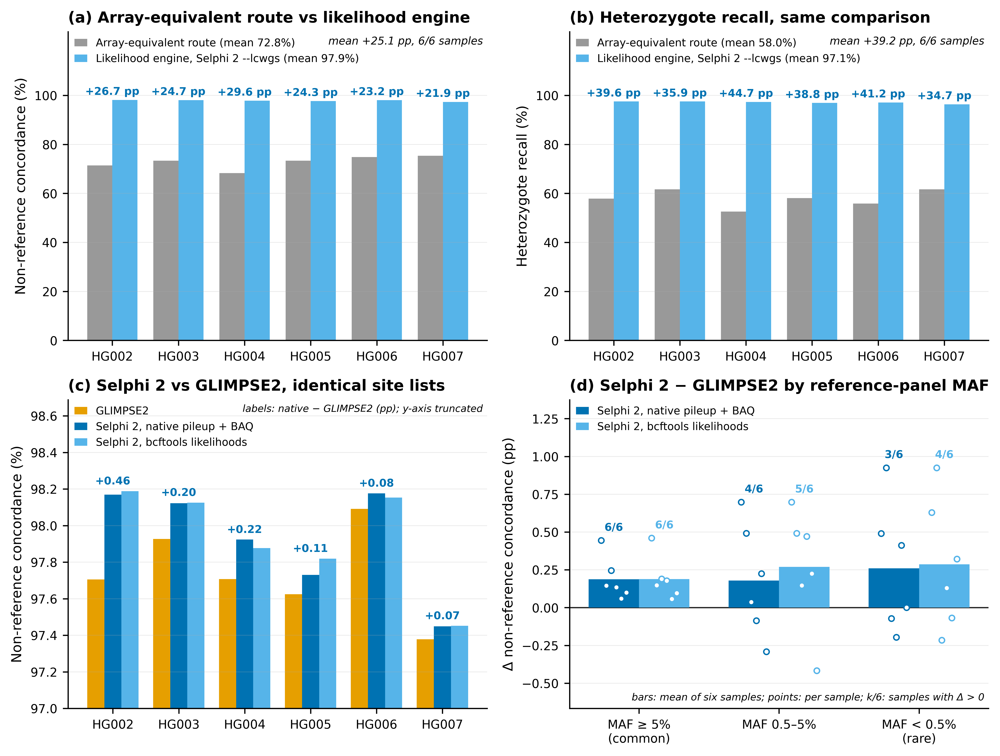
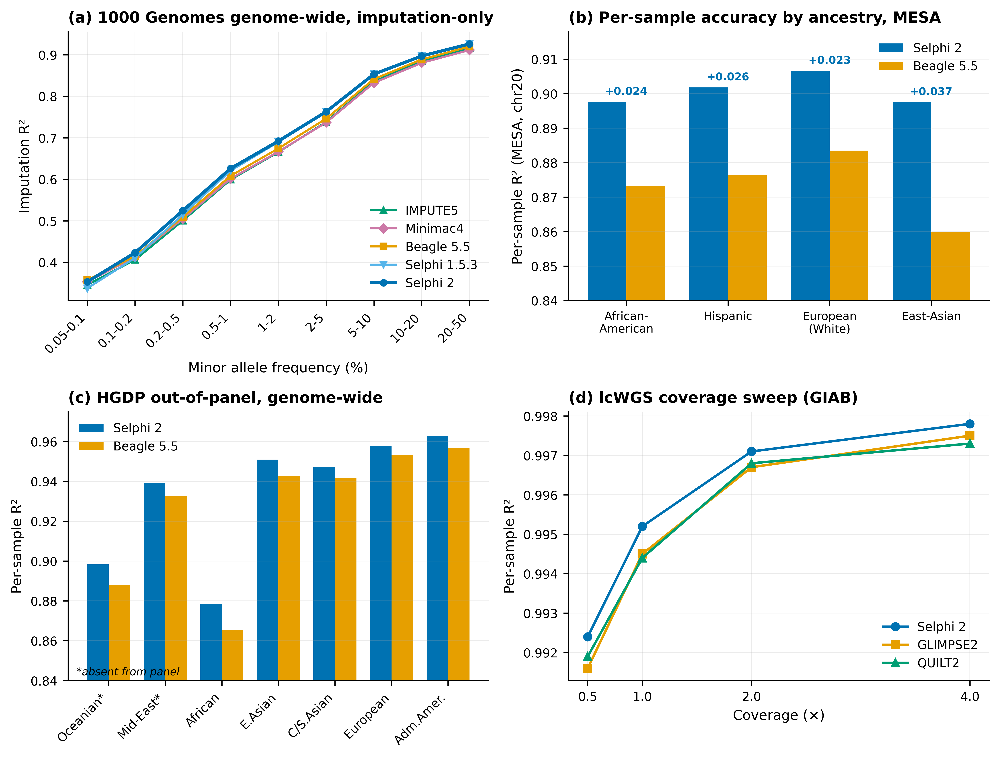
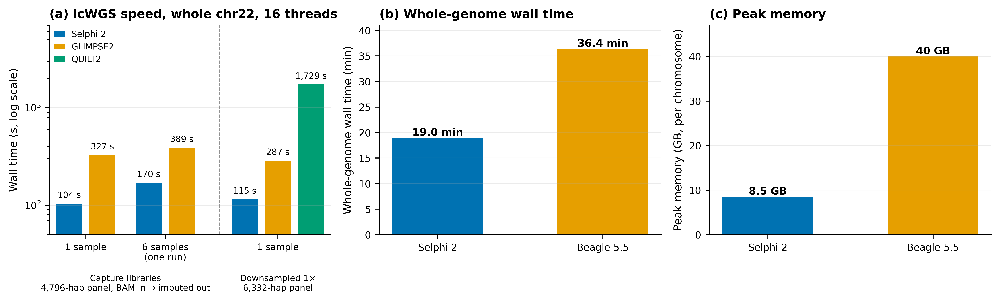

# **Selphi 2: genotype-likelihood imputation for low-coverage and capture sequencing, unified with array phasing and imputation in one binary**

Authors: Adriano De Marino^1^, Sandra Bohn^1^, Jon Lerga-Jaso^1^, Biljana Novković^1^, Andrew Terpolovsky^1^, Puya G. Yazdi^1,\*^

^1^ Research and Development, Omicsedge, Miami, FL, USA

\* Corresponding author: pyazdi@omicsedge.com

# **Abstract**

Imputation from one or two sequencing reads per site differs from array imputation: most sites carry a genotype likelihood rather than a genotype, and calling genotypes first discards both the uncertainty and the sites left uncalled. Here we present Selphi 2, a Rust tool whose genotype-likelihood-aware Li-Stephens engine imputes directly from likelihoods or aligned reads with a native pileup, and integrates phasing, array imputation, panel preparation and multi-format output in one whole-genome binary. On six Genome in a Bottle samples sequenced by hybridization capture over the ~614,000 Global Screening Array sites with a 1.6-2.7$\times$ off-target background, imputing from likelihoods instead of treating the libraries as an array raises non-reference concordance at untyped chromosome-22 sites from 68.27-75.38% to 97.32-98.17% (+25.09 percentage points; heterozygote recall +39.17 points; six of six samples). Against GLIMPSE2 on identical site lists and a leak-free 4,796-haplotype 1000 Genomes panel, Selphi 2 leads non-reference concordance in six of six samples with its native pileup (+0.19 points; +0.20 points, six of six, from bcftools likelihoods), replicates on chromosomes 20, 10 and 1 with the margin growing toward rare variants on the larger chromosomes, and imputes a sample from the BAM 3.1$\times$ faster (104 versus 327 s, 16 threads). On 30$\times$ GIAB genomes downsampled to ~1.8$\times$, its per-sample dosage $R^2$ exceeds GLIMPSE2's in five of six samples (0.9493 versus 0.9455), and across a 0.5-4$\times$ sweep it leads GLIMPSE2 and QUILT2 in overall $R^2$ at every depth. The same binary phases and imputes genotyping arrays, matching or exceeding Beagle 5.5 at equal phasing and exceeding Beagle's full pipeline with its own phasing on six consumer arrays against a 75,552-haplotype panel, with lower trio switch-error than SHAPEIT5 and up to 58% less memory than Beagle. It ships as one self-contained x86-64 and ARM64 binary writing five output formats from a single pass.

# **Introduction**

Genotype imputation, the statistical inference of ungenotyped variants from reference panels of sequenced haplotypes, has become foundational to modern human genetics. By expanding the variant coverage of array-genotyped and low-coverage sequenced cohorts, imputation enables genome-wide association studies (GWAS), polygenic risk score (PRS) estimation, and fine-mapping of causal variants at a fraction of the cost of deep whole-genome sequencing (WGS)^1^. As reference panels have grown from thousands to hundreds of thousands of sequenced individuals, and as the clinical relevance of rare and low-frequency variants has become increasingly apparent, the demands on imputation algorithms have evolved accordingly. Two kinds of input now dominate: genotyping arrays, which deliver confident calls at a fixed set of typed sites, and low-coverage or targeted sequencing, which delivers a thin, uneven read layer over every site.

At one or two reads per site a sequenced genome does not yield a genotype but a genotype likelihood: the reads are consistent with more than one genotype, and their relative support for each is all the data can say. Calling a genotype first, and imputing from the calls as if they were array genotypes, discards that uncertainty and, at the many sites where no call can be made, discards the site altogether. A likelihood-aware Li and Stephens model instead integrates the read evidence at every site with the haplotype prior supplied by the reference panel, so that a single read shifts the posterior without committing it. Hybridization-capture libraries that pair deep coverage at the typed sites with a thin off-target background pose the same problem at mixed depth: the array-equivalent route, which calls the typed sites and imputes them as a chip, throws the background away, whereas a likelihood-aware model uses both layers through one emission model.

The dominant computational framework for genotype imputation is the Li and Stephens hidden Markov model (HMM)^2^, which reconstructs each target haplotype as a series of segments copied from panel haplotypes, with switches between the copied haplotypes standing in for historical recombination. To efficiently identify the most informative reference haplotypes from panels containing tens of thousands of individuals, modern tools employ the Positional Burrows-Wheeler Transform (PBWT)^3^ for haplotype matching. The current landscape of imputation software is anchored by three widely used tools: IMPUTE5^4^ uses PBWT-based haplotype selection to achieve sub-linear scaling with panel size; Beagle^5^ (used here at version 5.5) combines integrated phasing^6^ with haplotype clustering for computational efficiency; and Minimac4^7^ powers the Michigan and TOPMed imputation servers with low memory requirements. All three tools produce accurate imputation for common variants, though they differ in their handling of rare variants, memory consumption, and integration with upstream phasing.

The array-imputation ecosystem, meanwhile, is fragmented across multiple specialized tools. A standard end-to-end workflow phases the target with a dedicated phaser such as Eagle2^8^, SHAPEIT5^9^, or an earlier biobank-scale haplotype estimator^10^, imputes the phased target with Beagle 5.5^5^, IMPUTE5^4^, or Minimac4^7^, converts the reference panel between project-specific binary formats with dedicated converters (bref3 for Beagle, xcf for IMPUTE5, msav for Minimac4), splits the genome into per-chromosome files for parallel execution, indexes outputs with bcftools, and re-encodes results into downstream formats (BCF, Apache Parquet, PLINK2 PGEN^11^) with external writers. Each handoff requires intermediate files, shell glue, and per-chromosome bookkeeping. Beagle 5.5^5^ integrates phasing and imputation in a single Java process, mitigating some of this fragmentation, but the genome is still processed one chromosome at a time and the output is restricted to VCF.

The original Selphi^12^ targeted a different limitation: the short matching range of the sliding-window and chunked PBWT scans used by other tools. Instead of restarting the PBWT within local windows, Selphi 1 ran it across the entire chromosome and summed match evidence along the whole scan, which raised rare-variant accuracy above Beagle 5.4, IMPUTE5, and Minimac4 on both the 1000 Genomes Project^13^ and TOPMed^14^ panels. However, Selphi 1 was implemented in Python with Numba-JIT-compiled inner loops, required pre-phased input, processed one chromosome at a time, and selected its conditioning haplotypes with fixed per-variant match caps that do not scale with reference panel size.

Recent methodological advances have addressed some of these challenges in isolation. SHAPEIT5^9^ cut low-frequency switch-error rates in large cohorts by splitting phasing into two passes: a confident backbone built from common variants, onto which rare alleles are then placed one at a time. GLIMPSE2^15^ made whole-genome low-coverage imputation tractable by storing the panel compactly, using dense bitmaps for frequent alleles and per-site carrier lists for the rare ones. QUILT2^16^ extended the PBWT with multi-symbol matching for application to diverse sequencing technologies. Both are designed for whole genomes sequenced at uniformly low depth. None of these tools, however, integrate phasing, imputation, panel preparation, indexing, and multi-format output in a single executable, nor do they perform whole-genome imputation in a single process against a single reference panel file.

Here we present Selphi 2, a Rust tool built around a genotype-likelihood-aware Li-Stephens engine that imputes directly from Phred-scaled likelihoods or from aligned reads with a native pileup (`--lcwgs`), and that integrates in the same binary the array pipeline: a complete reimplementation of the Selphi algorithm that keeps Selphi 1's long-range, match-accumulating PBWT selection but now runs it within large overlapping windows (default 80 cM) instead of one whole-chromosome pass, which removes the dominant runtime bottleneck of Selphi 1, while resolving the workflow limitations above. Phasing is integrated through two engines: a diploid genotype-graph engine with MCMC sampling, used by default for all inputs, and a haploid composite-HMM engine selectable for chip arrays; pre-phased input is no longer required. Whole-genome imputation is performed in a single command against a single multi-chromosome reference panel file, with the next chromosome's data prefetched during the current chromosome's HMM computation, eliminating per-chromosome file splitting and output concatenation. The number of reference haplotypes retained per target is set by a panel-adaptive sizing formula derived from the reference panel size and the haplotype-pattern diversity of the panel; on admixed cohorts imputed against biobank-scale panels this preserves rare-variant accuracy that a fixed candidate-set size loses by retaining too few rare-allele-carrying haplotypes from minority ancestries. The Rust reimplementation, with a streaming sparse panel format that bounds peak memory below 500 MB during panel construction independently of panel size, reduces both wall time and peak memory relative to Selphi 1 (Results). Output is written to one or more of five formats from a single interpolation pass: VCF.gz, BCF 2.2, Apache Parquet, PLINK2 PGEN with dosage, and SelfDecode per-sample Parquet archives. Figure 1 gives an overview of the full pipeline.

In this paper, we describe the algorithmic components of Selphi 2 (Methods), benchmark the likelihood engine on real capture-plus-low-pass Genome in a Bottle libraries^17^ against the array-equivalent route and against GLIMPSE2^15^, and on uniformly downsampled Genome in a Bottle genomes against GLIMPSE2 and QUILT2^16^; then benchmark the array pipeline's imputation accuracy and resource consumption against Selphi 1^12^ and Beagle 5.5^5^ on the 1000 Genomes Project^13^ and TOPMed^14^ reference panels, and its phasing accuracy against SHAPEIT5^9^ on the 1000 Genomes trio dataset (Results).

**Figure 1. Overview of the Selphi 2 pipeline.** The pipeline accepts unphased or phased target genotypes in VCF/BCF format, a reference panel in SRP format (single- or multi-chromosome), and a genetic map. If the input is unphased, phasing is performed first; by default the diploid engine (genotype graph with MCMC sampling) is used for all inputs, with the haploid engine (composite HMM with three-channel greedy swap) selectable for chip arrays. The diploid engine operates in two stages: common variants (MAF ≥ 0.1%) are phased via iterative MCMC with EM-estimated effective population size, then rare variants are phased onto the common-variant scaffold using bidirectional PBWT sweeps with IBD2-aware neighbor exclusion and singleton IBD phasing. When pedigree information is available, Mendelian constraints are applied before the HMM to pre-phase deterministic parent-child configurations. Phased haplotypes are passed directly in memory to the imputation stage with no intermediate file I/O. Imputation uses a coded-step PBWT to select candidate reference haplotypes per target, with the per-target candidate-set size set automatically as a function of panel size and panel diversity (Candidate selection and HMM, below). After haplotype deduplication, a Li-Stephens HMM (32-bit state vectors in both passes, with 64-bit recombination terms and row sums) computes per-site posterior weights, with an effective population size that scales linearly with panel size ($N_e \approx 36.4 \times n_\text{ref}$, consistent across panels from 5,000 to 171,000 haplotypes) and is further adjusted per site by minor allele frequency. The HMM weights are interpolated to full reference-panel density using cache-friendly 2D tiles, with interpolation fused to output encoding so that no chromosome-wide interpolated dosage matrix is materialized. Five output formats are supported from a single interpolation pass: VCF.gz, BCF 2.2, Apache Parquet, PLINK2 PGEN with dosage, and SelfDecode per-sample Parquet archives. For sequencing input at low or uneven depth (uniform 0.5-4$\times$ low-pass genomes, or capture libraries with a low-pass off-target background), a dedicated genotype-likelihood-aware engine (`--lcwgs` / `--engine lcwgs`) replaces the standard phase-and-impute path: it accepts a PL VCF/BCF or aligned reads (BAM/CRAM, with native pileup), and alternates sparse-PBWT haplotype selection with a GL-weighted Li-Stephens forward-backward ($\sqrt{n}$-checkpointed, SIMD-accelerated) and an eight-founder phasing HMM re-committed at every Gibbs iteration, emitting GT:DS:GP against the same reference panel and output formats. Auxiliary capabilities include multi-chromosome processing from a single SRP file with overlapped prefetch and mixed-density (WGS + chip) reference-panel construction.

# **Methods**

## **Selphi 2**

### **Architecture overview**

Selphi 2 is implemented in Rust as a single self-contained binary. All compression libraries, file format encoders (VCF, BCF, Parquet, PGEN), and index builders (TBI, CSI) are integrated into the binary; no external tools are invoked at runtime. Parallelism is provided by the rayon library^18^, with fixed-seed iteration orders that guarantee bit-identical output across runs on the same hardware. The inner loops of the haploid and diploid HMMs are SIMD-vectorized for x86-64 and ARM, with a runtime CPU check selecting the appropriate kernel on each host.

The pipeline accepts unphased or phased VCF/BCF input, phases the target if necessary, imputes against the reference panel, and writes output in one or more formats simultaneously. No intermediate files are written between stages; phased haplotypes are passed in memory to the imputation engine. Memory usage is estimated at startup from panel dimensions and thread count, with a warning if the estimate exceeds available system RAM.

### **Phasing engines**

Selphi 2 includes two phasing engines. By default the diploid engine is used for all inputs: across our benchmarks it matches or exceeds the haploid engine on SNP accuracy at every variant density, attains lower phasing switch-error, and runs roughly 2.5$\times$ faster (Discussion). The haploid composite-HMM engine, the regime for which it was originally designed (chip arrays), remains available through a command-line option. Missing (no-call) target genotypes, a routine occurrence on genotyping arrays, where typically 1-2% of sites are no-calls per sample, are carried through both phasing engines as missing and imputed from the surrounding haplotypes by a local copying consensus (the majority allele over the nearest neighbours in a positional-BWT sweep of the target haplotypes and the reference panel), rather than being set to the reference allele; conditioning the phasing scaffold on a falsely homozygous-reference call at such sites measurably degrades downstream imputation accuracy, both directly and by biasing the imputer's reference-haplotype selection toward the reference allele at exactly those sites (Results, Table 5; Discussion).

**Haploid engine.**

The haploid phasing engine models each haplotype independently through a composite HMM with a greedy swap criterion, following the approach of Browning and Browning^19^. The algorithm operates in 15 iterations (3 burn-in with fixed phase, 12 phasing iterations with decreasing likelihood-ratio thresholds from 100,000 to 1.0).

At each iteration, a coded-step PBWT^4^ is constructed on the combined reference and target haplotypes, restricted to the set of shared variants. Steps are defined at fixed genetic-distance intervals, with an adaptive step scale: fine steps (scale 1.0, approximately 10 SNPs per step) in early iterations when phasing is uncertain, and coarse steps (scale 3.0, approximately 30 SNPs per step) in later iterations when the phase scaffold is established. This two-resolution strategy is analogous to the common-then-rare phasing approach used in SHAPEIT5^9^, but operates within a single iterative framework rather than as separate stages.

Within each iteration, a composite HMM is constructed with three parallel channels. The channels correspond to alternative haplotype configurations, and phase is resolved through a greedy swap that compares the forward-backward posteriors across channels at each heterozygous site. The swap decision is accepted if the likelihood ratio exceeds a threshold that decreases across iterations, implementing a simulated-annealing-like convergence.

For rare variants, a carrier injection mechanism ensures that haplotypes carrying rare alleles are represented in the matching: when the best IBS match at a position does not carry the target's rare allele, it is replaced by the carrier that best matches the target by identity-by-state over the 30 flanking variants on either side. This prevents rare alleles from being systematically lost during the matching step.

EM parameter estimation^20^ is performed within each iteration to calibrate the mismatch probability and effective recombination rate per window, enabling the HMM transition probabilities to adapt to local recombination patterns.

**Diploid engine.**

The diploid engine models the pair of haplotypes jointly through a genotype graph, following the approach of SHAPEIT4^21^ and SHAPEIT5^9^. At each heterozygous site, the graph encodes all possible local diplotype configurations using 64-bit bitmasks. A segment-based Li-Stephens HMM computes diplotype transition probabilities across conditioning haplotypes selected by positional PBWT. The number of conditioning haplotypes can be capped for computational efficiency (default: unlimited).

Phase is resolved via MCMC sampling on the genotype graph with 15 iterations following the scheme 5b,1p,1b,1p,1b,1p,5m (5 initial burn-in, 3 interleaved prune/burn-in cycles, 5 main iterations), followed by a final Viterbi solve. The HMM forward pass is SIMD-vectorized. The diploid engine operates only on common variants (MAF ≥ 0.1%); rare variants are phased in a separate pass (Rare variant phasing, below).

By default the diploid engine forms a small **intra-run phase ensemble** to marginalise phase uncertainty for the cost of one extra imputation pass, with no extra phasing. Each main MCMC iteration already draws a complete diplotype configuration, a sample from the phase posterior, that the chain otherwise discards in favour of the final Viterbi solve. Instead, the Viterbi solve and a thinned subset of these post-burn-in samples are kept as N phase members (default N = 2) from the single phasing chain; each is carried through rare-variant phasing and imputed, and the per-haplotype Li-Stephens copying weights are averaged across the members before interpolation. Because the imputed dosage is linear in those weights (dosage = Σ w · panel allele, normalised by Σ w), the averaged weights yield the members' mean dosage, marginalising phase uncertainty in dosage space rather than committing to one phasing; the identity is exact up to the per-row sparsity threshold applied to the weights, whose effect we measure at $10^{-6}$ in per-sample $R^2$ on the chromosome-22 benchmark. Crucially the members share one phasing chain, so the cost is one phasing plus N imputation passes (the reference-panel read and interpolation are shared), rather than the N independent phasings of a conventional ensemble; on the consumer-array benchmark N = 2 adds ≈25-30 % wall time and raises the diploid engine's genome-wide SNP $R^2$ from 0.9588 to 0.9605 (the ensemble step on top of the no-call-imputation fix; Results, Table 5). The ensemble is disabled (N = 1, a single Viterbi solve) under `--sample-batch-size` and `--phase-only`; the haploid engine does not use it, as its greedy-swap phasing converges to a single solution rather than sampling a posterior.

During burn-in iterations the effective population size ($N_e$) is re-estimated from the genotype graphs, inverting the Li-Stephens relation^2^ $\mathrm{rate} \approx 0.04 \times N_e \times d / n_\text{haps}$, where $d$ is the mean inter-marker distance in cM. The rate used is the number of diplotype-graph transitions per variant, an edge count rather than a fraction of sites, so the estimate systematically overshoots and in practice settles at its upper bound. That bound therefore sets the phasing $N_e$: it is $\min(77.5 \times n_\text{haps}, 10^6)$ with a floor of 1,000, so the per-cM switch rate is held constant for panels below 12,904 haplotypes and decays as $1/n_\text{haps}$ above. An update is applied only when it moves $N_e$ by more than 5%.

**Rare variant phasing (diploid).**

Rare variants (those not in the common-variant scaffold) are phased in a dedicated PBWT-based pass over the target haplotypes together with the reference panel, when one is supplied; panel phasing, which has no external reference, uses the cohort alone. This two-stage common-then-rare strategy parallels the approach introduced in SHAPEIT5^9^, whose rare pass conditions on the cohort only.

The algorithm proceeds in three steps. First, an IBD2 scan identifies sample pairs sharing both haplotypes identical-by-descent across scaffold sites^22^. Pairs are detected using a diploid PBWT on genotype sums (0/1/2), with IBD2 segments required to span at least 2.5 cM, 1 Mb, and 100 scaffold sites. IBD2 pairs are excluded from PBWT neighbor selection during rare variant phasing, as their haplotypes are uninformative for resolving phase at heterozygous sites shared between both individuals.

Second, a scaffold bitmatrix is constructed at scaffold sites from the target haplotypes and, when present, the reference haplotypes, filtering out sites with a missing data rate (MDR) above 10%. A forward PBWT sweep processes all variants in physical order: at scaffold sites, the PBWT arrays (permutation A, divergence C, reverse-lookup R) are updated; at rare heterozygous sites, phasing is performed using a two-pass threshold-then-distance voting scheme. In the threshold pass, the two PBWT neighbors of each of the target's haplotypes vote on the phase assignment. If the net vote exceeds a threshold (starting at 2.5 and decreasing to 1.0), the phase is assigned and the carrier contributes to subsequent decisions. In the distance pass, remaining unphased sites use distance-weighted votes, where the weight is the genetic distance from the PBWT divergence point to the current position.

Third, a backward PBWT sweep repeats the same procedure in reverse genomic order. The forward and backward results are merged by selecting the direction with higher confidence (absolute vote score) for each rare het.

Singletons (MAC = 1 among the targets) receive no separate treatment. At such a site no PBWT neighbour carries the allele, so the threshold pass casts no vote and the decision falls to the distance pass, which places the allele on the haplotype whose PBWT match to its neighbours is shorter. This is the direction of the coalescent argument used for singletons in SHAPEIT5^9^, a recent allele sits on the more recently diverged haplotype, obtained here from PBWT divergence rather than from a coalescent HMM.

**Pedigree scaffolding.**

When pedigree information is available (PLINK PED format), Mendelian logic from parent-child relationships is applied to the genotypes before phasing. For each trio or duo, the algorithm considers all nine combinations of parental genotype sums (homozygous reference, heterozygous, homozygous alternate) at each variant. When the child has missing genotype data and both parents are homozygous, the child's genotype is imputed. When the child is heterozygous and at least one parent is homozygous, the Mendelian phase is determined and written to the input; by default the HMM then re-derives every heterozygous site's phase, so this resolved orientation initialises rather than constrains the sampler. Fixing those sites as a scaffold, the SHAPEIT5 treatment^9^, is available as an option but is not the default: on 54 trios genotyped at 9,283 array sites it lowered imputation R² despite the fixed phase agreeing with the children's sequenced haplotypes at 99.95% of sites, because fixing four heterozygous sites in five lets genotype-graph segments grow to their length limit and removes the segment boundaries at which the copying model may switch haplotype. Mendelian inconsistencies (e.g., child heterozygous with both parents homozygous for the same allele) are counted but not corrected.

On chromosome X, haploid samples (males) are detected automatically by their heterozygosity rate: samples with fewer than 1% heterozygous calls across at least 100 non-missing sites are classified as haploid. Heterozygous calls in haploid samples are biologically impossible and indicate genotyping error; these are reset to missing to allow the HMM to impute the correct homozygous genotype.

**Panel phasing.**

When no external reference panel is available, the same two phasing engines can phase a cohort against itself in a single command. The cohort haplotypes are used both as the target and as the conditioning set; the diploid engine is used unless the haploid engine is requested explicitly. Output is written as a phased VCF/BCF and, optionally, as a Selphi SRP file or a BREF3^5^ file for direct reuse as a reference panel in subsequent imputation runs. For cohorts whose memory footprint exceeds available system RAM, the genome is automatically chunked along the genetic map and the chunks are ligated at the boundary haplotype assignment.

### **PBWT matching for imputation**

The imputation component uses a coded-step PBWT^4^ operating directly on the reference panel bitmatrix (1 bit per allele, packed as 64-bit words). At each step boundary (defined by genetic map positions at approximately 0.05 cM intervals), haplotypes are grouped by their allele sequence within the step using word-level extraction: 64 haplotypes are processed per 64-bit operation, steps spanning at most 40 SNPs are coded exactly, as a 64-bit shift register over the step's alleles, and longer steps are coded by FNV-1a hashing. The result is a set of coded-step partitions from which candidate reference haplotypes can be selected.

For each target haplotype, candidate reference haplotypes are selected based on their co-occurrence with the target in coded-step partitions. The number retained per target (`max_candidates`, henceforth $m_c$) is set automatically as a function of the reference panel size and diversity, as described in the next section. Thread-local workspace buffers (permutation arrays, divergence arrays) are pre-allocated and reused across all targets within a rayon thread, eliminating per-target allocation overhead.

### **Candidate selection and HMM**

The selected candidates undergo two filtering steps before entering the HMM. First, candidates appearing below the 10th percentile of occurrence frequency across all step partitions are removed. Second, candidates with greater than 95% position coverage have their gaps filled to prevent artificial truncation of otherwise consistent matches. Identical reference haplotypes at the shared variant positions are then grouped (haplotype deduplication), reducing the number of HMM hidden states by 10-50% depending on the reference panel and target region.

A reduced array is constructed containing only the candidate haplotypes plus the target, and a PBWT forward-backward pass is run on this reduced array. Both passes carry the hidden-state vectors in 32-bit floating point, for 2x cache density and SIMD throughput, while the per-site recombination probabilities and the per-row normalization sums are computed and accumulated in 64-bit to maintain numerical stability. The backward pass is streamed rather than materialized: each backward row is computed and immediately multiplied into the stored forward row, so only two backward rows are resident at any time instead of a full site-by-state matrix. The per-site recombination probability follows the standard Li-Stephens formulation^2^:

$$P(\mathrm{switch}) = 1 - \exp\!\left(-d_k \times 0.04 \times N_e / n_\text{ref}\right)$$

where $d_k$ is the genetic distance between consecutive markers in centiMorgans, $N_e$ is the effective population size, and $n_\text{ref}$ is the number of candidate haplotypes. In existing imputation tools, $N_e$ is a single value that does not scale with reference panel size (Beagle, for example, uses a default $N_e$ = 100,000 for both its phasing and imputation HMMs, optionally re-estimated once per run by EM^5^). However, the optimal $N_e$ depends on the reference panel size: as panels grow, PBWT-selected candidates represent increasingly close matches to the target, sharing shorter identity-by-descent segments. To capture the mosaic structure at finer resolution, the HMM must switch between candidates more frequently, requiring a proportionally larger $N_e$.

Selphi 2 sets $N_e$ automatically as a linear function of the total number of reference haplotypes:

$$N_e = \max(36.4 \times n_\text{ref,total},\ 100{,}000)$$

where $n_\text{ref,total}$ is the total number of haplotypes in the reference panel (not the number of candidates selected for the HMM). This scaling was derived empirically by optimizing imputation $R^2$ across three reference panels spanning two orders of magnitude in size: the 1000 Genomes Phase 3 panel (4,802 haplotypes; optimal $N_e$ ≈ 175,000), a UK Biobank^23^ and 1000 Genomes composite (75,552 haplotypes; optimal $N_e$ ≈ 2,750,000), and the TOPMed panel (171,054 haplotypes; optimal $N_e$ ≈ 6,200,000). The constant ratio $N_e/n_\text{ref} \approx 36.4$ was consistent across panels despite substantial differences in population composition (a multi-ethnic global panel, a UK Biobank and 1000 Genomes composite, and a multi-ethnic clinical cohort, respectively). A per-MAF sweep on the current implementation confirms both the optimum and its structure (Supplementary Table S13): on the 1000 Genomes panel overall $R^2$ is maximised at the formula's $N_e \approx 175{,}000$, while rare variants favour a lower $N_e$ (≈50,000) and common variants a higher one (≈350,000), so the single formula value balances a genuine rare-versus-common tradeoff rather than sitting at either extreme.

The effective population size is further calibrated per site using a MAF-adaptive scheme: $N_e$ is set to $0.85 \times N_{e,\text{base}}$ for rare variants (MAF < 0.5%) and $1.2 \times N_{e,\text{base}}$ for common variants (MAF > 2%), with a linear ramp in MAF between the two thresholds. When the haploid phasing engine is used, the per-window $N_e$ it estimates during phasing replaces this scheme in the imputation HMM unless disabled; with the default diploid engine the MAF-adaptive scheme applies as written. Users may override the automatic $N_e$ with a fixed value for reproducibility with prior results.

**Adaptive candidate-set sizing.** Selphi 1 retained conditioning haplotypes with fixed per-variant match caps, independent of reference panel size: a forward top-$K_1$ = 450, reduced to $K_2$ = 60 matches per variant in a backward re-scoring pass, then a top-$K_3$ = 50 filter. Selphi 2 instead sizes the per-target candidate set adaptively. The maximum number of reference haplotypes retained per target, denoted $m_c$, henceforth, is set automatically as a function of reference panel size and panel diversity. A fixed $m_c$ (for example $m_c = 2{,}500$) generates a panel-relative truncation rate that varies by two orders of magnitude across panels: $m_c = 2{,}500$ retains 50% of a 5,000-haplotype panel but only 1.5% of a 171,054-haplotype panel. The latter regime systematically excludes rare-variant carriers from minority sub-populations when the per-target top-K is dominated by haplotypes of the panel's majority ancestry, producing $R^2$ losses concentrated on low-frequency variants in admixed cohorts.

Selphi 2 resolves $m_c$ automatically as

$$m_c = \mathrm{clamp}\!\left(N_\text{ref}\,(\gamma + \alpha\,\mathrm{CV}_\text{panel}),\ m_c^{\text{floor}},\ m_c^{\text{ceil}}\right)$$

where $N_\text{ref}$ is the total number of reference haplotypes, $\gamma$ is a base fraction, $\alpha$ is a diversity-coupled fraction, and $\mathrm{CV}_\text{panel} \in [0, 1]$ is the coefficient of variation of compressed tile sizes in the SRP, computed once at panel load. $\mathrm{CV}_\text{panel}$ is a proxy for haplotype-pattern diversity: panels containing multiple distinct mosaic structures (multiple ancestries, divergent sub-populations) compress less uniformly than ancestrally homogeneous panels, yielding higher CV.

**Choice of $\gamma$, $\alpha$, and the small-panel rule.** Subsetting the conditioning set is a speed and memory optimization that benefits only biobank-scale panels; on a small panel it discards rare-allele-carrying haplotypes for no compute benefit, and the diversity-coupled fraction can return only a fraction of a small panel (on a low-CV panel it falls to the floor). We therefore retain the **entire panel** as the conditioning set when it contains at most 16,000 haplotypes (≈8,000 samples), applying the formula $m_c = \mathrm{clamp}(N_\text{ref}(\gamma + \alpha\cdot\mathrm{CV}_\text{panel}),\ 2{,}500,\ 10^6)$, with $\gamma = 0.10$ and $\alpha = 0.80$, only above that size (the result is additionally capped at $N_\text{ref}$). This threshold sits above 1000-Genomes-scale panels and below biobank panels (HRC ≈ 65,000, TOPMed ≈ 171,000 haplotypes), and near the empirical accuracy-saturation point of the conditioning-set size. The distinction is consequential for ancestries absent from the panel: imputing Human Genome Diversity Project individuals against a 1000 Genomes panel, the formula's small-panel fraction fell to the 2,500 floor (39% of the 6,332-haplotype panel), dropping the conditioning set's rare-allele carriers and inverting the rare-variant ranking versus Beagle 5.5; retaining the full panel restored Selphi 2's advantage at every frequency above the rarest bin (Results, Out-of-panel generalization). On the panels evaluated here the rule yields the full 4,802 haplotypes for the 1000 Genomes Phase 3 panel and $m_c = 132{,}676$ for the TOPMed panel ($\mathrm{CV}_\text{panel} = 0.845$, $N_\text{ref} = 171{,}054$; 78% of the panel). Users may override the automatic $m_c$ with a fixed value for reproducibility with prior results.

The resulting HMM posterior weights are stored as sparse CSR matrices (row-per-chip-variant, column-per-reference-haplotype), with entries below $1/(H+1)$ set to zero.

### **Interpolation and output**

Between consecutive shared-variant positions (chip sites), imputed dosages at reference-panel-only positions are computed by linear interpolation of the HMM-derived haplotype weights, following the standard approach^4,7^:

$$P(\mathrm{alt} \mid j) = \frac{\sum_r w_r(j)\, x_r(j)}{\sum_r w_r(j)}$$

where $w_r(j)$ is the interpolated weight of reference haplotype r at position j, and $x_r(j)$ is the allele carried by haplotype r at that position. Reference alleles at imputed positions are read from the tiled SRP format (see Sparse Reference Panel format, below), with pre-loaded stripe batches overlapping I/O with HMM computation.

Interpolation operates on tiles of 1,024 variants $\times$ 4,096 haplotypes, sized to fit in L2 cache per core. Within each tile, the interpolation is fused with output encoding: after a tile's dosages are computed, they are immediately formatted to all active output formats and the tile memory is freed. This prevents accumulation of interpolated dosages across the entire chromosome.

The per-variant dosage R-squared (DR2) quality metric^24^ is computed using a numerically stable two-pass method:

$$\mathrm{DR2} = \frac{\mathrm{var}(\mathrm{dosage})}{2\,p\,(1-p)}$$

where $p = \mathrm{mean}(\mathrm{dosage}) / 2$ is the estimated alternate allele frequency, and var(dosage) is computed as the mean of squared deviations from the mean (avoiding the numerically unstable single-pass $E[X^2] - E[X]^2$ formula).

VCF output formatting performs no floating-point-to-string conversion at all. Dosages are quantized to the emitted precision (three decimals for DS, two for AP) and the quantized values index byte-slice lookup tables rendered once at start-up: a 2 $\times$ 2 $\times$ 2,001-entry table over (haplotype-1 call, haplotype-2 call, dosage index) emits an entire `GT:DS` field as a single memory copy, and a 101 $\times$ 101-entry table does the same for the paired `AP1:AP2` field. Every sample at every variant takes this path, so per-sample formatting cost is constant and independent of the dosage value.

Selphi 2 supports five output formats from a single interpolation pass: VCF.gz (multi-threaded BGZF compression), native BCF 2.2^25^, Apache Parquet (zstd-compressed, variant-major columnar layout), PLINK2 PGEN^11^ (mode 0x03 with fixed-width records containing 2-bit hardcalls and 16-bit unphased dosage), and SelfDecode format (per-sample chunked Parquet in a ZIP archive). The VCF/BCF output channel uses a dedicated writer thread with a bounded synchronous channel, decoupling interpolation throughput from I/O throughput; its depth is set from cohort size (16 blocks below 1,000 samples, 4 at or above, because a single block at biobank scale is hundreds of megabytes of encoded text). All output formats use the same two-pass DR2 computation, ensuring consistent quality metrics regardless of format choice.

### **Low-coverage sequencing imputation engine**

The phasing-and-imputation pipeline above targets array-genotyped data, where the input is a set of confident hard genotype calls at chip sites. Low-coverage whole-genome sequencing (lcWGS) presents a different inference problem: at 0.5-4$\times$ depth, and at the off-target sites of a capture library, most sites carry no confident call but a soft genotype likelihood (GL) derived from one or two reads, while deeply covered sites contribute near-certain likelihoods through the same model with no special handling. Selphi 2 provides a dedicated lcWGS engine, selected with `--lcwgs`, that reuses the reference-panel ingestion (SRP), the `HaplotypeBitmatrix`, the genetic map, and the output writers, but replaces the hard-call HMM with a genotype-likelihood-aware Li-Stephens model. GLIMPSE2^15^ established that this regime is best addressed by imputing directly from genotype likelihoods rather than from hard calls; we benchmark against it in Results.

The engine reads per-sample Phred-scaled genotype likelihoods (the `PL` field produced by `bcftools mpileup | call`) at the panel's variant sites and converts them, via a 256-entry lookup table, to per-haplotype likelihoods. The genotype likelihoods may instead be computed natively from aligned reads (BAM or CRAM, one file per sample) in the same process, removing the external pileup step: for each biallelic panel SNP, the overlapping reads are walked through their CIGAR alignment and each read base is folded into the three genotype likelihoods under the standard SAMtools/BCFtools base-quality error model^25^ ($P(b\,|\,\mathrm{REF})=1-\varepsilon$ if the base matches else $\varepsilon/3$, with $\varepsilon=10^{-Q/10}$ and the heterozygous term $\tfrac{1}{2}P(b\,|\,\mathrm{REF})+\tfrac{1}{2}P(b\,|\,\mathrm{ALT})$), filtered by mapping and base quality (defaults MAPQ ≥ 20, base quality ≥ 20, at most 250 reads per site; `LCWGS_MIN_MAPQ`, `LCWGS_MIN_BQ`, `LCWGS_MAX_DEPTH`); the result matches `bcftools mpileup` at the same thresholds. Overlapping paired-end mates, the two mates of one fragment sample the same molecule, are collapsed to a single observation per site (agreeing bases retain the higher base quality, disagreeing bases are down-weighted) so a fragment's evidence is not double-counted. CRAM read bases are reconstructed against the supplied reference FASTA, and with a region restriction the alignment index (`.bai`/`.crai`) is used to decode only the requested span. Non-SNP panel sites, for which the pileup collects no read evidence, are excluded from the native target set and imputed from the haplotype scaffold, as in GLIMPSE2 and as on the likelihood-file path when that file is restricted to SNPs; carrying them as flat-likelihood target sites instead changes the head-to-head result of Table 1b within noise (+0.184 against +0.190 pp non-reference concordance over GLIMPSE2). At low coverage per-read indel likelihoods are miscalibrated and degrade neighbouring-SNP accuracy when fed to the joint model. Optionally (for higher-coverage input) the local REF and ALT haplotypes of each panel indel are built from the reference and every spanning read is scored against both with a pair-hidden-Markov model (forward algorithm, affine gap penalties, per-base-quality emissions, marginalising over alignment uncertainty), folding $P(\text{read}\,|\,\text{REF})$ and $P(\text{read}\,|\,\text{ALT})$ into the genotype likelihoods as for a SNP. To verify that this in-process pileup is faithful to the external `bcftools mpileup` path, we ran a downsampling check (a 52$\times$ whole-genome sample reduced to 1$\times$, with the full-depth calls as truth): Selphi 2's native pileup attains per-allele-frequency-bin aggregate $r^2$ 0.964, matching (and slightly exceeding) its own pre-computed-likelihood path (0.960) and comparable to an equivalent GLIMPSE2 pileup (0.967), confirming the native genotype-likelihood computation reproduces the established pipeline. Imputation proceeds by Gibbs alternation between haplotype selection and a GL-weighted forward-backward pass: each iteration selects a conditioning set of reference haplotypes by sparse PBWT from the current sampled haplotypes, then runs a Li-Stephens forward-backward in which each haplotype's per-site emission is built conditional on the partner haplotype's currently sampled allele, decoupling the two haplotypes of a diploid sample into independent copying problems, and samples a fresh allele per site from the resulting posterior. Posterior dosages from the post-burn-in iterations are averaged for the output, written as VCF.gz with `GT:DS:GP` fields. The forward-backward applies a leave-one-out emission: the forward emission at each site is divided back out of the hidden-state posterior before the read likelihood and error model are re-applied, so the per-site read is incorporated once rather than twice.

*Base alignment quality.* The native pileup applies base alignment quality (BAQ)^30^ exactly as `bcftools mpileup` does by default. Extended BAQ is computed by a bit-exact port of the htslib `probaln_glocal` and `sam_prob_realn` routines (on these libraries 28,596 of 28,596 reads receive base qualities identical to `samtools calmd -r -E`), applied to the reads that bcftools 1.22's partial-realignment heuristic selects: a pileup column triggers realignment on indel or soft-clip evidence, and a read is judged once, at its first triggering column. On the capture libraries 7.6% of reads are realigned. Without BAQ the native pileup trailed the bcftools-likelihood arm of the head-to-head (Results, Table 1b: +0.125 against +0.197 pp over GLIMPSE2); with BAQ the two arms are at parity (+0.190 pp). GLIMPSE2's own pileup applies no BAQ.

*Gibbs schedule, phasing and recombination model.* The engine imputes each target sample independently against the reference panel with a genotype-likelihood-aware Li-Stephens forward-backward: sparse-PBWT conditioning-set selection, an eight-founder phasing HMM re-committed at each Gibbs iteration (opt-out `LCWGS_NO_FOUNDER_PHASE=1`, which reverts to a heuristic diplotype-mosaic segment commitment), and a band-mode recombination rate in the imputation forward-backward (default; the phasing HMM keeps the conditioning-set-independent rate at every site): at common sites the rate is independent of the conditioning-set size, giving a sticky copying model that carries a reference haplotype across read-depleted sites, while at rare sites the rate is raised to the reference per-haplotype value ($0.04\,N_e/n_\text{ref}$) so a copied haplotype can recombine onto a true rare-allele carrier instead of remaining locked to a flanking non-carrier, the single change that lifts the ultra-rare bin to parity with or above GLIMPSE2 (Results, Table 2b), reducible to the prior uniform rate with `LCWGS_RECOMB_DENOM=max`. A rare-carrier-aware augmentation is applied at every Gibbs iteration (opt-out `LCWGS_NO_RARE_CARRIER`): at each rare site, a target haplotype currently sampled as carrying the minor allele has that site's panel carriers appended to its own conditioning set, so a true carrier becomes copyable once the sampler has tentatively placed the rare allele on that haplotype. The augmentation is per haplotype rather than global, and when the conditioning set is capped the appended carriers are ranked behind the haplotype's similarity-selected states, so the common-site copying model is left intact. The forward matrix is stored only at $\sqrt{n}$ checkpoint columns and recomputed per block during the backward pass. The Gibbs iteration count and the cM window size are explicit accuracy/speed controls.

*Likelihood-file input.* Records without a `PL` field (for example the indel records that `bcftools call -C alleles` emits genotype-only when the alleles file contains indels but `mpileup` ran with `-I`) are currently read as flat-likelihood target sites; a `PL` VCF should therefore be restricted to records carrying likelihoods (`bcftools view -v snps`), as in every likelihood-file run reported here, or the BAM path used instead (Limitations).

To bound memory independently of chromosome length and panel size, the chromosome is processed in overlapping cM chunks: each chunk's reference bitmatrix is extracted directly from the SRP for that chunk's variants and discarded after use, so the full-chromosome reference bitmatrix is never materialized. The forward-backward inner loops over the conditioning states are vectorized with AVX-512, AVX2 or NEON selected at runtime (the AVX-512 path loads 16 bit-packed reference alleles directly as a mask register), with a scalar fallback; the selection step accumulates IBS match lengths in a per-target sparse map rather than a dense target$\times$panel matrix, so its memory is independent of panel haplotype count.

### **Sparse Reference Panel format (SRP)**

The SRP format stores reference panel haplotypes as a 2D tiled sparse matrix. Each tile covers 1,024 variants $\times$ 4,096 haplotypes and is stored as a compressed sparse column (CSC) sub-matrix with u16 row indices and u32 column pointers, compressed with zstd at level 3. Tiles are arranged in row-major order (all bands for stripe 0, then stripe 1, etc.), enabling sequential bulk reads per stripe batch via a single pread() system call.

SRP creation is fully streaming: source data (BCF, VCF, or BREF3^5^) is processed chunk-by-chunk, with each source chunk decompressed once and scattered to tile columns in parallel. Completed stripes are flushed to disk immediately, keeping peak memory below 500 MB for any panel size. The parallel BCF reader uses CSI index^25^ seeking to divide the source file into balanced genomic regions across threads. The reverse direction is also provided natively: an SRP or BREF3 panel can be decoded back to phased VCF or BCF in the same binary, as a streaming three-stage pipeline (panel read, per-record formatting, and BGZF compression overlapped across threads) with bounded memory, removing the dependency on Beagle's `unbref3` and the per-stage intermediate files it requires; the decode is lossless, reproducing the panel genotypes byte-for-byte on an SRP round-trip (Results).

The SRP format supports both single-chromosome and multi-chromosome panels. A multi-chromosome SRP stores all chromosomes in a single file with a global header containing a chromosome directory and shared sample IDs, followed by independent per-chromosome tile sections. Multi-chromosome panels are automatically detected, enabling whole-genome imputation from a single command with overlapped prefetch of the next chromosome's data during the current chromosome's HMM computation.

### **Multi-chromosome processing**

Selphi 2 supports whole-genome imputation from a single command using a multi-chromosome SRP file. A multi-chromosome SRP contains a global header with a chromosome directory and shared sample IDs, followed by independent per-chromosome tile sections. Multi-chromosome panels are created from multi-contig BCF files, from directories of per-chromosome BCF files, or by merging existing single-chromosome SRP files.

Target VCF input is read once and partitioned by chromosome in memory. Genetic maps are auto-discovered from a directory by matching chromosome names against common naming patterns (chr1.map, chr_1.map, genetic_map_chr1_*, etc.). Chromosomes are processed sequentially in natural sort order, with the next chromosome's reference data prefetched in a background thread during the current chromosome's HMM computation. This prefetch overlap hides I/O latency at no additional memory cost beyond one chromosome's reference data.

Output is written to a single VCF/BCF file across all chromosomes, with per-chromosome BGZF blocks concatenated natively (preserving block alignment for tabix/CSI indexing).

### **LD correction**

Genetic map distances used in the HMM transition probabilities are corrected for local linkage disequilibrium (LD) patterns^26^. Empirical switch rates between consecutive variant pairs in the reference panel are computed via XOR-and-popcount operations on the bitmatrix. These switch rates are normalized by expected heterozygosity, median-filtered to remove noise, and used to adjust the genetic map distances while preserving the total genetic length. This prevents inflation of the effective population size estimate in regions of strong LD.

### **Reference panels and relatedness**

Six reference panels are used. The **1000 Genomes Phase 3** panel (2,401 samples, 4,802 haplotypes) is used with its published phasing; the 801 evaluation targets are a disjoint held-out subset. The **no-trios** panel (2,239 samples, 4,478 haplotypes), used for the phasing benchmark and the downsampled low-coverage benchmark (Table 2), is the 1000 Genomes cohort with all declared trio offspring and parents removed. The **out-of-panel** benchmark uses the 3,166 1000 Genomes samples of the gnomAD Human Genome Diversity Project and 1000 Genomes harmonized callset (6,332 haplotypes) as the panel and the 925 HGDP individuals as targets; the same panel serves the coverage sweep (Table 2b). The **75,552-haplotype** panel (37,776 samples) combines 34,582 UK Biobank whole-genome sequences, ancestry-balanced by down-sampling the majority European-ancestry set, with the full 1000 Genomes cohort (3,194 samples), phased with SHAPEIT5^9^; its ancestry composition is approximately 49% European, 22% South Asian, 19% African, 10% East Asian and 1% admixed-American. The **TOPMed Freeze 8** panel (171,054 haplotypes, 85,527 samples) is a TOPMed Freeze 8 reference panel from which the MESA study samples were removed, so the 5,000 MESA evaluation targets are held out from it. The **NA12878-trio-removed 1000 Genomes** panel (2,398 samples, 4,796 haplotypes) is the NYGC 30$\times$ GRCh38 call set of the 2,401 samples not among the 801 array targets, with alleles longer than 255 bp removed (1,070,399 chromosome-22 sites: 929,834 SNPs and 140,565 indels, 54,406 of them monomorphic in the retained samples) and NA12878, NA12891 and NA12892 removed; it serves the capture-library benchmark (Tables 1-1d). None of HG002-HG007 is present in any panel. A seventh capture library (NA12878) was sequenced on the same design but is not reported: a possible relative (NA12872) remains in the panel and the version of its truth set is unrecorded. For chromosomes 20, 10 and 1 the panel was additionally restricted, for both tools, to sites polymorphic in the retained samples with alleles ≤ 250 bp (chromosome 20: 1,564,145 sites, 1,357,434 SNPs and 206,711 indels); on chromosome 22 only GLIMPSE2 received the polymorphic-site restriction (1,015,993 sites) that its BAM input path requires (Limitations).

Following standard practice for imputation reference panels, related individuals are retained rather than pruned. Unlike a genome-wide association cohort, in which cryptic relatedness inflates association test statistics, an imputation reference panel benefits from related haplotypes: they raise the local minor-allele count available to the copying model and thereby improve rare-variant accuracy, so panels such as 1000 Genomes, HRC and TOPMed are distributed without relatedness pruning. Only exact duplicate samples were removed during construction of the 75,552-haplotype panel. The relatedness that can bias an accuracy benchmark is instead the relatedness between a panel and its *evaluation targets*, and this is controlled at the target side: the GIAB and HGDP benchmarks use targets provably absent from their panels (leak-free), whereas the 1000 Genomes benchmark, whose held-out targets share haplotypes with the panel by descent, is reported as such (Results) and is the reason the leak-free GIAB and HGDP results are treated as the decisive accuracy evidence.

### **Consumer-array benchmark: data preparation and evaluation**

For the consumer-array benchmark (Results, *Imputation accuracy on consumer arrays against high-coverage WGS truth*; Table 5), we used six individuals each having both a SelfDecode consumer genotyping array (Illumina Global Screening Array, GRCh38) and an independent high-coverage Illumina whole-genome sequence processed with the DRAGEN germline pipeline (GRCh38; ≈30-60$\times$). All six were confirmed absent from the reference panel before any analysis.

*Truth construction.* DRAGEN hard-filtered WGS calls were normalized and decomposed with `bcftools norm -m-any` against the GRCh38 reference, then restricted to high-confidence genotypes by requiring `FILTER=PASS`, genotype quality `GQ ≥ 20`, and read depth `DP ≥ 10`. This removed roughly 13% of raw calls on average across the six samples (9% to 14% per sample; e.g. 4.98M to 4.34M for one sample); `FILTER=PASS` alone retained many low-confidence calls (genotypes supported by `GQ` as low as 5) and was insufficient. Both SNPs and indels were retained and evaluated separately. The high-confidence set defines the truth genotype at every site it contains.

*Array input.* Array genotypes were lifted to the panel's variant coordinates: REF/ALT and site position were taken from the reference panel, the genotype was assigned from the array alleles (strand-flipping by complement where required), and homozygous-reference calls, which a naïve TSV-to-VCF conversion leaves with an undefined ALT and would otherwise be dropped, were explicitly retained, yielding ≈620,000 autosomal SNPs per sample. The six samples were merged into one cohort and imputed jointly.

*Imputation.* The array cohort was imputed against the 75,552-haplotype reference panel with each tool given the same per-chromosome genetic map. For the "Beagle-phased" rows, both Selphi 2 and Selphi 1.5.3 were given Beagle's phase-only output as their phased input, isolating the imputation step from phasing quality; the "haploid"/"diploid" rows use Selphi 2's internal phasing engines. Beagle 5.5 (build 03 Oct 2025) was run as a full phase-plus-impute pipeline against the same panel in `bref3` form.

*Evaluation.* For each sample, variant class (SNP, indel), and chromosome we computed $R^2$ as the squared Pearson correlation between imputed dosage and truth genotype. A truth genotype is the high-confidence call where one exists; sites present in the raw WGS but removed by the confidence filter are excluded from evaluation rather than counted as homozygous reference; sites absent from the WGS are treated as homozygous reference; and the array sites themselves are excluded so that only imputed variants are scored. Reported values are means over the six samples, genome-wide across chromosomes 1-22. Pairwise comparisons between tools are summarized by the mean per-sample difference in $R^2$, a 95% confidence interval obtained from 20,000 paired bootstrap resamples of the six per-sample differences, and a two-sided exact Wilcoxon signed-rank test; with n = 6 paired samples the smallest attainable two-sided p value is 0.031.

### **Capture-plus-low-pass GIAB benchmark: data, processing and evaluation**

*Libraries.* Six GIAB reference samples (HG002-HG007; HG002 = NA24385, HG003 = NA24149, HG004 = NA24143, HG005 = NA24631, HG006 = NA24694, HG007 = NA24695) were sequenced by Gene by Gene, Ltd. (Houston, TX, USA) on an MGI DNBSEQ instrument (2 $\times$ 150 bp; adapters pre-trimmed; 27-46 M read pairs per sample) from a hybridization-capture library whose baits target the 613,711 autosomal biallelic Global Screening Array (GSA) SNP sites. Reads were aligned with bwa-mem 0.7.19-r1273 (`-K 100000000 -Y`) to GRCh38_full_analysis_set_plus_decoy_hla and processed with samtools 1.22 `fixmate`, `sort` and `markdup` (duplicates marked, not removed; 4.8% in HG002); coverage was profiled with mosdepth 0.3.10. Between 71% and 73% of reads fall within ±150 bp of an array site; on-target depth is 28.1-52.1$\times$, the off-target background 1.6-2.7$\times$, and the autosome-wide mean 2.68-4.71$\times$ including on-target reads (chromosome 22: 2.38-4.17$\times$); 43-45% of sequenced bases fall in GSA ±100 bp windows that cover 4.08% of the autosomes. On chromosome 22, 506,862-572,999 of the 929,834 panel SNP sites (54.5-61.6%) carry no read at MAPQ ≥ 20 and base quality ≥ 20. The typed-site list is the 613,711 autosomal biallelic ACGT GSA SNPs (9,144 on chromosome 22).

*Array-equivalent route.* Genotypes were called only at the GSA sites with bcftools 1.22 (`mpileup -a AD,DP -q 20 -Q 20 -d 500` restricted to the GSA sites, piped to `call -m -A -C alleles`); no-calls were dropped (8,672-8,721 called chromosome-22 sites per sample) and the genotype VCF was imputed with `selphi` at its defaults, which auto-route it to the array (genotype) engine.

*Likelihood routes.* For the likelihood-file arm, bcftools 1.22 `mpileup -I -E -a DP -q 20 -Q 20` was restricted to the panel SNP sites and piped to `call -Aim -C alleles` with a SNP-only alleles file (929,834 rows on chromosome 22); the `PL` VCF was imputed with `selphi --lcwgs --input`. For the native arm the BAM was imputed directly with `selphi --lcwgs --bam` (MAPQ ≥ 20, base quality ≥ 20, BAQ as above). Both arms used the unfiltered 1,070,399-site chromosome-22 panel.

*GLIMPSE2.* GLIMPSE2 v2.0.0 (commit 2cee597, 6 May 2026) was run from the BAM (`GLIMPSE2_phase --bam-file`) at its defaults (5 burn-in and 15 main iterations, $N_e$ = 100,000, Kinit = 1,000, Kpbwt = 2,000, MAPQ ≥ 10, base quality ≥ 10, maximum depth 40) over 16 chromosome-22 chunks run sequentially with `--threads 16`, followed by `GLIMPSE2_ligate`. Its `--bam-file` path aborts on panel sites that are monomorphic in the panel (Limitations), so it was given the panel restricted to its 1,015,993 polymorphic sites; on chromosomes 20, 10 and 1 both tools used the polymorphic-only panel (Reference panels and relatedness).

*Truth.* The GIAB v4.2.1 benchmark VCF and high-confidence BED of each sample (chromosome 22: the per-sample BEDs; chromosomes 20, 10 and 1: the `*_noinconsistent.bed` files for HG002-HG004 and the `*_benchmark.bed` files for HG005-HG007).

*Scoring.* Candidate sites are the SNPs emitted by GLIMPSE2 (head-to-head, Tables 1b-1d) or by Selphi 2 (Table 1); typed GSA sites are removed first (9,018 on chromosome 22 in the head-to-head lists); a site is kept if it lies inside the high-confidence BED; a site inside the BED with no truth record is homozygous reference; sites with a multi-allelic truth or call, or with a non-reference truth allele that does not match the panel alleles, are skipped (59-75 sites per sample); no-calls are removed from the denominators. Overall concordance is the fraction of evaluated sites whose called genotype matches the truth exactly. Non-reference concordance is the fraction of truth heterozygous or homozygous-alternate genotypes recovered exactly, a recall of carriers that does not penalise false non-reference calls (those appear in heterozygote precision and in overall concordance). Heterozygote recall is the number of correctly called heterozygotes divided by the number of truth heterozygotes, and heterozygote precision the same numerator divided by the number of called heterozygotes. Between 94.4% and 94.8% of evaluated sites are homozygous reference in truth, so overall concordance is the analogue of the monomorphic-dominated per-sample $R^2$ of the downsampled benchmark, and per-MAF strata are reported alongside every aggregate. MAF is $\min(\mathrm{AF},\,1-\mathrm{AF})$ from `bcftools +fill-tags` on the 2,398-sample panel, in three strata: below 0.5%, 0.5-5% and 5% or more.

*Statistics.* As for the consumer-array benchmark: mean paired difference in percentage points (pp), 95% CI from 20,000 paired bootstrap resamples of the six per-sample differences (numpy `default_rng`, seed 1) and a two-sided exact Wilcoxon signed-rank test (minimum attainable p = 0.031 at n = 6); where only the paired t statistic is reported (Table 1d) it is the mean difference divided by its standard error over the six samples.

*Timing.* Wall time and peak resident memory were measured with `/usr/bin/time -v` on an otherwise idle 16-core host, one job at a time, from the BAM to the imputed VCF for both tools; GLIMPSE2's time is the sum of its chunk, phase and ligate steps.

*Determinism.* Re-running the six chromosome-22 samples with a later build reproduces every concordance statistic to four decimals.

### **Comparator tools and versions**

Comparators were run at their default parameters unless noted, given the same per-chromosome genetic maps and the identical reference panel as Selphi 2 on each benchmark, and imputed variants were scored on the identical site set across the compared tools. Beagle 5.5 (build 03Oct25.f35702) was run as an integrated phase-and-impute pipeline against the panel in `bref3` form. IMPUTE5 v1.1.5 was run after converting the panel with `imp5Convert`, and Minimac4 v4.1.6 after converting the panel to `msav` (the current Minimac4 panel format; the deprecated `m3vcf` was not used). Phasing was compared against SHAPEIT5 v5.1.1 (`phase_common` followed by `phase_rare`). Low-coverage imputation was compared against GLIMPSE2 v2.0.0 (commit 2cee597; native `chunk`/`phase`/`ligate`) and QUILT2 v2.0.4. In the downsampled benchmarks (Tables 2, 2b) every tool derived genotype likelihoods from the same BAM files with its own in-process pileup. On the capture libraries (Tables 1b-1d) GLIMPSE2 read the BAM directly and Selphi 2 was run both with its native pileup (like-for-like) and from bcftools likelihoods; QUILT2 was not run on the capture libraries. The original Selphi 1.5.3 was run from its published Docker image with the published `--chunk_size 10000` configuration. We verified that these defaults do not disadvantage the comparators: on the 1000 Genomes chromosome-22 benchmark, varying Beagle 5.5's window from 20 to 80 cM changed its overall $R^2$ by less than 0.0001, consistent with the near-insensitivity to window size reported by its authors; IMPUTE5's and Minimac4's default conditioning-state and blocking parameters are likewise the settings their authors recommend for large reference panels.

# **Results**

Two low-coverage datasets are used and are deliberately not merged: real capture-plus-low-pass libraries of six GIAB samples, scored by genotype concordance against a 2,398-sample leak-free panel (Tables 1-1d), and 30$\times$ GIAB genomes uniformly downsampled to 0.5-4$\times$, scored by dosage $R^2$ (Tables 2, 2b); the two use different panels and different site lists, and their statistics are not interchangeable. Genotyping-array imputation is then evaluated against Beagle 5.5 and the original Selphi 1.5.3 on three reference panels spanning two orders of magnitude in size: the 1000 Genomes Phase 3 panel^13^ (4,802 haplotypes), the TOPMed Freeze 8 panel^14^ (171,054 haplotypes), and a 75,552-haplotype (37,776-sample) reference panel combining UK Biobank whole-genome sequences (34,582 samples) with the full 1000 Genomes cohort (3,194 samples). All experiments use unphased target genotypes as the realistic input scenario; tools that require pre-phased input (Selphi 1.5.3 in particular) were pre-phased with Selphi 2's haploid engine to ensure an identical phased starting point. Imputation $R^2$ is computed against held-out whole-genome-sequenced truth, stratified by minor allele frequency (MAF) in the reference panel. All benchmarks were run on the same machine with 16 threads.

## **Genotype-likelihood imputation of capture-plus-low-pass libraries: a regime change over array-equivalent processing**

Six GIAB reference samples (HG002-HG007, the Ashkenazi and Han Chinese trios; HG002 = NA24385, HG003 = NA24149, HG004 = NA24143, HG005 = NA24631, HG006 = NA24694, HG007 = NA24695) were sequenced by Gene by Gene on an MGI DNBSEQ instrument (2 $\times$ 150 bp) from a hybridization-capture library over the 613,711 autosomal biallelic Global Screening Array (GSA) SNP sites (Methods). The libraries pair deep typed sites with a thin background: 71-73% of reads fall within ±150 bp of an array site, on-target depth is 28.1-52.1$\times$, the off-target background 1.6-2.7$\times$ and the autosome-wide mean 2.68-4.71$\times$ including on-target reads (chromosome 22: 2.38-4.17$\times$); 43-45% of bases fall in GSA ±100 bp windows covering 4.08% of the autosomes, and on chromosome 22, 506,862-572,999 of the 929,834 panel SNP sites (54.5-61.6%) carry no read at MAPQ ≥ 20 and base quality ≥ 20. These are real libraries, not downsampled genomes, and their depth is strongly heterogeneous; we treat them as a test of genotype-likelihood imputation under mixed depth, the regime of array-plus-low-pass products. The reference panel is the 2,398-sample (4,796-haplotype) NYGC 1000 Genomes 30$\times$ GRCh38 call set with the NA12878 trio removed (Methods); none of HG002-HG007 is a 1000 Genomes sample. The 9,144 typed GSA sites on chromosome 22 are excluded from every untyped-site statistic.

We processed each library by two routes through the same binary against the same panel. The array-equivalent route calls genotypes only at the array sites (8,672-8,721 called chromosome-22 sites per sample after dropping no-calls; concordance with the GIAB truth at the typed sites 99.57-99.72%, mean 99.66%, at a call rate of 95.6-96.2% over 8,042-8,320 evaluable typed sites) and imputes them through the standard phase-and-impute path, exactly as a genotyping array would be processed. The likelihood route (`--lcwgs`) imputes from bcftools genotype likelihoods at all 929,834 panel SNP sites. Both are scored on Selphi 2's own emitted site list (700,109-723,251 evaluated untyped sites per sample) against the GIAB v4.2.1 high-confidence truth.

The difference is a regime change, not an increment (Table 1; Figure 2a,b). Non-reference concordance at untyped sites rises from 72.78% to 97.88% (per sample 68.27-75.38% to 97.32-98.17%; mean +25.09 pp, 95% CI +23.23 to +27.18; six of six samples, p = 0.031), heterozygote recall from 57.95% to 97.12% (+39.17 pp, CI +36.61 to +41.86), heterozygote precision from 92.75% to 97.40% (+4.64 pp, CI +4.00 to +5.30) and overall concordance from 98.50% to 99.83% (+1.33 pp). The gain holds in every panel-MAF stratum: non-reference concordance 74.19% to 98.58% at MAF ≥ 5%, 65.67% to 95.42% at 0.5-5% and 54.65% to 86.76% below 0.5%, with heterozygote recall 60.34% to 98.27%, 44.00% to 93.03% and 30.85% to 79.87% in the same strata. The gap is the information the array route discards (the off-target backbone and deep flanking coverage), not a tuning difference between two imputers. Absolute values of the array route are specific to this 4,796-haplotype panel.

**Table 1. Genotype-likelihood imputation versus array-equivalent processing of the same capture libraries (chromosome 22).** Per-sample genotype concordance (%) at untyped sites on Selphi 2's own emitted site list (larger than the GLIMPSE2 site list of Table 1b), against the GIAB v4.2.1 high-confidence truth, the 9,144 typed GSA sites excluded; metric definitions in Methods. Array route: genotypes called at the GSA sites only and imputed through the standard phase-and-impute path. GL engine: `--lcwgs` from bcftools likelihoods at all panel SNP sites, same binary and panel. Δ is GL engine minus array route in percentage points; all six samples favour the GL engine on every metric (p = 0.031). QUILT2 was not run on these libraries. HG002 = NA24385, HG003 = NA24149, HG004 = NA24143, HG005 = NA24631, HG006 = NA24694, HG007 = NA24695.

| Sample | Untyped sites evaluated | Non-ref concordance %, array route | GL engine | Δ pp | Het recall %, array route | GL engine | Δ pp | Het precision %, array route | GL engine |
|---|---|---|---|---|---|---|---|---|---|
| HG002 | 723,251 | 71.44 | **98.17** | +26.73 | 57.88 | **97.51** | +39.63 | 93.19 | **97.75** |
| HG003 | 713,863 | 73.37 | **98.10** | +24.74 | 61.63 | **97.51** | +35.88 | 93.07 | **97.55** |
| HG004 | 711,235 | 68.27 | **97.86** | +29.59 | 52.59 | **97.30** | +44.71 | 92.78 | **97.23** |
| HG005 | 700,109 | 73.37 | **97.71** | +24.34 | 58.09 | **96.92** | +38.82 | 91.77 | **97.64** |
| HG006 | 707,197 | 74.86 | **98.08** | +23.21 | 55.86 | **97.09** | +41.23 | 91.98 | **97.24** |
| HG007 | 706,411 | 75.38 | **97.32** | +21.95 | 61.65 | **96.38** | +34.73 | 93.74 | **96.98** |
| Mean | | 72.78 | **97.88** | +25.09 | 57.95 | **97.12** | +39.17 | 92.75 | **97.40** |

## **Head-to-head with GLIMPSE2 on the capture libraries**

We then compared the likelihood engine with GLIMPSE2^15^ (v2.0.0) on the same six libraries, both tools imputing from the same BAM files against the same leak-free 2,398-sample panel and scored on identical per-sample site lists: GLIMPSE2's emitted chromosome-22 SNPs inside the high-confidence regions, with 9,018 typed sites excluded (662,250-684,142 evaluated sites per sample; truth heterozygous/homozygous-alternate genotypes HG002 24,458/12,797, HG003 24,988/12,775, HG004 22,453/12,221, HG005 21,526/14,422, HG006 19,159/16,258, HG007 22,437/14,606). GLIMPSE2 read the BAM directly (`--bam-file`, 16 chunks, ligated) against the panel restricted to its 1,015,993 polymorphic sites (Methods). Selphi 2 was run in two arms: (i) its native pileup (`--bam`, MAPQ ≥ 20, base quality ≥ 20, base alignment quality applied), the like-for-like arm; and (ii) from bcftools-mpileup likelihoods. The like-for-like arm is the one we take as the engine's result; the bcftools arm is reported because it is what a deployed pipeline would produce, and because agreement between the two shows that the native pileup reproduces the established likelihood computation.

In the like-for-like arm Selphi 2 leads GLIMPSE2 in non-reference concordance in six of six samples (97.74% to 97.93%; mean +0.19 pp, 95% CI +0.10 to +0.31, p = 0.031; per sample +0.07 to +0.46 pp), in heterozygote recall in six of six (96.94% to 97.22%; +0.28 pp, CI +0.16 to +0.45, p = 0.031), in heterozygote precision in five of six (97.27% to 97.40%; +0.13 pp, CI +0.00 to +0.26, p = 0.16) and in overall concordance in five of six with one tie (99.81% to 99.82%; +0.01 pp, CI +0.01 to +0.02, p = 0.0625) (Table 1b; Figure 2c). The bcftools-likelihood arm gives the same picture: non-reference concordance +0.20 pp (97.94%; CI +0.11 to +0.32; six of six; p = 0.031), heterozygote recall +0.28 pp (97.22%; CI +0.16 to +0.46; six of six; p = 0.031), heterozygote precision +0.13 pp (CI -0.06 to +0.34; four of six; p = 0.31) and overall concordance +0.01 pp (CI +0.01 to +0.02; five of six; p = 0.0625). The two arms agree on every mean to within 0.01 pp. Base alignment quality is what brings the native pileup to this parity: in an ablation without BAQ, which reproduces the pileup before BAQ was implemented, the like-for-like arm gave +0.13 pp (five of six; CI +0.02 to +0.25; p = 0.094) against the bcftools arm's +0.20 pp, and its margin in the rare stratum was +0.01 pp; with BAQ, which `bcftools mpileup` applies by default and GLIMPSE2's pileup does not (Methods), it gives +0.19 pp.

By reference-panel MAF the like-for-like advantage is unanimous at common sites and not consistent per sample below 5% (Table 1c; Figure 2d). At MAF ≥ 5% (79,005-81,576 sites per sample) non-reference concordance is 98.39% for GLIMPSE2, 98.58% for the native arm and 98.58% for the bcftools arm (native +0.19 pp, CI +0.10 to +0.30, six of six, p = 0.031; bcftools +0.19 pp, CI +0.10 to +0.31, six of six, p = 0.031). At 0.5-5% (108,535-112,020 sites) the values are 95.15%, 95.33% and 95.42% (native +0.18 pp, CI -0.08 to +0.45, four of six, p = 0.44; bcftools +0.27 pp, CI -0.04 to +0.52, five of six, p = 0.16). Below 0.5% (474,710-490,546 sites, 71.7% of the evaluated sites) they are 87.71%, 87.97% and 87.99% (native +0.26 pp, CI -0.03 to +0.60, three of six, p = 0.31; bcftools +0.29 pp, CI -0.02 to +0.61, four of six, p = 0.22). Heterozygote recall follows the same pattern (98.00%, 98.28% and 98.27% at MAF ≥ 5%, native +0.27 pp, six of six, p = 0.031; 92.57%, 92.89% and 93.03% at 0.5-5%; 81.36%, 81.72% and 81.70% below 0.5%, native +0.37 pp, four of six). On chromosome 22, then, the advantage is unanimous at common sites, while below 5% the mean favours Selphi 2 in both arms but the intervals include zero and the per-sample ordering is not consistent; the larger chromosomes resolve this stratum (Replication across chromosomes, below). Per-sample $R^2$ on downsampled genomes (Table 2) and per-MAF concordance here therefore tell the same story at chromosome-22 scale: a consistent common-variant edge, and at the rarest frequencies a mean advantage that is not yet consistent per sample.

The engine is also faster from the BAM. On an otherwise idle 16-core host, imputing one chromosome-22 sample end-to-end from the BAM takes 104 s for Selphi 2 (peak resident memory 5.0 GB) against 327 s for GLIMPSE2 (chunking, 16 phased chunks and ligation), 3.1$\times$. Because each sample is imputed independently, several can share one invocation: the six libraries in one run take 170 s (28 s per sample; 14.5 GB) against 389 s for GLIMPSE2 (65 s per sample; 8.7 GB for its largest chunk), 2.3$\times$, and twelve samples (the six libraries plus six relabelled duplicates, timing only) 313 s (26 s per sample; 16.5 GB) against 460 s (38 s per sample), 1.5$\times$. At GLIMPSE2's own iteration count (20 Gibbs iterations, 5 burn-in and 15 main) the six-sample run takes 79 s (13 s per sample) with equal accuracy (mean non-reference gain over GLIMPSE2 +0.20 pp against +0.19 pp at the default iteration count); GLIMPSE2's own accuracy in the six-sample run equals its single-sample accuracy (difference below 0.01 pp in non-reference concordance). The single-sample footprint is higher than in the downsampled benchmark (5.0 GB against ≈3.3 GB; Table 2) because this panel carries 1,070,399 sites including 140,565 indels, against the SNP-only 4,478-haplotype panel used there.

**Table 1b. Selphi 2 versus GLIMPSE2 on the capture libraries, chromosome 22, identical site lists.** Per-sample genotype concordance (%) on GLIMPSE2's emitted chromosome-22 SNPs inside the GIAB v4.2.1 high-confidence regions, 9,018 typed GSA sites excluded (metric definitions in Methods; three decimals because per-sample differences in overall concordance are of order 0.01 pp). GLIMPSE2 v2.0.0 (G2) read the BAM directly against the panel restricted to its 1,015,993 polymorphic sites (Limitations); Selphi 2 used the unfiltered 1,070,399-site panel, either with its native pileup from the same BAM (base alignment quality applied; the like-for-like arm, taken as the engine's result; "native") or from bcftools-mpileup likelihoods ("bcftools"). Bold marks the best of the three per metric. The two footer rows give the mean paired difference in percentage points with its 95% CI (20,000 paired bootstrap resamples), the number of samples favouring Selphi 2 (of six) and the two-sided exact Wilcoxon p (minimum 0.031 at n = 6; HG007 ties GLIMPSE2 on overall concordance in the native arm). Wall time for one sample, BAM in to imputed VCF out, 16 threads, idle host: Selphi 2 native 104 s (peak 5.0 GB) against GLIMPSE2 327 s (Computational efficiency). QUILT2 was not run on these libraries.

| Sample | Sites | Non-ref %, G2 | native | bcftools | Het recall %, G2 | native | bcftools | Het precision %, G2 | native | bcftools | Overall %, G2 | native | bcftools |
|---|---|---|---|---|---|---|---|---|---|---|---|---|---|
| HG002 | 684,142 | 97.705 | 98.169 | **98.188** | 96.844 | 97.502 | **97.543** | 97.743 | **97.866** | 97.751 | 99.806 | **99.834** | 99.831 |
| HG003 | 675,214 | 97.927 | 98.123 | **98.125** | 97.267 | **97.555** | 97.547 | 97.552 | **97.692** | 97.547 | 99.806 | **99.824** | 99.818 |
| HG004 | 672,779 | 97.707 | **97.924** | 97.877 | 97.101 | **97.417** | 97.328 | 96.679 | 97.062 | **97.233** | 99.790 | 99.814 | **99.817** |
| HG005 | 662,250 | 97.624 | 97.730 | **97.819** | 96.855 | 96.976 | **97.092** | 97.280 | 97.497 | **97.636** | 99.809 | 99.820 | **99.828** |
| HG006 | 669,015 | 98.091 | **98.176** | 98.153 | 97.088 | **97.249** | 97.228 | 97.219 | **97.275** | 97.239 | 99.836 | **99.842** | 99.840 |
| HG007 | 668,184 | 97.379 | 97.449 | **97.452** | 96.492 | **96.617** | 96.595 | **97.164** | 97.037 | 96.984 | **99.786** | **99.786** | 99.783 |
| Mean | | 97.739 | 97.928 | **97.936** | 96.941 | 97.219 | **97.222** | 97.273 | **97.405** | 97.398 | 99.805 | **99.820** | **99.820** |
| Δ native − GLIMPSE2 (95% CI; wins; p) | | | +0.190 (+0.102 to +0.312; 6/6; 0.031) | | | +0.278 (+0.156 to +0.446; 6/6; 0.031) | | | +0.132 (+0.004 to +0.257; 5/6; 0.16) | | | +0.014 (+0.007 to +0.022; 5/6, one tie; 0.0625) | |
| Δ bcftools − GLIMPSE2 (95% CI; wins; p) | | | | +0.197 (+0.105 to +0.319; 6/6; 0.031) | | | +0.281 (+0.158 to +0.459; 6/6; 0.031) | | | +0.126 (-0.057 to +0.339; 4/6; 0.31) | | | +0.014 (+0.006 to +0.022; 5/6; 0.0625) |

**Table 1c. Head-to-head by reference-panel minor allele frequency.** Same site lists, arms and truth as Table 1b, stratified by MAF in the 2,398-sample panel (Methods); values are means over the six samples in percent, Δ is Selphi 2 minus GLIMPSE2 in percentage points with its 95% CI (20,000 paired bootstrap resamples), the number of samples favouring Selphi 2 and the two-sided exact Wilcoxon p. In the like-for-like (native) arm the advantage is unanimous at MAF ≥ 5% (p = 0.031); at 0.5-5% (p = 0.44) and below 0.5% (p = 0.31) the mean favours Selphi 2 but the intervals include zero. In the bcftools arm the corresponding exact p values for non-reference concordance are 0.031, 0.16 and 0.22; its all-sites heterozygote-recall CI is +0.158 to +0.459 (Table 1b).

| Metric | MAF stratum | Sites per sample | GLIMPSE2 | Selphi 2 native | Selphi 2 bcftools | Δ native (95% CI; wins; p) | Δ bcftools (95% CI; wins; p) |
|---|---|---|---|---|---|---|---|
| Non-ref concordance % | ≥ 5% | 79,005-81,576 | 98.39 | **98.58** | **98.58** | +0.19 (+0.10 to +0.30; 6/6; 0.031) | +0.19 (+0.10 to +0.31; 6/6; 0.031) |
| | 0.5-5% | 108,535-112,020 | 95.15 | 95.33 | **95.42** | +0.18 (-0.08 to +0.45; 4/6; 0.44) | +0.27 (-0.04 to +0.52; 5/6; 0.16) |
| | < 0.5% | 474,710-490,546 | 87.71 | 87.97 | **87.99** | +0.26 (-0.03 to +0.60; 3/6; 0.31) | +0.29 (-0.02 to +0.61; 4/6; 0.22) |
| Het recall % | ≥ 5% | 79,005-81,576 | 98.00 | **98.28** | 98.27 | +0.27 (+0.16 to +0.43; 6/6; 0.031) | +0.27 (+0.17 to +0.43; 6/6; 0.031) |
| | 0.5-5% | 108,535-112,020 | 92.57 | 92.89 | **93.03** | +0.32 (-0.16 to +0.77; 4/6; 0.31) | +0.46 (-0.08 to +0.88; 5/6; 0.16) |
| | < 0.5% | 474,710-490,546 | 81.36 | **81.72** | 81.70 | +0.37 (-0.14 to +0.92; 4/6; 0.31) | +0.35 (-0.18 to +0.92; 3/6; 0.44) |

**Figure 2. Genotype-likelihood imputation of capture-plus-low-pass GIAB libraries (chromosome 22).** Six GIAB samples (HG002-HG007) sequenced by hybridization capture over the GSA sites with a 1.6-2.7$\times$ off-target background, imputed against the leak-free 4,796-haplotype 1000 Genomes panel; typed GSA sites excluded throughout; n = 6; arms as defined in Methods. (a) Non-reference concordance (%) at untyped sites for the array-equivalent route (genotypes called at the array sites and imputed as a chip) and the likelihood engine (`--lcwgs` from bcftools likelihoods), per sample, scored on Selphi 2's own site list, with the per-sample gain in percentage points annotated (mean +25.09 pp; Table 1). (b) The same for heterozygote recall (mean +39.17 pp). (c) Selphi 2 versus GLIMPSE2 on identical per-sample site lists (GLIMPSE2's emitted SNPs): non-reference concordance (%) for GLIMPSE2, Selphi 2's native pileup (the like-for-like arm) and Selphi 2 from bcftools likelihoods, with the native arm's paired difference annotated per sample (six of six, mean +0.19 pp; Table 1b). (d) Difference in non-reference concordance (Selphi 2 minus GLIMPSE2, percentage points) by reference-panel MAF stratum for both arms: bars are the mean over samples, the six per-sample values are overlaid, and the number of samples favouring Selphi 2 is given as k/6 (native 6/6, 4/6 and 3/6, bcftools 6/6, 5/6 and 4/6 at MAF ≥ 5%, 0.5-5% and below 0.5%; Table 1c).

## **Replication across chromosomes**

To test whether the chromosome-22 result generalises, we repeated the head-to-head on chromosomes 20, 10 and 1 with the same six samples, the same truth and the same scoring, against one shared panel per chromosome restricted to polymorphic sites with alleles ≤ 250 bp for both tools (2,398 samples; chromosome 20: 1,564,145 sites; Methods), GLIMPSE2 at its defaults and Selphi 2 in both arms (Table 1d; Supplementary Figure S1). Selphi 2's native pileup leads GLIMPSE2 in non-reference concordance in six of six samples on every chromosome: +0.18 pp on chromosome 20 (97.72% to 97.91%; 1,139,422-1,168,950 evaluated sites per sample; paired t = 2.79), +0.21 pp on chromosome 10 (98.21% to 98.42%; 2,555,483-2,586,705 sites; t = 3.90) and +0.26 pp on chromosome 1 (98.20% to 98.46%; 2,216,536-2,263,597 sites; t = 3.20), against +0.19 pp on chromosome 22 (t = 3.15); the bcftools-likelihood arm is six of six on every chromosome as well (+0.21, +0.23 and +0.26 pp). Heterozygote recall rises with it (native +0.20, +0.32 and +0.38 pp; six of six on chromosomes 10 and 1, five of six on chromosome 20). Pooled over the four chromosomes, site-weighted within each sample (6,573,691-6,703,394 evaluated untyped sites per sample), the native arm leads by +0.22 pp in non-reference concordance (t = 3.49; six of six) and +0.31 pp in heterozygote recall (t = 2.61; six of six), and the bcftools arm by +0.23 pp (t = 3.67; six of six).

The rare-variant picture sharpens with chromosome size. The chromosome-22 reservation, that the sub-0.5% margin is not consistent across samples, does not generalise: on chromosome 20 the rare stratum gives +0.48 pp (four of six), and on chromosomes 10 and 1 it is the largest of the three strata and unanimous (+0.41 pp and +0.66 pp, six of six, against +0.20 and +0.23 pp at MAF ≥ 5% and +0.24 and +0.37 pp at 0.5-5%), so the advantage grows toward rare variants on the larger chromosomes. Heterozygote precision is within noise on chromosomes 22, 20 and 1 (native +0.13, +0.17 and +0.13 pp) and lower than GLIMPSE2's on chromosome 10 in both arms (native -0.48 pp; three of six), the one metric on one chromosome where Selphi 2 does not lead. Base alignment quality contributes on every chromosome tested: the pre-BAQ native pileup gave +0.11 pp (five of six) on chromosome 20 and +0.16 pp (six of six) on chromosome 10, against +0.18 and +0.21 pp with BAQ.

**Table 1d. Replication across chromosomes (mean over six samples).** Head-to-head on GLIMPSE2's per-sample site lists inside the GIAB v4.2.1 high-confidence regions, typed GSA sites excluded; on chromosomes 20, 10 and 1 both tools used one shared polymorphic-only panel per chromosome (Methods), and the chromosome-22 row repeats Table 1b for reference. Δ is Selphi 2's native pileup (base alignment quality applied) minus GLIMPSE2 in percentage points, with the paired t statistic over the six samples and the number of samples favouring Selphi 2; the bcftools-likelihood arm's all-sites Δ is given for comparison. The pooled row weights each sample's per-chromosome values by its evaluated sites before pairing. Per-sample values, the bcftools arm by stratum and the pre-BAQ ablation on chromosomes 20 and 10 are in Supplementary Table S4d and Supplementary Figure S1.

| Chr | Sites per sample | Non-ref %, GLIMPSE2 | Non-ref %, Selphi 2 native | Δ non-ref pp (t; wins) | Δ non-ref pp, bcftools arm (t; wins) | Δ het recall pp (t; wins) | Δ non-ref pp, MAF ≥ 5% (wins) | Δ non-ref pp, 0.5-5% (wins) | Δ non-ref pp, < 0.5% (wins) |
|---|---|---|---|---|---|---|---|---|---|
| 22 | 662,250-684,142 | 97.74 | **97.93** | +0.19 (3.15; 6/6) | +0.20 (3.16; 6/6) | +0.28 (3.34; 6/6) | +0.19 (6/6) | +0.18 (4/6) | +0.26 (3/6) |
| 20 | 1,139,422-1,168,950 | 97.72 | **97.91** | +0.18 (2.79; 6/6) | +0.21 (2.77; 6/6) | +0.20 (1.62; 5/6) | +0.16 (6/6) | +0.28 (5/6) | +0.48 (4/6) |
| 10 | 2,555,483-2,586,705 | 98.21 | **98.42** | +0.21 (3.90; 6/6) | +0.23 (4.10; 6/6) | +0.32 (2.51; 6/6) | +0.20 (6/6) | +0.24 (5/6) | +0.41 (6/6) |
| 1 | 2,216,536-2,263,597 | 98.20 | **98.46** | +0.26 (3.20; 6/6) | +0.26 (3.33; 6/6) | +0.38 (2.92; 6/6) | +0.23 (6/6) | +0.37 (6/6) | +0.66 (6/6) |
| Pooled (22 + 20 + 10 + 1, site-weighted) | 6,573,691-6,703,394 | | | +0.22 (3.49; 6/6) | +0.23 (3.67; 6/6) | +0.31 (2.61; 6/6) | | | |

## **Controlled-coverage complement: downsampled GIAB genomes and a 0.5-4$\times$ sweep**

The capture libraries above are heterogeneous in depth. As a controlled complement we assessed the engine on uniformly downsampled sequencing of the same six Genome in a Bottle (GIAB) reference samples HG002-HG007 (the Ashkenazi and Han Chinese trios), none of which are in the 1000 Genomes Project. This benchmark uses a different panel (the 4,478-haplotype no-trios panel), a different site list and a different metric (per-sample dosage $R^2$) from Tables 1-1d, and its values are not comparable with the concordances above. The public NovaSeq PCR-free 30$\times$ whole-genome alignments (brain-genomics-public, GRCh38) were downsampled to ~1.8$\times$ over chromosome 22; each sample's genotype likelihoods were computed from the aligned reads at the reference-panel sites and imputed against the 4,478-haplotype (2,239-sample) no-trios 1000 Genomes panel, the same leak-free panel used for the trio phasing benchmark below, from which these trio individuals were removed. Per-sample dosage $R^2$ was computed against the GIAB v4.2.1 high-confidence truth over the high-confidence variant sites, on the identical set of sites imputed by both tools, and compared to GLIMPSE2^15^. The engine (Methods) imputes each sample independently with band-mode recombination, founder-HMM phasing and rare-carrier augmentation at every Gibbs iteration.

On the GIAB samples Selphi 2 exceeds GLIMPSE2 in per-sample $R^2$ over the high-confidence variant sites on five of the six samples and ties on the sixth: 0.9457 versus 0.9421 (HG002), 0.9515 versus 0.9459 (HG003), 0.9479 versus 0.9435 (HG004), 0.9455 versus 0.9416 (HG005), 0.9547 versus 0.9496 (HG006), and 0.9502 versus 0.9504 (HG007), mean 0.9493 versus 0.9455 ($\Delta$ = +0.0037, on the identical site set for both tools; Table 2). The advantage is consistent across the six samples (95% CI [+0.0021, +0.0050] from 20,000 paired bootstrap resamples of the per-sample differences; Selphi 2 higher in five of six), though with n = 6 the two-sided exact Wilcoxon signed-rank test does not reach significance (p = 0.0625), the single exception (HG007) differing by 0.0002. At the rarest frequencies (MAF 0-0.5%) the two tools are within ≈0.005 $R^2$ at this single low coverage (GLIMPSE2 marginally ahead), consistent with the chromosome-22 rare stratum of the like-for-like capture-library arm, where the mean favours Selphi 2 but the per-sample ordering is not consistent (Table 1c); the engine's default now applies band-mode recombination (Methods), which raises the Li-Stephens recombination rate to GLIMPSE2's reference value at rare sites only and places Selphi 2 level with or ahead of GLIMPSE2 on the ultra-rare bin from 1$\times$ upward across the matched coverage sweep (Table 2b, Figure 3d). Because each sample is imputed independently against the panel, the engine's natural mode is one sample at a time: a single chromosome-22 sample completes in approximately 2.0 minutes on 16 cores at ≈3.3 GB of peak memory, versus approximately 5.4 minutes for GLIMPSE2's per-sample phasing, about 2.7$\times$ faster, with the full reference panel never resident (GLIMPSE2's one-time reference-splitting step, analogous to building Selphi 2's SRP, is excluded from both). A coverage sweep from 0.5$\times$ to 4$\times$ and a three-way comparison that adds QUILT2^16^ as a second low-coverage baseline are reported below (Table 2b; per-sample and coverage-swept detail in Supplementary Table S4).

**Table 2. Low-coverage sequencing imputation accuracy and efficiency versus GLIMPSE2.** GIAB reference samples HG002-HG007 (six samples, the Ashkenazi and Han Chinese trios; none in the 1000 Genomes Project): the public NovaSeq PCR-free 30$\times$ WGS alignments (brain-genomics-public, GRCh38) were downsampled to ~1.8$\times$ chromosome 22 and each imputed independently against the 4,478-haplotype (2,239-sample) no-trios 1000 Genomes panel (biallelic SNPs, polymorphic in the subset), with Selphi 2's band-mode recombination (default; Methods). Both tools compute their own genotype likelihoods from the BAM (as in the native-pileup arm of Table 1b) and emit the identical set of panel sites; per-sample dosage $R^2$ is the squared correlation between imputed dosage and the GIAB v4.2.1 high-confidence truth, over the high-confidence sites carrying a non-reference allele in the sample (the informative variant sites, ≈37-40k per sample), evaluated on the identical site set for both tools. Wall time and peak memory are for a single chromosome-22 sample on 16 cores; GLIMPSE2's one-time reference-splitting step (analogous to building Selphi 2's SRP) is excluded from both tools. Selphi 2's ≈3.3 GB here against 5.0 GB in Table 1b reflects the SNP-only 4,478-haplotype panel against the 1,070,399-site panel with 140,565 indels.

| Sample | Selphi 2 $R^2$ | GLIMPSE2 $R^2$ | $\Delta$ |
|---|---|---|---|
| HG002 | 0.9457 | 0.9421 | +0.0036 |
| HG003 | 0.9515 | 0.9459 | +0.0056 |
| HG004 | 0.9479 | 0.9435 | +0.0044 |
| HG005 | 0.9455 | 0.9416 | +0.0039 |
| HG006 | 0.9547 | 0.9496 | +0.0051 |
| HG007 | 0.9502 | 0.9504 | -0.0002 |
| **Mean** | **0.9493** | **0.9455** | **+0.0037** |

To position the engine against both established low-coverage tools across a range of depths, we ran a three-way comparison, Selphi 2 versus GLIMPSE2^15^ and QUILT2^16^, on the same GIAB samples downsampled to 0.5$\times$, 1$\times$, 2$\times$ and 4$\times$ over a 10 Mb region of chromosome 22 (positions 20-30 Mb), each computing genotype likelihoods with its own in-process pileup (no external caller), imputing against a leak-free 1000 Genomes panel, and scored against the GIAB high-confidence truth (reference-homozygous sites as dosage zero) on the set of sites imputed by all three tools. Selphi 2 exceeds both GLIMPSE2 and QUILT2 in overall per-sample $R^2$ at every coverage (0.9924, 0.9950, 0.9971 and 0.9979 versus GLIMPSE2's 0.9916, 0.9945, 0.9967 and 0.9975 and QUILT2's 0.9919, 0.9944, 0.9968 and 0.9973 at 0.5$\times$, 1$\times$, 2$\times$ and 4$\times$; Table 2b). On the ultra-rare bin (MAF 0-0.5%), where GLIMPSE2's dedicated sparse rare-allele path previously held the only edge, Selphi 2's band-mode recombination (Methods), which raises the Li-Stephens recombination rate to GLIMPSE2's reference value at rare sites only, letting a copied haplotype recombine onto a true rare-allele carrier, now matches or exceeds GLIMPSE2 from 1$\times$ upward: ahead by 0.0027 $R^2$ at 2$\times$ (0.9522 versus 0.9495) and 0.0066 at 4$\times$ (0.9704 versus 0.9638), tied at 1$\times$ (0.9243 versus 0.9252), with GLIMPSE2 marginally ahead only at the read-starved 0.5$\times$ (0.8997 versus 0.9023); Selphi 2 leads QUILT2 at every coverage and ties or leads every other MAF bin (Figure 3d). The salient difference at this scale is speed. Imputing one sample over the whole of chromosome 22 (1$\times$ coverage, 16 threads, same machine; Selphi 2 in a single native pass, GLIMPSE2 across its 15 chunks plus ligation, QUILT2 tiled across the chromosome), Selphi 2 completes in 115 s, versus 287 s for GLIMPSE2 and 1,729 s for QUILT2, so Selphi 2 is roughly 2.5$\times$ faster than GLIMPSE2 and 15$\times$ faster than QUILT2 (Figure 4a); QUILT2's runtime grows further with sequencing depth. QUILT2's distinguishing mechanism, a read-level latent-label model that retains within-read linkage rather than collapsing reads to per-site genotype likelihoods, may confer an advantage below the 0.5$\times$ depth evaluated here, a regime outside the range we tested. Across the two datasets and two metrics the picture at the rarest frequencies is the same: on chromosome 22 no consistent per-sample ordering against GLIMPSE2, whether at ~1.8$\times$ in $R^2$ or in the like-for-like capture arm in concordance, and Selphi 2 level with or ahead from 1$\times$ upward in the sweep; on the larger chromosomes 10 and 1 the capture-library rare stratum becomes Selphi 2's largest and unanimous margin (Table 1d).

**Table 2b. Three-way low-coverage comparison across a coverage sweep.** Mean per-sample dosage $R^2$ over GIAB HG002, HG003 and HG004 downsampled to the indicated depth over chromosome 22 (positions 20-30 Mb), each imputed against a leak-free 1000 Genomes panel (6,332 haplotypes) and scored against the GIAB v4.2.1 high-confidence truth (reference-homozygous sites scored as dosage zero) on the set of sites imputed by all three tools. All three tools generate genotype likelihoods from the BAMs with their own in-process pileup (no external caller): Selphi 2's `--lcwgs` engine uses a faithful reimplementation of the samtools/bcftools revised-MAQ base-error model and band-mode recombination (default; Methods); GLIMPSE2 and QUILT2 use their built-in pileups with default settings. Overall (top) and ultra-rare (MAF 0-0.5%, bottom).

*Overall per-sample $R^2$:*

| Coverage | Selphi 2 | GLIMPSE2 | QUILT2 |
|---|---|---|---|
| 0.5$\times$ | **0.9924** | 0.9916 | 0.9919 |
| 1$\times$   | **0.9950** | 0.9945 | 0.9944 |
| 2$\times$   | **0.9971** | 0.9967 | 0.9968 |
| 4$\times$   | **0.9979** | 0.9975 | 0.9973 |

*Ultra-rare (MAF 0-0.5%) $R^2$:*

| Coverage | Selphi 2 | GLIMPSE2 | QUILT2 |
|---|---|---|---|
| 0.5$\times$ | 0.8997 | **0.9023** | 0.8864 |
| 1$\times$   | 0.9243 | 0.9252 | 0.9150 |
| 2$\times$   | **0.9522** | 0.9495 | 0.9415 |
| 4$\times$   | **0.9704** | 0.9638 | 0.9437 |

## **Imputation accuracy on the 1000 Genomes Phase 3 reference panel**

On chromosome 22 of the 1000 Genomes Phase 3 panel (4,802 haplotypes, 1,070,401 variants) imputed for 801 held-out samples, Selphi 2's default diploid engine attains an overall $R^2$ of 0.4832 against the whole-genome-sequenced truth, compared to 0.4727 for Beagle 5.5, 0.4688 for Minimac4, and 0.4594 for IMPUTE5, all evaluated against the identical 1000 Genomes reference panel and truth (Selphi 2 and Beagle 5.5 run as full phase-and-impute pipelines from the unphased chip; IMPUTE5 and Minimac4, which require pre-phased input, given the identical phased target, as detailed in the Table 3 caption). The per-sample mean $R^2$ is 0.9159 (Selphi 2) versus 0.9048 (Beagle 5.5), 0.9030 (Minimac4), and 0.9025 (IMPUTE5). Across the 801 held-out samples this per-sample advantage is consistent and paired-significant: on chromosome 22 Selphi 2 exceeds Beagle 5.5 by a mean +0.0110 (95% CI [+0.0105, +0.0114] from 20,000 paired bootstrap resamples; higher in 769 of 801 samples), IMPUTE5 by +0.0134, and Minimac4 by +0.0129 (all 95% CIs exclude zero; two-sided Wilcoxon $p < 10^{-100}$ against each tool). The same comparison on chromosome 1 (5,769,087 variants) gives overall $R^2$ 0.5739 (Selphi 2) versus 0.5640 (Beagle 5.5), and per-sample mean 0.9564 versus 0.9507, a per-sample gain of +0.0057 (95% CI [+0.0056, +0.0059]) that favours Selphi 2 in all 801 of 801 samples. Selphi 2 attains the highest $R^2$ of the four tools in every MAF bin from 0.1% upward on chromosome 22, and exceeds Beagle 5.5 in every bin from 0.1% upward on chromosome 1; only at the rarest bin (MAF 0.05-0.1%) does Beagle 5.5 narrowly lead (Table 3). Aggregated genome-wide across 20 autosomes (chromosomes 8 and 11 excluded, where Beagle aborted on a duplicate panel marker, so all tools span the identical chromosome set), the same ordering holds. To compare imputation on an equal footing, independent of each tool's phasing, we ran a like-for-like **imputation-only** benchmark in which all five tools (Selphi 2, the original Selphi 1.5.3, Beagle 5.5, Minimac4 and IMPUTE5) receive the *identical* phased target haplotypes and the same 1000 Genomes panel, and impute from that shared phasing (Figure 3a; Supplementary Table S9). Selphi 2 leads at overall $R^2$ 0.5808, ahead of Selphi 1.5.3 and Beagle 5.5 (both 0.5739), Minimac4 (0.5668) and IMPUTE5 (0.5635). Because the shared target is fully phased and contains no missing genotypes, all five tools are compared purely as imputation methods on identical input haplotypes; under this condition Beagle 5.5 likewise imputes without re-estimating the target phase. Selphi 2 is highest at overall and across the low-frequency bins (0.1-2%); it and Selphi 1.5.3 lie within ≈0.001 (seed-level noise) at the common bins (2-50%), both above the three external tools, and only at the rarest bin (MAF 0.05-0.1%) does Beagle 5.5 narrowly lead. Minimac4 and IMPUTE5, which require pre-phased input, were imputed against that identical phased target and re-scored here with the identical $R^2$ metric (Table 3 reports their per-MAF detail on chromosome 22). In deployment as a full phase-and-impute pipeline from the unphased chip, the mode in which it is actually run, Selphi 2's own internal phasing lifts its genome-wide overall $R^2$ further, to 0.5838 (per-sample mean 0.9548) versus Beagle 5.5's 0.5764 (0.9503), each re-run with the current release. Extended per-MAF detail is in Supplementary Table S1 (chr22 and chr1), Supplementary Table S9 (the genome-wide five-way imputation-only breakdown underlying Figure 3a) and Supplementary Table S12 (Selphi 2 versus Selphi 1.5.3 on chr22 and chr1: overall $R^2$ 0.4776 versus 0.4703 and 0.5643 versus 0.5581, Selphi 2 higher at every bin from the rarest through low frequency, the two within ≈0.001 at the most common bins). The Rust reimplementation thus preserves, and at rare frequencies improves on, Selphi 1's imputation accuracy, while Selphi 2's integrated phasing carries the full pipeline beyond every external tool.

**Table 3. Imputation $R^2$ on the 1000 Genomes Phase 3 panel, by MAF.** Each cell reports $R^2$ between imputed dosage and whole-genome-sequenced truth, computed at variants in the indicated MAF bin (frequencies in the 1000 Genomes reference panel). n = 801 held-out samples per chromosome; full-pipeline mode (unphased target chip in, imputed dosage out); Selphi 2 uses its default diploid phasing engine. IMPUTE5, Minimac4 and the original Selphi 1.5.3 are impute-only, run on the identical phased target and 1000 Genomes reference panel (Selphi 1.5.3 requires pre-phased input) and evaluated on chromosome 22 (Selphi 1.5.3 also on chromosome 1); Selphi 2 and Beagle 5.5 are the full unphased-to-imputed pipeline, both additionally evaluated on chromosome 1. Bold marks the best full-pipeline result (Selphi 2 or Beagle 5.5) in each chromosome group; at common bins the impute-only tools can marginally exceed it because they are handed a high-quality phasing rather than performing their own, so the like-for-like impute-only comparison of the two Selphi versions is given separately in Supplementary Table S12.

| MAF | chr22 Selphi 2 | chr22 Beagle 5.5 | chr22 IMPUTE5 | chr22 Minimac4 | chr22 Selphi 1.5.3 | chr1 Selphi 2 | chr1 Beagle 5.5 |
|---|---|---|---|---|---|---|---|
| 0.05-0.1% | 0.2768 | **0.2800** | 0.2613 | 0.2757 | 0.2502 | 0.3616 | **0.3638** |
| 0.1-0.2%  | **0.3262** | 0.3177 | 0.3029 | 0.3155 | 0.3051 | **0.4175** | 0.4065 |
| 0.2-0.5%  | **0.4237** | 0.4073 | 0.3936 | 0.4010 | 0.4064 | **0.5134** | 0.4950 |
| 0.5-1%    | **0.5074** | 0.4866 | 0.4763 | 0.4807 | 0.4986 | **0.6146** | 0.5924 |
| 1-2%      | **0.5719** | 0.5480 | 0.5415 | 0.5442 | 0.5696 | **0.6805** | 0.6578 |
| 2-5%      | **0.6758** | 0.6519 | 0.6486 | 0.6503 | 0.6753 | **0.7556** | 0.7338 |
| 5-10%     | **0.7591** | 0.7385 | 0.7355 | 0.7358 | 0.7598 | **0.8500** | 0.8343 |
| 10-20%    | **0.7955** | 0.7789 | 0.7769 | 0.7731 | 0.7972 | **0.9010** | 0.8901 |
| 20-50%    | **0.8414** | 0.8270 | 0.8255 | 0.8215 | 0.8432 | **0.9311** | 0.9231 |
| OVERALL   | **0.4832** | 0.4727 | 0.4594 | 0.4688 | 0.4703 | **0.5739** | 0.5640 |

At the rarest bin (MAF 0.05-0.1%), Beagle 5.5 narrowly outperforms Selphi 2 on both chromosomes ($\Delta$ ≈ -0.002 to -0.003), the only frequency at which any tool exceeds Selphi 2; IMPUTE5 and Minimac4 trail Selphi 2 in every bin, including the rarest. At MAF ≥ 0.1% Selphi 2 leads by margins that grow with allele frequency (chr22 20-50% MAF: +0.0144 over Beagle 5.5, +0.0199 over Minimac4, +0.0159 over IMPUTE5). The crossover at the rarest bin reflects the differing trade-offs in candidate selection: at the rarest frequencies, Beagle 5.5's window-local composite-haplotype reconstruction better preserves single-carrier reference haplotypes, while at common frequencies the long-range, large-window PBWT scan of Selphi 2 retains more informative haplotypes per target.

## **Imputation accuracy on a biobank-scale admixed cohort**

A fixed per-target candidate-set size retains a panel-relative fraction that shrinks sharply as the panel grows, so a size adequate for a small panel retains only a small fraction of a biobank-scale panel ($m_c$ = 2,500 retains 1.5% of the 171,054-haplotype TOPMed panel), systematically excluding haplotypes that carry rare alleles in minority sub-populations. We tested this hypothesis on the MESA cohort^27^ (5,000 multi-ethnic samples, chip-array genotyped) imputed against the TOPMed Freeze 8 panel (chr20, 17.9 million variants). The cohort is admixed (African, Hispanic, Asian, and European sub-populations) and is fully held out from TOPMed.

Selphi 2's panel-adaptive sizing formula (Methods, Candidate selection and HMM) yields $m_c$ = 132,676 for the TOPMed panel (panel-tile-compression diversity CV = 0.845, scaled fraction 0.776). At this candidate-set size, Selphi 2's default diploid engine attains overall $R^2$ 0.6148 on the MESA cohort, compared to 0.5921 for Beagle 5.5 on the same full-panel set of 17.9 million variants ($\Delta$ = +0.0227). Per-sample mean $R^2$ is 0.8978 (Selphi 2) versus 0.8764 (Beagle 5.5), $\Delta$ = +0.0214; broken down by self-reported ancestry, Selphi 2 leads Beagle 5.5 in all four MESA groups (+0.019 to +0.032 per-sample $R^2$, largest on the East-Asian group; Figure 3b). Increasing the candidate set further to $m_c$ = 150,000 yields only a marginal additional gain, confirming the diminishing-returns regime captured by the formula (the full candidate-set-size sweep is in Supplementary Table S2). Run at their default settings on the identical 17.9-million-variant, 5,000-sample set, IMPUTE5 and Minimac4 attain overall $R^2$ 0.4967 and 0.4795 respectively, well below both Beagle 5.5 (0.5921) and Selphi 2 (0.6148): IMPUTE5's fixed $L$ = 4 conditioning states and Minimac4's block-based state reduction retain too few of the rare-allele carriers present in a 171,054-haplotype panel, the same truncation the candidate-sizing ablation isolates, and Selphi 2 leads both at every MAF bin (Supplementary Table S11).

To isolate the contribution of the new sizing rule, we ran Selphi 2 on the same admixed cohort with $m_c$ fixed at 2,500 (a representative fixed candidate-set size). On a 500-sample MESA subset (chr20, TOPMed panel), $m_c$ = 2,500 yielded overall $R^2$ 0.5771 while $m_c$ = 132,676 (auto) yielded $R^2$ 0.6422, a gain of +0.0651 attributable entirely to the candidate-set size (Table 4).

**Table 4. Effect of candidate-set size on imputation $R^2$, MESA admixed cohort $\times$ TOPMed panel.** $R^2$ for two candidate-set sizes on a 500-sample subset of MESA, chr20, at representative MAF bins spanning the frequency range (the full nine-bin breakdown, stratified by ancestry, is in Table 4b). $m_c$ = 2,500 is a representative fixed candidate-set size; $m_c$ = 132,676 is the value chosen by the panel-adaptive formula (Methods).

| MAF | $m_c$ = 2,500 | $m_c$ = 132,676 (auto) | $\Delta$ |
|---|---|---|---|
| 0.1-0.2% | 0.5066 | 0.6150 | +0.1084 |
| 0.2-0.5% | 0.5373 | 0.6101 | +0.0728 |
| 0.5-1%   | 0.5961 | 0.6504 | +0.0543 |
| 1-2%     | 0.6277 | 0.6677 | +0.0400 |
| 5-10%    | 0.6471 | 0.6650 | +0.0179 |
| 20-50%   | 0.6688 | 0.6769 | +0.0081 |
| OVERALL  | 0.5771 | **0.6422** | **+0.0651** |

The gain is monotonically larger at rarer MAF bins, confirming that the fixed candidate-set size was preferentially truncating rare-variant carriers. The panel-adaptive formula recovers this accuracy without manual tuning.

To test whether this candidate-set truncation falls preferentially on minority ancestries, as the proposed mechanism predicts, we re-imputed the full 5,000-sample cohort twice (fixed $m_c$ = 2,500 versus panel-adaptive $m_c$ = 132,676, identical in every other respect) and stratified the recovered accuracy (adaptive minus fixed) by self-reported ancestry and minor-allele frequency (3,948 of 5,000 samples carry an ancestry label; per-variant $R^2$ binned by within-group MAF). The recovery is concentrated at rare variants and is largest for the most admixed or diverged populations (Table 4b): at the rarest bin (MAF 0.05-0.1%) the panel-adaptive sizing recovers +0.172 $R^2$ for Hispanic and +0.139 for African-American samples, versus +0.119 for European-ancestry (White) samples, and the gap widens across the low-frequency range (at 0.2-0.5% MAF, +0.127 and +0.089 versus +0.059). Aggregated over all variants the recovery is +0.113 (Hispanic), +0.087 (African-American), and +0.054 (White); the comparatively homogeneous East-Asian (Chinese-American) group, already well served by a small candidate set, gains essentially nothing (overall +0.001, and marginally negative at common variants where the larger candidate set slightly over-conditions this homogeneous group; Table 4b). The monotonic decay from rare to common variants, and the ordering by population admixture and divergence, are the signature of the proposed mechanism: a fixed candidate cap, dominated by the panel's majority-ancestry haplotypes, preferentially excludes the rare-allele-carrying haplotypes of admixed and diverged populations, and the panel-adaptive sizing recovers them.

**Table 4b. Rare-variant accuracy recovered by panel-adaptive candidate sizing, stratified by ancestry.** Per-variant $R^2$ gain (panel-adaptive $m_c$ = 132,676 minus fixed $m_c$ = 2,500) on the full 5,000-sample MESA cohort imputed against the TOPMed panel (chr20), binned by within-group minor-allele frequency. Both runs are identical except for the candidate-set size. n = labelled samples per group.

| MAF | African-American (924) | Hispanic (859) | White (1,631) | Chinese-American (534) |
|---|---|---|---|---|
| 0.05-0.1% | +0.1391 | **+0.1715** | +0.1195 | +0.0170 |
| 0.1-0.2%  | +0.1211 | +0.1554 | +0.0858 | +0.0123 |
| 0.2-0.5%  | +0.0885 | +0.1268 | +0.0587 | +0.0055 |
| 0.5-1%    | +0.0642 | +0.0968 | +0.0381 | +0.0008 |
| 1-2%      | +0.0528 | +0.0692 | +0.0242 | -0.0034 |
| 2-5%      | +0.0436 | +0.0436 | +0.0141 | -0.0055 |
| 5-10%     | +0.0343 | +0.0255 | +0.0128 | -0.0060 |
| 10-20%    | +0.0266 | +0.0199 | +0.0114 | -0.0059 |
| 20-50%    | +0.0173 | +0.0125 | +0.0063 | -0.0038 |
| OVERALL   | +0.0874 | +0.1133 | +0.0539 | +0.0011 |

## **Out-of-panel generalization to ancestries absent from the reference panel**

The MESA experiment holds the reference panel fixed and varies the candidate-set size. A complementary and more stringent question is whether Selphi 2's accuracy advantage holds for target ancestries that are entirely absent from the reference panel, the hardest case for any panel-based method. We built an out-of-panel benchmark from the gnomAD Human Genome Diversity Project and 1000 Genomes harmonized callset (all 22 autosomes, GRCh38, phased)^28^: the 3,166 1000 Genomes samples (6,332 haplotypes, spanning African, admixed-American, East-Asian, European and Central/South-Asian ancestries) served as the reference panel, and the 925 HGDP individuals as held-out targets, masked to a common-SNP array (common variants thinned to approximately one per 5 kb genome-wide) and imputed back to full sequence density, scored against their full-sequence genotypes. The HGDP cohort includes two continental groups with no representation in the 1000 Genomes panel, Oceanian (n = 30) and Middle-Eastern (n = 157), giving a strict out-of-panel test, alongside groups whose continent is represented but whose specific populations are not (for example Central/South-Asian, n = 183).

Across all 22 autosomes, Selphi 2 (default diploid engine) exceeds Beagle 5.5 in per-sample $R^2$ in all seven continental regions, including the two absent from the panel (Oceanian +0.0104, Middle-Eastern +0.0060; African +0.0126, East-Asian +0.0075; Table 4c). The advantage is unanimous across individuals: Selphi 2's per-sample $R^2$ exceeds Beagle 5.5's in all 925 targets (mean $\Delta R^2$ = +0.0066, 95% CI [+0.0064, +0.0069] from 20,000 paired bootstrap resamples; two-sided Wilcoxon $p < 10^{-100}$), and in every one of the seven regions taken separately (every per-region 95% CI excludes zero; every sample favours Selphi 2). On the per-variant metric Selphi 2 also leads overall (0.5323 versus 0.5252) and at every MAF bin above 0.1%, with Beagle retaining its usual edge only at the rarest bin (MAF 0.05-0.1%, $\Delta$ = -0.0075), exactly the crossover seen on the in-panel 1000 Genomes benchmark (Table 3). The consistency of this crossover across panel-present and panel-absent ancestries indicates that the Selphi 2 accuracy profile is a property of the method rather than of a particular cohort, and that the advantage generalizes to ancestries unseen in the panel. This benchmark also motivated the small-panel conditioning rule (Methods): with the panel-size-and-diversity formula left to subset this 6,332-haplotype panel to 2,500 haplotypes, the rare-allele carriers of the out-of-panel targets were dropped and the per-variant ranking inverted; retaining the full panel as the conditioning set restored the result reported here.

**Table 4c. Out-of-panel generalization: HGDP targets imputed against a 1000 Genomes panel, genome-wide.** Per-sample mean $R^2$ (Selphi 2 default diploid engine versus Beagle 5.5) for 925 HGDP individuals imputed from a 3,166-sample 1000 Genomes reference panel (all 22 autosomes, GRCh38, common-SNP array input), by continental region. Oceanian and Middle-Eastern groups have no representation in the panel. n = targets per region.

| Region (n) | Selphi 2 | Beagle 5.5 | $\Delta$ |
|---|---|---|---|
| Oceanian, not in panel (30)        | **0.8984** | 0.8880 | +0.0104 |
| Middle-Eastern, not in panel (157) | **0.9386** | 0.9326 | +0.0060 |
| African (107)                      | **0.8778** | 0.8652 | +0.0126 |
| East-Asian (233)                   | **0.9506** | 0.9431 | +0.0075 |
| Central/South-Asian (183)          | **0.9465** | 0.9418 | +0.0047 |
| European (153)                     | **0.9572** | 0.9532 | +0.0040 |
| Admixed-American (62)              | **0.9626** | 0.9569 | +0.0057 |
| All (925)                          | **0.9395** | 0.9329 | +0.0066 |

**Figure 3. Imputation accuracy across the allele-frequency spectrum.** (a) 1000 Genomes genome-wide (20 autosomes; chr8 and chr11 excluded because Beagle aborted on a duplicate panel marker, so all tools use the identical chromosome set), imputation-only: n-weighted per-MAF $R^2$ for Selphi 2, the original Selphi 1.5.3, Beagle 5.5, Minimac4 and IMPUTE5, all imputing from the identical phased target haplotypes and the same reference panel (the target is fully phased and complete, so Beagle 5.5 likewise imputes without re-estimating phase). Selphi 2 leads at overall $R^2$ (0.5808) and across the low-frequency bins; it and Selphi 1.5.3 lie within ≈0.001 at the common bins, both above the three external tools, and Beagle 5.5 leads only the rarest 0.05-0.1% bin (Supplementary Table S9). (b) Per-sample imputation $R^2$ by self-reported ancestry on the MESA cohort (chromosome 20, full phase-and-impute pipeline against the TOPMed reference panel): Selphi 2 (default diploid engine) versus Beagle 5.5. Selphi 2 leads in all four ancestry groups (per-group $R^2$ gain annotated), with the largest margin on the East-Asian group; the candidate-set-sizing ablation behind the rare-variant gains in the admixed and diverged groups is in Table 4b. (c) Out-of-panel generalization, genome-wide: per-sample $R^2$ for 925 HGDP individuals imputed against a 1000 Genomes panel, by continental region (Table 4c); Selphi 2 exceeds Beagle 5.5 in every region, including Oceanian and Middle-Eastern ancestries absent from the panel (asterisk). (d) Low-coverage sequencing coverage sweep: overall per-sample dosage $R^2$ versus coverage for Selphi 2, GLIMPSE2 and QUILT2 (GIAB HG002/HG003/HG004, chromosome 22:20-30 Mb, leak-free 6,332-haplotype 1000 Genomes panel, reference-homozygous sites scored as dosage zero, scored on the sites imputed by all three tools; Table 2b). Selphi 2 (native in-process pileup, band-mode recombination by default) exceeds both GLIMPSE2 and QUILT2 in overall per-sample $R^2$ at every coverage. On the ultra-rare bin (MAF 0-0.5%; Table 2b) Selphi 2 leads at 2$\times$ and 4$\times$ and ties GLIMPSE2 at 1$\times$, with GLIMPSE2 marginally ahead only at the read-starved 0.5$\times$.

## **Independent validation against leak-free GIAB truth**

The 1000 Genomes panel benchmarks share haplotypes with the held-out targets via descent, which can inflate measured accuracy. As an independent validation we used the Genome in a Bottle (GIAB) reference samples HG002-HG007, none of which are in the 1000 Genomes Project, as held-out targets against a 75,552-haplotype reference panel that contains the full 1000 Genomes cohort. Truth genotypes were taken from the GIAB v4.2.1 high-confidence regions restricted to common variants (MAF 5-50%, n = 73,710 sites on chr21 after restriction; n = 409,392 on chr1).

On chr21, Selphi 2 attains $R^2$ 0.9704 (concordance 0.9777) versus Beagle 5.5 (build 03 Oct 2025) 0.9676 (concordance 0.9762) and Selphi 1.5.3 0.9702 (concordance 0.9776). Selphi 2 and Selphi 1.5.3 are effectively tied on this leak-free truth ($\Delta$ = +0.0002, within run-to-run variation); both exceed Beagle 5.5 by 0.0028. On chr1, Selphi 2 attains $R^2$ 0.9815 versus Beagle 0.9825 and Selphi 1.5.3 0.9815, a three-way effective tie on a well-saturated panel. This leak-free truth is restricted to common variants (MAF 5-50%), where modern imputers are expected to converge; the complementary leak-free assessment of rare-variant accuracy is the out-of-panel HGDP benchmark above (all MAF bins, genome-wide), where Selphi 2 leads Beagle 5.5 at every frequency above the rarest.

The wall-time and memory differences on this benchmark are large: Selphi 2 imputes chr21 in 7.2 s with peak memory 6.2 GB; Selphi 1.5.3 takes 112.8 s with peak 7.1 GB; Beagle 5.5 takes 12.5 s with peak 14.5 GB. On the larger chr1, the speed-up over Selphi 1.5.3 grows to 50$\times$ (38.8 s for Selphi 2 versus 1923 s for Selphi 1.5.3), with Selphi 2 using less than half the memory of Beagle 5.5 (16.3 GB versus 39.2 GB). Selphi 2 thus matches the accuracy of the established imputation tools on leak-free truth while reducing runtime by an order of magnitude relative to Selphi 1.5.3 and by up to 1.7$\times$ relative to Beagle 5.5 (Supplementary Table S3).

## **Imputation accuracy on consumer arrays against high-coverage WGS truth**

To evaluate the deployment scenario directly, a consumer genotyping array imputed against the reference panel and validated against the individual's own high-coverage genome, we assembled a held-out set of six individuals, each having both a SelfDecode genotyping array (Illumina Global Screening Array, ≈620,000 autosomal SNPs after restriction to panel sites) and an independent high-coverage Illumina DRAGEN whole-genome sequence (≈30-60$\times$). The array genotypes were imputed against the 75,552-haplotype (37,776-sample) reference panel, and the imputed dosages compared, genome-wide (chromosomes 1-22), against each individual's WGS truth restricted to high-confidence genotypes (DRAGEN PASS, GQ ≥ 20, DP ≥ 10). All six individuals were confirmed absent from the reference panel (leak-free).

Given both tools the same Beagle-derived phasing, Selphi 2's imputation exceeds Beagle 5.5 on both variant classes, averaged across all 22 autosomes and the six samples: mean SNP $R^2$ 0.9601 versus 0.9584 and mean indel $R^2$ 0.7911 versus 0.7840 (Table 5). Selphi 1.5.3 and Selphi 2 are effectively tied (SNP 0.9599 versus 0.9601; indel 0.7932 versus 0.7911), confirming that the Rust reimplementation preserves the imputation core. Run with its own internal phasing, Selphi 2 matches or exceeds Beagle's full pipeline on both variant classes with either engine, and its default diploid engine attains the highest point estimate of any configuration tested (mean SNP $R^2$ 0.9605, indel $R^2$ 0.7935), above Beagle 5.5 (0.9584 / 0.7840) and the haploid engine (0.9587 / 0.7909) and on par with the Beagle-phased configurations (0.9601 / 0.7911; the 0.0004 SNP difference is within the n = 6 sampling variation). Because imputation is linear in the per-haplotype copying weights, averaging several of Selphi's own phasings yields the posterior-mean dosage over phase realizations rather than conditioning on a single committed phasing. Two changes drive this. First, earlier versions trailed Beagle on common SNPs because array no-call genotypes (≈1.7% of typed sites on this array) were folded to homozygous reference before phasing rather than imputed, biasing both the phasing scaffold and the imputer's reference-haplotype selection toward the reference allele at precisely the sites being imputed; imputing the no-calls instead, a local copying consensus over the nearest PBWT neighbours, applied in both engines, closed that gap (Methods; Discussion). Second, the diploid engine averages its imputation over a small intra-run phase ensemble: the post-burn-in MCMC samples the phasing chain already computes (and would otherwise discard) are reused as independent phase draws, and because interpolation is linear in the per-haplotype copying weights, averaging their dosages marginalises phase uncertainty for one extra imputation pass and no extra phasing (the phasing chain is shared; Methods). Together these lift the diploid engine from SNP $R^2$ 0.9553 (an earlier single-phase version) to 0.9605. Selphi 2 therefore no longer requires an external phaser to reach Beagle-quality accuracy on real arrays; with its default engine it exceeds Beagle's full pipeline. Because this is a held-out set of only six individuals, we report paired statistics over the six samples (95% confidence intervals from 20,000 paired bootstrap resamples; two-sided exact Wilcoxon signed-rank, for which n = 6 gives a minimum attainable p of 0.031). With its own diploid phasing, Selphi 2 exceeds Beagle 5.5 on both variant classes (SNP $\Delta R^2$ +0.0021, 95% CI [+0.0009, +0.0034]; indel +0.0095, [+0.0077, +0.0116]; both p = 0.031, all 6 of 6 samples) and exceeds the haploid engine (SNP +0.0018, [+0.0016, +0.0020]; indel +0.0026, [+0.0024, +0.0029]; both p = 0.031). Relative to Selphi 2 given Beagle's own phasing, the diploid engine is statistically indistinguishable on SNPs (+0.0004, [-0.0002, +0.0011], p = 0.44) and higher on indels (+0.0024, [+0.0018, +0.0031], p = 0.031). At equal (Beagle-derived) phasing, Selphi 2's imputer exceeds Beagle 5.5 (SNP +0.0017, [+0.0009, +0.0024]; indel +0.0071, [+0.0058, +0.0086]; both p = 0.031) and is indistinguishable from Selphi 1.5.3 (SNP +0.0002, [-0.0004, +0.0007], p = 0.81), confirming that the Rust reimplementation preserves the imputation core. The ranking is consistent across all six individuals and concordant with the leak-free GIAB result above.

**Table 5. Genome-wide imputation $R^2$ on real consumer arrays against high-coverage WGS truth.** Six individuals, each with a SelfDecode Illumina GSA array imputed against the 75,552-haplotype reference panel and evaluated against their own high-coverage DRAGEN whole-genome sequence (PASS, GQ ≥ 20, DP ≥ 10), genome-wide (chr1-22). Each value is the mean over the six samples of the per-sample squared correlation ($R^2$) between imputed dosage and truth genotype. "Beagle-phased" rows feed both imputers the identical Beagle phase-only output (isolating the imputation step); "haploid/diploid" rows use Selphi's internal phasing. All rows cover the full 22 autosomes. The internal-phasing rows impute array no-call genotypes during phasing rather than treating them as homozygous reference (Methods); Beagle-phased input contains no no-calls, so those rows are unaffected.

| Pipeline (phasing to imputation) | SNP $R^2$ | Indel $R^2$ |
|---|---|---|
| Selphi 2 (Beagle-phased) | 0.9601 | 0.7911 |
| Selphi 1.5.3 (Beagle-phased) | 0.9599 | 0.7932 |
| Beagle 5.5 (phase + impute) | 0.9584 | 0.7840 |
| Selphi 2 (haploid engine, internal phasing) | 0.9587 | 0.7909 |
| Selphi 2 (diploid engine, internal phasing) | **0.9605** | **0.7935** |

Beyond accuracy, Selphi 2's default diploid engine is faster and leaner than Beagle 5.5 on this benchmark. Imputing the six-sample cohort against the 75,552-haplotype panel on a single 16-thread node (one chromosome at a time), Selphi 2 completes all 22 autosomes in 27.7 minutes versus Beagle's 36.4 minutes (1.3$\times$ faster end-to-end), at a peak resident memory of about 25 GB versus Beagle's roughly 40 GB (about 1.6$\times$ leaner), even though the default intra-run ensemble (Methods) runs two imputation passes; disabling the ensemble is faster still (Table 5b). Per-chromosome wall times on this shared node fluctuate with system load, so the whole-genome total is the stable measure.

**Table 5b. Whole-genome wall time and peak memory on the consumer-array benchmark.** Six-sample cohort imputed against the 75,552-haplotype reference panel across all 22 autosomes, 16 threads, one chromosome at a time on the same node. Wall time is summed over the 22 autosomes; peak memory is the maximum resident set during the run, reached on the largest chromosome. Selphi 2 uses its default diploid engine (intra-run phase ensemble on; disabling it is faster still). Beagle 5.5 is the full phase-plus-impute pipeline. Per-chromosome wall times on this shared node fluctuate with system load (Selphi's memory-bandwidth-bound interpolation varies roughly 15% run to run), so the whole-genome total is the stable comparison; Beagle's peak memory is JVM-garbage-collector-dependent (31-51 GB across repeats, median ≈ 40 GB).

| Tool | Whole-genome wall time | Peak memory |
|---|---|---|
| Selphi 2 (default diploid) | 27.7 min | ≈ 25 GB |
| Beagle 5.5 (phase + impute) | 36.4 min | ≈ 40 GB |

## **Phasing accuracy on the 1000 Genomes trio dataset**

We evaluated phasing accuracy on the 1000 Genomes trio dataset using 54 trio children for whom both parents are independently sequenced and therefore the parent-of-origin truth phase at each heterozygous site can be established by Mendelian inheritance. All 54 children's whole-genome sequencing genotypes for chromosomes 1 and 22 were phased against the 2,239-sample 1000 Genomes reference panel from which the trio members had been removed ("no-trios" panel). For SHAPEIT5 v5.1.1, the full pipeline was run (phase_common at MAF ≥ 0.001, then phase_rare on the common-variant scaffold). For Beagle 5.5, the default phasing pass was used. Switch error rate (SER) was computed against the parent-of-origin truth using `bcftools +trio-switch-rate`. The set of testable heterozygous sites was determined by the trio genotypes and was therefore the same for every tool (1,992,617 sites on chr22; 10,632,243 sites on chr1, summed across the 54 trios).

On chromosome 22, Selphi 2's diploid engine attains the lowest mean SER (2.521%), followed by Beagle 5.5 (2.548%), Selphi 2's haploid engine (2.569%), and SHAPEIT5 full pipeline (2.611%). On chromosome 1, the ranking is Beagle 5.5 (1.865%), Selphi 2 diploid (1.876%) and Selphi 2 haploid (1.876%) (tied to 4 decimal places), and SHAPEIT5 (1.935%). Selphi 2's diploid engine is effectively tied with Beagle 5.5 across both chromosomes (|$\Delta$| ≤ 0.027 percentage points, within seed-to-seed variation) and consistently better than SHAPEIT5 (by 0.060-0.090 percentage points). Selphi 2 diploid is also the fastest phaser of the four on both chromosomes, completing chr22 in 0.66$\times$ Beagle's wall time and chr1 in 0.67$\times$, with ~4$\times$ lower peak memory than Beagle 5.5 (Table 6; Supplementary Table S5).

**Table 6. Phasing accuracy, wall time, and peak memory on the 1000 Genomes trio dataset.** All tools phased the same 54 trio children (whole-genome sequencing density) against the 2,239-sample no-trios reference panel, on the same machine with 16 threads. SER computed by `bcftools +trio-switch-rate` over the same heterozygous site set for every tool (n = 1,992,617 sites on chr22, 10,632,243 sites on chr1, summed across the 54 trios).

| Tool | chr22 SER (%) | chr22 wall | chr22 peak RAM | chr1 SER (%) | chr1 wall | chr1 peak RAM |
|---|---|---|---|---|---|---|
| **Selphi 2 diploid** | **2.521** | **131 s** | **4.1 GB** | 1.876 | **570 s** | **11.0 GB** |
| Beagle 5.5 | 2.548 | 197 s | 17.6 GB | **1.865** | 846 s | 44.9 GB |
| Selphi 2 haploid | 2.569 | 591 s | 37.4 GB | 1.876 | 1,651 s | 78.9 GB |
| SHAPEIT5 v5.1.1 (full) | 2.611 | 277 s | 5.9 GB | 1.935 | 622 s | 31.0 GB |

The two Selphi 2 engines tie on chr1 (1.876% each) and are within 0.05 percentage points on chr22 (diploid 2.521% versus haploid 2.569%). On admixed biobank-scale data (MESA 5K $\times$ TOPMed chr20), the two engines remain close: the haploid engine attains overall imputation $R^2$ 0.6156 versus the diploid engine's 0.6148, a gap of +0.0008, effectively tied on this cohort. We discuss the interpretation of this engine-by-cohort behaviour in the Discussion.

**Pedigree-aware phasing.** When trios or duos are available, Selphi 2 applies the Mendelian constraints implied by the pedigree before the HMM (Methods, *Pedigree scaffolding*). To quantify the benefit, we re-phased the same 54 children together with their parents (162 individuals) against the no-trios panel with the pedigree supplied (`--ped`), and compared against the parent-free phasing above. On chromosome 22 the pedigree scaffold lowered Selphi 2's mean switch-error rate from 2.521% to 0.849% (a 66% reduction), while the same pedigree lowered Beagle 5.5's SER from 2.548% to 1.050% and SHAPEIT5's (full pipeline, `phase_common` + `phase_rare`) from 2.599% to 0.000% (Table 6b). Crucially, this pedigree benefit is consistent at the level of individual trios: Selphi 2's pedigree-aware phasing achieved a lower switch-error rate than Beagle's in 52 of 54 trios on chromosome 22 (paired Δ = -0.20 pp, 95% CI [-0.23, -0.17]) and in all 54 of 54 trios on chromosome 1 (where the pedigree lowered Selphi 2 from 1.876% to 0.335% and Beagle from 1.865% to 0.429%; Δ = -0.09 pp, [-0.10, -0.08]), so among the two probabilistic scaffolders Selphi 2 makes the more effective use of the pedigree.

Switch-error rates measured *with* pedigree information are only partially independent of the phasing, because the parent-of-origin truth phase is itself derived from the parental genotypes that pedigree-aware phasing also uses: a method that commits the child's phase rigidly to the Mendelian-implied configuration at every informative site reports a switch-error rate approaching zero by construction, as SHAPEIT5's `--pedigree` mode does here (0.000%). Selphi 2 and Beagle 5.5 instead treat the pedigree as a soft scaffold that still admits HMM-driven phasing where the trio is uninformative (both parents heterozygous), so their residual switch-error rates remain meaningful. The parent-free comparison (Table 6) is therefore the unconfounded measure of phasing quality. There the three tools are close: on chromosome 22 Selphi 2's diploid engine is statistically indistinguishable from Beagle 5.5 (paired Δ = -0.027 pp, 95% CI [-0.056, +0.002], lower in 30 of 54 trios) and significantly lower than SHAPEIT5 (Δ = -0.078 pp on the SHAPEIT5 run reported in Table 6b, within the ≤0.012 pp run-to-run range of Table 6's headline value; 95% CI [-0.104, -0.053], 44 of 54 trios), while on chromosome 1 Beagle 5.5 is marginally lowest but again not significantly different from Selphi 2 (Δ = +0.011 pp, [-0.000, +0.027]).

To confirm that the pedigree improves phasing in a way that is real rather than an artifact of this circularity, we measured downstream imputation accuracy against a fully independent truth: each child's own high-coverage WGS, which does not enter the phasing. We masked the 54 children to a consumer-array site set (Illumina GSA), phased the masked target with and without the pedigree, imputed the result against the no-trios panel with a single fixed imputer (Selphi 2), and scored imputed-only sites against the child's WGS. Pedigree-aware phasing raised imputation accuracy for every phaser on both chromosomes (overall $R^2$ +0.016 to +0.022 on chromosome 22 and +0.013 to +0.018 on chromosome 1; Table 6c). The paired per-sample gains are significant for all three phasers: on chromosome 22 +0.0048 for Selphi 2 (95% CI [+0.0032, +0.0063], 46 of 54 samples), +0.0079 for Beagle and +0.0079 for SHAPEIT5, and on chromosome 1 +0.0035, +0.0046 and +0.0036 respectively (all 54 of 54 samples; every CI excludes zero). Because the truth is the child's own genome rather than the parents, this is an out-of-sample confirmation that the pedigree yields genuinely better haplotypes for downstream imputation; without it the three phasers are practically interchangeable as imputation input (per-sample $R^2$ within 0.002), so the gain reflects the pedigree information itself rather than the choice of phasing tool.

**Table 6b. Pedigree-aware phasing: switch-error rate with and without trio pedigree.** The same 54 trio children were phased against the 2,239-sample no-trios reference panel either alone (no pedigree) or jointly with their parents (162 individuals) with the trio pedigree supplied. SER computed by `bcftools +trio-switch-rate` (column nSwitch %) against the parent-of-origin truth, reported as the mean of per-trio switch-error rates (equal weight per trio, n = 54) over an identical 1,992,617-site testable set for every tool. SHAPEIT5 is the full pipeline (`phase_common` at MAF ≥ 0.001 then `phase_rare`). The no-pedigree columns reproduce the experiment of Table 6 (Selphi 2 and Beagle 5.5 identical; SHAPEIT5 within 0.012 pp of Table 6's independent run); paired significance is given in the text. Pedigree-aware SER is partially circular (see text); the no-pedigree columns are the unconfounded comparison and Table 6c is the independent confirmation.

| Tool | chr22 SER, no pedigree (%) | chr22 SER, + pedigree (%) | chr1 SER, no pedigree (%) | chr1 SER, + pedigree (%) |
|---|---|---|---|---|
| Selphi 2 (diploid) | 2.521 | **0.849** | 1.876 | **0.335** |
| Beagle 5.5 | 2.548 | 1.050 | 1.865 | 0.429 |
| SHAPEIT5 v5.1.1 (full) | 2.599 | 0.000\* | 1.935 | 0.000\* |

\*0.000% reflects rigid commitment of the child's phase to the Mendelian configuration, not error-free phasing (see text).

**Table 6c. Pedigree benefit measured by downstream imputation against an independent truth.** The 54 trio children were masked to a consumer-array site set (Illumina GSA; 9,283 sites on chromosome 22, 49,977 on chromosome 1), phased with and without the trio pedigree, imputed against the 2,239-sample no-trios panel with a single fixed imputer (Selphi 2), and scored on imputed-only sites against each child's own high-coverage WGS, which is independent of the parents. Values are overall $R^2$; only the phasing input varies between rows. The paired per-sample gains from the pedigree are significant for every phaser (chromosome 22 +0.0048 to +0.0079; chromosome 1 +0.0035 to +0.0046; all 95% CIs exclude zero; 46-54 of 54 samples).

| Phasing | chr22 $R^2$, no ped | chr22 $R^2$, + ped | chr1 $R^2$, no ped | chr1 $R^2$, + ped |
|---|---|---|---|---|
| Selphi 2 (diploid) | 0.7495 | 0.7659 | 0.8425 | 0.8570 |
| Beagle 5.5 | 0.7508 | 0.7729 | 0.8414 | 0.8592 |
| SHAPEIT5 v5.1.1 | 0.7515 | 0.7680 | 0.8425 | 0.8551 |

## **Computational efficiency**

Table 7 summarizes wall time and peak resident memory for Selphi 2, Selphi 1.5.3, and Beagle on the three reference panels evaluated above, on the same machine (16 threads) and on identical inputs; a fuller per-benchmark breakdown, including the lcWGS runs, is in Supplementary Table S6.

**Table 7. Wall time and peak memory.** All numbers measured on a single workstation (16-thread CPU) with /usr/bin/time -v; Selphi 1.5.3 memory measured via docker stats. The MESA 5K $\times$ TOPMed row reflects Selphi 2 at its panel-adaptive default $m_c$ (132,676) and Beagle 5.5 at its default settings, both consuming an unphased chip target and producing imputed dosages. On the 1000 Genomes 801-sample impute-only benchmark Selphi 1.5.3 (run with its published chunked-reference setting) completed both chromosomes but 22$\times$ (chr22) to 41$\times$ (chr1) slower than Selphi 2 at comparable peak memory. Selphi 1.5.3 requires a pre-phased target and does not perform phasing, so on the MESA 5K $\times$ TOPMed chr20 benchmark it runs impute-only (given a phased target), completing in ~4 h 18 min at ~98 GB; the Selphi 2 and Beagle figures in that row are the full phase-plus-impute pipeline. The Beagle column is Beagle 5.5 (build 03 Oct 2025) throughout.

| Benchmark | Selphi 2 | Selphi 1.5.3 | Beagle |
|---|---|---|---|
| chr22 1KG 801s (impute-only, phased input) | 69 s / 13.2 GB | 1,532 s / 15.6 GB | 58 s / 21.7 GB |
| chr1 1KG 801s (impute-only, phased input) | 373 s / 21.9 GB | 15,338 s / 32.6 GB | 207 s / 20.2 GB |
| chr21 GIAB 6 samples (impute-only) | 7.2 s / 6.2 GB | 112.8 s / 7.1 GB | 12.5 s / 14.5 GB |
| chr1 GIAB 6 samples (impute-only) | 38.8 s / 16.3 GB | 1923 s / 22.1 GB | 43.2 s / 39.2 GB |
| MESA 5K $\times$ TOPMed chr20 (full pipeline) | 11289 s / 65.5 GB | ~15,480 s / ~98 GB (impute-only) | 4148 s / 96.5 GB |

**Figure 4. Computational efficiency.** (a) Per-sample low-coverage wall time for the whole of chromosome 22 (16 threads, same host, log scale) in two clusters that are not comparable with each other. Left, the capture libraries against the 4,796-haplotype panel, BAM in to imputed VCF out: one sample takes 104 s for Selphi 2 (native pileup with base alignment quality) against 327 s for GLIMPSE2 (chunking, phasing and ligation), 3.1$\times$, and six samples in one run 170 s against 389 s, 2.3$\times$ (Table 1b). Right, one sample uniformly downsampled to 1$\times$ against the 6,332-haplotype panel: 115 s for Selphi 2 against 287 s for GLIMPSE2 (its 15 native chunks plus ligation) and 1,729 s for QUILT2 (tiled across the chromosome), roughly 2.5$\times$ and 15$\times$ (Table 2b). (b) Whole-genome wall time and (c) peak memory on the consumer-array benchmark (six samples against the 75,552-haplotype panel, all 22 autosomes, 16 threads, one chromosome at a time): Selphi 2's default diploid engine completes the genome in 27.7 min versus Beagle 5.5's 36.4 min (1.3$\times$ faster) at about 25 GB versus 40 GB peak memory (~1.6$\times$ leaner; Table 5b).

The per-sample Selphi 2 to GLIMPSE2 wall-time ratios in this paper each hold under their own conditions and are not interchangeable: 3.1$\times$ end-to-end from the BAM on the capture libraries (104 s against 327 s for one sample; 4,796-haplotype panel of 1.07 M sites; Table 1b), 2.3$\times$ on the same libraries with six samples per run (170 s against 389 s) and 1.5$\times$ with twelve (313 s against 460 s), 2.7$\times$ at ~1.8$\times$ uniformly downsampled coverage (Table 2; 4,478-haplotype SNP panel) and 2.5$\times$ at 1$\times$ on a 6,332-haplotype panel (Figure 4a). At GLIMPSE2's own iteration count the six-sample capture run takes 79 s with unchanged accuracy (Head-to-head with GLIMPSE2 on the capture libraries).

Selphi 2's wall time is 16$\times$ to 50$\times$ lower than Selphi 1.5.3 on the imputation-only GIAB workloads, and the same gap holds at genome scale: on the multi-sample 1000 Genomes benchmark underlying Figure 3a (801 held-out samples, 20 autosomes, imputation-only, 16 threads), Selphi 2 imputes the full set in ≈1.3 h versus ≈36 h for Selphi 1.5.3 (≈27$\times$), with Selphi 1.5.3 peaking near 34 GB. Its peak memory is 39-58% lower than Beagle's on the 1000 Genomes chromosome 22 and both GIAB benchmarks, and comparable to Beagle on 1000 Genomes chromosome 1 (21.9 GB versus 20.2 GB). On the TOPMed biobank-scale run, Selphi 2 is slower than Beagle 5.5 (2.7$\times$) but its peak memory is 32% lower (65.5 GB versus 96.5 GB). The runtime cost on the biobank-scale panel is the price paid for the larger candidate-set retained per target ($m_c$ = 132,676 versus Beagle's window-local composite haplotypes); the corresponding accuracy gain is +0.0227 overall $R^2$, with Selphi 2 leading Beagle across the MAF spectrum.

To demonstrate the single-command whole-genome workflow on a fully public benchmark, we merged the 22 per-chromosome 1000 Genomes panels into one multi-chromosome SRP file (4.3 GB) and imputed 50 held-out 1000 Genomes samples across all 22 autosomes in a single invocation against that one file, with the next chromosome's reference data prefetched during the current chromosome's HMM computation. The run produced one indexed VCF spanning all 22 contigs (70.8 million imputed variants) in 7 min 45 s at 23.7 GB peak memory on the 16-thread node, with no per-chromosome file splitting, reference-format conversion, or output concatenation, and no intermediate files between phasing and imputation.

## **Output-format equivalence and reproducibility**

Selphi 2 emits every output format from a single interpolation pass (Methods), so the format choice does not change the imputed values. We verified this on the 1000 Genomes chromosome-22 benchmark (801 samples, 1,070,401 variants). Across $2.7\times10^{7}$ per-sample dosage values (all 801 samples over a chromosome-22 megabase), the imputed dosage is identical across VCF, BCF, Apache Parquet, and PLINK2 PGEN up to each format's storage precision: the binary BCF, Parquet, and SelfDecode formats carry the full 32-bit dosage (Parquet versus PGEN maximum $|\Delta|$ = $6.1\times10^{-5}$, exactly PGEN's 16-bit dosage step), while VCF text-rounds to three decimals (maximum $|\Delta| \le 1.0\times10^{-3}$ against the binary formats). Hard-genotype calls follow each format's documented convention (Methods). The output is bit-reproducible: two independent imputation runs of the full chromosome on the same hardware produced byte-identical VCF.gz (identical MD5), consistent with the fixed-seed iteration orders (Methods). The native panel codec is lossless: decoding the SRP panel to BCF, re-encoding it to SRP, and decoding again reproduced the panel genotypes byte-for-byte (identical genotype-matrix MD5 over all 1,070,401 variants $\times$ 2,239 samples), so the in-binary converters replace the external bref3/xcf/msav round-trips without information loss. The capture-library results are deterministic as well: re-running the six chromosome-22 samples with a later build from the same likelihood files reproduced every concordance statistic to four decimals.

# **Discussion**

We presented Selphi 2, a Rust tool built around a genotype-likelihood-aware Li-Stephens engine for sequencing at low or uneven depth, integrated with array phasing and imputation in one whole-genome binary. On real capture-plus-low-pass libraries of six GIAB samples, imputing from genotype likelihoods rather than from the array-equivalent hard calls raises non-reference concordance at untyped chromosome-22 sites by +25.09 pp and heterozygote recall by +39.17 pp (six of six samples), a regime change rather than a tuning gain. Against GLIMPSE2 on identical site lists the engine leads non-reference concordance in six of six samples with its native pileup (+0.19 pp) and from bcftools likelihoods (+0.20 pp), replicates on chromosomes 20, 10 and 1 (six of six on each; pooled +0.22 pp) with the margin growing toward rare variants on the larger chromosomes, and imputes a sample end-to-end from the BAM 3.1$\times$ faster. On uniformly downsampled ~1.8$\times$ genomes it leads GLIMPSE2 in per-sample $R^2$ in five of six samples (0.9493 versus 0.9455) and leads GLIMPSE2 and QUILT2 in overall $R^2$ at every depth of a 0.5-4$\times$ sweep.

The same binary reimplements the Selphi array pipeline^12^ in Rust: it integrates phasing and imputation in a single tool, performs whole-genome imputation in one command against a single multi-chromosome reference panel, and replaces Selphi 1's fixed per-variant match caps with a per-target panel-adaptive candidate-set sizing rule. On the 1000 Genomes Phase 3 panel, Selphi 2 exceeds Beagle 5.5 in overall $R^2$ by 0.0105 (chr22) and 0.0099 (chr1) while reducing peak memory by ~39% on chromosome 22 (comparable on chromosome 1). On the TOPMed panel, Selphi 2 exceeds Beagle 5.5 in overall $R^2$ by 0.0227 on the MESA admixed cohort, leading Beagle across all four ancestry groups (Figure 3b); this advantage over Beagle reflects the larger panel-adaptive candidate set retained per target versus Beagle's window-local composite haplotypes. The same panel-adaptive sizing recovers +0.0651 overall $R^2$ over a fixed candidate-set size ($m_c$ = 2,500), a recovery that is monotonically larger at rarer bins and largest for the most admixed groups (Table 4, Table 4b). On an independent leak-free truth (GIAB HG002-HG007 against a reference panel that contains the full 1000 Genomes cohort), Selphi 2 matches the accuracy of Selphi 1.5.3 and exceeds Beagle 5.5 by 0.0028 $R^2$ on chr21, while running 16-50$\times$ faster than Selphi 1.5.3 and up to 1.7$\times$ faster than Beagle 5.5.

Selphi 2 occupies a different position in the imputation landscape from the four main existing tools. Beagle 5.5^5,6^ integrates phasing and imputation in a single Java process and remains the most widely deployed end-to-end tool, but it processes the genome one chromosome at a time, emits only VCF, requires bref3 conversion for its reference panel format, and uses a fixed effective population size that does not adapt to panel size; on the 1000 Genomes benchmarks it trails Selphi 2 by 0.0099 to 0.0105 in overall $R^2$, and on biobank-scale admixed cohorts its window-local composite-haplotype construction places it 0.023 below Selphi 2 in overall $R^2$. IMPUTE5^4^ uses PBWT-based haplotype selection with sub-linear scaling but requires pre-phased input from an external phaser and processes per chromosome. Minimac4^7^ is the imputation engine behind the Michigan and TOPMed servers and offers among the lowest memory footprints but likewise requires pre-phased input and per-chromosome execution. On the 1000 Genomes chromosome 22 benchmark, given the identical phased target and reference panel, both trail Selphi 2 in overall $R^2$ (Minimac4 0.4688, IMPUTE5 0.4594, versus 0.4832; Table 3), reproducing for Selphi 2 the accuracy ordering that Selphi 1 reported against the same three tools. SHAPEIT5^9^ is a phasing-only tool whose two-stage common-then-rare strategy inspired the rare-variant phasing pass in our diploid engine. On the 1000 Genomes trio benchmark (54 children, against a 2,239-sample no-trios panel; identical heterozygous site sets tested for every tool), Selphi 2's diploid engine attains lower switch error rate than SHAPEIT5 full pipeline (phase_common + phase_rare) on both chromosome 22 (2.521% versus 2.611%) and chromosome 1 (1.876% versus 1.935%), in 0.47$\times$ SHAPEIT5's wall time on chromosome 22 and 0.92$\times$ on chromosome 1 (570 s versus 622 s). Beagle 5.5's built-in phasing is competitive with Selphi 2 diploid on both chromosomes (chr22: 2.548% versus 2.521%, +0.027 in favor of Selphi 2; chr1: 1.865% versus 1.876%, +0.011 in favor of Beagle); no method dominates the other in mean SER, but Selphi 2 diploid uses 4$\times$ less memory and runs at 0.66$\times$ Beagle's wall time on these benchmarks. The remaining architectural difference is the integration with the downstream imputation HMM: phased haplotypes are passed in memory to the Li-Stephens forward-backward pass with no intermediate VCF emission. Of Selphi 1's^12^ original design choices, what carries over to Selphi 2 is the long-range PBWT scan, here realized as large overlapping windows (80 cM by default) in place of a single chromosome-wide pass. An ablation on chromosome 22 (Supplementary Table S10) quantifies the two: restricting the scan to an IMPUTE5-like 8 cM window costs 0.013 in overall $R^2$ (chromosome 22 is shorter than the 80 cM window, so the default window already spans the whole chromosome and coincides with Selphi 1's whole-chromosome pass), and the panel-adaptive effective population size ($N_e$ = 36.4 $\times$ $n_\text{ref}$) contributes a further 0.008 over a fixed $N_e$ = 20,000. The principal extensions are the integrated phasing engines, the panel-adaptive candidate-set sizing, the multi-chromosome single-pass workflow, and the panel-format-agnostic input (BCF, VCF, BREF3) with multi-format output. GLIMPSE2^15^ and QUILT2^16^ target imputation from low-coverage sequencing. Selphi 2 is directly comparable on that input: on real capture-plus-low-pass libraries it leads GLIMPSE2 in non-reference concordance in six of six samples with its native pileup (+0.19 pp) and six of six from bcftools likelihoods (+0.20 pp) on chromosome 22, and six of six on each of chromosomes 20, 10 and 1; on downsampled ~1.8$\times$ genomes it leads in per-sample $R^2$ in five of six (0.9493 versus 0.9455); and it is 3.1$\times$ faster per sample end-to-end from the BAM. At minor allele frequencies below 0.5% the per-sample ordering on chromosome 22 is not consistent under either metric (Table 1c; Table 2b at 1$\times$), whereas on chromosomes 10 and 1 the rare stratum is where Selphi 2's lead is largest and unanimous (Table 1d), and in the coverage sweep Selphi 2 is ahead from 2$\times$ upward. GLIMPSE2 read the panel restricted to polymorphic sites (Limitations).

The phasing experiments also separate the contribution of the phaser from that of the imputer. Imputing a 1000 Genomes array target (801 held-out samples) under a full phasing $\times$ imputer matrix, the three phasings (Selphi 2, Beagle 5.5, SHAPEIT5) were practically interchangeable as imputation input: all pairwise overall-$R^2$ differences were $\le 0.002$ for a fixed imputer (an order of magnitude below the imputer effect, though formally distinguishable at this sample size), whereas the choice of imputer moved overall $R^2$ by +0.007 to +0.011 in favour of Selphi 2 regardless of which tool produced the phasing (Supplementary Table S7). This is consistent with the near-tied switch-error rates on common variants (Table 6): array sites are predominantly common, where modern phasers agree closely, so phasing quality is not the limiting factor for array-based imputation, and Selphi 2's consistent imputation advantage is a property of its imputer rather than its phasing. Re-deriving the phase of an already-well-phased reference panel with Selphi 2 was likewise net-neutral-to-negative on this benchmark (a small gain on common variants offset by a loss at the rarest bin), so a panel's published phasing is best retained (Supplementary Table S8). The pedigree result (Table 6c) is the informative exception: where phasing draws on genuinely new information (parental genotypes), it improves downstream imputation against an independent truth (+0.016 to +0.022 $R^2$), confirming that the value of phasing for imputation lies in the information it adds, not in the choice of phasing algorithm among comparable tools.

The low-coverage experiments make the complementary point about the input representation. The +25.09 pp gap between the array-equivalent route and the likelihood engine on the same libraries is information, the off-target backbone and the deep flanking coverage that a hard-called array VCF cannot carry, not imputer tuning: the two routes share the binary, the panel and the truth, and differ only in what the target file is allowed to say. It is the counterpart, on the target side, of the phaser-versus-imputer separation above: what an imputer can recover is bounded first by what its input retains. The same experiments impose a reporting rule that we apply throughout. Aggregate statistics dominated by homozygous-reference sites (94.4-94.8% of the evaluated sites here; the monomorphic sites of per-sample $R^2$ in the downsampled benchmark) move by hundredths of a point when rare-variant behaviour changes by whole points, so every aggregate is reported with its below-0.5%, 0.5-5% and 5%-or-more strata, and the like-for-like arm, not the more favourable of two pipelines, is taken as the engine's result.

Several limitations of the present work bear discussion. First, at the rarest MAF bin (0.05-0.1%) on the 1000 Genomes panel, Beagle 5.5 narrowly outperforms Selphi 2 ($\Delta$ ≈ -0.002 to -0.004 $R^2$); the chromosome-wide PBWT statistic underlying Selphi's candidate selection is, by construction, biased toward longer-range matches and may underweight single-carrier haplotypes whose informative segment is short. Second, the diploid engine, Selphi 2's default, dominates the haploid engine across the benchmarks: it matches or exceeds it on SNP $R^2$ at every density (e.g. +0.0013 $R^2$ on chr22 1000 Genomes; +0.0018 $R^2$ genome-wide on the consumer-array set), wins phasing switch-error, and runs roughly 2.5$\times$ faster. A single-phase diploid run trailed the haploid engine slightly on indels (the diploid phases rare variants in a separate pass, versus the haploid engine's unified treatment), but the diploid intra-run phase ensemble, on by default (Methods), closes and reverses that gap (diploid indel $R^2$ 0.7935 versus 0.7909 genome-wide on the consumer-array set). We therefore default to the diploid engine for all inputs and expose the haploid engine via --phasing-engine haploid; no current rule predicts the optimal engine from cohort admixture alone. Third, the panel-adaptive candidate-set sizing rule (Methods, Candidate selection and HMM) is parameterized by two scalar constants ($\gamma$, $\alpha$) that we tuned on three panels (1000 Genomes, UK Biobank subset, TOPMed); the rule extrapolates to other panel sizes and diversity levels in the manner of its derivation, but we have not independently validated the choice of constants on a panel materially different from these three. Fourth, on biobank-scale runs the wall-time cost of retaining 78% of a 171,054-haplotype panel as candidates is substantial (2.7$\times$ Beagle on MESA 5K $\times$ TOPMed chr20); for use cases where rare-variant accuracy is not the priority, users may set a smaller fixed $m_c$ to recover faster runtime. Relatedly, on the consumer-array benchmark against high-coverage WGS truth (Results, Table 5), Selphi 2's imputer exceeds Beagle 5.5 when both are given identical phasing (SNP $R^2$ 0.9601 versus 0.9584; indel 0.7911 versus 0.7840). Earlier versions of Selphi 2's own internal phasing trailed Beagle by ≈0.003 $R^2$ on common SNPs, which we initially read as a broad-spectrum difference between our phasing and Beagle's decoding; on closer investigation it was instead a single localized defect, array no-call genotypes (≈1.7% of typed sites on this array) were folded to homozygous reference before phasing rather than imputed, corrupting both the phasing scaffold and the imputer's reference-haplotype selection precisely at those sites. Imputing the missing genotypes during phasing (Methods), by a local copying consensus over the nearest PBWT neighbours, applied in both engines, closes essentially all of that gap, and the diploid engine's default intra-run phase ensemble (Methods) then carries it past every other pipeline (Table 5): with its own internal phasing Selphi 2's default diploid engine now exceeds Beagle on both SNPs and indels (the haploid engine matches Beagle on SNPs and exceeds it on indels), and the diploid engine (SNP 0.9605, indel 0.7935) matches the Beagle-phased configurations on SNPs and exceeds them on indels (0.9601 / 0.7911), so the deployment need not depend on an external phaser. The diploid engine, whose graph construction already tolerated missing genotypes for phasing but discarded the imputed values when it wrote the scaffold, gained the most accuracy from these two changes, SNP 0.9553 to 0.9588 from the no-call fix, then to 0.9605 with the intra-run ensemble, at roughly 2.5$\times$ the haploid engine's phasing speed. The consumer-array set is small (n = 6), so its per-sample variance is appreciable even though the tool ranking is consistent across the six individuals. Finally, the present array-versus-WGS comparisons aside, the biobank-scale MESA $\times$ TOPMed benchmark is restricted to chromosome 20 and the per-MAF panel breakdowns to chromosomes 1, 21 and 22, though the 1000 Genomes and out-of-panel HGDP aggregates (Figure 3a; Table 4c) are genome-wide; the panel-adaptive rule's behavior on the X chromosome under sex-aware phasing remains to be characterized in a dedicated whole-genome study.

The low-coverage benchmarks have their own limitations. First, they rest on six samples from two trios, on chromosome 22 with replication on chromosomes 20, 10 and 1, and all six libraries come from one capture design, one instrument and one provider. Second, genotype concordance (capture libraries) and dosage $R^2$ (downsampled genomes) are complementary, not interchangeable: they use different panels (4,796 against 4,478 and 6,332 haplotypes), different site lists and different denominators, and we do not combine them. Third, the capture libraries are capture-plus-background, not uniform low-pass sequencing: 54.5-61.6% of the chromosome-22 panel SNP sites carry no read, and the absolute values of the array-equivalent route are specific to the 4,796-haplotype panel. Fourth, with default settings GLIMPSE2 v2.0.0's `--bam-file` path skips panel sites that are monomorphic in the panel during its scan pass but not during parsing, and aborts every chunk with "AC/AN INFO fields in VCF are inconsistent with GT field" (54,406 such sites on chromosome 22); the documented workaround is `--keep-monomorphic-ref-sites`, which we did not test, or pre-filtering the panel, which we applied for GLIMPSE2 on chromosome 22 and for both tools on chromosomes 20, 10 and 1. Selphi 2 accepts the unfiltered panel, and GLIMPSE2's VCF-likelihood input path is unaffected. Fifth, Selphi 2's likelihood-file reader treats records without a `PL` field as flat-likelihood target sites, so a `PL` VCF that carries genotype-only indel records loses accuracy (chromosome 20, HG004: 92.49% against 98.07% non-reference concordance with those records removed); likelihood files should be restricted to records carrying likelihoods, as here, or the BAM path used. Sixth, heterozygote precision on chromosome 10 is lower than GLIMPSE2's in both Selphi 2 arms (native -0.48 pp, three of six samples), the one metric on one chromosome in Table 1d where Selphi 2 does not lead. Seventh, QUILT2 was not run on the capture libraries. Finally, a seventh capture library (NA12878) was excluded for the reason given in Methods.

**Privacy considerations.** Imputation output can in principle leak information about the reference panel, because each imputed dosage is a deterministic function of the panel haplotypes the model copies from, and adaptively constructed queries can reconstruct panel haplotypes from an imputation server's output^29^. Two aspects of Selphi 2's design bear on this. Unlike Selphi 1's single whole-chromosome PBWT pass, Selphi 2 confines haplotype matching to large overlapping windows (80 cM by default), which bounds the longest contiguous reference segment any single query can expose, the quantity that segment-linking reconstruction attacks exploit. For deployments serving sensitive panels, the panel can additionally be held under controlled access (as the TOPMed and MESA data used here are) and per-query output aggregated or rate-limited. We did not perform a formal privacy analysis; quantifying the reconstruction risk of windowed matching relative to a whole-chromosome scan is a direction for server deployments.

# **Data availability**

The 1000 Genomes Project Phase 3 reference panel^13^ and the Genome in a Bottle (GIAB) reference-sample sequencing and v4.2.1 high-confidence truth genotypes are publicly available. The TOPMed Freeze 8 reference panel^14^ and the MESA cohort genotypes are available through controlled access (dbGaP) under their respective data-use agreements; they are not redistributed here. The reference panel used for the GIAB validation contains the full 1000 Genomes cohort and is described in the Methods. The capture-library sequencing of HG002-HG007 (FASTQ and aligned BAM) was generated by Gene by Gene, Ltd. and is available from the authors on request; the underlying reference materials are publicly distributed by the Coriell Institute for Medical Research (NA24385, NA24149, NA24143, NA24631, NA24694 and NA24695). The NYGC 1000 Genomes 30$\times$ GRCh38 call set (public) is the source of the 2,398-sample panel used for the capture-library benchmark; the brain-genomics-public 30$\times$ GIAB alignments (public) underlie Tables 2 and 2b; the gnomAD HGDP and 1000 Genomes harmonized callset^28^ is the source of the 6,332-haplotype panel; the GIAB v4.2.1 truth sets and the per-sample high-confidence BED files named in Methods are public. The six consumer-array and matched high-coverage whole-genome sequences used for the consumer-array benchmark (Results, Table 5) are de-identified genomes of consenting individuals and cannot be redistributed; the processing and filtering steps applied to them are given in full in the Methods so the analysis can be reproduced on equivalent array-plus-WGS data.

# **Code availability**

The Selphi 2 source code is openly available for academic and non-commercial use under a non-commercial license, consistent with the terms under which Selphi 1 was released, at https://github.com/omicsedge/selphi (branch `new_version/selphi2_cluster`). The repository provides the source, a self-contained binary, documentation, and the reference-panel preparation utilities required to reproduce the analyses in this work. The binary is fully self-contained and requires no container runtime, root privileges, or external tools, and is provided for x86-64 (with AVX2 and AVX-512 kernels) and ARM64 (NEON), including a statically linked build for older-glibc clusters. The concordance evaluation script (`concordance.py`) and the driver scripts of the capture-library benchmark are provided under `paper/benchmarks/lcwgs_capture/`.

# **Author contributions**

Conceptualization and methodology, A.D.M. and P.G.Y.; data curation, A.D.M. and S.B.; formal analysis, A.D.M., S.B. and J.L.J.; software, A.D.M. and S.B.; investigation, A.D.M., S.B., J.L.J. and B.N.; visualization, A.D.M., S.B., J.L.J. and B.N.; writing, original draft, A.D.M. and B.N.; writing, review and editing, A.D.M., S.B., J.L.J., B.N. and A.T.; funding acquisition, project administration, resources and supervision, P.G.Y.

# **Competing interests**

A.D.M., S.B., J.L.J., B.N., A.T. and P.G.Y. are either employed by and/or hold stock or stock options in Omicsedge, a subsidiary of Genius Labs. In addition, P.G.Y. has equity in Systomic Health LLC and Ethobiotics LLC. This does not alter our adherence to journal policies on sharing data and materials. There are no other relevant activities or financial relationships which have influenced this work.

# **References**

1. McCarthy S, Das S, Kretzschmar W, et al. A reference panel of 64,976 haplotypes for genotype imputation. *Nat Genet*. 2016;48(10):1279-1283.
2. Li N, Stephens M. Modeling linkage disequilibrium and identifying recombination hotspots using single-nucleotide polymorphism data. *Genetics*. 2003;165(4):2213-2233.
3. Durbin R. Efficient haplotype matching and storage using the positional Burrows-Wheeler transform (PBWT). *Bioinformatics*. 2014;30(9):1266-1272.
4. Rubinacci S, Delaneau O, Marchini J. Genotype imputation using the Positional Burrows Wheeler Transform. *PLoS Genet*. 2020;16(11):e1009049.
5. Browning BL, Zhou Y, Browning SR. A one-penny imputed genome from next-generation reference panels. *Am J Hum Genet*. 2018;103(3):338-348.
6. Browning BL, Browning SR. Statistical phasing of 150,119 sequenced genomes in the UK Biobank. *Am J Hum Genet*. 2023;110(1):161-165.
7. Das S, Forer L, Schönherr S, et al. Next-generation genotype imputation service and methods. *Nat Genet*. 2016;48(10):1284-1287.
8. Loh PR, Danecek P, Palamara PF, et al. Reference-based phasing using the Haplotype Reference Consortium panel. *Nat Genet*. 2016;48(11):1443-1448.
9. Hofmeister RJ, Ribeiro DM, Rubinacci S, Delaneau O. Accurate rare variant phasing of whole-genome and whole-exome sequencing data in the UK Biobank. *Nat Genet*. 2023;55(7):1243-1249.
10. O'Connell J, Sharp K, Shrine N, et al. Haplotype estimation for biobank-scale data sets. *Nat Genet*. 2016;48(7):817-820.
11. Chang CC, Chow CC, Tellier LC, Vattikuti S, Purcell SM, Lee JJ. Second-generation PLINK: rising to the challenge of larger and richer datasets. *GigaScience*. 2015;4(1):7.
12. De Marino A, Mahmoud AA, Bohn S, Lerga-Jaso J, Novković B, Manson C, Loguercio S, Terpolovsky A, Matushyn M, Torkamani A, Yazdi PG. Selphi, a tool for improving genotype imputation accuracy. *Sci Rep*. 2026;16:58420. doi:10.1038/s41598-026-58420-2.
13. 1000 Genomes Project Consortium. A global reference for human genetic variation. *Nature*. 2015;526(7571):68-74.
14. Taliun D, Harris DN, Kessler MD, et al. Sequencing of 53,831 diverse genomes from the NHLBI TOPMed Program. *Nature*. 2021;590(7845):290-299. doi:10.1038/s41586-021-03205-y.
15. Rubinacci S, Hofmeister RJ, Sousa da Mota B, Delaneau O. Imputation of low-coverage sequencing data from 150,119 UK Biobank genomes. *Nat Genet*. 2023;55(7):1088-1090.
16. Li Z, Albrechtsen A, Davies RW. Flexible read-aware genotype imputation from sequence using biobank sized reference panels. *Nat Commun*. 2025;17(1):524.
17. Zook JM, McDaniel J, Olson ND, et al. An open resource for accurately benchmarking small variant and reference calls. *Nat Biotechnol*. 2019;37(5):561-566.
18. Stone N, Matsakis N. Rayon: a data parallelism library for Rust. https://github.com/rayon-rs/rayon (accessed 2026).
19. Browning SR, Browning BL. Rapid and accurate haplotype phasing and missing-data inference for whole-genome association studies by use of localized haplotype clustering. *Am J Hum Genet*. 2007;81(5):1084-1097.
20. Dempster AP, Laird NM, Rubin DB. Maximum likelihood from incomplete data via the EM algorithm. *J R Stat Soc Ser B*. 1977;39(1):1-38.
21. Delaneau O, Zagury JF, Robinson MR, Marchini JL, Dermitzakis ET. Accurate, scalable and integrative haplotype estimation. *Nat Commun*. 2019;10(1):5436.
22. Browning SR, Browning BL. Identity by descent between distant relatives: detection and applications. *Annu Rev Genet*. 2012;46:617-633.
23. Bycroft C, Freeman C, Petkova D, et al. The UK Biobank resource with deep phenotyping and genomic data. *Nature*. 2018;562(7726):203-209.
24. Browning BL, Browning SR. A unified approach to genotype imputation and haplotype-phase inference for large data sets of trios and unrelated individuals. *Am J Hum Genet*. 2009;84(2):210-223.
25. Danecek P, Bonfield JK, Liddle J, et al. Twelve years of SAMtools and BCFtools. *GigaScience*. 2021;10(2):giab008.
26. Myers S, Bottolo L, Freeman C, McVean G, Donnelly P. A fine-scale map of recombination rates and hotspots across the human genome. *Science*. 2005;310(5746):321-324.
27. Bild DE, Bluemke DA, Burke GL, et al. Multi-Ethnic Study of Atherosclerosis: objectives and design. *Am J Epidemiol*. 2002;156(9):871-881.
28. Koenig Z, Yohannes MT, Nkambule LL, et al. A harmonized public resource of deeply sequenced diverse human genomes. *Genome Res*. 2024;34(5):796-809. doi:10.1101/gr.278378.123.
29. Mosca MJ, Cho H. Reconstruction of private genomes through reference-based genotype imputation. *Genome Biol*. 2023;24(1):271. doi:10.1186/s13059-023-03105-6.
30. Li H. Improving SNP discovery by base alignment quality. *Bioinformatics*. 2011;27(8):1157-1158.
