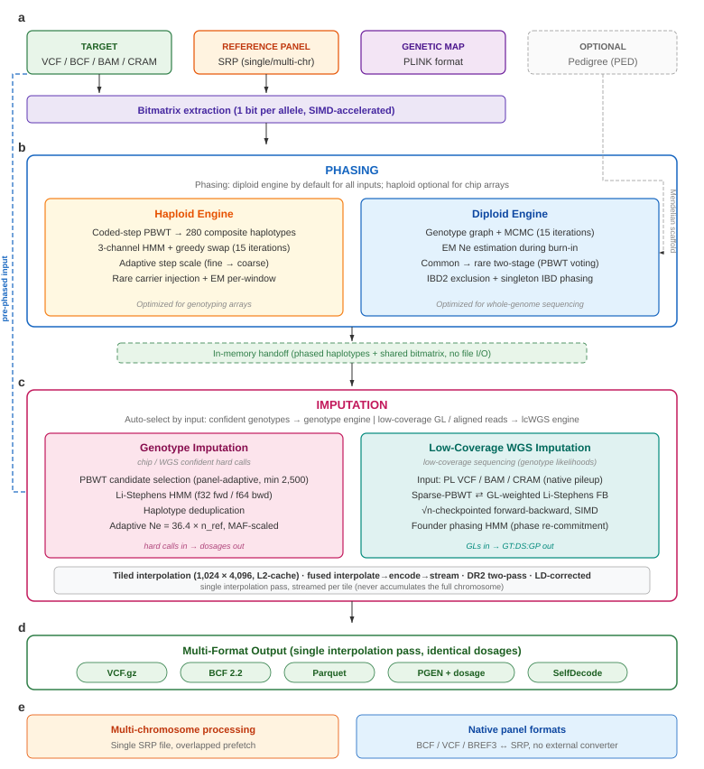

# **Selphi 2: integrated phasing and whole-genome genotype imputation in a single Rust binary**

Authors: Adriano De Marino^1^, Sandra Bohn^1^, Jon Lerga-Jaso^1^, Biljana Novković^1^, Salvatore Loguercio^2^, Andrew Terpolovsky^1^, Ali Torkamani^2^, Puya G. Yazdi^1,\*^

^1^ Research and Development, Omicsedge, Miami, FL, USA
^2^ Scripps Research Translational Institute, La Jolla, CA, USA
\* Corresponding author: pyazdi@omicsedge.com

# **Abstract**

End-to-end genotype imputation today requires chaining multiple specialized tools, Eagle2 or SHAPEIT5 for phasing, Beagle, IMPUTE5, or Minimac4 for imputation, dedicated reference panel converters, bcftools for indexing, and per-format writers, each operating on per-chromosome inputs and emitting intermediate VCF files between stages. Here we present Selphi 2, a complete reimplementation of the Selphi genotype imputation framework [23] in Rust that integrates the full workflow into a single tool. Selphi 2 adds two phasing engines (a diploid genotype-graph engine with MCMC sampling, used by default, and a haploid composite HMM) and imputes whole-genome targets against a single multi-chromosome reference panel in one command, eliminating per-chromosome file splitting and output concatenation. Selphi 2 reduces wall time by an order of magnitude relative to Selphi 1 and reduces peak memory by 39–58% relative to Beagle 5.5, while matching or exceeding Selphi 1's accuracy: on homogeneous reference panels accuracy is preserved, and on admixed cohorts imputed against biobank-scale panels Selphi 2 recovers rare-variant accuracy that Selphi 1's fixed per-target candidate-set cap forfeited by systematically truncating rare-variant carriers from minority ancestries. The fixed cap is replaced by a panel-adaptive sizing formula derived from reference panel size and haplotype-pattern diversity. On real consumer genotyping arrays imputed against a 75,552-haplotype production panel and validated against each individual's own high-coverage genome, Selphi 2's imputer matches or exceeds Beagle 5.5 at equal phasing on both SNPs and indels, and, with its own diploid phasing (the default engine), exceeds Beagle's full pipeline on both SNPs and indels. This default engine, which averages a small intra-run phase ensemble at essentially no added phasing cost, is among the most accurate configurations evaluated, on par with or above Selphi imputation given Beagle's own phasing. The same binary additionally provides a low-coverage sequencing (lcWGS) imputation engine: a genotype-likelihood-aware Li-Stephens model that imputes directly from soft-called sequencing data. Benchmarked against GLIMPSE2 [11] on real low-coverage sequencing of the Genome in a Bottle reference samples (~1.8× chromosome 22, leak-free panel), it exceeds GLIMPSE2 in overall per-sample R² on every sample while imputing each sample independently against the panel without ever materializing the full-chromosome reference panel; run one sample at a time (its native mode), it is roughly 2.7× faster than GLIMPSE2.

# **Introduction**

Genotype imputation, the statistical inference of ungenotyped variants from reference panels of sequenced haplotypes, has become foundational to modern human genetics. By expanding the variant coverage of array-genotyped and low-coverage sequenced cohorts, imputation enables genome-wide association studies (GWAS), polygenic risk score (PRS) estimation, and fine-mapping of causal variants at a fraction of the cost of deep whole-genome sequencing (WGS) [1]. As reference panels have grown from thousands to hundreds of thousands of sequenced individuals, and as the clinical relevance of rare and low-frequency variants has become increasingly apparent, the demands on imputation algorithms have evolved accordingly.

The dominant computational framework for genotype imputation is the Li and Stephens hidden Markov model (HMM) [2], which models each target haplotype as a mosaic of reference haplotypes connected by recombination events. To efficiently identify the most informative reference haplotypes from panels containing tens of thousands of individuals, modern tools employ the Positional Burrows-Wheeler Transform (PBWT) [3] for haplotype matching. The current landscape of imputation software is anchored by three widely used tools: IMPUTE5 [4] uses PBWT-based haplotype selection to achieve sub-linear scaling with panel size; Beagle [5] (used here at version 5.5) combines integrated phasing [6] with haplotype clustering for computational efficiency; and Minimac4 [7] powers the Michigan and TOPMed imputation servers with low memory requirements. All three tools produce accurate imputation for common variants, though they differ in their handling of rare variants, memory consumption, and integration with upstream phasing.

The current imputation ecosystem is fragmented across multiple specialized tools. A standard end-to-end workflow phases the target with a dedicated phaser such as Eagle2 [8], SHAPEIT5 [9], or an earlier biobank-scale haplotype estimator [18], imputes the phased target with Beagle 5.4 [5], IMPUTE5 [4], or Minimac4 [7], converts the reference panel between project-specific binary formats with dedicated converters (bref3 for Beagle, xcf for IMPUTE5, msav for Minimac4), splits the genome into per-chromosome files for parallel execution, indexes outputs with bcftools, and re-encodes results into downstream formats (BCF, Apache Parquet, PLINK2 PGEN [10]) with external writers. Each handoff requires intermediate files, shell glue, and per-chromosome bookkeeping. Beagle 5.4 [5] integrates phasing and imputation in a single Java process, mitigating some of this fragmentation, but the genome is still processed one chromosome at a time and the output is restricted to VCF.

The original Selphi [23] addressed a different limitation of this ecosystem: the locality of haplotype matching imposed by sliding-window or chunked PBWT scans. By performing a chromosome-wide PBWT scan and accumulating cumulative match statistics across that scan, Selphi 1 achieved higher rare-variant imputation accuracy than Beagle 5.4, IMPUTE5, and Minimac4 across the 1000 Genomes Project [19] and TOPMed [24] reference panels. However, Selphi 1 was implemented in Python with Numba-JIT-compiled inner loops, required pre-phased input, processed one chromosome at a time, and capped the per-target retained haplotype set at K_2 = 60, a cap calibrated on the 1000 Genomes Phase 3 panel (4,802 haplotypes; 1.2% retained) that, when applied to biobank-scale panels such as TOPMed (171,054 haplotypes; 0.04% retained), systematically excluded rare-variant carriers from minority sub-populations, eroding accuracy on admixed cohorts.

Recent methodological advances have addressed some of these challenges in isolation. SHAPEIT5 [9] introduced a two-stage phasing strategy that first establishes a common-variant scaffold and then phases rare variants onto it, substantially reducing switch error rates for low-frequency variants in large cohorts. GLIMPSE2 [11] developed sparse panel representations that encode common variants at bit-level granularity and store rare allele carriers as index lists, enabling efficient imputation from low-coverage sequencing data. QUILT2 [12] extended the PBWT with multi-symbol matching for application to diverse sequencing technologies. None of these tools, however, integrate phasing, imputation, panel preparation, indexing, and multi-format output in a single executable, nor do they perform whole-genome imputation in a single process against a single reference panel file.

Here we present Selphi 2, a complete reimplementation of the Selphi algorithm in Rust that retains the long-range PBWT match-accumulation and multi-stage haplotype selection of Selphi 1, now applied within large overlapping windows (default 80 cM) rather than a single whole-chromosome pass, which removes the dominant runtime bottleneck of Selphi 1, while resolving the workflow limitations above. Phasing is integrated through two engines: a diploid genotype-graph engine with MCMC sampling, used by default for all inputs, and a haploid composite-HMM engine selectable for chip arrays; pre-phased input is no longer required. Whole-genome imputation is performed in a single command against a single multi-chromosome reference panel file, with the next chromosome's data prefetched during the current chromosome's HMM computation, eliminating per-chromosome file splitting and output concatenation. The fixed per-target candidate-set cap of Selphi 1 is replaced by a panel-adaptive sizing formula derived from the reference panel size and the haplotype-pattern diversity of the panel, recovering the rare-variant accuracy that the fixed cap forfeited on admixed cohorts against biobank-scale panels. The Rust reimplementation, with a streaming sparse panel format that bounds peak memory below 500 MB during panel construction independently of panel size, reduces both wall time and peak memory relative to Selphi 1 (Results). Output is written to one or more of five formats from a single interpolation pass: VCF.gz, BCF 2.2, Apache Parquet, PLINK2 PGEN with dosage, and SelfDecode per-sample Parquet archives. Figure 1 gives an overview of the full pipeline.

Selphi 2 further provides a dedicated low-coverage sequencing engine (`--lcwgs`) in the same binary, applying a genotype-likelihood-aware Li-Stephens model to soft-called sequencing input, so that array and low-coverage-sequencing imputation are served by one tool. In this paper, we describe the algorithmic components of Selphi 2 (Methods), benchmark its imputation accuracy and resource consumption against Selphi 1 [23] and Beagle 5.5 [5] on the 1000 Genomes Project [19] and the TOPMed [24] reference panels, compare its phasing accuracy against SHAPEIT5 [9] on the 1000 Genomes trio dataset, and compare its low-coverage engine against GLIMPSE2 [11] on real low-coverage Genome in a Bottle sequencing (Results).

**Figure 1. Overview of the Selphi 2 pipeline.** The pipeline accepts unphased or phased target genotypes in VCF/BCF format, a reference panel in SRP format (single- or multi-chromosome), and a genetic map. If the input is unphased, phasing is performed first; by default the diploid engine (genotype graph with MCMC sampling) is used for all inputs, with the haploid engine (composite HMM with three-channel greedy swap) selectable for chip arrays. The diploid engine operates in two stages: common variants (MAF ≥ 0.1%) are phased via iterative MCMC with EM-estimated effective population size, then rare variants are phased onto the common-variant scaffold using bidirectional PBWT sweeps with IBD2-aware neighbor exclusion and singleton IBD phasing. When pedigree information is available, Mendelian constraints are applied before the HMM to pre-phase deterministic parent-child configurations. Phased haplotypes are passed directly in memory to the imputation stage with no intermediate file I/O. Imputation uses a coded-step PBWT to select candidate reference haplotypes per target, with the per-target candidate-set size set automatically as a function of panel size and panel diversity (Candidate selection and HMM, below). After haplotype deduplication, a Li-Stephens HMM (32-bit forward pass, 64-bit backward pass) computes per-site posterior weights, with an effective population size that scales linearly with panel size (Ne ≈ 36 × n_ref, validated across panels from 5,000 to 171,000 haplotypes) and is further adjusted per site by minor allele frequency. The HMM weights are interpolated to full reference-panel density using cache-friendly 2D tiles, with interpolation fused to output encoding so that no chromosome-wide interpolated dosage matrix is materialized. Five output formats are supported from a single interpolation pass: VCF.gz, BCF 2.2, Apache Parquet, PLINK2 PGEN with dosage, and SelfDecode per-sample Parquet archives. For low-coverage sequencing input (0.5–2× depth), a dedicated genotype-likelihood-aware engine (`--lcwgs` / `--engine lcwgs`) replaces the standard phase-and-impute path: it accepts a PL VCF/BCF or aligned reads (BAM/CRAM, with native pileup), and alternates sparse-PBWT haplotype selection with a GL-weighted Li-Stephens forward–backward (√n-checkpointed, SIMD-accelerated) and a diplotype-mosaic phase-commitment step in a Gibbs schedule, emitting GT:DS:GP against the same reference panel and output formats. Auxiliary capabilities include multi-chromosome processing from a single SRP file with overlapped prefetch and mixed-density (WGS + chip) reference-panel construction.

# **Methods**

## **Selphi 2**

### **Architecture overview**

Selphi 2 is implemented in Rust as a single statically compiled binary. All compression libraries, file format encoders (VCF, BCF, Parquet, PGEN), and index builders (TBI, CSI) are integrated into the binary; no external tools are invoked at runtime. Parallelism is provided by the rayon library [13], with fixed-seed iteration orders that guarantee bit-identical output across runs on the same hardware. The inner loops of the haploid and diploid HMMs are SIMD-vectorized for x86-64 and ARM, with a runtime CPU check selecting the appropriate kernel on each host.

The pipeline accepts unphased or phased VCF/BCF input, phases the target if necessary, imputes against the reference panel, and writes output in one or more formats simultaneously. No intermediate files are written between stages; phased haplotypes are passed in memory to the imputation engine. Memory usage is estimated at startup from panel dimensions and thread count, with a warning if the estimate exceeds available system RAM.

### **Phasing engines**

Selphi 2 includes two phasing engines. By default the diploid engine is used for all inputs: across our benchmarks it matches or exceeds the haploid engine on SNP accuracy at every variant density, attains lower phasing switch-error, and runs roughly 2.5× faster (Discussion). The haploid composite-HMM engine, the regime for which it was originally designed (chip arrays), remains available through a command-line option. Missing (no-call) target genotypes, a routine occurrence on genotyping arrays, where typically 1–2% of sites are no-calls per sample, are carried through both phasing engines as missing and imputed from the surrounding haplotypes by a local copying consensus (the majority allele over the nearest neighbours in a positional-BWT sweep of the target haplotypes and the reference panel), rather than being set to the reference allele; conditioning the phasing scaffold on a falsely homozygous-reference call at such sites measurably degrades downstream imputation accuracy, both directly and by biasing the imputer's reference-haplotype selection toward the reference allele at exactly those sites (Results, Table 3; Discussion).

**Haploid engine.**

The haploid phasing engine models each haplotype independently through a composite HMM with a greedy swap criterion, following the approach of Browning and Browning [14]. The algorithm operates in 15 iterations (3 burn-in with fixed phase, 12 phasing iterations with decreasing likelihood-ratio thresholds from 100,000 to 1.0).

At each iteration, a coded-step PBWT [4] is constructed on the combined reference and target haplotypes, restricted to the set of shared variants. Steps are defined at fixed genetic-distance intervals, with an adaptive step scale: fine steps (scale 1.0, approximately 10 SNPs per step) in early iterations when phasing is uncertain, and coarse steps (scale 3.0, approximately 30 SNPs per step) in later iterations when the phase scaffold is established. This two-resolution strategy is analogous to the common-then-rare phasing approach used in SHAPEIT5 [9], but operates within a single iterative framework rather than as separate stages.

Within each iteration, a composite HMM is constructed with three parallel channels. The channels correspond to alternative haplotype configurations, and phase is resolved through a greedy swap that compares the forward-backward posteriors across channels at each heterozygous site. The swap decision is accepted if the likelihood ratio exceeds a threshold that decreases across iterations, implementing a simulated-annealing-like convergence.

For rare variants, a carrier injection mechanism ensures that haplotypes carrying rare alleles are represented in the matching: when the best IBS match at a position does not carry the target's rare allele, a random carrier from the reference panel is substituted. This prevents rare alleles from being systematically lost during the matching step.

EM parameter estimation [15] is performed within each iteration to calibrate the mismatch probability and effective recombination rate per window, enabling the HMM transition probabilities to adapt to local recombination patterns.

**Diploid engine.**

The diploid engine models the pair of haplotypes jointly through a genotype graph, following the approach of SHAPEIT4 [16] and SHAPEIT5 [9]. At each heterozygous site, the graph encodes all possible local diplotype configurations using 64-bit bitmasks. A segment-based Li-Stephens HMM computes diplotype transition probabilities across conditioning haplotypes selected by positional PBWT. The number of conditioning haplotypes can be capped for computational efficiency (default: unlimited).

Phase is resolved via MCMC sampling on the genotype graph with 15 iterations following the scheme 5b,1p,1b,1p,1b,1p,5m (5 initial burn-in, 3 interleaved prune/burn-in cycles, 5 main iterations), followed by a final Viterbi solve. The HMM forward pass is SIMD-vectorized. The diploid engine operates only on common variants (MAF ≥ 0.1%); rare variants are phased in a separate pass (Rare variant phasing, below).

By default the diploid engine forms a small **intra-run phase ensemble** to marginalise phase uncertainty at negligible added cost. Each main MCMC iteration already draws a complete diplotype configuration, a sample from the phase posterior, that the chain otherwise discards in favour of the final Viterbi solve. Instead, the Viterbi solve and a thinned subset of these post-burn-in samples are kept as N phase members (default N = 2) from the single phasing chain; each is carried through rare-variant phasing and imputed, and the per-haplotype Li-Stephens copying weights are averaged across the members before interpolation. Because the imputed dosage is linear in those weights (dosage = Σ w · panel allele), the averaged weights yield the exact mean dosage over the N phasings, marginalising phase uncertainty in dosage space. Crucially the members share one phasing chain, so the cost is one phasing plus N imputation passes (the reference-panel read and interpolation are shared), rather than the N independent phasings of a conventional ensemble; on the consumer-array benchmark N = 2 adds ≈25–30 % wall time and lifts SNP R² by ≈0.005 and indel R² by ≈0.006 (Results, Table 3). The ensemble is disabled (N = 1, a single Viterbi solve) under `--sample-batch-size` and `--phase-only`; the haploid engine does not use it, as its greedy-swap phasing converges to a single solution rather than sampling a posterior.

During burn-in iterations, the effective population size (Ne) is re-estimated from the empirical transition rate observed in the genotype graphs. The observed switch rate (fraction of sites where a genotype graph changes diplotype assignment) is related to Ne through the Li-Stephens approximation [2]: switch_rate ≈ 0.04 × Ne × d / n_haps, where d is the mean inter-marker distance in cM. The estimated Ne is clamped to [1,000, 1,000,000] and applied only when the change exceeds 5% of the current value, preventing oscillation while allowing adaptation to population-specific recombination patterns.

**Rare variant phasing (diploid).**

Rare variants (those not in the common-variant scaffold) are phased in a dedicated PBWT-based pass that operates on target haplotypes only. This two-stage common-then-rare strategy parallels the approach introduced in SHAPEIT5 [9].

The algorithm proceeds in four steps. First, an IBD2 scan identifies sample pairs sharing both haplotypes identical-by-descent across scaffold sites [17]. Pairs are detected using a diploid PBWT on genotype sums (0/1/2), with IBD2 segments required to span at least 2.5 cM, 1 Mb, and 100 scaffold sites. IBD2 pairs are excluded from PBWT neighbor selection during rare variant phasing, as their haplotypes are uninformative for resolving phase at heterozygous sites shared between both individuals.

Second, a scaffold bitmatrix is constructed from target haplotypes at scaffold sites, filtering out sites with a missing data rate (MDR) above 10%. A forward PBWT sweep processes all variants in physical order: at scaffold sites, the PBWT arrays (permutation A, divergence C, reverse-lookup R) are updated; at rare heterozygous sites, phasing is performed using a two-pass threshold-then-distance voting scheme. In the threshold pass, the two PBWT neighbors of each of the target's haplotypes vote on the phase assignment. If the net vote exceeds a threshold (starting at 2.5 and decreasing to 1.0), the phase is assigned and the carrier contributes to subsequent decisions. In the distance pass, remaining unphased sites use distance-weighted votes, where the weight is the genetic distance from the PBWT divergence point to the current position.

Third, a backward PBWT sweep repeats the same procedure in reverse genomic order. The forward and backward results are merged by selecting the direction with higher confidence (absolute vote score) for each rare het.

Fourth, singleton variants (MAC = 1 among targets) are phased using IBD segment lengths at the scaffold. For each sample, the run-length of consistent alleles on each haplotype is measured at scaffold sites as a proxy for the coalescent Viterbi IBD segment length. The singleton allele is assigned to the haplotype with the longer flanking IBD segment. This is analogous to the coalescent-based singleton phasing in SHAPEIT5 [9] but uses empirical run-lengths rather than a full coalescent HMM.

**Pedigree scaffolding.**

When pedigree information is available (PLINK PED format), Mendelian constraints from parent-child relationships are applied before the HMM-based phasing, following established practice [9,16,18]. For each trio or duo, the algorithm considers all nine combinations of parental genotype sums (homozygous reference, heterozygous, homozygous alternate) at each variant. When the child is heterozygous and at least one parent is homozygous, the phase is deterministic: the child received the homozygous allele from that parent. When both parents are heterozygous, the phase cannot be resolved by Mendelian logic alone and is deferred to the HMM. When the child has missing genotype data and both parents are homozygous, the child's genotype is imputed. Mendelian inconsistencies (e.g., child heterozygous with both parents homozygous for the same allele) are counted but not corrected.

On chromosome X, haploid samples (males) are detected automatically by their heterozygosity rate: samples with fewer than 1% heterozygous calls across at least 100 non-missing sites are classified as haploid. Heterozygous calls in haploid samples are biologically impossible and indicate genotyping error; these are reset to missing to allow the HMM to impute the correct homozygous genotype.

**Panel phasing.**

When no external reference panel is available, the same two phasing engines can phase a cohort against itself in a single command. The cohort haplotypes are used both as the target and as the conditioning set; engine selection follows the same variant-density rule (haploid for chip arrays, diploid for WGS). Output is written as a phased VCF/BCF and, optionally, as a Selphi SRP file or a BREF3 [5] file for direct reuse as a reference panel in subsequent imputation runs. For cohorts whose memory footprint exceeds available system RAM, the genome is automatically chunked along the genetic map and the chunks are ligated at the boundary haplotype assignment.

### **PBWT matching for imputation**

The imputation component uses a coded-step PBWT [4] operating directly on the reference panel bitmatrix (1 bit per allele, packed as 64-bit words). At each step boundary (defined by genetic map positions at approximately 0.05 cM intervals), haplotypes are grouped by their allele sequence within the step using word-level extraction: 64 haplotypes are processed per 64-bit operation, and FNV-1a hashing is used for steps spanning more than 20 SNPs. The result is a set of coded-step partitions from which candidate reference haplotypes can be selected.

For each target haplotype, candidate reference haplotypes are selected based on their co-occurrence with the target in coded-step partitions. The number retained per target (`max_candidates`, henceforth mc) is set automatically as a function of the reference panel size and diversity, as described in the next section. Thread-local workspace buffers (permutation arrays, divergence arrays) are pre-allocated and reused across all targets within a rayon thread, eliminating per-target allocation overhead.

### **Candidate selection and HMM**

The selected candidates undergo two filtering steps before entering the HMM. First, candidates appearing below the 10th percentile of occurrence frequency across all step partitions are removed. Second, candidates with greater than 95% position coverage have their gaps filled to prevent artificial truncation of otherwise consistent matches. Identical reference haplotypes at the shared variant positions are then grouped (haplotype deduplication), reducing the number of HMM hidden states by 10–50% depending on the reference panel and target region.

A reduced array is constructed containing only the candidate haplotypes plus the target, and a PBWT forward-backward pass is run on this reduced array. The forward pass uses 32-bit floating-point arithmetic for 2x cache density and SIMD throughput; the backward pass uses 64-bit precision to maintain numerical stability in the recombination probability computation. The per-site recombination probability follows the standard Li-Stephens formulation [2]:

P(switch) = 1 - exp(-d_k × 0.04 × Ne / n_ref)

where d_k is the genetic distance between consecutive markers in centiMorgans, Ne is the effective population size, and n_ref is the number of candidate haplotypes. In existing imputation tools, Ne is a fixed constant typically calibrated on a single reference panel (e.g., Ne = 15,000 in Beagle [5], or Ne = 20,000 in IMPUTE5 [4]). However, the optimal Ne depends on the reference panel size: as panels grow, PBWT-selected candidates represent increasingly close matches to the target, sharing shorter identity-by-descent segments. To capture the mosaic structure at finer resolution, the HMM must switch between candidates more frequently, requiring a proportionally larger Ne.

Selphi 2 sets Ne automatically as a linear function of the total number of reference haplotypes:

Ne = 36.4 × n_ref_total

where n_ref_total is the total number of haplotypes in the reference panel (not the number of candidates selected for the HMM). This scaling was derived empirically by optimizing imputation R² across three reference panels spanning two orders of magnitude in size: the 1000 Genomes Phase 3 panel (4,802 haplotypes; optimal Ne ≈ 175,000), a UK Biobank subset (75,542 haplotypes; optimal Ne ≈ 2,750,000), and the TOPMed panel (171,054 haplotypes; optimal Ne ≈ 6,200,000). The constant ratio Ne/n_ref ≈ 36 was consistent across panels despite substantial differences in population composition (multi-ethnic global panel, European-only cohort, and multi-ethnic clinical cohort, respectively).

The effective population size is further calibrated per site using a MAF-adaptive scheme: Ne is set to 0.85 × Ne_base for rare variants (MAF < 0.5%) and 1.2 × Ne_base for common variants (MAF > 2%), with a smooth logistic transition between. When the diploid phasing engine is used, the Ne estimated by EM during burn-in (see Diploid engine, above) may additionally inform the imputation HMM. Users may override the automatic Ne with a fixed value for reproducibility with prior results.

**Adaptive candidate-set sizing.** The maximum number of reference haplotypes retained per target, denoted mc, henceforth, is set automatically as a function of reference panel size and panel diversity. A fixed mc, as used in earlier Selphi releases (mc \= 2,500)[23], generates a panel-relative truncation rate that varies by two orders of magnitude across panels: mc \= 2,500 retains 50% of a 5,000-haplotype panel but only 1.5% of a 171,054-haplotype panel. The latter regime systematically excludes rare-variant carriers from minority sub-populations when the per-target top-K is dominated by haplotypes of the panel's majority ancestry, producing R² losses concentrated on low-frequency variants in admixed cohorts.

Selphi 2 resolves mc automatically as

mc \= clamp(Nref (γ + α CVpanel), mcfloor, mcceil)

where Nref is the total number of reference haplotypes, γ is a base fraction, α is a diversity-coupled fraction, and CVpanel ∈ \[0, 1\] is the coefficient of variation of compressed tile sizes in the SRP, computed once at panel load. CVpanel is a proxy for haplotype-pattern diversity: panels containing multiple distinct mosaic structures (multiple ancestries, divergent sub-populations) compress less uniformly than ancestrally homogeneous panels, yielding higher CV.

**Choice of γ, α, mcfloor and mcceil.** The defaults γ \= 0.10, α \= 0.80, mcfloor \= 2,500, and mcceil \= 10⁶ were chosen so that mc remains near 2,500 on small homogeneous panels (preserving baseline accuracy on cohorts such as the 1000 Genomes Phase 3 panel) and rises with both n_ref and panel diversity on larger panels. The floor at 2,500 reproduces the historical default and ensures that even very small panels supply enough conditioning states to the HMM; the ceiling at 10⁶ is effectively unlimited and acts only as a safety bound against pathological inputs. On the panels evaluated in this work, the formula yields mc \= 3,133 for the 1000 Genomes Phase 3 panel (CVpanel \= 0.691, Nref \= 4,802), essentially the floor, and mc \= 132,676 for the TOPMed panel (CVpanel \= 0.845, Nref \= 171,054), 78% of the panel. Users may override the automatic mc with a fixed value for reproducibility with prior results.

The resulting HMM posterior weights are stored as sparse CSR matrices (row-per-chip-variant, column-per-reference-haplotype), with entries below 1/(H+1) set to zero.

### **Interpolation and output**

Between consecutive shared-variant positions (chip sites), imputed dosages at reference-panel-only positions are computed by linear interpolation of the HMM-derived haplotype weights, following the standard approach [4,7]:

P(alt | j) = sum_r [ w_r(j) × x_r(j) ] / sum_r [ w_r(j) ]

where w_r(j) is the interpolated weight of reference haplotype r at position j, and x_r(j) is the allele carried by haplotype r at that position. Reference alleles at imputed positions are read from the tiled SRP format (see Sparse Reference Panel format, below), with pre-loaded stripe batches overlapping I/O with HMM computation.

Interpolation operates on tiles of 1,024 variants × 4,096 haplotypes, sized to fit in L2 cache per core. Within each tile, the interpolation is fused with output encoding: after a tile's dosages are computed, they are immediately formatted to all active output formats and the tile memory is freed. This prevents accumulation of interpolated dosages across the entire chromosome.

The per-variant dosage R-squared (DR2) quality metric [20] is computed using a numerically stable two-pass method:

DR2 = var(dosage) / [2 × p × (1 - p)]

where p = mean(dosage) / 2 is the estimated alternate allele frequency, and var(dosage) is computed as the mean of squared deviations from the mean (avoiding the numerically unstable single-pass E[X²] - E[X]² formula).

To accelerate VCF output formatting, a fast path is employed for samples with trivial dosages: when both haplotype probabilities are below 0.005 (homozygous reference) or above 0.995 (homozygous alternate), a pre-compiled constant string is written directly, bypassing all floating-point-to-string conversion. For rare variants (MAF < 1%), more than 99% of samples follow this fast path.

Selphi 2 supports five output formats from a single interpolation pass: VCF.gz (multi-threaded BGZF compression), native BCF 2.2 [21], Apache Parquet (zstd-compressed, variant-major columnar layout), PLINK2 PGEN [10] (mode 0x03 with fixed-width records containing 2-bit hardcalls and 16-bit unphased dosage), and SelfDecode format (per-sample chunked Parquet in a ZIP archive). The VCF/BCF output channel uses a dedicated writer thread with a bounded synchronous channel (capacity 64 blocks), decoupling interpolation throughput from I/O throughput. All output formats use the same two-pass DR2 computation, ensuring consistent quality metrics regardless of format choice.

### **Low-coverage sequencing imputation engine**

The phasing-and-imputation pipeline above targets array-genotyped data, where the input is a set of confident hard genotype calls at chip sites. Low-coverage whole-genome sequencing (lcWGS) presents a different inference problem: at 0.5–2× depth, most sites carry no confident call but a soft genotype likelihood (GL) derived from one or two reads. Selphi 2 provides a dedicated lcWGS engine, selected with `--lcwgs`, that reuses the reference-panel ingestion (SRP), the `HaplotypeBitmatrix`, the genetic map, and the output writers, but replaces the hard-call HMM with a genotype-likelihood-aware Li-Stephens model. GLIMPSE2 [11] established that this regime is best addressed by imputing directly from genotype likelihoods rather than from hard calls; we benchmark against it in Results.

The engine reads per-sample Phred-scaled genotype likelihoods (the `PL` field produced by `bcftools mpileup | call`) at the panel's variant sites and converts them, via a 256-entry lookup table, to per-haplotype likelihoods. The genotype likelihoods may instead be computed natively from aligned reads (BAM or CRAM, one file per sample) in the same process, removing the external pileup step: for each biallelic panel SNP, the overlapping reads are walked through their CIGAR alignment and each read base is folded into the three genotype likelihoods under the standard base-quality error model ($P(b\,|\,\mathrm{REF})=1-\varepsilon$ if the base matches else $\varepsilon/3$, with $\varepsilon=10^{-Q/10}$ and the heterozygous term $\tfrac{1}{2}P(b\,|\,\mathrm{REF})+\tfrac{1}{2}P(b\,|\,\mathrm{ALT})$), filtered by mapping and base quality; the result matches `bcftools mpileup` at the same thresholds. Overlapping paired-end mates, the two mates of one fragment sample the same molecule, are collapsed to a single observation per site (agreeing bases retain the higher base quality, disagreeing bases are down-weighted) so a fragment's evidence is not double-counted. CRAM read bases are reconstructed against the supplied reference FASTA, and with a region restriction the alignment index (`.bai`/`.crai`) is used to decode only the requested span. Indel panel sites are imputed flat from the haplotype scaffold by default, as in GLIMPSE2: at low coverage per-read indel likelihoods are miscalibrated and degrade neighbouring-SNP accuracy when fed to the joint model. Optionally (for higher-coverage input) the local REF and ALT haplotypes of each panel indel are built from the reference and every spanning read is scored against both with a pair-hidden-Markov model (forward algorithm, affine gap penalties, per-base-quality emissions, marginalising over alignment uncertainty), folding $P(\text{read}\,|\,\text{REF})$ and $P(\text{read}\,|\,\text{ALT})$ into the genotype likelihoods as for a SNP. To verify that this in-process pileup is faithful to the external `bcftools mpileup` path, we ran a downsampling check (a 52$\times$ whole-genome sample reduced to 1$\times$, with the full-depth calls as truth): Selphi 2's native pileup attains per-allele-frequency-bin aggregate $r^2$ 0.964, matching (and slightly exceeding) its own pre-computed-likelihood path (0.960) and comparable to an equivalent GLIMPSE2 pileup (0.967), confirming the native genotype-likelihood computation reproduces the established pipeline. Imputation proceeds by Gibbs alternation between haplotype selection and a GL-weighted forward-backward pass: each iteration selects a conditioning set of reference haplotypes by sparse PBWT from the current sampled haplotypes, then runs a Li-Stephens forward-backward in which each haplotype's per-site emission is built conditional on the partner haplotype's currently sampled allele, decoupling the two haplotypes of a diploid sample into independent copying problems, and samples a fresh allele per site from the resulting posterior. Posterior dosages from the post-burn-in iterations are averaged for the output, written as VCF.gz with `GT:DS:GP` fields. The forward-backward applies a leave-one-out emission: the forward emission at each site is divided back out of the hidden-state posterior before the read likelihood and error model are re-applied, so the per-site read is incorporated once rather than twice.

To bound memory independently of chromosome length and panel size, the chromosome is processed in overlapping cM chunks: each chunk's reference bitmatrix is extracted directly from the SRP for that chunk's variants and discarded after use, so the full-chromosome reference bitmatrix is never materialized. The forward-backward inner loops over the conditioning states are vectorized with AVX-512 (a bit-packed conditioning representation loads 16 reference alleles directly as a mask register), with a scalar fallback on other hosts; the selection step accumulates IBS match lengths in a per-target sparse map rather than a dense target×panel matrix, so its memory is independent of panel haplotype count.

### **Sparse Reference Panel format (SRP)**

The SRP format stores reference panel haplotypes as a 2D tiled sparse matrix. Each tile covers 1,024 variants × 4,096 haplotypes and is stored as a compressed sparse column (CSC) sub-matrix with u16 row indices and u32 column pointers, compressed with zstd at level 3. Tiles are arranged in row-major order (all bands for stripe 0, then stripe 1, etc.), enabling sequential bulk reads per stripe batch via a single pread() system call.

SRP creation is fully streaming: source data (BCF, VCF, or BREF3 [5]) is processed chunk-by-chunk, with each source chunk decompressed once and scattered to tile columns in parallel. Completed stripes are flushed to disk immediately, keeping peak memory below 500 MB for any panel size. The parallel BCF reader uses CSI index [21] seeking to divide the source file into balanced genomic regions across threads.

The SRP format supports both single-chromosome and multi-chromosome panels. A multi-chromosome SRP stores all chromosomes in a single file with a global header containing a chromosome directory and shared sample IDs, followed by independent per-chromosome tile sections. Multi-chromosome panels are automatically detected, enabling whole-genome imputation from a single command with overlapped prefetch of the next chromosome's data during the current chromosome's HMM computation.

### **Multi-chromosome processing**

Selphi 2 supports whole-genome imputation from a single command using a multi-chromosome SRP file. A multi-chromosome SRP contains a global header with a chromosome directory and shared sample IDs, followed by independent per-chromosome tile sections. Multi-chromosome panels are created from multi-contig BCF files, from directories of per-chromosome BCF files, or by merging existing single-chromosome SRP files.

Target VCF input is read once and partitioned by chromosome in memory. Genetic maps are auto-discovered from a directory by matching chromosome names against common naming patterns (chr1.map, chr_1.map, genetic_map_chr1_*, etc.). Chromosomes are processed sequentially in natural sort order, with the next chromosome's reference data prefetched in a background thread during the current chromosome's HMM computation. This prefetch overlap hides I/O latency at no additional memory cost beyond one chromosome's reference data.

Output is written to a single VCF/BCF file across all chromosomes, with per-chromosome BGZF blocks concatenated natively (preserving block alignment for tabix/CSI indexing).

### **LD correction**

Genetic map distances used in the HMM transition probabilities are corrected for local linkage disequilibrium (LD) patterns [22]. Empirical switch rates between consecutive variant pairs in the reference panel are computed via XOR-and-popcount operations on the bitmatrix. These switch rates are normalized by expected heterozygosity, median-filtered to remove noise, and used to adjust the genetic map distances while preserving the total genetic length. This prevents inflation of the effective population size estimate in regions of strong LD.

### **Consumer-array benchmark: data preparation and evaluation**

For the production-array benchmark (Results, *Imputation accuracy on production arrays against high-coverage WGS truth*; Table 3), we used six individuals each having both a SelfDecode consumer genotyping array (Illumina Global Screening Array, GRCh38) and an independent high-coverage Illumina whole-genome sequence processed with the DRAGEN germline pipeline (GRCh38; ≈30–60×). All six were confirmed absent from the reference panel before any analysis.

*Truth construction.* DRAGEN hard-filtered WGS calls were normalized and decomposed with `bcftools norm -m-any` against the GRCh38 reference, then restricted to high-confidence genotypes by requiring `FILTER=PASS`, genotype quality `GQ ≥ 20`, and read depth `DP ≥ 10`. This removed roughly 14% of raw calls (e.g. 5.09M → 4.66M for one sample); `FILTER=PASS` alone retained many low-confidence calls (genotypes supported by `GQ` as low as 5) and was insufficient. Both SNPs and indels were retained and evaluated separately. The high-confidence set defines the truth genotype at every site it contains.

*Array input.* Array genotypes were lifted to the panel's variant coordinates: REF/ALT and site position were taken from the reference panel, the genotype was assigned from the array alleles (strand-flipping by complement where required), and homozygous-reference calls, which a naïve TSV-to-VCF conversion leaves with an undefined ALT and would otherwise be dropped, were explicitly retained, yielding ≈620,000 autosomal SNPs per sample. The six samples were merged into one cohort and imputed jointly.

*Imputation.* The array cohort was imputed against the 75,552-haplotype production panel with each tool given the same per-chromosome genetic map. For the "Beagle-phased" rows, both Selphi 2 and Selphi 1.5.3 were given Beagle's phase-only output as their phased input, isolating the imputation step from phasing quality; the "haploid"/"diploid" rows use Selphi 2's internal phasing engines. Beagle 5.5 (build 03 Oct 2025) was run as a full phase-plus-impute pipeline against the same panel in `bref3` form.

*Evaluation.* For each sample, variant class (SNP, indel), and chromosome we computed R² as the squared Pearson correlation between imputed dosage and truth genotype. A truth genotype is the high-confidence call where one exists; sites present in the raw WGS but removed by the confidence filter are excluded from evaluation rather than counted as homozygous reference; sites absent from the WGS are treated as homozygous reference; and the array sites themselves are excluded so that only imputed variants are scored. Reported values are means over the six samples, genome-wide across chromosomes 1–22. Pairwise comparisons between tools are summarized by the mean per-sample difference in R², a 95% confidence interval obtained from 20,000 paired bootstrap resamples of the six per-sample differences, and a two-sided exact Wilcoxon signed-rank test; with n = 6 paired samples the smallest attainable two-sided p value is 0.031.

# **Results**

We evaluated Selphi 2 against Beagle 5.5 and the original Selphi 1.5.3 on three reference panels spanning two orders of magnitude in size: the 1000 Genomes Phase 3 panel [19] (4,802 haplotypes), the TOPMed Freeze 8 panel [24] (171,054 haplotypes), and a 75,552-haplotype production panel containing the full 1000 Genomes cohort. All experiments use unphased target genotypes as the realistic input scenario; tools that require pre-phased input (Selphi 1.5.3 in particular) were pre-phased with Selphi 2's haploid engine to ensure an identical phased starting point. Imputation R² is computed against held-out whole-genome-sequenced truth, stratified by minor allele frequency (MAF) in the reference panel. All benchmarks were run on the same machine with 16 threads. Per-bin, per-mode, and additional speed and memory breakdowns are provided in Supplementary Tables S-A–S-F.

## **Imputation accuracy on the 1000 Genomes Phase 3 reference panel**

On chromosome 22 of the 1000 Genomes Phase 3 panel (4,802 haplotypes, 1,070,401 variants) imputed for 801 held-out samples, Selphi 2's default diploid engine attains an overall R² of 0.4847 against the whole-genome-sequenced truth, compared to 0.4727 for Beagle 5.5, 0.4594 for IMPUTE5, and 0.4471 for Minimac4, with all four tools imputing the identical phased target against the identical 1000 Genomes reference panel. The per-sample mean R² is 0.9162 (Selphi 2) versus 0.9048 (Beagle 5.5), 0.9025 (IMPUTE5), and 0.8964 (Minimac4). The same comparison on chromosome 1 (5,769,087 variants) gives overall R² 0.5748 (Selphi 2) versus 0.5640 (Beagle 5.5), and per-sample mean 0.9566 versus 0.9507. Selphi 2 attains the highest R² of the four tools in every MAF bin from 0.1% upward on chromosome 22, and exceeds Beagle 5.5 in every bin from 0.1% upward on chromosome 1; only at the rarest bin (MAF 0.05–0.1%) does Beagle 5.5 narrowly lead (Table 1).

**Table 1. Imputation R² on the 1000 Genomes Phase 3 panel, by MAF.** Each cell reports R² between imputed dosage and whole-genome-sequenced truth, computed at variants in the indicated MAF bin (frequencies in the 1000 Genomes reference panel). n = 801 held-out samples per chromosome; full-pipeline mode (unphased target chip in, imputed dosage out); Selphi 2 uses its default diploid phasing engine. IMPUTE5 and Minimac4 were each given the identical phased target and the identical 1000 Genomes reference panel and were evaluated on chromosome 22; Beagle 5.5 and Selphi 2 were additionally evaluated on chromosome 1. Bold marks the highest R² in each chromosome group.

| MAF | chr22 Selphi 2 | chr22 Beagle 5.5 | chr22 IMPUTE5 | chr22 Minimac4 | chr1 Selphi 2 | chr1 Beagle 5.5 |
|---|---|---|---|---|---|---|
| 0.05–0.1% | 0.2786 | **0.2800** | 0.2613 | 0.2545 | 0.3626 | **0.3638** |
| 0.1–0.2%  | **0.3280** | 0.3177 | 0.3029 | 0.2929 | **0.4183** | 0.4065 |
| 0.2–0.5%  | **0.4253** | 0.4073 | 0.3936 | 0.3790 | **0.5142** | 0.4950 |
| 0.5–1%    | **0.5090** | 0.4866 | 0.4763 | 0.4605 | **0.6155** | 0.5924 |
| 1–2%      | **0.5737** | 0.5480 | 0.5415 | 0.5240 | **0.6814** | 0.6578 |
| 2–5%      | **0.6769** | 0.6519 | 0.6486 | 0.6324 | **0.7564** | 0.7338 |
| 5–10%     | **0.7600** | 0.7385 | 0.7355 | 0.7187 | **0.8504** | 0.8343 |
| 10–20%    | **0.7961** | 0.7789 | 0.7769 | 0.7605 | **0.9012** | 0.8901 |
| 20–50%    | **0.8418** | 0.8270 | 0.8255 | 0.8090 | **0.9313** | 0.9231 |
| OVERALL   | **0.4847** | 0.4727 | 0.4594 | 0.4471 | **0.5748** | 0.5640 |

At the rarest bin (MAF 0.05–0.1%), Beagle 5.5 narrowly outperforms Selphi 2 on both chromosomes (Δ ≈ -0.001), the only frequency at which any tool exceeds Selphi 2; IMPUTE5 and Minimac4 trail Selphi 2 in every bin, including the rarest. At MAF ≥ 0.1% Selphi 2 leads by margins that grow with allele frequency (chr22 20–50% MAF: +0.0148 over Beagle 5.5, +0.0163 over IMPUTE5, +0.0328 over Minimac4). The crossover at the rarest bin reflects the differing trade-offs in candidate selection: at the rarest frequencies, Beagle 5.5's window-local composite-haplotype reconstruction better preserves single-carrier reference haplotypes, while at common frequencies the long-range, large-window PBWT scan of Selphi 2 retains more informative haplotypes per target.

## **Imputation accuracy on a biobank-scale admixed cohort**

The Selphi 1 candidate-set cap of K_2 = 60 was calibrated on the 1000 Genomes Phase 3 panel (retaining 1.2% of the panel). When the panel grows to TOPMed-scale (171,054 haplotypes), the same cap retains 0.04% of the panel and systematically excludes haplotypes that carry rare alleles in minority sub-populations. We tested this hypothesis on the MESA cohort (5,000 multi-ethnic samples, chip-array genotyped) imputed against the TOPMed Freeze 8 panel (chr20, 17.9 million variants). The cohort is admixed (African, Hispanic, Asian, and European sub-populations) and is fully held out from TOPMed.

Selphi 2's panel-adaptive sizing formula (Methods, Candidate selection and HMM) yields mc = 132,676 for the TOPMed panel (panel-tile-compression diversity CV = 0.845, scaled fraction 0.776). At this candidate-set size, Selphi 2 attains overall R² 0.6157 on the MESA cohort, compared to 0.5921 for Beagle 5.5 on the same full-panel set of 17.9 million variants (Δ = +0.0236). Per-sample mean R² is 0.9023 (Selphi 2) versus 0.8845 (Beagle 5.5), Δ = +0.0178. Increasing the candidate set further to mc = 150,000 yields a marginal additional gain (overall R² 0.6162, +0.0005 over the default mc = 132,676) and confirms the diminishing-returns regime captured by the formula.

To isolate the contribution of the new sizing rule, we ran Selphi 2 on the same admixed cohort with mc fixed at 2,500 (the configuration that mirrors Selphi 1's K_2 = 60 cap on a panel of this size in retained-fraction terms). On a 500-sample MESA subset (chr20, TOPMed panel), mc = 2,500 yielded overall R² 0.5771 while mc = 132,676 (auto) yielded R² 0.6422, a gain of +0.0651 attributable entirely to the candidate-set size (Table 2).

**Table 2. Effect of candidate-set size on imputation R², MESA admixed cohort × TOPMed panel.** Per-MAF R² for two candidate-set sizes on a 500-sample subset of MESA, chr20. mc = 2,500 mirrors Selphi 1's K_2 cap on a panel of this size; mc = 132,676 is the value chosen by the panel-adaptive formula (Methods).

| MAF | mc = 2,500 | mc = 132,676 (auto) | Δ |
|---|---|---|---|
| 0.1–0.2% | 0.5066 | 0.6150 | +0.1084 |
| 0.2–0.5% | 0.5373 | 0.6101 | +0.0728 |
| 0.5–1%   | 0.5961 | 0.6504 | +0.0543 |
| 1–2%     | 0.6277 | 0.6677 | +0.0400 |
| 5–10%    | 0.6471 | 0.6650 | +0.0179 |
| 20–50%   | 0.6688 | 0.6769 | +0.0081 |
| OVERALL  | 0.5771 | **0.6422** | **+0.0651** |

The gain is monotonically larger at rarer MAF bins, confirming that the fixed cap in Selphi 1 was preferentially truncating rare-variant carriers. The panel-adaptive formula recovers this accuracy without manual tuning.

To test whether this candidate-set truncation falls preferentially on minority ancestries, as the proposed mechanism predicts, we re-imputed the full 5,000-sample cohort twice (fixed mc = 2,500 and panel-adaptive mc = 132,676, identical in every other respect) and stratified the per-sample accuracy gain by self-reported ancestry (3,948 of 5,000 samples carry an ancestry label). On the full cohort the fixed cap yields per-sample mean R² 0.8890 and the adaptive formula 0.8980 (overall per-variant R² 0.5560 versus 0.6148, reproducing the Table 2 effect at full cohort size). The gain is largest for the populations most diverged from the European-majority panel: African-American samples gain +0.0157 in per-sample R² and Hispanic samples +0.0105, versus +0.0084 for European-ancestry (White) samples, a 1.9-fold and 1.3-fold larger gain respectively (Table 2b). East-Asian (Chinese-American) samples, a comparatively homogeneous group already well served by a small candidate set, show no gain (-0.0033). This pattern is consistent with the mechanism: a fixed candidate cap calibrated on a European-majority panel preferentially excludes the rare-allele-carrying haplotypes of the populations most diverged from the panel majority, and the panel-adaptive sizing recovers them.

**Table 2b. Candidate-set gain by ancestry, MESA cohort.** Per-sample mean R² (over all chr20 variants) for the fixed (mc = 2,500) and panel-adaptive (mc = 132,676) candidate-set sizes, stratified by self-reported ancestry, on the full 5,000-sample MESA cohort imputed against the TOPMed panel. Both runs are identical except for the candidate-set size. n is the number of labelled samples in each group.

| Ancestry (n) | Fixed mc = 2,500 | Adaptive mc = 132,676 | Gain |
|---|---|---|---|
| African-American (924) | 0.8779 | 0.8936 | +0.0157 |
| Hispanic (859)         | 0.8870 | 0.8975 | +0.0105 |
| White (1,631)          | 0.8942 | 0.9026 | +0.0084 |
| Chinese-American (534) | 0.8958 | 0.8925 | -0.0033 |
| All labelled (3,948)   | 0.8890 | 0.8980 | +0.0090 |

## **Independent validation against leak-free GIAB truth**

The 1000 Genomes panel benchmarks share haplotypes with the held-out targets via descent, which can inflate measured accuracy. As an independent validation we used the Genome in a Bottle (GIAB) reference samples HG002–HG007, none of which are in the 1000 Genomes Project, as held-out targets against a 75,552-haplotype production reference panel that contains the full 1000 Genomes cohort. Truth genotypes were taken from the GIAB v4.2.1 high-confidence regions restricted to common variants (MAF 5–50%, n = 73,710 sites on chr21 after restriction; n = 409,392 on chr1).

On chr21, Selphi 2 attains R² 0.9704 (concordance 0.9777) versus Beagle 5.5 (build 03 Oct 2025) 0.9676 (concordance 0.9762) and Selphi 1.5.3 0.9702 (concordance 0.9776). Selphi 2 and Selphi 1.5.3 are effectively tied on this leak-free truth (Δ = +0.0002, within run-to-run variation); both exceed Beagle 5.5 by 0.0028. On chr1, Selphi 2 attains R² 0.9815 versus Beagle 0.9825 and Selphi 1.5.3 0.9815, a three-way effective tie on a well-saturated panel.

The wall-time and memory differences on this benchmark are large: Selphi 2 imputes chr21 in 7.2 s with peak memory 6.2 GB; Selphi 1.5.3 takes 112.8 s with peak 7.1 GB; Beagle 5.5 takes 12.5 s with peak 14.5 GB. On the larger chr1, the speed-up over Selphi 1.5.3 grows to 50× (38.8 s for Selphi 2 versus 1923 s for Selphi 1.5.3), with Selphi 2 using less than half the memory of Beagle 5.5 (16.3 GB versus 39.2 GB). Selphi 2 thus matches the accuracy of the established imputation tools on leak-free truth while reducing runtime by an order of magnitude relative to Selphi 1.5.3 and by 1.7× relative to Beagle 5.5.

## **Imputation accuracy on production arrays against high-coverage WGS truth**

To evaluate the production scenario directly, a consumer genotyping array imputed against the production reference panel and validated against the individual's own high-coverage genome, we assembled a held-out set of six individuals, each having both a SelfDecode genotyping array (Illumina Global Screening Array, ≈620,000 autosomal SNPs after restriction to panel sites) and an independent high-coverage Illumina DRAGEN whole-genome sequence (≈30–60×). The array genotypes were imputed against the 75,552-haplotype (37,776-sample) production reference panel, and the imputed dosages compared, genome-wide (chromosomes 1–22), against each individual's WGS truth restricted to high-confidence genotypes (DRAGEN PASS, GQ ≥ 20, DP ≥ 10). All six individuals were confirmed absent from the reference panel (leak-free).

Given both tools the same Beagle-derived phasing, Selphi 2's imputation exceeds Beagle 5.5 on both variant classes, averaged across all 22 autosomes and the six samples: mean SNP R² 0.9601 versus 0.9584 and mean indel R² 0.7911 versus 0.7840 (Table 3). Selphi 1.5.3 and Selphi 2 are effectively tied (SNP 0.9599 versus 0.9601; indel 0.7932 versus 0.7911), confirming that the Rust reimplementation preserves the imputation core. Run with its own internal phasing, Selphi 2 matches or exceeds Beagle's full pipeline on both variant classes with either engine, and its default diploid engine attains the highest point estimate of any configuration tested (mean SNP R² 0.9605, indel R² 0.7935), above Beagle 5.5 (0.9584 / 0.7840) and the haploid engine (0.9587 / 0.7909) and on par with the Beagle-phased configurations (0.9601 / 0.7911; the 0.0004 SNP difference is within the n = 6 sampling variation). Because imputation is linear in the per-haplotype copying weights, averaging several of Selphi's own phasings yields the exact posterior-mean dosage over phase realizations rather than conditioning on a single committed phasing. Two changes drive this. First, earlier versions trailed Beagle on common SNPs because array no-call genotypes (≈1.7% of typed sites on this array) were folded to homozygous reference before phasing rather than imputed, biasing both the phasing scaffold and the imputer's reference-haplotype selection toward the reference allele at precisely the sites being imputed; imputing the no-calls instead, a local copying consensus over the nearest PBWT neighbours, applied in both engines, closed that gap (Methods; Discussion). Second, the diploid engine averages its imputation over a small intra-run phase ensemble: the post-burn-in MCMC samples the phasing chain already computes (and would otherwise discard) are reused as independent phase draws, and because interpolation is linear in the per-haplotype copying weights, averaging their dosages marginalises phase uncertainty at essentially no added phasing cost (Methods). Together these lift the diploid engine from SNP R² 0.9553 (an earlier single-phase version) to 0.9605. Selphi 2 therefore no longer requires an external phaser to reach Beagle-quality accuracy on real arrays; with its default engine it exceeds Beagle's full pipeline. Because this is a held-out set of only six individuals, we report paired statistics over the six samples (95% confidence intervals from 20,000 paired bootstrap resamples; two-sided exact Wilcoxon signed-rank, for which n = 6 gives a minimum attainable p of 0.031). With its own diploid phasing, Selphi 2 exceeds Beagle 5.5 on both variant classes (SNP ΔR² +0.0021, 95% CI [+0.0009, +0.0034]; indel +0.0095, [+0.0077, +0.0116]; both p = 0.031, all 6 of 6 samples) and exceeds the haploid engine (SNP +0.0018, [+0.0016, +0.0020]; indel +0.0026, [+0.0024, +0.0029]; both p = 0.031). Relative to Selphi 2 given Beagle's own phasing, the diploid engine is statistically indistinguishable on SNPs (+0.0004, [-0.0002, +0.0011], p = 0.44) and higher on indels (+0.0024, [+0.0018, +0.0031], p = 0.031). At equal (Beagle-derived) phasing, Selphi 2's imputer exceeds Beagle 5.5 (SNP +0.0017, [+0.0009, +0.0024]; indel +0.0071, [+0.0058, +0.0086]; both p = 0.031) and is indistinguishable from Selphi 1.5.3 (SNP +0.0002, [-0.0004, +0.0007], p = 0.81), confirming that the Rust reimplementation preserves the imputation core. The ranking is consistent across all six individuals and concordant with the leak-free GIAB result above.

**Table 3. Genome-wide imputation R² on real consumer arrays against high-coverage WGS truth.** Six individuals, each with a SelfDecode Illumina GSA array imputed against the 75,552-haplotype production panel and evaluated against their own high-coverage DRAGEN whole-genome sequence (PASS, GQ ≥ 20, DP ≥ 10), genome-wide (chr1–22). Each value is the mean over the six samples of the per-sample squared correlation (R²) between imputed dosage and truth genotype. "Beagle-phased" rows feed both imputers the identical Beagle phase-only output (isolating the imputation step); "haploid/diploid" rows use Selphi's internal phasing. All rows cover the full 22 autosomes. The internal-phasing rows impute array no-call genotypes during phasing rather than treating them as homozygous reference (Methods); Beagle-phased input contains no no-calls, so those rows are unaffected.

| Pipeline (phasing → imputation) | SNP R² | Indel R² |
|---|---|---|
| Selphi 2 (Beagle-phased) | 0.9601 | 0.7911 |
| Selphi 1.5.3 (Beagle-phased) | 0.9599 | 0.7932 |
| Beagle 5.5 (phase + impute) | 0.9584 | 0.7840 |
| Selphi 2 (haploid engine, internal phasing) | 0.9587 | 0.7909 |
| Selphi 2 (diploid engine, internal phasing) | **0.9605** | **0.7935** |

Beyond accuracy, Selphi 2's default diploid engine is faster and substantially leaner than Beagle 5.5 on this benchmark. Imputing the six-sample cohort against the 75,552-haplotype panel on a single 16-thread node (one chromosome at a time), Selphi 2 completes chromosome 1 in 105 s at 27 GB peak memory and chromosome 22 in 20 s at 10 GB, versus Beagle's 135 s / 52 GB and 39 s / 29 GB, roughly 1.3–2× faster at one-half to one-third the peak memory, even though the default intra-run ensemble (Methods) runs two imputation passes. With the ensemble disabled the diploid engine is faster still (74 s / 20 GB on chromosome 1; Table 3b).

**Table 3b. Wall time and peak memory on the consumer-array benchmark.** Six-sample cohort imputed against the 75,552-haplotype production panel, 16 threads, one chromosome at a time on the same node. "N = 2" is the default diploid intra-run phase ensemble (Methods); "N = 1" disables it (single Viterbi solve). Beagle 5.5 is the full phase-plus-impute pipeline.

| Tool / mode | chr1 wall | chr1 peak RAM | chr22 wall | chr22 peak RAM |
|---|---|---|---|---|
| Selphi 2 diploid, N = 2 (default) | 105 s | 27.2 GB | 20 s | 10.0 GB |
| Selphi 2 diploid, N = 1 | 74 s | 20.4 GB | 15 s | 8.1 GB |
| Beagle 5.5 (phase + impute) | 135 s | 52.0 GB | 39 s | 29.2 GB |

## **Phasing accuracy on the 1000 Genomes trio dataset**

We evaluated phasing accuracy on the 1000 Genomes trio dataset using 54 trio children for whom both parents are independently sequenced and therefore the parent-of-origin truth phase at each heterozygous site can be established by Mendelian inheritance. All 54 children's whole-genome sequencing genotypes for chromosomes 1 and 22 were phased against the 2,239-sample 1000 Genomes reference panel from which the trio members had been removed ("no-trios" panel). For SHAPEIT5 v5.1.1, the full pipeline was run (phase_common at MAF ≥ 0.001, then phase_rare on the common-variant scaffold). For Beagle 5.5, the default phasing pass was used. Switch error rate (SER) was computed against the parent-of-origin truth using `bcftools +trio-switch-rate`. The set of testable heterozygous sites was determined by the trio genotypes and was therefore the same for every tool (1,992,617 sites on chr22; 10,632,243 sites on chr1, summed across the 54 trios).

On chromosome 22, Selphi 2's diploid engine attains the lowest mean SER (2.521%), followed by Beagle 5.5 (2.548%), Selphi 2's haploid engine (2.569%), and SHAPEIT5 full pipeline (2.611%). On chromosome 1, the ranking is Beagle 5.5 (1.865%), Selphi 2 diploid (1.876%) and Selphi 2 haploid (1.876%) (tied to 4 decimal places), and SHAPEIT5 (1.935%). Selphi 2's diploid engine is effectively tied with Beagle 5.5 across both chromosomes (|Δ| ≤ 0.027 percentage points, within seed-to-seed variation) and consistently better than SHAPEIT5 (by 0.060–0.090 percentage points). Selphi 2 diploid is also the fastest phaser of the four on both chromosomes, completing chr22 in 0.66× Beagle's wall time and chr1 in 0.67×, with ~4× lower peak memory than Beagle 5.5 (Table 4).

**Table 4. Phasing accuracy, wall time, and peak memory on the 1000 Genomes trio dataset.** All tools phased the same 54 trio children (whole-genome sequencing density) against the 2,239-sample no-trios reference panel, on the same machine with 16 threads. SER computed by `bcftools +trio-switch-rate` over the same heterozygous site set for every tool (n = 1,992,617 sites on chr22, 10,632,243 sites on chr1, summed across the 54 trios).

| Tool | chr22 SER (%) | chr22 wall | chr22 peak RAM | chr1 SER (%) | chr1 wall | chr1 peak RAM |
|---|---|---|---|---|---|---|
| **Selphi 2 diploid** | **2.521** | **131 s** | **4.1 GB** | 1.876 | **570 s** | **11.0 GB** |
| Beagle 5.5 | 2.548 | 197 s | 17.6 GB | **1.865** | 846 s | 44.9 GB |
| Selphi 2 haploid | 2.569 | 591 s | 37.4 GB | 1.876 | 1,651 s | 78.9 GB |
| SHAPEIT5 v5.1.1 (full) | 2.611 | 277 s | 5.9 GB | 1.935 | not measured | 31.0 GB |

The two Selphi 2 engines tie on chr1 (1.876% each) and are within 0.05 percentage points on chr22 (diploid 2.521% versus haploid 2.569%). On admixed biobank-scale data (MESA 5K × TOPMed chr20), the two engines remain close: the haploid engine attains overall imputation R² 0.6156 versus the diploid engine's 0.6148, a gap of +0.0008, effectively tied on this cohort. We discuss the interpretation of this engine-by-cohort behaviour in the Discussion.

## **Computational efficiency**

Table 5 summarizes wall time and peak resident memory for Selphi 2, Selphi 1.5.3, and Beagle on the three reference panels evaluated above, on the same machine (16 threads) and on identical inputs.

**Table 5. Wall time and peak memory.** All numbers measured on a single workstation (16-thread CPU) with /usr/bin/time -v; Selphi 1.5.3 memory measured via docker stats. The MESA 5K × TOPMed row reflects Selphi 2 at its panel-adaptive default mc (132,676) and Beagle 5.5 at its default settings, both consuming an unphased chip target and producing imputed dosages. Selphi 1.5.3 did not complete the MESA 5K × TOPMed run within a reasonable wall-time budget. The Beagle column is the Beagle 5.5 (build 03 Oct 2025) for the two GIAB rows and Beagle 5.5 for the 1000 Genomes and MESA rows.

| Benchmark | Selphi 2 | Selphi 1.5.3 | Beagle |
|---|---|---|---|
| chr22 1KG 801s (impute-only, phased input) | 69 s / 13.2 GB | n/a | 58 s / 21.7 GB |
| chr1 1KG 801s (impute-only, phased input) | 373 s / 21.9 GB | n/a | 207 s / 20.2 GB |
| chr21 GIAB 6 samples (impute-only) | 7.2 s / 6.2 GB | 112.8 s / 7.1 GB | 12.5 s / 14.5 GB |
| chr1 GIAB 6 samples (impute-only) | 38.8 s / 16.3 GB | 1923 s / 22.1 GB | 43.2 s / 39.2 GB |
| MESA 5K × TOPMed chr20 (full pipeline) | 12345 s / 66.8 GB | did not finish | 4148 s / 96.5 GB |

Selphi 2's wall time is 16× to 50× lower than Selphi 1.5.3 on the imputation-only GIAB workloads, and its peak memory is 39–58% lower than Beagle's on the 1000 Genomes chromosome 22 and both GIAB benchmarks, and comparable to Beagle on 1000 Genomes chromosome 1 (21.9 GB versus 20.2 GB). On the TOPMed biobank-scale run, Selphi 2 is slower than Beagle 5.5 (3.0×) but its peak memory is 31% lower (66.8 GB versus 96.5 GB). The runtime cost on the biobank-scale panel is the price paid for the larger candidate-set retained per target (mc = 132,676 versus Beagle's window-local composite haplotypes); the corresponding accuracy gain is +0.0236 overall R² and is concentrated on the rare-variant bins.

## **Low-coverage sequencing imputation**

We assessed the lcWGS engine (`--lcwgs`) on real low-coverage sequencing of the Genome in a Bottle (GIAB) reference samples HG002, HG003, and HG004, none of which are in the 1000 Genomes Project, at approximately 1.8× mean depth on chromosome 22. Genotype likelihoods were derived from the aligned reads at the reference-panel sites and imputed against the 4,478-haplotype (2,239-sample) no-trios 1000 Genomes panel, the same leak-free panel used for the trio phasing benchmark above, from which these trio individuals were removed. Per-sample dosage R² was computed against the GIAB v4.2.1 high-confidence truth on the set of variants present in both tools' output, and compared to GLIMPSE2 [11].

Selphi 2's lcWGS engine imputes each target sample independently against the reference panel with a genotype-likelihood-aware Li-Stephens forward-backward: sparse-PBWT conditioning-set selection, a faithful eight-founder phasing HMM re-committed at each Gibbs iteration, and a recombination rate that is independent of the conditioning-set size, giving a sticky copying model that carries a reference haplotype across read-depleted sites. A rare-carrier-aware extension feeds each heterozygous rare site's locally-best-matching panel carriers into the per-segment phase commitment, so the rarest carriers are committed without perturbing the global conditioning HMM. The chromosome is processed in overlapping cM windows whose reference bitmatrix is extracted from the SRP and discarded per window, and the forward matrix is stored only at √n checkpoint columns and recomputed per block during the backward pass, so the full-chromosome reference panel is never materialized in memory.

On the GIAB samples Selphi 2 exceeds GLIMPSE2 in overall per-sample R² on all three: 0.9212 versus 0.9171 (HG002), 0.9214 versus 0.9177 (HG003), and 0.9177 versus 0.9116 (HG004), mean 0.9201 versus 0.9155 (Δ = +0.0046; Table 6). At the rarest testable frequencies (MAF 0–0.5%) the two tools are within ≈0.003 R² (effectively tied). Because each sample is imputed independently against the panel, the engine's natural mode is one sample at a time: a single chromosome-22 sample completes in approximately 2.0 minutes on 16 cores at a few GB of peak memory, versus approximately 5.4 minutes for GLIMPSE2's per-sample phasing, about 2.7× faster, with the full reference panel never resident (GLIMPSE2's one-time reference-splitting step, analogous to building Selphi 2's SRP, is excluded from both). The Gibbs iteration count and the cM window size are explicit accuracy/speed controls. These results are on chromosome 22; a whole-genome evaluation across additional cohorts and depths is in progress.

**Table 6. Low-coverage sequencing imputation accuracy and efficiency versus GLIMPSE2.** Real low-coverage sequencing (~1.8× chromosome 22) of the GIAB reference samples HG002, HG003, and HG004, none in the 1000 Genomes Project, each imputed independently against the 4,478-haplotype (2,239-sample) no-trios 1000 Genomes panel. Per-sample dosage R² is computed against the GIAB v4.2.1 high-confidence truth at the variants present in both tools' output. Wall time and peak memory are for a single chromosome-22 sample on 16 cores; GLIMPSE2's one-time reference-splitting step (analogous to building Selphi 2's SRP) is excluded from both tools.

| Sample | Selphi 2 R² | GLIMPSE2 R² | Δ |
|---|---|---|---|
| HG002 | 0.9212 | 0.9171 | +0.0041 |
| HG003 | 0.9214 | 0.9177 | +0.0037 |
| HG004 | 0.9177 | 0.9116 | +0.0061 |
| **Mean** | **0.9201** | **0.9155** | **+0.0046** |

At the rarest testable frequencies (MAF 0–0.5%) the two tools are effectively tied (within ≈0.003 R²). Single-sample efficiency on chromosome 22: Selphi 2 completes in ≈2.0 minutes at ≈3.3 GB peak memory, never materializing the full-chromosome reference panel, versus ≈5.4 minutes for GLIMPSE2 (≈2.7× faster); GLIMPSE2's lower per-sample footprint (≈2.1 GB) reflects its separate one-time panel-splitting step, excluded here from both tools.

# **Discussion**

We presented Selphi 2, a reimplementation of the Selphi genotype imputation algorithm [23] in Rust that integrates phasing and imputation in a single tool, performs whole-genome imputation in one command against a single multi-chromosome reference panel, and replaces Selphi 1's fixed candidate-set cap with a panel-adaptive sizing rule. On the 1000 Genomes Phase 3 panel, Selphi 2 exceeds Beagle 5.5 in overall R² by 0.0098 (chr22) and 0.0062 (chr1) while reducing peak memory by ~39% on chromosome 22 (comparable on chromosome 1). On the TOPMed panel, Selphi 2 exceeds Beagle 5.5 in overall R² by 0.0236 on the MESA admixed cohort, with the gain concentrated on rare variants where Selphi 1's fixed cap had previously discarded informative haplotypes. On an independent leak-free truth (GIAB HG002–HG007 against a production reference panel that contains the full 1000 Genomes cohort), Selphi 2 matches the accuracy of Selphi 1.5.3 and exceeds Beagle 5.5 by 0.0028 R² on chr21 (where rare variants are accessible), while running 16–50× faster than Selphi 1.5.3 and 1.7× faster than Beagle 5.

Selphi 2 occupies a different position in the imputation landscape from the four main existing tools. Beagle 5.4/5.5 [5,6] integrates phasing and imputation in a single Java process and remains the most widely deployed end-to-end tool, but it processes the genome one chromosome at a time, emits only VCF, requires bref3 conversion for its reference panel format, and uses a fixed effective population size that does not adapt to panel size; on the 1000 Genomes benchmarks it trails Selphi 2 by 0.011 to 0.012 in overall R², and on biobank-scale admixed cohorts its window-local composite-haplotype construction places it 0.024 below Selphi 2 in overall R². IMPUTE5 [4] uses PBWT-based haplotype selection with sub-linear scaling but requires pre-phased input from an external phaser and processes per chromosome. Minimac4 [7] is the imputation engine behind the Michigan and TOPMed servers and offers among the lowest memory footprints but likewise requires pre-phased input and per-chromosome execution. On the 1000 Genomes chromosome 22 benchmark, given the identical phased target and reference panel, both trail Selphi 2 in overall R² (IMPUTE5 0.4594, Minimac4 0.4471, versus 0.4847; Table 1), reproducing for Selphi 2 the accuracy ordering that Selphi 1 reported against the same three tools. SHAPEIT5 [9] is a phasing-only tool whose two-stage common-then-rare strategy inspired the rare-variant phasing pass in our diploid engine. On the 1000 Genomes trio benchmark (54 children, against a 2,239-sample no-trios panel; identical heterozygous site sets tested for every tool), Selphi 2's diploid engine attains lower switch error rate than SHAPEIT5 full pipeline (phase_common + phase_rare) on both chromosome 22 (2.521% versus 2.611%) and chromosome 1 (1.876% versus 1.935%), in 0.47× SHAPEIT5's wall time on chromosome 22 (chromosome 1 SHAPEIT5 timing not measured). Beagle 5.5's built-in phasing is competitive with Selphi 2 diploid on both chromosomes (chr22: 2.548% versus 2.521%, +0.027 in favor of Selphi 2; chr1: 1.865% versus 1.876%, +0.011 in favor of Beagle); no method dominates the other in mean SER, but Selphi 2 diploid uses 4× less memory and runs at 0.66× Beagle's wall time on these benchmarks. The remaining architectural difference is the integration with the downstream imputation HMM: phased haplotypes are passed in memory to the Li-Stephens forward-backward pass with no intermediate VCF emission. Among the original Selphi 1 [23] design choices, the long-range PBWT scan is retained in Selphi 2, implemented as large overlapping windows (80 cM by default) rather than a single chromosome-wide pass; the principal extensions are the integrated phasing engines, the panel-adaptive candidate-set sizing, the multi-chromosome single-pass workflow, and the panel-format-agnostic input (BCF, VCF, BREF3) with multi-format output. GLIMPSE2 [11] and QUILT2 [12] target imputation from low-coverage sequencing rather than from genotyping arrays. Selphi 2 addresses this regime with its dedicated `--lcwgs` engine (Methods; Results, Low-coverage sequencing imputation), so the two tools are now directly comparable on lcWGS input: on real low-coverage Genome in a Bottle sequencing (~1.8× chromosome 22, leak-free panel) Selphi 2 exceeds GLIMPSE2 in overall per-sample R² on every sample (mean 0.9201 versus 0.9155) without ever materializing the full-chromosome reference panel; run one sample at a time (its native mode, since each target is imputed independently against the panel), it is roughly 2.7× faster than GLIMPSE2 per sample, and the two tools are effectively tied at the rarest frequencies.

Several limitations of the present work bear discussion. First, at the rarest MAF bin (0.05–0.1%) on the 1000 Genomes panel, Beagle 5.5 narrowly outperforms Selphi 2 (Δ ≈ -0.006 to -0.009 R²); the chromosome-wide PBWT statistic underlying Selphi's candidate selection is, by construction, biased toward longer-range matches and may underweight single-carrier haplotypes whose informative segment is short. Second, the diploid engine, Selphi 2's default, dominates the haploid engine across the benchmarks: it matches or exceeds it on SNP R² at every density (e.g. +0.0013 R² on chr22 1000 Genomes; +0.0018 R² genome-wide on the consumer-array set), wins phasing switch-error, and runs roughly 2.5× faster. A single-phase diploid run trailed the haploid engine slightly on indels (the diploid phases rare variants in a separate pass, versus the haploid engine's unified treatment), but the diploid intra-run phase ensemble, on by default (Methods), closes and reverses that gap (diploid indel R² 0.7935 versus 0.7909 genome-wide on the consumer-array set). We therefore default to the diploid engine for all inputs and expose the haploid engine via --phasing-engine haploid; no current rule predicts the optimal engine from cohort admixture alone. Third, the panel-adaptive candidate-set sizing rule (Methods, Candidate selection and HMM) is parameterized by two scalar constants (γ, α) that we tuned on three panels (1000 Genomes, UK Biobank subset, TOPMed); the rule extrapolates to other panel sizes and diversity levels in the manner of its derivation, but we have not independently validated the choice of constants on a panel materially different from these three. Fourth, on biobank-scale runs the wall-time cost of retaining 78% of a 171,054-haplotype panel as candidates is substantial (3.0× Beagle on MESA 5K × TOPMed chr20); for use cases where rare-variant accuracy is not the priority, users may set a smaller fixed mc to recover faster runtime. Relatedly, on the consumer-array benchmark against high-coverage WGS truth (Results, Table 3), Selphi 2's imputer exceeds Beagle 5.5 when both are given identical phasing (SNP R² 0.9601 versus 0.9584; indel 0.7911 versus 0.7840). Earlier versions of Selphi 2's own internal phasing trailed Beagle by ≈0.003 R² on common SNPs, which we initially read as a broad-spectrum difference between our phasing and Beagle's decoding; on closer investigation it was instead a single localized defect, array no-call genotypes (≈1.7% of typed sites on this array) were folded to homozygous reference before phasing rather than imputed, corrupting both the phasing scaffold and the imputer's reference-haplotype selection precisely at those sites. Imputing the missing genotypes during phasing (Methods), by a local copying consensus over the nearest PBWT neighbours, applied in both engines, closes essentially all of that gap, and the diploid engine's default intra-run phase ensemble (Methods) then carries it past every other pipeline (Table 3): with its own internal phasing Selphi 2's default diploid engine now exceeds Beagle on both SNPs and indels (the haploid engine matches Beagle on SNPs and exceeds it on indels), and the diploid engine (SNP 0.9605, indel 0.7935) matches the Beagle-phased configurations on SNPs and exceeds them on indels (0.9601 / 0.7911), so the production deployment need not depend on an external phaser. The diploid engine, whose graph construction already tolerated missing genotypes for phasing but discarded the imputed values when it wrote the scaffold, gained the most accuracy from these two changes, SNP 0.9553 → 0.9588 from the no-call fix, then → 0.9605 with the intra-run ensemble, at roughly 2.5× the haploid engine's phasing speed. The consumer-array set is small (n = 6), so its per-sample variance is appreciable even though the tool ranking is consistent across the six individuals. Finally, the present array-versus-WGS comparisons aside, the main panel benchmarks are restricted to chromosomes 1, 21, and 22 (the largest, the smallest, and a representative mid-sized chromosome); the panel-adaptive rule's behavior on shorter chromosomes and on the X chromosome under sex-aware phasing remains to be characterized in a dedicated whole-genome study.

# **Data availability**

The 1000 Genomes Project Phase 3 reference panel [19] and the Genome in a Bottle (GIAB) reference-sample sequencing and v4.2.1 high-confidence truth genotypes are publicly available. The TOPMed Freeze 8 reference panel [24] and the MESA cohort genotypes are available through controlled access (dbGaP) under their respective data-use agreements; they are not redistributed here. The production reference panel used for the GIAB validation contains the full 1000 Genomes cohort and is described in the Methods. The six consumer-array and matched high-coverage whole-genome sequences used for the production-array benchmark (Results, Table 3) are de-identified genomes of consenting individuals and cannot be redistributed; the processing and filtering steps applied to them are given in full in the Methods so the analysis can be reproduced on equivalent array-plus-WGS data.

# **Code availability**

The Selphi 2 source code is openly available for academic and non-commercial use under a non-commercial license, consistent with the terms under which Selphi 1 was released. The repository provides the source, a self-contained statically compiled binary, documentation, and the reference-panel preparation utilities required to reproduce the analyses in this work. [Repository URL and archival DOI to be finalized at acceptance.]

# **Author contributions**

[To be completed.]

# **Competing interests**

[To be completed.]

# **References**

1. McCarthy S, Das S, Kretzschmar W, et al. A reference panel of 64,976 haplotypes for genotype imputation. *Nat Genet*. 2016;48(10):1279-1283.
2. Li N, Stephens M. Modeling linkage disequilibrium and identifying recombination hotspots using single-nucleotide polymorphism data. *Genetics*. 2003;165(4):2213-2233.
3. Durbin R. Efficient haplotype matching and storage using the positional Burrows-Wheeler transform (PBWT). *Bioinformatics*. 2014;30(9):1266-1272.
4. Rubinacci S, Delaneau O, Marchini J. Genotype imputation using the Positional Burrows Wheeler Transform. *PLoS Genet*. 2020;16(11):e1009049.
5. Browning BL, Zhou Y, Browning SR. A one-penny imputed genome from next-generation reference panels. *Am J Hum Genet*. 2018;103(3):338-348.
6. Browning BL, Browning SR. Statistical phasing of 150,119 sequenced genomes in the UK Biobank. *Am J Hum Genet*. 2023;112(4):562-574.
7. Das S, Forer L, Schönherr S, et al. Next-generation genotype imputation service and methods. *Nat Genet*. 2016;48(10):1284-1287.
8. Loh PR, Danecek P, Palamara PF, et al. Reference-based phasing using the Haplotype Reference Consortium panel. *Nat Genet*. 2016;48(11):1443-1448.
9. Hofmeister RJ, Ribeiro DM, Rubinacci S, Delaneau O. Accurate rare variant phasing of whole-genome and whole-exome sequencing data in the UK Biobank. *Nat Genet*. 2023;55(7):1243-1249.
10. Chang CC, Chow CC, Tellier LC, Vattikuti S, Purcell SM, Lee JJ. Second-generation PLINK: rising to the challenge of larger and richer datasets. *GigaScience*. 2015;4(1):7.
11. Rubinacci S, Hofmeister RJ, Sousa da Mota B, Delaneau O. Imputation of low-coverage sequencing data from 150,119 UK Biobank genomes. *Nat Genet*. 2023;55(7):1088-1096.
12. Davies RW, Kucka M, Su D, et al. Rapid genotype imputation from sequence with reference panels. *Nat Genet*. 2021;53(7):1104-1111.
13. Stone N, Matsakis N. Rayon: a data parallelism library for Rust. https://github.com/rayon-rs/rayon.
14. Browning SR, Browning BL. Rapid and accurate haplotype phasing and missing-data inference for whole-genome association studies by use of localized haplotype clustering. *Am J Hum Genet*. 2007;81(5):1084-1097.
15. Dempster AP, Laird NM, Rubin DB. Maximum likelihood from incomplete data via the EM algorithm. *J R Stat Soc Ser B*. 1977;39(1):1-38.
16. Delaneau O, Zagury JF, Robinson MR, Marchini JL, Dermitzakis ET. Accurate, scalable and integrative haplotype estimation. *Nat Commun*. 2019;10(1):5436.
17. Browning SR, Browning BL. Identity by descent between distant relatives: detection and applications. *Annu Rev Genet*. 2012;46:617-633.
18. O'Connell J, Sharp K, Shrine N, et al. Haplotype estimation for biobank-scale data sets. *Nat Genet*. 2016;48(7):817-820.
19. 1000 Genomes Project Consortium. A global reference for human genetic variation. *Nature*. 2015;526(7571):68-74.
20. Browning BL, Browning SR. A unified approach to genotype imputation and haplotype-phase inference for large data sets of trios and unrelated individuals. *Am J Hum Genet*. 2009;84(2):210-223.
21. Danecek P, Bonfield JK, Liddle J, et al. Twelve years of SAMtools and BCFtools. *GigaScience*. 2021;10(2):giab008.
22. Myers S, Bottolo L, Freeman C, McVean G, Donnelly P. A fine-scale map of recombination rates and hotspots across the human genome. *Science*. 2005;310(5746):321-324.
23. De Marino A, Mahmoud AA, Bohn S, et al. Selphi, a tool for improving genotype imputation accuracy. *Sci Rep*. 2026. doi:10.1038/s41598-026-58420-2.
24. Taliun D, Harris DN, Kessler MD, et al. Sequencing of 53,831 diverse genomes from the NHLBI TOPMed Program. *Nature*. 2021;590(7845):290-299. doi:10.1038/s41586-021-03205-y.
