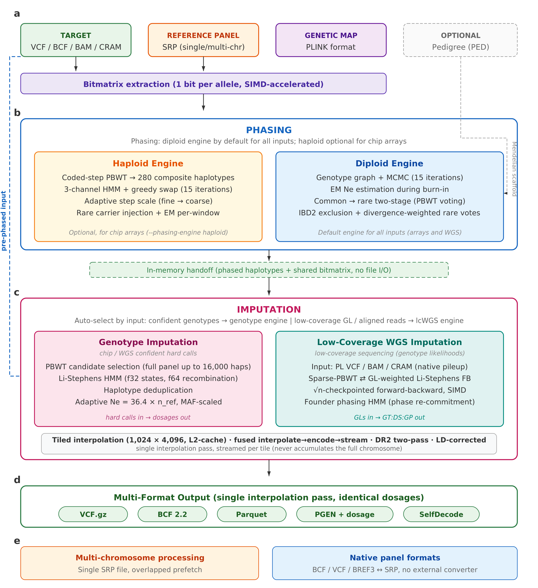
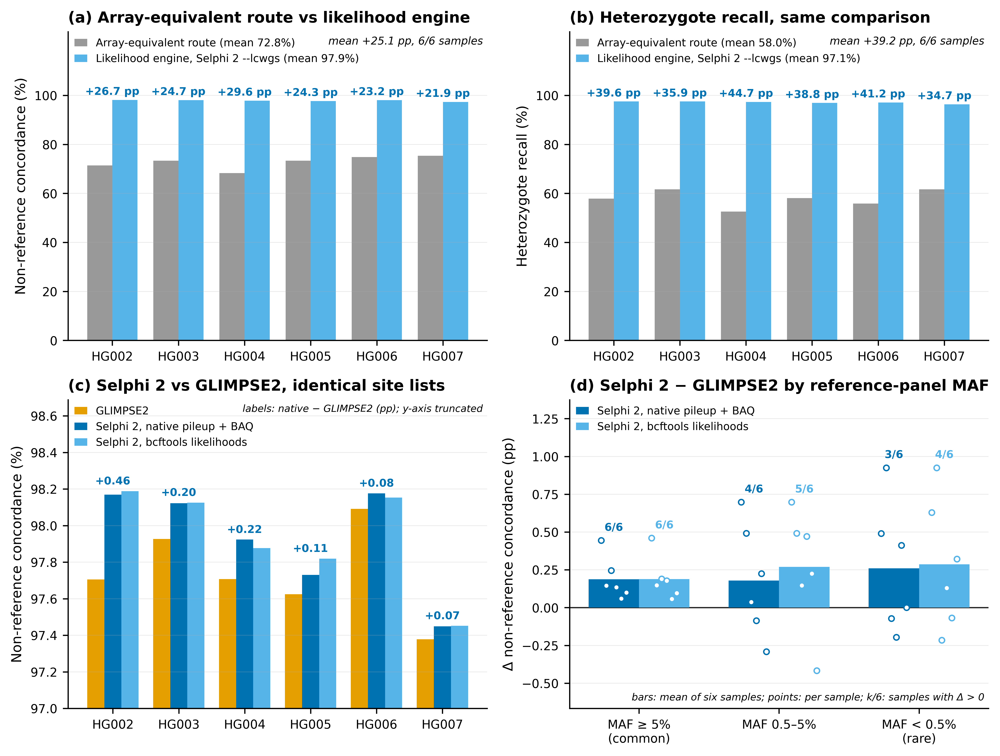
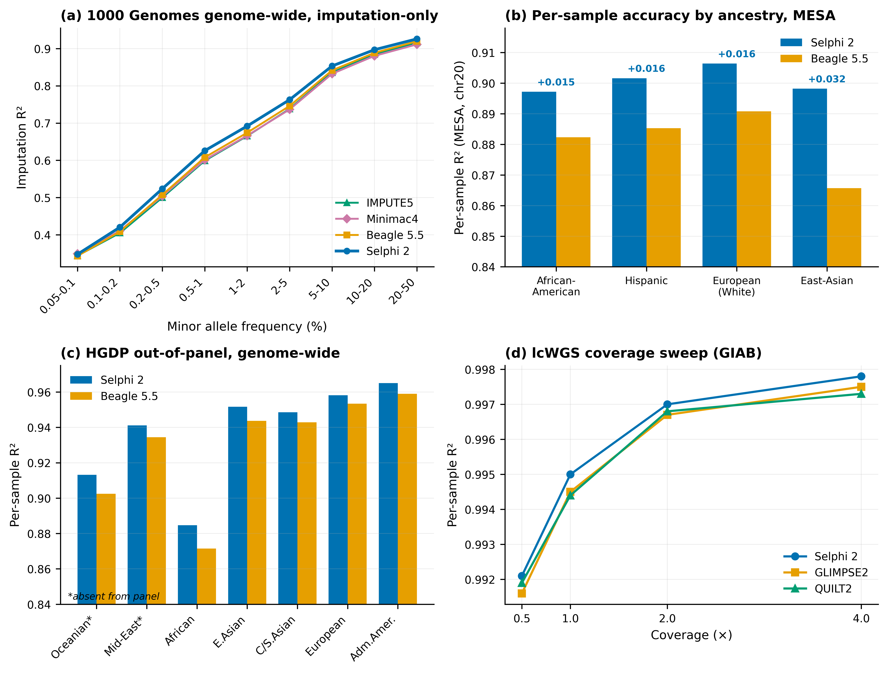
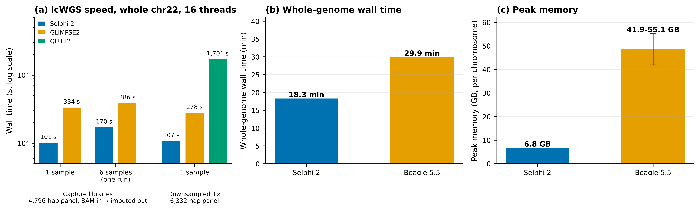

# **Selphi 2: genotype-likelihood imputation for low-coverage and capture sequencing, unified with array phasing and imputation in one binary**

Authors: Adriano De Marino^1^, Sandra Bohn^1^, Jon Lerga-Jaso^1^, Biljana Novković^1^, Andrew Terpolovsky^1^, Puya G. Yazdi^1,\*^

^1^ Research and Development, Omicsedge, Miami, FL, USA

\* Corresponding author: pyazdi@omicsedge.com

# **Abstract**

Imputation from one or two sequencing reads per site differs from array imputation: most sites carry a genotype likelihood rather than a genotype, and calling genotypes first discards both the uncertainty and the sites left uncalled. Here we present Selphi 2, a Rust tool whose genotype-likelihood-aware Li-Stephens engine imputes directly from likelihoods or aligned reads with a native pileup, and integrates phasing, array imputation, panel preparation and multi-format output in one whole-genome binary. On six Genome in a Bottle samples sequenced by hybridization capture over the ~614,000 Global Screening Array sites with a 1.6-2.7$\times$ off-target background, imputing from likelihoods instead of treating the libraries as an array raises non-reference concordance at untyped chromosome-22 sites from 68.27-75.38% to 97.32-98.17% (+25.09 percentage points; heterozygote recall +39.17 points; six of six samples). Against GLIMPSE2 on identical site lists and a leak-free 4,796-haplotype 1000 Genomes panel, Selphi 2 leads non-reference concordance in six of six samples with its native pileup (+0.19 points; +0.20 points, six of six, from bcftools likelihoods), replicates on chromosomes 20, 10 and 1 with the margin growing toward rare variants on the larger chromosomes, and imputes a sample from the BAM 3.3$\times$ faster (101 versus 334 s, 16 threads). On 30$\times$ GIAB genomes downsampled to ~1.8$\times$, its per-sample dosage $R^2$ exceeds GLIMPSE2's in six of six samples (0.9501 versus 0.9449), and across a 0.5-4$\times$ sweep it leads GLIMPSE2 and QUILT2 in overall $R^2$ at every depth. The same binary phases and imputes genotyping arrays, matching or exceeding Beagle 5.5 at equal phasing and exceeding Beagle's full pipeline with its own phasing on six consumer arrays against a 75,552-haplotype panel, with lower trio switch-error than SHAPEIT5, and completes the consumer-array genome in 61% of Beagle's wall time at under a sixth of its peak memory. It ships as one self-contained x86-64 and ARM64 binary writing five output formats from a single pass.

# **Introduction**

Genotype imputation infers ungenotyped variants from reference panels of sequenced haplotypes. It extends the variant coverage of array-genotyped and low-coverage sequenced cohorts at a fraction of the cost of deep whole-genome sequencing (WGS), and so underpins genome-wide association studies (GWAS), polygenic risk scores (PRS) and fine-mapping^1^. Reference panels have grown from thousands to hundreds of thousands of sequenced individuals, and rare and low-frequency variants have gained clinical weight. Two kinds of input now dominate: genotyping arrays, which give confident calls at a fixed set of typed sites, and low-coverage or targeted sequencing, which gives a thin, uneven layer of reads over every site.

At one or two reads per site, sequencing yields a genotype likelihood rather than a genotype: the reads fit more than one genotype, and their relative support is all the data contain. Calling genotypes first and imputing them as array calls discards that uncertainty, and discards outright the many sites where no call can be made. A likelihood-aware Li and Stephens model instead combines the read evidence at each site with the haplotype prior from the panel, so a single read shifts the posterior without fixing it. Hybridization-capture libraries, which pair deep coverage at the typed sites with a thin off-target background, raise the same problem at mixed depth. The array-equivalent route calls the typed sites, imputes them as a chip and discards the background; a likelihood-aware model uses both layers through one emission model.

Most imputation methods build on the Li and Stephens hidden Markov model (HMM)^2^, which reconstructs each target haplotype as a mosaic of segments copied from panel haplotypes, with switches between them standing in for historical recombination. To find the informative panel haplotypes among tens of thousands, current tools use the positional Burrows-Wheeler transform (PBWT)^3^. Three tools are in wide use. IMPUTE5^4^ selects haplotypes with the PBWT and scales sub-linearly with panel size. Beagle^5^ (here version 5.5) combines integrated phasing^6^ with haplotype clustering. Minimac4^7^ runs the Michigan and TOPMed imputation servers with low memory. All three impute common variants accurately; they differ in rare-variant handling, memory use and integration with phasing.

The array workflow is spread across several tools. A typical pipeline phases the target with Eagle2^8^, SHAPEIT5^9^ or an earlier biobank-scale phaser^10^, and imputes it with Beagle 5.5^5^, IMPUTE5^4^ or Minimac4^7^. The panel is converted between tool-specific formats (bref3 for Beagle, xcf for IMPUTE5, msav for Minimac4), the genome is split into per-chromosome files, outputs are indexed with bcftools, and results are re-encoded into BCF, Apache Parquet or PLINK2 PGEN^11^ by external writers. Each handoff adds intermediate files, shell scripts and per-chromosome bookkeeping. Beagle 5.5^5^ runs phasing and imputation in one Java process, but still one chromosome at a time and with VCF output only.

The original Selphi^12^ addressed a different limitation: the short matching range of the windowed and chunked PBWT scans used by other tools. Selphi 1 ran the PBWT along the whole chromosome and summed match evidence over the full scan, which raised rare-variant accuracy above Beagle 5.4, IMPUTE5 and Minimac4 on the 1000 Genomes Project^13^ and TOPMed^14^ panels. It was, however, written in Python with Numba-compiled inner loops, required pre-phased input, processed one chromosome at a time, and capped candidate haplotypes per variant at fixed values that do not scale with panel size.

Other recent methods address parts of the problem. SHAPEIT5^9^ reduced rare-variant switch error in large cohorts by phasing in two passes: a backbone of common variants, onto which rare alleles are then placed one at a time. GLIMPSE2^15^ made whole-genome low-coverage imputation tractable with a compact panel representation: dense bitmaps for frequent alleles and carrier lists for rare ones. QUILT2^16^ extended the PBWT to multi-symbol matching for diverse sequencing technologies. GLIMPSE2 and QUILT2 both target genomes sequenced at uniformly low depth. None of these tools combines phasing, imputation, panel preparation, indexing and multi-format output in one executable, and none imputes a whole genome in one process against one panel file.

Here we present Selphi 2, a Rust tool built around a genotype-likelihood-aware Li-Stephens engine (`--lcwgs`) that imputes from Phred-scaled likelihoods or directly from aligned reads with a native pileup. The same binary contains a reimplementation of the Selphi array pipeline. It keeps Selphi 1's long-range, match-accumulating PBWT selection but runs it in large overlapping windows (default 80 cM) rather than one whole-chromosome pass, which removes Selphi 1's main runtime bottleneck. Two phasing engines are built in: a diploid genotype-graph engine with MCMC sampling, the default for all inputs, and a haploid composite-HMM engine for chip arrays; pre-phased input is no longer needed. A whole genome is imputed with one command against one multi-chromosome panel file, and the next chromosome is prefetched while the current one is in the HMM, so no per-chromosome splitting or concatenation is needed. The number of panel haplotypes kept per target follows from panel size and haplotype diversity; on admixed cohorts imputed against biobank-scale panels this retains rare-allele carriers from minority ancestries that a fixed candidate-set size drops. A streaming sparse panel format keeps peak memory below 500 MB during panel construction regardless of panel size, and the Rust code reduces wall time and peak memory relative to Selphi 1 (Results). One interpolation pass writes any of five formats: VCF.gz, BCF 2.2, Apache Parquet, PLINK2 PGEN with dosage, and SelfDecode per-sample Parquet archives. Figure 1 summarises the pipeline.

We describe the algorithms (Methods) and then benchmark the likelihood engine on capture-plus-low-pass Genome in a Bottle libraries^17^, against the array-equivalent route and against GLIMPSE2^15^, and on uniformly downsampled Genome in a Bottle genomes against GLIMPSE2 and QUILT2^16^. We then compare the array pipeline's accuracy and resource use with Selphi 1^12^ and Beagle 5.5^5^ on the 1000 Genomes Project^13^ and TOPMed^14^ panels, and its phasing accuracy with SHAPEIT5^9^ on 1000 Genomes trios (Results).

**Figure 1. Overview of the Selphi 2 pipeline.** The pipeline accepts unphased or phased target genotypes in VCF/BCF format, a reference panel in SRP format (single- or multi-chromosome), and a genetic map. If the input is unphased, phasing is performed first; by default the diploid engine (genotype graph with MCMC sampling) is used for all inputs, with the haploid engine (composite HMM with three-channel greedy swap) selectable for chip arrays. The diploid engine operates in two stages: common variants (MAF ≥ 0.1%) are phased via iterative MCMC with EM-estimated effective population size, then rare variants are phased onto the common-variant scaffold using bidirectional PBWT sweeps with IBD2-aware neighbor exclusion, the second pass weighting neighbours by PBWT match length so that a singleton is placed on the haplotype with the shorter match. When pedigree information is available, Mendelian constraints are applied before the HMM to pre-phase deterministic parent-child configurations. Phased haplotypes are passed directly in memory to the imputation stage with no intermediate file I/O. Imputation uses a coded-step PBWT to select candidate reference haplotypes per target, with the per-target candidate-set size set automatically as a function of panel size and panel diversity (Candidate selection and HMM, below). After haplotype deduplication, a Li-Stephens HMM (32-bit state vectors in both passes, with 64-bit recombination terms and row sums) computes per-site posterior weights, with an effective population size that scales linearly with panel size ($N_e \approx 36.4 \times n_\text{ref}$, consistent across panels from 5,000 to 171,000 haplotypes) and is further adjusted per site by minor allele frequency. The HMM weights are interpolated to full reference-panel density using cache-friendly 2D tiles, with interpolation fused to output encoding so that no chromosome-wide interpolated dosage matrix is materialized. Five output formats are supported from a single interpolation pass: VCF.gz, BCF 2.2, Apache Parquet, PLINK2 PGEN with dosage, and SelfDecode per-sample Parquet archives. For sequencing input at low or uneven depth (uniform 0.5-4$\times$ low-pass genomes, or capture libraries with a low-pass off-target background), a dedicated genotype-likelihood-aware engine (`--lcwgs` / `--engine lcwgs`) replaces the standard phase-and-impute path: it accepts a PL VCF/BCF or aligned reads (BAM/CRAM, with native pileup), and alternates sparse-PBWT haplotype selection with a GL-weighted Li-Stephens forward-backward ($\sqrt{n}$-checkpointed, SIMD-accelerated) and an eight-founder phasing HMM re-committed at every Gibbs iteration, emitting GT:DS:GP against the same reference panel and output formats. Auxiliary capabilities include multi-chromosome processing from a single SRP file with overlapped prefetch.

# **Methods**

## **Selphi 2**

### **Architecture overview**

Selphi 2 is a single self-contained Rust binary. Compression libraries, format encoders (VCF, BCF, Parquet, PGEN) and index builders (TBI, CSI) are built in, and no external tool is called at run time. Parallelism uses the rayon library^18^ with fixed-seed iteration orders, so output is bit-identical across runs on the same hardware. The inner loops of the haploid and diploid HMMs are SIMD-vectorised for x86-64 and ARM, and a run-time CPU check selects the kernel.

The pipeline accepts unphased or phased VCF/BCF input, phases the target if needed, imputes against the panel and writes one or more output formats at once. Phased haplotypes pass to the imputation engine in memory, with no intermediate files. Memory use is estimated at startup from the panel dimensions and thread count, with a warning if it exceeds available RAM.

### **Phasing engines**

Selphi 2 has two phasing engines. The diploid engine is the default for all inputs: across our benchmarks it matches or exceeds the haploid engine on SNP accuracy, has equal or lower switch error, and phases the trio benchmark several times faster (Discussion). The haploid composite-HMM engine, designed for chip arrays, remains available as an option. Missing target genotypes, typically 1-2% of sites per sample on an array, are carried through both engines as missing and imputed from the surrounding haplotypes by a local copying consensus: the majority allele among the nearest neighbours in a positional-BWT sweep over the target and panel haplotypes. Setting them to the reference allele instead conditions the phasing scaffold on false homozygous-reference calls, which lowers downstream accuracy directly and by biasing the imputer's choice of panel haplotypes toward the reference allele at those sites (Results, Table 5; Discussion).

**Haploid engine.**

The haploid engine models each haplotype separately through a composite HMM with a greedy swap criterion, following Browning and Browning^19^. It runs 15 iterations: 3 burn-in iterations with fixed phase, then 12 phasing iterations whose likelihood-ratio threshold falls from 100,000 to 1.0.

Each iteration builds a coded-step PBWT^4^ on the combined panel and target haplotypes at the shared variants. Steps are fixed genetic-distance intervals on an adaptive scale: fine (scale 1.0, about 10 SNPs per step) in early iterations, when phase is uncertain, and coarse (scale 3.0, about 30 SNPs per step) later, once the scaffold is established. This resembles SHAPEIT5's common-then-rare strategy^9^ but within one iterative scheme rather than separate stages.

Within each iteration a composite HMM runs three parallel channels for alternative haplotype configurations. At each heterozygous site a greedy swap compares the forward-backward posteriors of the channels and is accepted if the likelihood ratio exceeds the current threshold, which falls across iterations in the manner of simulated annealing.

For rare variants, carrier injection keeps rare-allele carriers in the matching: when the best identity-by-state (IBS) match at a position lacks the target's rare allele, it is replaced by the carrier that best matches the target by IBS over 30 flanking variants on each side. This prevents rare alleles from being lost at the matching step.

EM parameter estimation^20^ is performed within each iteration to calibrate the mismatch probability and effective recombination rate per window, enabling the HMM transition probabilities to adapt to local recombination patterns.

**Diploid engine.**

The diploid engine models the two haplotypes jointly through a genotype graph, following SHAPEIT4^21^ and SHAPEIT5^9^. At each heterozygous site the graph encodes all local diplotype configurations as 64-bit bitmasks. A segment-based Li-Stephens HMM computes diplotype transitions across conditioning haplotypes chosen by positional PBWT; their number can be capped for speed (default: unlimited).

Phase is sampled by MCMC on the genotype graph over 15 iterations in the scheme 5b,1p,1b,1p,1b,1p,5m (5 burn-in, 3 interleaved prune and burn-in cycles, 5 main), followed by a final Viterbi solve. The forward pass is SIMD-vectorised. This engine phases common variants only (MAF ≥ 0.1%); rare variants are phased in a separate pass (Rare variant phasing, below).

By default the diploid engine forms a small **intra-run phase ensemble**, which integrates over phase uncertainty for one extra imputation pass and no extra phasing. Each main MCMC iteration draws a complete diplotype configuration, a sample from the phase posterior that the chain would otherwise discard in favour of the final Viterbi solve. The Viterbi solve and a thinned subset of these samples are kept as N phase members (default N = 2) from the one chain. Each member is carried through rare-variant phasing and imputation, and the per-haplotype Li-Stephens copying weights are averaged across members before interpolation. Because the dosage is linear in those weights (dosage = Σ w · panel allele, normalised by Σ w), the averaged weights give the members' mean dosage. The identity is exact up to the per-row sparsity threshold on the weights, whose effect we measured at $10^{-6}$ in per-sample $R^2$ on chromosome 22. The cost is one phasing plus N imputation passes, with the panel read and interpolation shared, rather than the N phasings of a conventional ensemble. On the consumer-array benchmark N = 2 adds ≈25-30 % wall time and raises the diploid engine's genome-wide SNP $R^2$ from 0.9588 to 0.9605 on top of the no-call fix (0.9609 in the current release; Results, Table 5). The ensemble is off (N = 1) under `--sample-batch-size` and `--phase-only`. The haploid engine does not use it, because its greedy swap converges to one solution rather than sampling a posterior.

During burn-in the effective population size ($N_e$) is re-estimated from the genotype graphs by inverting the Li-Stephens relation^2^ $\mathrm{rate} \approx 0.04 \times N_e \times d / n_\text{haps}$, where $d$ is the mean inter-marker distance in cM. The rate used is the number of diplotype-graph transitions per variant, an edge count rather than a fraction of sites, so the estimate overshoots and settles at its upper bound. That bound therefore sets the phasing $N_e$. For array targets it is $\min(77.5 \times n_\text{haps}, 10^6)$ with a floor of 1,000, so the per-cM switch rate is constant below 12,904 haplotypes and decays as $1/n_\text{haps}$ above; for targets at whole-genome density (at least 1,000 scaffold sites per Mb), including the trio benchmark, it is a flat $10^6$, because the scaled bound raised switch error on dense data. An update is applied only if it changes $N_e$ by more than 5%.

**Rare variant phasing (diploid).**

Rare variants, those outside the common-variant scaffold, are phased in a PBWT-based pass over the target haplotypes and, when supplied, the reference panel; panel phasing, with no external panel, uses the cohort alone. This common-then-rare split follows SHAPEIT5^9^, whose rare pass uses the cohort only.

The pass has three steps. First, an IBD2 scan finds sample pairs that share both haplotypes identical by descent across scaffold sites^22^, using a diploid PBWT on genotype sums (0/1/2) and requiring segments of at least 2.5 cM, 1 Mb and 100 scaffold sites. These pairs are excluded as each other's PBWT neighbours, since their haplotypes cannot resolve phase at heterozygous sites they share.

Second, a scaffold bitmatrix is built at scaffold sites from the target and, when present, the panel haplotypes, excluding sites with more than 10% missing data. A forward PBWT sweep visits all variants in physical order. At scaffold sites it updates the PBWT arrays (permutation A, divergence C, reverse lookup R); at rare heterozygous sites it phases by a two-pass vote. In the threshold pass the two PBWT neighbours of each target haplotype vote on the phase; if the net vote exceeds a threshold that falls from 2.5 to 1.0, the phase is assigned and the carrier joins later decisions. In the distance pass, sites still unphased are decided by votes weighted by the genetic distance from the PBWT divergence point to the current position.

Third, a backward PBWT sweep repeats the same procedure in reverse genomic order. The forward and backward results are merged by selecting the direction with higher confidence (absolute vote score) for each rare het.

Singletons (MAC = 1 among the targets) need no special rule. No PBWT neighbour carries the allele, so the threshold pass casts no vote and the distance pass places the allele on the haplotype with the shorter PBWT match to its neighbours. This is the direction of SHAPEIT5's coalescent argument for singletons^9^, that a recent allele sits on the more recently diverged haplotype, here derived from PBWT divergence rather than a coalescent HMM.

**Pedigree scaffolding.**

With a pedigree (PLINK PED format), Mendelian logic is applied to the genotypes before phasing. For each trio or duo the algorithm considers the nine combinations of parental genotype sums at each variant. A missing child genotype is filled when both parents are homozygous. When the child is heterozygous and at least one parent homozygous, the Mendelian phase is written to the input; by default the HMM then re-derives the phase at every heterozygous site, so this orientation initialises the sampler rather than constraining it. Fixing those sites as a scaffold, as SHAPEIT5 does^9^, is available but not the default. On 54 trios genotyped at 9,283 array sites it lowered imputation R², even though the fixed phase agreed with the children's sequenced haplotypes at 99.95% of sites: fixing four heterozygous sites in five lets genotype-graph segments grow to their length limit and removes the segment boundaries where the copying model can switch haplotype. Mendelian inconsistencies (for example a heterozygous child of two parents homozygous for the same allele) are counted but not corrected.

On chromosome X, haploid samples (males) are detected automatically by their heterozygosity rate: samples with fewer than 1% heterozygous calls across at least 100 non-missing sites are classified as haploid. Heterozygous calls in haploid samples are biologically impossible and indicate genotyping error; these are reset to missing to allow the HMM to impute the correct homozygous genotype.

**Panel phasing.**

Without an external panel, the same engines can phase a cohort against itself in one command. The cohort haplotypes serve as both target and conditioning set, with the diploid engine unless the haploid one is requested. Output is a phased VCF/BCF and, optionally, an SRP or BREF3^5^ file for direct use as a reference panel. If the cohort does not fit in RAM, the genome is chunked along the genetic map and the chunks are ligated at the boundary haplotype assignment.

### **PBWT matching for imputation**

Imputation uses a coded-step PBWT^4^ that works directly on the panel bitmatrix (1 bit per allele, packed in 64-bit words). At each step boundary, set from genetic-map positions about 0.05 cM apart, haplotypes are grouped by their allele sequence within the step, 64 haplotypes per word operation. Steps of at most 40 SNPs are coded exactly as a 64-bit shift register over their alleles; longer steps are coded by FNV-1a hashing. The resulting coded-step partitions are the basis for selecting candidate haplotypes.

For each target haplotype, candidates are chosen by how often they share the target's coded-step partition. The number kept per target (`max_candidates`, henceforth $m_c$) is set from panel size and diversity, as described next. Per-thread workspaces (permutation and divergence arrays) are allocated once and reused for every target on that thread. When the panel is large relative to the batch, the panel sort is shared by groups of targets and each target only scans the shared order for its neighbours. A target carrying the majority allele at a site visits only the minority-allele positions of its match block, located through a per-site index and block maxima of the divergence array. The matches found, and hence the output, are unchanged (byte-identical), and on MESA 5K $\times$ TOPMed chromosome 20 the run time fell from 10,767 to 9,047 s.

### **Candidate selection and HMM**

Candidates are filtered twice before the HMM. Those below the 10th percentile of occurrence across step partitions are removed, and those covering more than 95% of positions have their gaps filled, so that otherwise consistent matches are not truncated. Panel haplotypes identical at the shared positions are then merged (haplotype deduplication), which removes 10-50% of HMM states depending on the panel and region.

A reduced array of the candidates plus the target is built, and a forward-backward pass is run on it. Hidden-state vectors are 32-bit floats, for twice the cache density and SIMD throughput; per-site recombination probabilities and per-row normalisation sums are computed in 64-bit for numerical stability. The backward pass is streamed: each backward row is multiplied into the stored forward row as soon as it is computed, so only two backward rows are held at a time instead of a full site-by-state matrix. The per-site recombination probability follows the standard Li-Stephens form^2^:

$$P(\mathrm{switch}) = 1 - \exp\!\left(-d_k \times 0.04 \times N_e / n_\text{ref}\right)$$

where $d_k$ is the genetic distance between consecutive markers in cM, $N_e$ the effective population size and $n_\text{ref}$ the number of candidate haplotypes. Existing tools use one $N_e$ that does not scale with panel size; Beagle, for example, defaults to $N_e$ = 100,000 in both its phasing and imputation HMMs, optionally re-estimated once per run by EM^5^. The best $N_e$, however, grows with the panel. In a larger panel, PBWT-selected candidates match the target more closely and share shorter identity-by-descent segments with it, so the HMM must switch between candidates more often to follow the mosaic, which needs a proportionally larger $N_e$.

Selphi 2 therefore sets $N_e$ as a linear function of the total number of panel haplotypes:

$$N_e = \max(36.4 \times n_\text{ref,total},\ 100{,}000)$$

where $n_\text{ref,total}$ is the total number of panel haplotypes, not the number of candidates. The slope was fitted by maximising imputation $R^2$ on three panels spanning two orders of magnitude: 1000 Genomes Phase 3 (4,802 haplotypes; best $N_e$ ≈ 175,000), a UK Biobank^23^ and 1000 Genomes composite (75,552 haplotypes; ≈2,750,000) and TOPMed (171,054 haplotypes; ≈6,200,000). The ratio $N_e/n_\text{ref} \approx 36.4$ held across these panels despite their different composition (a global multi-ethnic panel, a UK Biobank composite and a multi-ethnic clinical cohort). A per-MAF sweep on the current implementation (Supplementary Table S13) confirms the optimum and shows its structure: on the 1000 Genomes panel overall $R^2$ peaks at the formula's $N_e \approx 175{,}000$, while rare variants prefer a lower value (≈50,000) and common variants a higher one (≈350,000). The formula balances a real trade-off between rare and common variants.

$N_e$ is further adjusted per site by MAF: it is $0.85 \times N_{e,\text{base}}$ for rare variants (MAF < 0.5%), $1.2 \times N_{e,\text{base}}$ for common variants (MAF > 2%), and ramps linearly in between. With the haploid phasing engine, the per-window $N_e$ estimated during phasing replaces this scheme in the imputation HMM unless disabled; with the default diploid engine the scheme applies as written. A fixed $N_e$ can be set to reproduce earlier results.

**Adaptive candidate-set sizing.** Selphi 1 kept conditioning haplotypes with fixed per-variant match caps that did not depend on panel size: a forward top-$K_1$ = 450, reduced to $K_2$ = 60 matches per variant in a backward re-scoring pass, then a top-$K_3$ = 50 filter. Selphi 2 sizes the per-target candidate set ($m_c$) from panel size and diversity instead. A fixed $m_c$ truncates panels at rates that differ by two orders of magnitude: $m_c = 2{,}500$ keeps 50% of a 5,000-haplotype panel but 1.5% of a 171,054-haplotype panel. In the second case the top candidates are dominated by the panel's majority ancestry, rare-variant carriers from minority sub-populations are excluded, and admixed cohorts lose $R^2$ at low frequencies.

Selphi 2 resolves $m_c$ automatically as

$$m_c = \mathrm{clamp}\!\left(N_\text{ref}\,(\gamma + \alpha\,\mathrm{CV}_\text{panel}),\ m_c^{\text{floor}},\ m_c^{\text{ceil}}\right)$$

where $N_\text{ref}$ is the total number of panel haplotypes, $\gamma$ a base fraction, $\alpha$ a diversity-coupled fraction, and $\mathrm{CV}_\text{panel} \in [0, 1]$ the coefficient of variation of compressed tile sizes in the SRP, computed once when the panel is loaded. $\mathrm{CV}_\text{panel}$ stands in for haplotype diversity: panels with several distinct mosaic structures (multiple ancestries, divergent sub-populations) compress less uniformly than homogeneous ones and give a higher CV.

**Choice of $\gamma$, $\alpha$, and the small-panel rule.** Subsetting the conditioning set saves time and memory only on biobank-scale panels. On a small panel it discards rare-allele carriers for no computational gain, and the diversity-coupled fraction can return only part of the panel (on a low-CV panel it falls to the floor). We therefore keep the **entire panel** as the conditioning set up to 16,000 haplotypes (≈8,000 samples), and apply $m_c = \mathrm{clamp}(N_\text{ref}(\gamma + \alpha\cdot\mathrm{CV}_\text{panel}),\ 2{,}500,\ 10^6)$, with $\gamma = 0.10$ and $\alpha = 0.80$ and a cap at $N_\text{ref}$, only above that size. The threshold lies above 1000-Genomes-scale panels, below biobank panels (HRC ≈ 65,000, TOPMed ≈ 171,000 haplotypes), and near the size at which accuracy saturates. It matters most for ancestries absent from the panel. Imputing HGDP individuals against a 1000 Genomes panel, the formula returned the 2,500 floor (39% of the 6,332-haplotype panel), dropped rare-allele carriers and inverted the rare-variant ranking against Beagle 5.5; keeping the full panel restored Selphi 2's lead at every frequency above the rarest bin (Results, Out-of-panel generalization). On the panels evaluated here the rule keeps all 4,802 haplotypes of 1000 Genomes Phase 3 and $m_c = 132{,}676$ of TOPMed ($\mathrm{CV}_\text{panel} = 0.845$, $N_\text{ref} = 171{,}054$; 78% of the panel). A fixed $m_c$ can be set to reproduce earlier results.

The HMM posterior weights are stored as sparse CSR matrices (one row per chip variant, one column per panel haplotype), with entries below $1/(H+1)$ set to zero.

### **Interpolation and output**

Between consecutive shared (chip) positions, dosages at panel-only positions are computed by linear interpolation of the HMM haplotype weights, as is standard^4,7^:

$$P(\mathrm{alt} \mid j) = \frac{\sum_r w_r(j)\, x_r(j)}{\sum_r w_r(j)}$$

where $w_r(j)$ is the interpolated weight of panel haplotype r at position j and $x_r(j)$ its allele there. Panel alleles at imputed positions are read from the tiled SRP format (below), with preloaded stripe batches overlapping I/O with the HMM.

Interpolation works on tiles of 1,024 variants $\times$ 4,096 haplotypes, sized to fit each core's L2 cache. Each tile's dosages are formatted to all active output formats as soon as they are computed and the tile is then freed, so interpolated dosages never accumulate over a chromosome.

The per-variant dosage R-squared (DR2) quality metric^24^ uses a numerically stable two-pass computation:

$$\mathrm{DR2} = \frac{\mathrm{var}(\mathrm{dosage})}{2\,p\,(1-p)}$$

where $p = \mathrm{mean}(\mathrm{dosage}) / 2$ is the estimated alternate-allele frequency and var(dosage) the mean squared deviation from the mean, avoiding the unstable single-pass $E[X^2] - E[X]^2$.

VCF formatting performs no floating-point-to-string conversion. Dosages are quantised to the emitted precision (three decimals for DS, two for AP), and the quantised values index byte-string lookup tables built once at start-up. A 2 $\times$ 2 $\times$ 2,001-entry table over (haplotype-1 call, haplotype-2 call, dosage index) writes a whole `GT:DS` field with one memory copy, and a 101 $\times$ 101-entry table does the same for `AP1:AP2`. Every sample at every variant takes this path, so formatting cost per sample is constant.

One interpolation pass writes up to five formats: VCF.gz (multi-threaded BGZF), native BCF 2.2^25^, Apache Parquet (zstd-compressed, variant-major columns), PLINK2 PGEN^11^ (mode 0x03, fixed-width records with 2-bit hard calls and 16-bit unphased dosage) and SelfDecode format (per-sample chunked Parquet in a ZIP archive). VCF/BCF output goes through a dedicated writer thread on a bounded channel, so interpolation and I/O proceed independently; the channel holds 16 blocks below 1,000 samples and 4 at or above, because one block at biobank scale is hundreds of megabytes of text. All formats use the same two-pass DR2 computation.

### **Low-coverage sequencing imputation engine**

The pipeline above is built for arrays, whose input is confident hard calls at chip sites. Low-coverage whole-genome sequencing (lcWGS) poses a different problem. At 0.5-4$\times$, and at the off-target sites of a capture library, most sites carry a soft genotype likelihood (GL) from one or two reads rather than a confident call, while deeply covered sites give near-certain likelihoods through the same model with no special handling. Selphi 2 has a dedicated engine for this, selected with `--lcwgs`. It reuses the panel format (SRP), the `HaplotypeBitmatrix`, the genetic map and the output writers, and replaces the hard-call HMM with a likelihood-aware Li-Stephens model. GLIMPSE2^15^ showed that this regime is best served by imputing from likelihoods rather than hard calls, and we compare against it in Results.

The engine reads per-sample Phred-scaled likelihoods (the `PL` field from `bcftools mpileup | call`) at the panel sites and converts them to per-haplotype likelihoods through a 256-entry lookup table. Alternatively it computes the likelihoods from aligned reads (BAM or CRAM, one file per sample) in the same process, with no external pileup. For each biallelic panel SNP, the overlapping reads are walked through their CIGAR alignments and each base enters the three genotype likelihoods under the revised MAQ error model of SAMtools/BCFtools^25^. That model caps base quality by mapping quality and by neighbouring-base quality, and down-weights repeated reads of the same base and strand to account for correlated errors. Reads are filtered by mapping and base quality (defaults MAPQ ≥ 20, base quality ≥ 20, at most 250 reads per site; `LCWGS_MIN_MAPQ`, `LCWGS_MIN_BQ`, `LCWGS_MAX_DEPTH`), and the result matches `bcftools mpileup` at the same thresholds. The two mates of one fragment sample the same molecule, so overlapping mates are collapsed to one observation per site (agreeing bases keep the higher quality, disagreeing bases are down-weighted). CRAM bases are reconstructed against the supplied reference FASTA, and with a region restriction the index (`.bai`/`.crai`) limits decoding to that span.

Panel sites other than SNPs, where the pileup collects no evidence, are excluded from the native target set and imputed from the haplotype scaffold, as in GLIMPSE2 and on the likelihood-file path restricted to SNPs. Carrying them as flat-likelihood sites instead changes the Table 1b result within noise (+0.184 against +0.190 pp non-reference concordance over GLIMPSE2). At low coverage, per-read indel likelihoods are miscalibrated and degrade nearby SNPs in the joint model. For higher-coverage input, an option builds the local REF and ALT haplotypes of each panel indel and scores every spanning read against both with a pair hidden Markov model (forward algorithm, affine gaps, base-quality emissions, marginalising over alignment), adding $P(\text{read}\,|\,\text{REF})$ and $P(\text{read}\,|\,\text{ALT})$ to the likelihoods as for a SNP. To check the native pileup against the external `bcftools mpileup` path, we downsampled a 52$\times$ genome to 1$\times$ with the full-depth calls as truth: the native pileup reached aggregate $r^2$ 0.964 per allele-frequency bin, against 0.960 from precomputed likelihoods and 0.967 for an equivalent GLIMPSE2 pileup.

Imputation alternates haplotype selection and a GL-weighted forward-backward in a Gibbs sampler. Each iteration selects a conditioning set of panel haplotypes by sparse PBWT from the currently sampled haplotypes. It then runs a Li-Stephens forward-backward in which each haplotype's emission at a site is conditioned on the partner haplotype's current allele, which splits a diploid sample into two independent copying problems, and samples a new allele per site from the posterior. The selected set is capped at 2,000 haplotypes per sample (`LCWGS_KPBWT`). With the default storage-site spacing of 0.002 cM the union of PBWT neighbours over a 16 cM chunk covers nearly the whole panel (5,708 to 6,332 of the 6,332 haplotypes of the coverage-sweep panel; 3,956 to 4,796 of the 4,796 of the capture-library panel). The cap, applied in haplotype-index order, therefore keeps an almost fixed low-index subset, exactly haplotypes 0 to 1,999 in several measured chunks, and the target-specific part of the conditioning set is the per-haplotype rare-carrier augmentation described below. A cap in PBWT match-rank order (`LCWGS_QUAL_TRUNC`; `g2` reproduces GLIMPSE2's order) raises the 0.5$\times$ ultra-rare bin of Table 2b from 0.8994 to 0.9059, above GLIMPSE2's 0.9023, on each of three seeds. It lowers the 5-10% bin at 0.5$\times$ and the ultra-rare and 1-2% bins at 1$\times$, where the default already leads, so the index-order cap stays the default. Posterior dosages from the post-burn-in iterations are averaged and written as VCF.gz with `GT:DS:GP`. The forward-backward uses a leave-one-out emission: the forward emission at each site is divided out of the posterior before the read likelihood and error model are re-applied, so each site's reads count once.

*Base alignment quality.* The native pileup applies base alignment quality (BAQ)^26^ as `bcftools mpileup` does by default. Extended BAQ is computed by a bit-exact port of htslib's `probaln_glocal` and `sam_prob_realn` (on these libraries all 28,596 tested reads receive base qualities identical to `samtools calmd -r -E`). It is applied to the reads that bcftools 1.22's partial-realignment heuristic selects: a column triggers realignment on indel or soft-clip evidence, and each read is judged once, at its first triggering column. On the capture libraries 7.6% of reads are realigned. Without BAQ the native pileup trailed the bcftools arm of the head-to-head (Table 1b: +0.125 against +0.197 pp over GLIMPSE2); with BAQ the two are level (+0.190 pp). GLIMPSE2's pileup applies no BAQ.

*Gibbs schedule, phasing and recombination model.* Each target sample is imputed independently. Three components run at every Gibbs iteration besides the capped selection above. An eight-founder phasing HMM re-commits phase (opt-out `LCWGS_NO_FOUNDER_PHASE=1` reverts to a heuristic diplotype-mosaic segment commitment). The imputation forward-backward uses a band-mode recombination rate (default; the phasing HMM keeps the conditioning-set-independent rate everywhere). At common sites the rate does not depend on the conditioning-set size, which gives a sticky copying model that carries a panel haplotype across sites with no reads. At rare sites the rate is raised to the per-haplotype panel value ($0.04\,N_e/n_\text{ref}$), so a copied haplotype can switch onto a true rare-allele carrier instead of staying on a flanking non-carrier. This is the change that brings the ultra-rare bin level with or above GLIMPSE2 (Results, Table 2b); `LCWGS_RECOMB_DENOM=max` restores the uniform rate. Finally, a rare-carrier augmentation (opt-out `LCWGS_NO_RARE_CARRIER`) appends, at each rare site, that site's panel carriers to the conditioning set of every target haplotype currently sampled with the minor allele, so a true carrier becomes copyable once the sampler has tentatively placed the allele. The augmentation is per haplotype, and under the cap the appended carriers rank behind the haplotype's selected states, leaving the common-site copying model intact. The forward matrix is stored only at $\sqrt{n}$ checkpoint columns and recomputed block by block in the backward pass. The number of Gibbs iterations and the cM window size trade accuracy for speed.

*Likelihood-file input.* Records without a `PL` field, such as the genotype-only indel records that `bcftools call -C alleles` emits when the alleles file has indels but `mpileup` ran with `-I`, are read as flat-likelihood sites. A `PL` VCF should therefore contain only records with likelihoods (`bcftools view -v snps`), as in every likelihood-file run reported here, or the BAM path should be used (Limitations).

To bound memory regardless of chromosome length and panel size, the chromosome is processed in overlapping cM chunks. Each chunk's panel bitmatrix is extracted from the SRP for that chunk's variants and discarded after use, so the full-chromosome bitmatrix never exists. The forward-backward loops over conditioning states use AVX-512, AVX2 or NEON selected at run time, with a scalar fallback; the AVX-512 path loads 16 bit-packed panel alleles directly as a mask register. The selection step accumulates IBS match lengths in a sparse per-target map rather than a dense target $\times$ panel matrix, so its memory does not grow with panel size.

### **Sparse Reference Panel format (SRP)**

The SRP format stores panel haplotypes as a 2D tiled sparse matrix. Each tile covers 1,024 variants $\times$ 4,096 haplotypes and is stored as a compressed sparse column (CSC) sub-matrix with u16 row indices and u32 column pointers, compressed with zstd at level 3. Tiles are laid out stripe by stripe (all bands of stripe 0, then stripe 1), so a batch of stripes is read with one pread() call.

SRP creation is streaming. Source data (BCF, VCF or BREF3^5^) is processed chunk by chunk; each chunk is decompressed once and scattered to tile columns in parallel, and finished stripes are written immediately, which keeps peak memory below 500 MB for any panel size. The parallel BCF reader uses the CSI index^25^ to split the file into balanced genomic regions across threads. The reverse conversion is also built in: an SRP or BREF3 panel can be decoded to phased VCF or BCF by a streaming three-stage pipeline (panel read, record formatting and BGZF compression on separate threads) with bounded memory. This removes the need for Beagle's `unbref3` and its intermediate files, and the decode is lossless (Results).

An SRP can hold one chromosome or many. A multi-chromosome SRP has a global header with a chromosome directory and shared sample IDs, followed by independent per-chromosome tile sections; it is detected automatically. It can be built from a multi-contig BCF, from a directory of per-chromosome BCF files, or by merging single-chromosome SRP files.

### **Multi-chromosome processing**

Selphi 2 imputes a whole genome with one command against one multi-chromosome SRP.

The target VCF is read once and split by chromosome in memory. Genetic maps are found in a directory by matching chromosome names against common patterns (chr1.map, chr_1.map, genetic_map_chr1_*, and so on). Chromosomes run in natural sort order, and the next chromosome's panel data is prefetched on a background thread during the current one's HMM, which hides I/O latency at the cost of one chromosome's panel data.

Output is one VCF/BCF file across all chromosomes, with the per-chromosome BGZF blocks concatenated natively so that block alignment for tabix/CSI indexing is preserved.

### **LD correction**

Genetic map distances in the HMM transitions are corrected for local linkage disequilibrium (LD)^27^. Empirical switch rates between consecutive variants in the panel are computed by XOR and popcount on the bitmatrix, normalised by expected heterozygosity, median-filtered, and used to adjust the map distances while preserving total genetic length. This prevents an inflated effective population size in regions of strong LD.

### **Reference panels and relatedness**

We used six reference panels. The **1000 Genomes Phase 3** panel (2,401 samples, 4,802 haplotypes) is used with its published phasing; the 801 evaluation targets are a disjoint held-out subset. The **no-trios** panel (2,239 samples, 4,478 haplotypes) is the 1000 Genomes cohort with all declared trio children and parents removed; it serves the phasing benchmark and the downsampled low-coverage benchmark (Table 2). The **out-of-panel** benchmark uses the 3,166 1000 Genomes samples of the gnomAD Human Genome Diversity Project and 1000 Genomes harmonized callset (6,332 haplotypes) as the panel and the 925 HGDP individuals as targets; the same panel serves the coverage sweep (Table 2b). The **75,552-haplotype** panel (37,776 samples) combines 34,582 UK Biobank genomes, ancestry-balanced by down-sampling the majority European set, with the full 1000 Genomes cohort (3,194 samples), phased with SHAPEIT5^9^; it is approximately 49% European, 22% South Asian, 19% African, 10% East Asian and 1% admixed-American. The **TOPMed Freeze 8** panel (171,054 haplotypes, 85,527 samples) excludes the MESA study samples, so the 5,000 MESA targets are held out from it. The **NA12878-trio-removed 1000 Genomes** panel (2,398 samples, 4,796 haplotypes) serves the capture-library benchmark (Tables 1-1d). It is the NYGC 30$\times$ GRCh38 call set of the 2,401 samples not among the 801 array targets, with NA12878, NA12891 and NA12892 removed and alleles longer than 255 bp dropped (1,070,399 chromosome-22 sites: 929,834 SNPs and 140,565 indels, 54,406 of them monomorphic in the retained samples). None of HG002-HG007 is in any panel. A seventh capture library (NA12878) was sequenced on the same design but is not reported, because a possible relative (NA12872) remains in the panel and the version of its truth set is unrecorded. For chromosomes 20, 10 and 1 the panel was further restricted for both tools to sites polymorphic in the retained samples with alleles ≤ 250 bp (chromosome 20: 1,564,145 sites, 1,357,434 SNPs and 206,711 indels); on chromosome 22 only GLIMPSE2 received the polymorphic-site restriction (1,015,993 sites) that its BAM input requires (Limitations).

As is standard for imputation panels, related individuals were kept. Unlike an association cohort, where cryptic relatedness inflates test statistics, a reference panel gains from related haplotypes: they raise the local minor-allele count available to the copying model and so improve rare-variant accuracy, which is why 1000 Genomes, HRC and TOPMed are distributed without relatedness pruning. Only exact duplicates were removed from the 75,552-haplotype panel. The relatedness that can bias a benchmark is between a panel and its *evaluation targets*, and we control it on the target side. The GIAB and HGDP targets are absent from their panels; the 1000 Genomes targets share haplotypes with the panel by descent, which we state with those results (Results), and for this reason the leak-free GIAB and HGDP results are the decisive accuracy evidence.

### **Accuracy evaluation of genotype imputation**

Array-imputation benchmarks were scored with one evaluator (`selphi --evaluate`, or the same code inline through `--truth`) for every tool in a comparison, on the same sites. Per-variant $R^2$ is the squared Pearson correlation, across targets, between imputed dosage and truth genotype at a site, averaged within bins of minor-allele frequency computed from the truth genotypes of the targets. The OVERALL row is the corresponding pooled value over all scored sites. Per-sample $R^2$ is the correlation across sites within one target, averaged over targets. Typed array sites are excluded. A site where the truth varies but a tool's dosage is constant scores $R^2$ = 0. Treating it as undefined would drop, separately for each tool, exactly the sites that tool failed to impute, so each tool would be scored on a different and flattering site set. Sites monomorphic in the reference panel were excluded from every comparison (`--exclude-panel-monomorphic`): their alternate allele exists only in the held-out targets, so no tool can impute them, and when they are counted they fill the 0.1-0.2% bin of the 1000 Genomes benchmarks with zeros. This removes 54,076 of 1,070,401 sites on 1000 Genomes chromosome 22, 6,815,267 of 17.9 million on TOPMed chromosome 20, and no site on the 75,552-haplotype panel. Paired comparisons use per-sample differences, with 95% intervals from 20,000 paired bootstrap resamples and two-sided Wilcoxon signed-rank tests. The low-coverage benchmarks and the consumer arrays are scored as described in their own sections.

### **Consumer-array benchmark: data preparation and evaluation**

For the consumer-array benchmark (Results; Table 5) we used six individuals with both a SelfDecode consumer genotyping array (Illumina Global Screening Array, GRCh38) and an independent high-coverage Illumina genome processed with the DRAGEN germline pipeline (GRCh38; ≈30-60$\times$). All six were confirmed absent from the panel before any analysis.

*Truth construction.* DRAGEN hard-filtered calls were normalised and decomposed with `bcftools norm -m-any` against GRCh38 and restricted to high-confidence genotypes (`FILTER=PASS`, `GQ ≥ 20`, `DP ≥ 10`). This removed about 13% of raw calls on average (9% to 14% per sample; for example 4.98M to 4.34M in one sample). `FILTER=PASS` alone kept many low-confidence calls, with `GQ` as low as 5. SNPs and indels were both kept and evaluated separately. The high-confidence set defines the truth genotype at every site it contains.

*Array input.* Array genotypes were mapped to the panel's variant coordinates: REF, ALT and position were taken from the panel, and the genotype from the array alleles, complementing strands where needed. Homozygous-reference calls, which a naïve TSV-to-VCF conversion leaves with an undefined ALT and drops, were kept explicitly, giving ≈620,000 autosomal SNPs per sample. The six samples were merged and imputed as one cohort.

*Imputation.* The cohort was imputed against the 75,552-haplotype panel, with every tool given the same per-chromosome genetic maps. In the "Beagle-phased" rows, Selphi 2 and Selphi 1.5.3 received Beagle's phase-only output as input, which isolates imputation from phasing; the "haploid" and "diploid" rows use Selphi 2's own phasing. Beagle 5.5 (build 03 Oct 2025) ran as a full phase-and-impute pipeline against the same panel in `bref3` form.

*Evaluation.* For each sample, variant class (SNP, indel) and chromosome, $R^2$ is the squared Pearson correlation between imputed dosage and truth genotype. The truth genotype is the high-confidence call where one exists. Sites in the raw genome but removed by the confidence filter are excluded rather than counted as homozygous reference; sites absent from the genome are homozygous reference; and the array sites are excluded so that only imputed variants are scored. Reported values are means over the six samples across chromosomes 1-22. Tools are compared by the mean per-sample difference in $R^2$, a 95% interval from 20,000 paired bootstrap resamples of the six differences, and a two-sided exact Wilcoxon signed-rank test, whose smallest attainable p at n = 6 is 0.031.

### **Capture-plus-low-pass GIAB benchmark: data, processing and evaluation**

*Libraries.* Six GIAB samples (HG002-HG007; HG002 = NA24385, HG003 = NA24149, HG004 = NA24143, HG005 = NA24631, HG006 = NA24694, HG007 = NA24695) were sequenced by Gene by Gene, Ltd. (Houston, TX, USA) on an MGI DNBSEQ instrument (2 $\times$ 150 bp; adapters pre-trimmed; 27-46 M read pairs per sample) from a hybridization-capture library with baits on the 613,711 autosomal biallelic Global Screening Array (GSA) SNP sites. Reads were aligned with bwa-mem 0.7.19-r1273 (`-K 100000000 -Y`) to GRCh38_full_analysis_set_plus_decoy_hla and processed with samtools 1.22 `fixmate`, `sort` and `markdup` (duplicates marked, not removed; 4.8% in HG002); coverage was profiled with mosdepth 0.3.10. Of the reads, 71-73% fall within ±150 bp of an array site. On-target depth is 28.1-52.1$\times$, the off-target background 1.6-2.7$\times$, and the autosome-wide mean including on-target reads 2.68-4.71$\times$ (chromosome 22: 2.38-4.17$\times$); 43-45% of bases fall in GSA ±100 bp windows covering 4.08% of the autosomes. On chromosome 22, 506,862-572,999 of the 929,834 panel SNP sites (54.5-61.6%) carry no read at MAPQ ≥ 20 and base quality ≥ 20. The typed sites are the 613,711 autosomal biallelic ACGT GSA SNPs (9,144 on chromosome 22).

*Array-equivalent route.* Genotypes were called only at the GSA sites with bcftools 1.22 (`mpileup -a AD,DP -q 20 -Q 20 -d 500` restricted to those sites, piped to `call -m -A -C alleles`). No-calls were dropped (8,672-8,721 called chromosome-22 sites per sample), and the genotype VCF was imputed with `selphi` at its defaults, which route it to the array engine.

*Likelihood routes.* For the likelihood-file arm, bcftools 1.22 `mpileup -I -E -a DP -q 20 -Q 20` at the panel SNP sites was piped to `call -Aim -C alleles` with a SNP-only alleles file (929,834 rows on chromosome 22), and the `PL` VCF was imputed with `selphi --lcwgs --input`. For the native arm the BAM was imputed directly with `selphi --lcwgs --bam` (MAPQ ≥ 20, base quality ≥ 20, BAQ as above). Both arms used the unfiltered 1,070,399-site chromosome-22 panel.

*GLIMPSE2.* GLIMPSE2 v2.0.0 (commit 2cee597, 6 May 2026) ran from the BAM (`GLIMPSE2_phase --bam-file`) at its defaults (5 burn-in and 15 main iterations, $N_e$ = 100,000, Kinit = 1,000, Kpbwt = 2,000, MAPQ ≥ 10, base quality ≥ 10, maximum depth 40) over 16 chromosome-22 chunks run in sequence with `--threads 16`, followed by `GLIMPSE2_ligate`. Its `--bam-file` path aborts on panel-monomorphic sites (Limitations), so it received the panel restricted to its 1,015,993 polymorphic sites; on chromosomes 20, 10 and 1 both tools used the polymorphic-only panel.

*Truth.* We used each sample's GIAB v4.2.1 benchmark VCF and high-confidence BED: the per-sample BEDs on chromosome 22, and on chromosomes 20, 10 and 1 the `*_noinconsistent.bed` files for HG002-HG004 and the `*_benchmark.bed` files for HG005-HG007.

*Scoring.* Candidate sites are the SNPs emitted by GLIMPSE2 (head-to-head, Tables 1b-1d) or by Selphi 2 (Table 1). Typed GSA sites are removed first (9,018 on chromosome 22 in the head-to-head lists), and a site is kept if it lies in the high-confidence BED; a kept site with no truth record is homozygous reference. Sites with a multi-allelic truth or call, or a non-reference truth allele that does not match the panel alleles, are skipped (59-75 per sample), and no-calls are removed from the denominators. Overall concordance is the fraction of sites whose call matches the truth exactly. Non-reference concordance is the fraction of truth heterozygous or homozygous-alternate genotypes recovered exactly; it measures carrier recall and does not penalise false non-reference calls, which appear in heterozygote precision and overall concordance. Heterozygote recall is correct heterozygote calls over truth heterozygotes, and heterozygote precision the same over called heterozygotes. Between 94.4% and 94.8% of sites are homozygous reference in truth, so overall concordance plays the role of the per-sample $R^2$ of the downsampled benchmark, and per-MAF strata accompany every aggregate. MAF is $\min(\mathrm{AF},\,1-\mathrm{AF})$ from `bcftools +fill-tags` on the 2,398-sample panel, in three strata: below 0.5%, 0.5-5% and 5% or more.

*Statistics.* As for the consumer arrays: mean paired difference in percentage points (pp), 95% interval from 20,000 paired bootstrap resamples of the six differences (numpy `default_rng`, seed 1) and a two-sided exact Wilcoxon signed-rank test (minimum p = 0.031 at n = 6). Where only a paired t is given (Table 1d), it is the mean difference over its standard error across the six samples.

*Timing.* Wall time and peak memory were measured with `/usr/bin/time -v` on an otherwise idle 16-core host, one job at a time, from BAM to imputed VCF for both tools; GLIMPSE2's time is the sum of its chunk, phase and ligate steps.

*Determinism.* Re-running the six chromosome-22 samples with a later build reproduces every concordance statistic to four decimals.

### **Comparator tools and versions**

Comparators ran at their defaults unless noted, with the same per-chromosome genetic maps and the same reference panel as Selphi 2 in each benchmark, and imputed variants were scored on the same site set for all tools compared. Beagle 5.5 (build 03Oct25.f35702) ran as an integrated phase-and-impute pipeline against the panel in `bref3` form. IMPUTE5 v1.1.5 ran after converting the panel with `imp5Convert`, and Minimac4 v4.1.6 after converting it to `msav` (its current format; the deprecated `m3vcf` was not used). Phasing was compared with SHAPEIT5 v5.1.1 (`phase_common`, then `phase_rare`), and low-coverage imputation with GLIMPSE2 v2.0.0 (commit 2cee597; native `chunk`/`phase`/`ligate`) and QUILT2 v2.0.4. In the downsampled benchmarks (Tables 2, 2b) every tool computed likelihoods from the same BAM files with its own pileup. On the capture libraries (Tables 1b-1d) GLIMPSE2 read the BAM directly and Selphi 2 ran with its native pileup (like-for-like) and from bcftools likelihoods; QUILT2 was not run there. Selphi 1.5.3 ran from its published Docker image with the published `--chunk_size 10000` configuration. These defaults do not disadvantage the comparators. On 1000 Genomes chromosome 22, varying Beagle 5.5's window from 20 to 80 cM changed its overall $R^2$ by less than 0.0001, in line with the insensitivity to window size its authors report, and the default conditioning and blocking parameters of IMPUTE5 and Minimac4 are those their authors recommend for large panels.

# **Results**

We used two low-coverage datasets and kept them separate. The first is real capture-plus-low-pass libraries of six GIAB samples, scored by genotype concordance against a 2,398-sample leak-free panel (Tables 1-1d). The second is 30$\times$ GIAB genomes uniformly downsampled to 0.5-4$\times$, scored by dosage $R^2$ (Tables 2, 2b). The two use different panels and site lists, and their statistics are not interchangeable. We then evaluated genotyping-array imputation against Beagle 5.5 and the original Selphi 1.5.3 on three panels spanning two orders of magnitude: 1000 Genomes Phase 3^13^ (4,802 haplotypes), TOPMed Freeze 8^14^ (171,054 haplotypes), and a 75,552-haplotype (37,776-sample) panel combining 34,582 UK Biobank whole genomes with the full 1000 Genomes cohort (3,194 samples). Targets were unphased in every experiment. Tools that require phased input, Selphi 1.5.3 in particular, received targets phased by Selphi 2's haploid engine, so all started from the same haplotypes. Imputation $R^2$ was computed against held-out whole-genome truth and stratified by panel minor allele frequency (MAF). All benchmarks ran on one machine with 16 threads.

## **Genotype-likelihood imputation of capture-plus-low-pass libraries: a regime change over array-equivalent processing**

Six GIAB samples (HG002-HG007, the Ashkenazi and Han Chinese trios; HG002 = NA24385, HG003 = NA24149, HG004 = NA24143, HG005 = NA24631, HG006 = NA24694, HG007 = NA24695) were sequenced by Gene by Gene on an MGI DNBSEQ instrument (2 $\times$ 150 bp) from a hybridization-capture library over the 613,711 autosomal biallelic Global Screening Array (GSA) SNP sites (Methods). The libraries combine deep typed sites with a thin background. Of the reads, 71-73% fall within ±150 bp of an array site. On-target depth is 28.1-52.1$\times$, the off-target background 1.6-2.7$\times$, and the autosome-wide mean 2.68-4.71$\times$ (chromosome 22: 2.38-4.17$\times$). The GSA ±100 bp windows cover 4.08% of the autosomes but hold 43-45% of the bases. On chromosome 22, 506,862-572,999 of the 929,834 panel SNP sites (54.5-61.6%) carry no read at MAPQ ≥ 20 and base quality ≥ 20. These are real libraries with strongly uneven depth, not downsampled genomes, and we use them to test likelihood imputation at mixed depth, the regime of array-plus-low-pass products. The panel is the 2,398-sample (4,796-haplotype) NYGC 1000 Genomes 30$\times$ GRCh38 call set with the NA12878 trio removed (Methods); none of HG002-HG007 is a 1000 Genomes sample. The 9,144 typed GSA sites on chromosome 22 are excluded from every untyped-site statistic.

Each library was processed by two routes through the same binary and panel. The array-equivalent route calls genotypes only at the array sites and imputes them through the standard phase-and-impute path, as for a genotyping array. After dropping no-calls it keeps 8,672-8,721 chromosome-22 sites per sample; at the 8,042-8,320 evaluable typed sites the call rate is 95.6-96.2% and concordance with the GIAB truth 99.57-99.72% (mean 99.66%). The likelihood route (`--lcwgs`) imputes from bcftools genotype likelihoods at all 929,834 panel SNP sites. Both are scored on Selphi 2's own site list (700,109-723,251 untyped sites per sample) against the GIAB v4.2.1 high-confidence truth.

Imputing from likelihoods transforms the result (Table 1; Figure 2a,b). Non-reference concordance at untyped sites rises from 72.78% to 97.88% (per sample 68.27-75.38% to 97.32-98.17%; mean +25.09 pp, 95% CI +23.23 to +27.18; six of six samples, p = 0.031). Heterozygote recall rises from 57.95% to 97.12% (+39.17 pp, CI +36.61 to +41.86), heterozygote precision from 92.75% to 97.40% (+4.64 pp, CI +4.00 to +5.30), and overall concordance from 98.50% to 99.83% (+1.33 pp). The gain holds in every panel-MAF stratum. Non-reference concordance rises from 74.19% to 98.58% at MAF ≥ 5%, from 65.67% to 95.42% at 0.5-5% and from 54.65% to 86.76% below 0.5%; heterozygote recall rises from 60.34% to 98.27%, 44.00% to 93.03% and 30.85% to 79.87%. The difference is the information the array route discards, the off-target background and the deep flanking coverage, and not tuning of two imputers. The array route's absolute values are specific to this 4,796-haplotype panel.

**Table 1. Genotype-likelihood imputation versus array-equivalent processing of the same capture libraries (chromosome 22).** Per-sample genotype concordance (%) at untyped sites on Selphi 2's own emitted site list (larger than the GLIMPSE2 site list of Table 1b), against the GIAB v4.2.1 high-confidence truth, the 9,144 typed GSA sites excluded; metric definitions in Methods. Array route: genotypes called at the GSA sites only and imputed through the standard phase-and-impute path. GL engine: `--lcwgs` from bcftools likelihoods at all panel SNP sites, same binary and panel. Δ is GL engine minus array route in percentage points; all six samples favour the GL engine on every metric (p = 0.031). QUILT2 was not run on these libraries. HG002 = NA24385, HG003 = NA24149, HG004 = NA24143, HG005 = NA24631, HG006 = NA24694, HG007 = NA24695.

| Sample | Untyped sites evaluated | Non-ref concordance %, array route | GL engine | Δ pp | Het recall %, array route | GL engine | Δ pp | Het precision %, array route | GL engine |
|---|---|---|---|---|---|---|---|---|---|
| HG002 | 723,251 | 71.44 | **98.17** | +26.73 | 57.88 | **97.51** | +39.63 | 93.19 | **97.75** |
| HG003 | 713,863 | 73.37 | **98.10** | +24.74 | 61.63 | **97.51** | +35.88 | 93.07 | **97.55** |
| HG004 | 711,235 | 68.27 | **97.86** | +29.59 | 52.59 | **97.30** | +44.71 | 92.78 | **97.23** |
| HG005 | 700,109 | 73.37 | **97.71** | +24.34 | 58.09 | **96.92** | +38.82 | 91.77 | **97.64** |
| HG006 | 707,197 | 74.86 | **98.08** | +23.21 | 55.86 | **97.09** | +41.23 | 91.98 | **97.24** |
| HG007 | 706,411 | 75.38 | **97.32** | +21.95 | 61.65 | **96.38** | +34.73 | 93.74 | **96.98** |
| Mean | | 72.78 | **97.88** | +25.09 | 57.95 | **97.12** | +39.17 | 92.75 | **97.40** |

## **Head-to-head with GLIMPSE2 on the capture libraries**

We then compared the likelihood engine with GLIMPSE2^15^ (v2.0.0) on the same six libraries. Both tools imputed from the same BAM files against the same leak-free 2,398-sample panel and were scored on identical per-sample site lists: GLIMPSE2's emitted chromosome-22 SNPs inside the high-confidence regions, with 9,018 typed sites excluded (662,250-684,142 sites per sample; truth heterozygous/homozygous-alternate genotypes HG002 24,458/12,797, HG003 24,988/12,775, HG004 22,453/12,221, HG005 21,526/14,422, HG006 19,159/16,258, HG007 22,437/14,606). GLIMPSE2 read the BAM directly (`--bam-file`, 16 chunks, ligated) against the panel restricted to its 1,015,993 polymorphic sites (Methods). Selphi 2 ran in two arms: its native pileup (`--bam`, MAPQ ≥ 20, base quality ≥ 20, base alignment quality applied), which is the like-for-like comparison and the result we report for the engine, and bcftools-mpileup likelihoods, which is what a deployed pipeline would produce. Agreement between the two arms shows that the native pileup reproduces the established likelihood computation.

In the like-for-like arm Selphi 2 leads GLIMPSE2 in non-reference concordance in six of six samples (97.74% to 97.93%; mean +0.19 pp, 95% CI +0.10 to +0.31, p = 0.031; per sample +0.07 to +0.46 pp) and in heterozygote recall in six of six (96.94% to 97.22%; +0.28 pp, CI +0.16 to +0.45, p = 0.031) (Table 1b; Figure 2c). Heterozygote precision (97.27% to 97.40%; +0.13 pp, CI +0.00 to +0.26) and overall concordance (99.81% to 99.82%; +0.01 pp, CI +0.01 to +0.02) are higher in five of six samples. The bcftools arm gives the same means to within 0.01 pp: non-reference concordance +0.20 pp (97.94%; CI +0.11 to +0.32; six of six), heterozygote recall +0.28 pp (97.22%; six of six) and heterozygote precision +0.13 pp (CI -0.06 to +0.34; four of six). Base alignment quality (BAQ) brings the native pileup to this parity. Without BAQ, as before it was implemented, the like-for-like arm gave +0.13 pp (five of six; CI +0.02 to +0.25; p = 0.094) and +0.01 pp in the rare stratum; with BAQ, which `bcftools mpileup` applies by default and GLIMPSE2's pileup does not (Methods), it gives +0.19 pp.

By panel MAF, the like-for-like advantage is unanimous at common sites but not consistent per sample below 5% (Table 1c; Figure 2d). At MAF ≥ 5% (79,005-81,576 sites per sample) non-reference concordance is 98.39% for GLIMPSE2 and 98.58% for both Selphi 2 arms (+0.19 pp, CI +0.10 to +0.30, six of six). At 0.5-5% (108,535-112,020 sites) it is 95.15% against 95.33% native and 95.42% bcftools (native +0.18 pp, CI -0.08 to +0.45, four of six). Below 0.5% (474,710-490,546 sites, 71.7% of those evaluated) it is 87.71% against 87.97% and 87.99% (native +0.26 pp, CI -0.03 to +0.60, three of six). Heterozygote recall follows the same pattern. On chromosome 22, then, Selphi 2 leads consistently at common sites; below 5% the mean favours it in both arms, but the intervals include zero and the per-sample ordering varies. The larger chromosomes resolve this stratum (next section). Per-sample $R^2$ on downsampled genomes (Table 2) gives the same picture at chromosome-22 scale.

The engine is also faster from the BAM. Timed in one session on an idle 16-core host, with GLIMPSE2 timed from chunking through its 16 phased chunks to ligation, one chromosome-22 sample takes 101 s from BAM to imputed output for Selphi 2 (peak memory 4.9 GB) against 334 s for GLIMPSE2 (2.1 GB), 3.3$\times$ faster (two repeats each, within 0.7 s). Because each sample is imputed independently, several can share one run. Six libraries take 170 s (28 s per sample; 13.4 GB) against 386 s for GLIMPSE2 (64 s per sample; 8.2 GB), 2.3$\times$; twelve samples (the six libraries plus six relabelled copies, for timing only) take 307 s (26 s per sample; 14.8 GB) against 451 s (38 s per sample; 17.2 GB), 1.5$\times$. At GLIMPSE2's iteration count (20 Gibbs iterations, 5 burn-in and 15 main) the six-sample run takes 75 s (13 s per sample) with unchanged accuracy (+0.20 pp over GLIMPSE2, against +0.19 pp at the default). GLIMPSE2's own accuracy is the same in single- and six-sample runs (difference below 0.01 pp). Memory per sample is higher here than in the downsampled benchmark (4.9 against 4.2 GB; Table 2) because this panel has 1,070,399 sites, 140,565 of them indels, while that one is SNP-only with 4,478 haplotypes.

**Table 1b. Selphi 2 versus GLIMPSE2 on the capture libraries, chromosome 22, identical site lists.** Per-sample genotype concordance (%) on GLIMPSE2's emitted chromosome-22 SNPs inside the GIAB v4.2.1 high-confidence regions, 9,018 typed GSA sites excluded (metric definitions in Methods; three decimals because per-sample differences in overall concordance are of order 0.01 pp). GLIMPSE2 v2.0.0 (G2) read the BAM directly against the panel restricted to its 1,015,993 polymorphic sites (Limitations); Selphi 2 used the unfiltered 1,070,399-site panel, either with its native pileup from the same BAM (base alignment quality applied; the like-for-like arm, taken as the engine's result; "native") or from bcftools-mpileup likelihoods ("bcftools"). Bold marks the best of the three per metric. The two footer rows give the mean paired difference in percentage points with its 95% CI (20,000 paired bootstrap resamples), the number of samples favouring Selphi 2 (of six) and the two-sided exact Wilcoxon p (minimum 0.031 at n = 6; HG007 ties GLIMPSE2 on overall concordance in the native arm). Wall time for one sample, BAM in to imputed VCF out, 16 threads, idle host, same session: Selphi 2 native 101 s (peak 4.9 GB) against GLIMPSE2 334 s including chunking and ligation (Computational efficiency). QUILT2 was not run on these libraries.

| Sample | Sites | Non-ref %, G2 | native | bcftools | Het recall %, G2 | native | bcftools | Het precision %, G2 | native | bcftools | Overall %, G2 | native | bcftools |
|---|---|---|---|---|---|---|---|---|---|---|---|---|---|
| HG002 | 684,142 | 97.705 | 98.169 | **98.188** | 96.844 | 97.502 | **97.543** | 97.743 | **97.866** | 97.751 | 99.806 | **99.834** | 99.831 |
| HG003 | 675,214 | 97.927 | 98.123 | **98.125** | 97.267 | **97.555** | 97.547 | 97.552 | **97.692** | 97.547 | 99.806 | **99.824** | 99.818 |
| HG004 | 672,779 | 97.707 | **97.924** | 97.877 | 97.101 | **97.417** | 97.328 | 96.679 | 97.062 | **97.233** | 99.790 | 99.814 | **99.817** |
| HG005 | 662,250 | 97.624 | 97.730 | **97.819** | 96.855 | 96.976 | **97.092** | 97.280 | 97.497 | **97.636** | 99.809 | 99.820 | **99.828** |
| HG006 | 669,015 | 98.091 | **98.176** | 98.153 | 97.088 | **97.249** | 97.228 | 97.219 | **97.275** | 97.239 | 99.836 | **99.842** | 99.840 |
| HG007 | 668,184 | 97.379 | 97.449 | **97.452** | 96.492 | **96.617** | 96.595 | **97.164** | 97.037 | 96.984 | **99.786** | **99.786** | 99.783 |
| Mean | | 97.739 | 97.928 | **97.936** | 96.941 | 97.219 | **97.222** | 97.273 | **97.405** | 97.398 | 99.805 | **99.820** | **99.820** |
| Δ native − GLIMPSE2 (95% CI; wins; p) | | | +0.190 (+0.102 to +0.312; 6/6; 0.031) | | | +0.278 (+0.156 to +0.446; 6/6; 0.031) | | | +0.132 (+0.004 to +0.257; 5/6; 0.16) | | | +0.014 (+0.007 to +0.022; 5/6, one tie; 0.0625) | |
| Δ bcftools − GLIMPSE2 (95% CI; wins; p) | | | | +0.197 (+0.105 to +0.319; 6/6; 0.031) | | | +0.281 (+0.158 to +0.459; 6/6; 0.031) | | | +0.126 (-0.057 to +0.339; 4/6; 0.31) | | | +0.014 (+0.006 to +0.022; 5/6; 0.0625) |

**Table 1c. Head-to-head by reference-panel minor allele frequency.** Same site lists, arms and truth as Table 1b, stratified by MAF in the 2,398-sample panel (Methods); values are means over the six samples in percent, Δ is Selphi 2 minus GLIMPSE2 in percentage points with its 95% CI (20,000 paired bootstrap resamples), the number of samples favouring Selphi 2 and the two-sided exact Wilcoxon p. In the like-for-like (native) arm the advantage is unanimous at MAF ≥ 5% (p = 0.031); at 0.5-5% (p = 0.44) and below 0.5% (p = 0.31) the mean favours Selphi 2 but the intervals include zero. In the bcftools arm the corresponding exact p values for non-reference concordance are 0.031, 0.16 and 0.22; its all-sites heterozygote-recall CI is +0.158 to +0.459 (Table 1b).

| Metric | MAF stratum | Sites per sample | GLIMPSE2 | Selphi 2 native | Selphi 2 bcftools | Δ native (95% CI; wins; p) | Δ bcftools (95% CI; wins; p) |
|---|---|---|---|---|---|---|---|
| Non-ref concordance % | ≥ 5% | 79,005-81,576 | 98.39 | **98.58** | **98.58** | +0.19 (+0.10 to +0.30; 6/6; 0.031) | +0.19 (+0.10 to +0.31; 6/6; 0.031) |
| | 0.5-5% | 108,535-112,020 | 95.15 | 95.33 | **95.42** | +0.18 (-0.08 to +0.45; 4/6; 0.44) | +0.27 (-0.04 to +0.52; 5/6; 0.16) |
| | < 0.5% | 474,710-490,546 | 87.71 | 87.97 | **87.99** | +0.26 (-0.03 to +0.60; 3/6; 0.31) | +0.29 (-0.02 to +0.61; 4/6; 0.22) |
| Het recall % | ≥ 5% | 79,005-81,576 | 98.00 | **98.28** | 98.27 | +0.27 (+0.16 to +0.43; 6/6; 0.031) | +0.27 (+0.17 to +0.43; 6/6; 0.031) |
| | 0.5-5% | 108,535-112,020 | 92.57 | 92.89 | **93.03** | +0.32 (-0.16 to +0.77; 4/6; 0.31) | +0.46 (-0.08 to +0.88; 5/6; 0.16) |
| | < 0.5% | 474,710-490,546 | 81.36 | **81.72** | 81.70 | +0.37 (-0.14 to +0.92; 4/6; 0.31) | +0.35 (-0.18 to +0.92; 3/6; 0.44) |

**Figure 2. Genotype-likelihood imputation of capture-plus-low-pass GIAB libraries (chromosome 22).** Six GIAB samples (HG002-HG007) sequenced by hybridization capture over the GSA sites with a 1.6-2.7$\times$ off-target background, imputed against the leak-free 4,796-haplotype 1000 Genomes panel; typed GSA sites excluded throughout; n = 6; arms as defined in Methods. (a) Non-reference concordance (%) at untyped sites for the array-equivalent route (genotypes called at the array sites and imputed as a chip) and the likelihood engine (`--lcwgs` from bcftools likelihoods), per sample, scored on Selphi 2's own site list, with the per-sample gain in percentage points annotated (mean +25.09 pp; Table 1). (b) The same for heterozygote recall (mean +39.17 pp). (c) Selphi 2 versus GLIMPSE2 on identical per-sample site lists (GLIMPSE2's emitted SNPs): non-reference concordance (%) for GLIMPSE2, Selphi 2's native pileup (the like-for-like arm) and Selphi 2 from bcftools likelihoods, with the native arm's paired difference annotated per sample (six of six, mean +0.19 pp; Table 1b). (d) Difference in non-reference concordance (Selphi 2 minus GLIMPSE2, percentage points) by reference-panel MAF stratum for both arms: bars are the mean over samples, the six per-sample values are overlaid, and the number of samples favouring Selphi 2 is given as k/6 (native 6/6, 4/6 and 3/6, bcftools 6/6, 5/6 and 4/6 at MAF ≥ 5%, 0.5-5% and below 0.5%; Table 1c).

## **Replication across chromosomes**

To test whether the chromosome-22 result generalises, we repeated the comparison on chromosomes 20, 10 and 1 with the same samples, truth and scoring. Both tools used one shared panel per chromosome restricted to polymorphic sites with alleles ≤ 250 bp (2,398 samples; chromosome 20: 1,564,145 sites; Methods), GLIMPSE2 at its defaults and Selphi 2 in both arms (Table 1d; Supplementary Figure S1). The native pileup leads GLIMPSE2 in non-reference concordance in six of six samples on every chromosome: +0.18 pp on chromosome 20 (97.72% to 97.91%; 1,139,422-1,168,950 sites per sample; paired t = 2.79), +0.21 pp on chromosome 10 (98.21% to 98.42%; 2,555,483-2,586,705 sites; t = 3.90) and +0.26 pp on chromosome 1 (98.20% to 98.46%; 2,216,536-2,263,597 sites; t = 3.20), against +0.19 pp on chromosome 22 (t = 3.15). The bcftools arm is also six of six on every chromosome (+0.21, +0.23 and +0.26 pp). Heterozygote recall rises with it (native +0.20, +0.32 and +0.38 pp; six of six on chromosomes 10 and 1, five of six on chromosome 20). Pooled over the four chromosomes and site-weighted within each sample (6,573,691-6,703,394 untyped sites per sample), the native arm leads by +0.22 pp in non-reference concordance (t = 3.49; six of six) and +0.31 pp in heterozygote recall (t = 2.61; six of six), and the bcftools arm by +0.23 pp (t = 3.67; six of six).

The rare-variant result sharpens with chromosome size. On chromosome 20 the stratum below 0.5% gives +0.48 pp (four of six). On chromosomes 10 and 1 it is the largest of the three strata and unanimous: +0.41 and +0.66 pp (six of six), against +0.20 and +0.23 pp at MAF ≥ 5% and +0.24 and +0.37 pp at 0.5-5%. The inconsistency seen below 0.5% on chromosome 22 therefore does not generalise; on the larger chromosomes the advantage grows toward rare variants. Heterozygote precision is within noise on chromosomes 22, 20 and 1 (native +0.13, +0.17 and +0.13 pp) and lower than GLIMPSE2's on chromosome 10 in both arms (native -0.48 pp; three of six), the one metric on one chromosome where Selphi 2 does not lead. BAQ contributes on every chromosome tested: without it the native pileup gave +0.11 pp (five of six) on chromosome 20 and +0.16 pp (six of six) on chromosome 10, against +0.18 and +0.21 pp with it.

**Table 1d. Replication across chromosomes (mean over six samples).** Head-to-head on GLIMPSE2's per-sample site lists inside the GIAB v4.2.1 high-confidence regions, typed GSA sites excluded; on chromosomes 20, 10 and 1 both tools used one shared polymorphic-only panel per chromosome (Methods), and the chromosome-22 row repeats Table 1b for reference. Δ is Selphi 2's native pileup (base alignment quality applied) minus GLIMPSE2 in percentage points, with the paired t statistic over the six samples and the number of samples favouring Selphi 2; the bcftools-likelihood arm's all-sites Δ is given for comparison. The pooled row weights each sample's per-chromosome values by its evaluated sites before pairing. Per-sample values, the bcftools arm by stratum and the pre-BAQ ablation on chromosomes 20 and 10 are in Supplementary Table S4d and Supplementary Figure S1.

| Chr | Sites per sample | Non-ref %, GLIMPSE2 | Non-ref %, Selphi 2 native | Δ non-ref pp (t; wins) | Δ non-ref pp, bcftools arm (t; wins) | Δ het recall pp (t; wins) | Δ non-ref pp, MAF ≥ 5% (wins) | Δ non-ref pp, 0.5-5% (wins) | Δ non-ref pp, < 0.5% (wins) |
|---|---|---|---|---|---|---|---|---|---|
| 22 | 662,250-684,142 | 97.74 | **97.93** | +0.19 (3.15; 6/6) | +0.20 (3.16; 6/6) | +0.28 (3.34; 6/6) | +0.19 (6/6) | +0.18 (4/6) | +0.26 (3/6) |
| 20 | 1,139,422-1,168,950 | 97.72 | **97.91** | +0.18 (2.79; 6/6) | +0.21 (2.77; 6/6) | +0.20 (1.62; 5/6) | +0.16 (6/6) | +0.28 (5/6) | +0.48 (4/6) |
| 10 | 2,555,483-2,586,705 | 98.21 | **98.42** | +0.21 (3.90; 6/6) | +0.23 (4.10; 6/6) | +0.32 (2.51; 6/6) | +0.20 (6/6) | +0.24 (5/6) | +0.41 (6/6) |
| 1 | 2,216,536-2,263,597 | 98.20 | **98.46** | +0.26 (3.20; 6/6) | +0.26 (3.33; 6/6) | +0.38 (2.92; 6/6) | +0.23 (6/6) | +0.37 (6/6) | +0.66 (6/6) |
| Pooled (22 + 20 + 10 + 1, site-weighted) | 6,573,691-6,703,394 | | | +0.22 (3.49; 6/6) | +0.23 (3.67; 6/6) | +0.31 (2.61; 6/6) | | | |

## **Controlled-coverage complement: downsampled GIAB genomes and a 0.5-4$\times$ sweep**

The capture libraries are uneven in depth, so we complemented them with uniformly downsampled sequencing of the same six GIAB samples. This benchmark differs from Tables 1-1d in panel (the 4,478-haplotype no-trios panel), site list and metric (per-sample dosage $R^2$), and its values are not comparable with the concordances above. The public NovaSeq PCR-free 30$\times$ alignments (brain-genomics-public, GRCh38) were downsampled to ~1.8$\times$ over chromosome 22. Genotype likelihoods were computed from the reads at the panel sites and imputed against the 4,478-haplotype (2,239-sample) no-trios 1000 Genomes panel, the leak-free panel also used for trio phasing below. Per-sample dosage $R^2$ against the GIAB v4.2.1 high-confidence truth was computed over the high-confidence variant sites imputed by both Selphi 2 and GLIMPSE2^15^. Selphi 2 ran with its defaults: band-mode recombination, founder-HMM phasing and rare-carrier augmentation at every Gibbs iteration (Methods).

Selphi 2 exceeds GLIMPSE2 in per-sample $R^2$ on all six samples: 0.9457 versus 0.9389 (HG002), 0.9522 versus 0.9447 (HG003), 0.9489 versus 0.9440 (HG004), 0.9465 versus 0.9416 (HG005), 0.9546 versus 0.9496 (HG006) and 0.9526 versus 0.9504 (HG007); mean 0.9501 versus 0.9449 ($\Delta$ = +0.0052; Table 2). The 95% interval from 20,000 paired bootstrap resamples is [+0.0039, +0.0065], and with n = 6 the two-sided exact Wilcoxon signed-rank test gives p = 0.031, its minimum. Below 0.5% MAF GLIMPSE2 is marginally ahead at this coverage (pooled over the six samples, 0.8788 against 0.8810), matching the chromosome-22 rare stratum of the capture libraries (Table 1c). Selphi 2 imputes one chromosome-22 sample in 117 s on 16 cores at 4.2 GB peak memory, against 332 s for GLIMPSE2 from chunking to ligation (2.8$\times$), timed in the same session; GLIMPSE2's one-time reference splitting, like building Selphi 2's SRP, is excluded from both.

**Table 2. Low-coverage sequencing imputation accuracy and efficiency versus GLIMPSE2.** GIAB reference samples HG002-HG007 (six samples, the Ashkenazi and Han Chinese trios; none in the 1000 Genomes Project): the public NovaSeq PCR-free 30$\times$ WGS alignments (brain-genomics-public, GRCh38) were downsampled to ~1.8$\times$ chromosome 22 and each imputed independently against the 4,478-haplotype (2,239-sample) no-trios 1000 Genomes panel (biallelic SNPs, polymorphic in the subset), with Selphi 2's band-mode recombination (default; Methods). Both tools compute their own genotype likelihoods from the BAM (as in the native-pileup arm of Table 1b) and emit the identical set of panel sites; per-sample dosage $R^2$ is the squared correlation between imputed dosage and the GIAB v4.2.1 high-confidence truth, over the high-confidence sites carrying a non-reference allele in the sample (the informative variant sites, ≈37-40k per sample), evaluated on the identical site set for both tools. Both tools used the same 861,018-site panel file. Wall time and peak memory (text) are for a single chromosome-22 sample on 16 cores, measured in one session; GLIMPSE2's one-time reference-splitting step (analogous to building Selphi 2's SRP) is excluded from both tools. Selphi 2's 4.2 GB here against 4.9 GB in Table 1b reflects the SNP-only 4,478-haplotype panel against the 1,070,399-site panel with 140,565 indels.

| Sample | Selphi 2 $R^2$ | GLIMPSE2 $R^2$ | $\Delta$ |
|---|---|---|---|
| HG002 | **0.9457** | 0.9389 | +0.0068 |
| HG003 | **0.9522** | 0.9447 | +0.0075 |
| HG004 | **0.9489** | 0.9440 | +0.0048 |
| HG005 | **0.9465** | 0.9416 | +0.0049 |
| HG006 | **0.9546** | 0.9496 | +0.0050 |
| HG007 | **0.9526** | 0.9504 | +0.0022 |
| **Mean** | **0.9501** | **0.9449** | **+0.0052** |

We then compared Selphi 2 with GLIMPSE2^15^ and QUILT2^16^ across sequencing depth. HG002, HG003 and HG004 were downsampled to 0.5$\times$, 1$\times$, 2$\times$ and 4$\times$ over chromosome 22 positions 20-30 Mb. Each tool computed genotype likelihoods with its own pileup and imputed the same region against the same leak-free 1000 Genomes panel, and we scored the sites imputed by all three against the GIAB high-confidence truth, counting reference-homozygous sites as dosage zero. Selphi 2 has the highest overall per-sample $R^2$ at every depth: 0.9921, 0.9950, 0.9970 and 0.9978, against 0.9916, 0.9945, 0.9967 and 0.9975 for GLIMPSE2 and 0.9919, 0.9944, 0.9968 and 0.9973 for QUILT2 (Table 2b; Figure 3d). Below 0.5% MAF Selphi 2 and GLIMPSE2 are level at 1$\times$ (0.9252 both), Selphi 2 leads at 2$\times$ (0.9510 versus 0.9495) and 4$\times$ (0.9703 versus 0.9638), and it trails at 0.5$\times$ (0.9014 versus 0.9023). This stratum depends on band-mode recombination (Methods), which lets a copied haplotype switch onto a rare-allele carrier. Selphi 2 leads QUILT2 at every depth in this bin. In the other MAF bins the three tools are close and no tool leads throughout: GLIMPSE2 or QUILT2 is ahead in some, most consistently at 1-2% from 0.5$\times$ to 2$\times$. Speed differs more than accuracy. For one sample (HG002) over the whole of chromosome 22 at 1$\times$, timed in one session on 16 threads, Selphi 2 takes 105-109 s in a single pass (two repeats), GLIMPSE2 278 s from chunking through its 15 chunks to ligation, and QUILT2 1,701 s tiled across the chromosome: 2.6$\times$ and 16$\times$ faster (Figure 4a). QUILT2's run time grows with depth. Its read-level model, which keeps within-read linkage instead of reducing reads to per-site likelihoods, may help below 0.5$\times$, which we did not test. Across both datasets the rarest frequencies tell one story: on chromosome 22 GLIMPSE2 is level or marginally ahead at ~1.8$\times$ and below 1$\times$, there is no consistent per-sample ordering in the capture libraries, Selphi 2 leads from 2$\times$ upward in the sweep, and on chromosomes 10 and 1 the rare stratum is Selphi 2's largest and unanimous margin (Table 1d).

**Table 2b. Three-way low-coverage comparison across a coverage sweep.** GIAB HG002, HG003 and HG004 downsampled to the indicated depth over chromosome 22 (positions 20-30 Mb); all three tools imputed the same region against a leak-free 1000 Genomes panel (6,332 haplotypes) and were scored against the GIAB v4.2.1 high-confidence truth (reference-homozygous sites scored as dosage zero) on the per-sample set of sites imputed by all three (191,954, 189,846 and 189,301 sites). All three tools generate genotype likelihoods from the BAMs with their own in-process pileup (no external caller): Selphi 2's `--lcwgs` engine uses a faithful reimplementation of the samtools/bcftools revised-MAQ base-error model and band-mode recombination (default; Methods); GLIMPSE2 and QUILT2 use their built-in pileups with default settings. Top: mean per-sample $R^2$. Bottom: $R^2$ at MAF 0-0.5%, pooled over the three samples (430,175 site-sample pairs).

*Overall per-sample $R^2$:*

| Coverage | Selphi 2 | GLIMPSE2 | QUILT2 |
|---|---|---|---|
| 0.5$\times$ | **0.9921** | 0.9916 | 0.9919 |
| 1$\times$   | **0.9950** | 0.9945 | 0.9944 |
| 2$\times$   | **0.9970** | 0.9967 | 0.9968 |
| 4$\times$   | **0.9978** | 0.9975 | 0.9973 |

*Ultra-rare (MAF 0-0.5%) $R^2$, pooled:*

| Coverage | Selphi 2 | GLIMPSE2 | QUILT2 |
|---|---|---|---|
| 0.5$\times$ | 0.9014 | **0.9023** | 0.8864 |
| 1$\times$   | **0.9252** | **0.9252** | 0.9150 |
| 2$\times$   | **0.9510** | 0.9495 | 0.9415 |
| 4$\times$   | **0.9703** | 0.9638 | 0.9437 |

## **Imputation accuracy on the 1000 Genomes Phase 3 reference panel**

On chromosome 22 of the 1000 Genomes Phase 3 panel (4,802 haplotypes, 1,070,401 variants, 1,016,325 of them polymorphic in the panel and scored), imputing 801 held-out samples, Selphi 2's default diploid engine reaches an overall $R^2$ of 0.4864 against whole-genome truth, against 0.4666 for Beagle 5.5, 0.4613 for Minimac4 and 0.4587 for IMPUTE5 (Table 3). Selphi 2 and Beagle 5.5 ran as full phase-and-impute pipelines from the unphased chip, in one session; IMPUTE5 and Minimac4, which need phased input, received the same phased target (Table 3 caption). Per-sample mean $R^2$ is 0.9175 for Selphi 2, 0.9062 for Beagle 5.5, 0.9040 for Minimac4 and 0.9035 for IMPUTE5. The per-sample gain is consistent across the 801 samples: +0.0114 over Beagle 5.5 (95% CI [+0.0110, +0.0118], 20,000 paired bootstrap resamples; higher in 782 of 801 samples), +0.0140 over IMPUTE5 (790 of 801) and +0.0135 over Minimac4 (778 of 801; two-sided Wilcoxon $p < 10^{-100}$ against each tool). On chromosome 1 (5,482,279 scored variants) overall $R^2$ is 0.5755 against 0.5558 for Beagle 5.5 and per-sample mean 0.9579 against 0.9518, a gain of +0.0061 (95% CI [+0.0059, +0.0062]) in all 801 samples. Selphi 2 has the highest $R^2$ of the four tools in every MAF bin on chromosome 22, and exceeds Beagle 5.5 in every bin on chromosome 1, including the rarest (MAF 0.05-0.1%). The same ordering holds across 20 autosomes (chromosomes 8 and 11 excluded, where Beagle aborted on a duplicate panel marker).

To compare the imputers alone, we gave all five tools (Selphi 2, Selphi 1.5.3, Beagle 5.5, Minimac4 and IMPUTE5) the same phased target haplotypes and the same panel (Figure 3a; Supplementary Table S9). Because the shared target is fully phased and complete, Beagle 5.5 also imputes without re-estimating phase. Selphi 2 leads with overall $R^2$ 0.5814, ahead of Selphi 1.5.3 and Beagle 5.5 (both 0.5739), Minimac4 (0.5668) and IMPUTE5 (0.5635). It is highest overall and in the low-frequency bins (0.1-2%); it and Selphi 1.5.3 are within ≈0.001 (seed-level noise) in the common bins (2-50%), both above the three external tools; and Beagle 5.5 leads narrowly only in the rarest bin (0.05-0.1%). As deployed, from the unphased chip with its own phasing, Selphi 2 reaches a genome-wide overall $R^2$ of 0.5963 (per-sample 0.9557) against Beagle 5.5's 0.5826 (0.9496), both measured in one session on the same targets, panel and evaluator, and leads in every MAF bin, the rarest included (+0.0031). Its own phasing adds +0.0149 overall and +0.0243 in the rarest bin over the imputation-only arm. Supplementary Table S1 gives chromosomes 22 and 1 by MAF, Table S9 the genome-wide imputation-only breakdown behind Figure 3a, and Table S12 the comparison with Selphi 1.5.3 (overall $R^2$ 0.4782 against 0.4703 on chromosome 22 and 0.5649 against 0.5581 on chromosome 1; Selphi 2 higher in every bin from the rarest through low frequency, the two within ≈0.001 in the most common). The Rust reimplementation therefore keeps Selphi 1's accuracy and improves it at rare frequencies, and its integrated phasing puts the full pipeline ahead of every external tool.

**Table 3. Imputation $R^2$ on the 1000 Genomes Phase 3 panel, by MAF.** Each cell reports $R^2$ between imputed dosage and whole-genome-sequenced truth at variants in the indicated MAF bin (minor-allele frequency in the 801 truth genomes), scored by one evaluator on the same sites for every tool: the untyped sites polymorphic in the panel (Methods). n = 801 held-out samples per chromosome. Selphi 2 (default diploid engine) and Beagle 5.5 are the full pipeline (unphased target chip in, imputed dosage out), run in one session, on chromosomes 22 and 1. IMPUTE5 and Minimac4 are impute-only, given the identical phased target and panel, on chromosome 22. Bold marks the best value in each chromosome group.

| MAF | chr22 Selphi 2 | chr22 Beagle 5.5 | chr22 IMPUTE5 | chr22 Minimac4 | chr1 Selphi 2 | chr1 Beagle 5.5 |
|---|---|---|---|---|---|---|
| 0.05-0.1% | **0.2800** | 0.2673 | 0.2599 | 0.2628 | **0.3624** | 0.3466 |
| 0.1-0.2%  | **0.3304** | 0.3130 | 0.3022 | 0.3076 | **0.4205** | 0.3988 |
| 0.2-0.5%  | **0.4296** | 0.4060 | 0.3933 | 0.3983 | **0.5174** | 0.4932 |
| 0.5-1%    | **0.5129** | 0.4859 | 0.4762 | 0.4802 | **0.6177** | 0.5922 |
| 1-2%      | **0.5767** | 0.5480 | 0.5414 | 0.5442 | **0.6832** | 0.6578 |
| 2-5%      | **0.6783** | 0.6525 | 0.6486 | 0.6503 | **0.7574** | 0.7338 |
| 5-10%     | **0.7608** | 0.7387 | 0.7355 | 0.7358 | **0.8513** | 0.8343 |
| 10-20%    | **0.7971** | 0.7790 | 0.7769 | 0.7731 | **0.9018** | 0.8901 |
| 20-50%    | **0.8430** | 0.8274 | 0.8255 | 0.8215 | **0.9318** | 0.9231 |
| OVERALL   | **0.4864** | 0.4666 | 0.4587 | 0.4613 | **0.5755** | 0.5558 |

As a full pipeline Selphi 2 leads at every frequency, the rarest bin included (+0.0127 on chromosome 22, +0.0158 on chromosome 1 over Beagle 5.5). Against Beagle 5.5 on chromosome 22 the margin is largest at 1-2% MAF (+0.0287) and smallest at the two ends of the spectrum (+0.0127 in the rarest bin, +0.0156 at 20-50%). Imputing from an external phasing, Selphi 2 also leads Beagle 5.5 in every bin on both chromosomes (Supplementary Table S1), so the advantage is in the imputer; at common frequencies it comes from the long-range, large-window PBWT scan, which keeps more informative haplotypes per target.

## **Imputation accuracy on a biobank-scale admixed cohort**

A fixed candidate-set size keeps a shrinking fraction of the panel as the panel grows: $m_c$ = 2,500 keeps 1.5% of the 171,054-haplotype TOPMed panel. We expected such a cap to exclude haplotypes that carry rare alleles in minority sub-populations, and tested this on the MESA cohort^28^ (5,000 multi-ethnic samples genotyped on a chip array) imputed against the TOPMed Freeze 8 panel (chromosome 20, 17.9 million variants). The cohort is admixed (African, Hispanic, Asian and European sub-populations) and fully held out from TOPMed.

The panel-adaptive formula (Methods, Candidate selection and HMM) gives $m_c$ = 132,676 for TOPMed (tile-compression diversity CV = 0.845, scaled fraction 0.776). Every tool was scored by the same evaluator on the same 11,085,368 sites, the variants polymorphic in the panel (6,815,267 of the 17.9 million carry no alternate allele among the panel's haplotypes and cannot be imputed by any tool). At this size Selphi 2's default diploid engine reaches overall $R^2$ 0.6209 on MESA against 0.5916 for Beagle 5.5 ($\Delta$ = +0.0293). Per-sample mean $R^2$ is 0.9016 against 0.8842 ($\Delta$ = +0.0174), and Selphi 2 leads in all four self-reported ancestry groups (+0.015 to +0.032, largest for the East-Asian group; Figure 3b). At their defaults on the same set, Selphi 1.5.3, IMPUTE5 and Minimac4 reach 0.4957, 0.4947 and 0.4802: IMPUTE5's fixed $L$ = 4 conditioning states, Minimac4's block-based state reduction and Selphi 1.5.3's fixed per-variant match caps keep too few rare-allele carriers from a 171,054-haplotype panel, the truncation that the candidate-size ablation isolates. Selphi 2 leads all four tools in every MAF bin (Supplementary Table S11).

To isolate the sizing rule, we ran Selphi 2 on the same cohort with $m_c$ fixed at 2,500. On a 500-sample MESA subset (chromosome 20, TOPMed), $m_c$ = 2,500 gave overall $R^2$ 0.5680 and the automatic $m_c$ = 132,676 gave 0.6215, a gain of +0.0535 from candidate-set size alone (Table 4).

**Table 4. Effect of candidate-set size on imputation $R^2$, MESA admixed cohort $\times$ TOPMed panel.** $R^2$ for two candidate-set sizes on a 500-sample subset of MESA, chr20, at representative MAF bins spanning the frequency range (the full nine-bin breakdown, stratified by ancestry, is in Table 4b). $m_c$ = 2,500 is a representative fixed candidate-set size; $m_c$ = 132,676 is the value chosen by the panel-adaptive formula (Methods). Scored on the panel-polymorphic sites; the 0.05-0.1% bin is empty at 500 samples (one allele copy is 0.1%).

| MAF | $m_c$ = 2,500 | $m_c$ = 132,676 (auto) | $\Delta$ |
|---|---|---|---|
| 0.1-0.2% | 0.4675 | 0.5570 | +0.0895 |
| 0.2-0.5% | 0.5449 | 0.6105 | +0.0657 |
| 0.5-1%   | 0.6097 | 0.6520 | +0.0422 |
| 1-2%     | 0.6369 | 0.6684 | +0.0315 |
| 5-10%    | 0.6656 | 0.6788 | +0.0132 |
| 20-50%   | 0.6731 | 0.6778 | +0.0047 |
| OVERALL  | 0.5680 | **0.6215** | **+0.0535** |

The gain grows toward rarer MAF bins, as expected if the fixed cap truncates rare-variant carriers first. The panel-adaptive formula recovers this accuracy without manual tuning.

If the truncation falls mainly on minority ancestries, the recovered accuracy should differ by ancestry. We re-imputed all 5,000 samples twice, with $m_c$ fixed at 2,500 and with the adaptive 132,676, identical otherwise, and stratified the difference by self-reported ancestry and within-group MAF (3,948 of 5,000 samples carry an ancestry label). The recovery is concentrated at rare variants and is largest in the most admixed or diverged groups (Table 4b). In the rarest bin (MAF 0.05-0.1%) it is +0.146 $R^2$ for Hispanic and +0.114 for African-American samples against +0.105 for European-ancestry (White) samples, and the gap widens across the low-frequency range (0.2-0.5% MAF: +0.109 and +0.070 against +0.047). Over all variants the recovery is +0.101 (Hispanic), +0.072 (African-American) and +0.046 (White). The more homogeneous East-Asian (Chinese-American) group, already well served by a small candidate set, gains little (overall +0.004; +0.014 in the rarest bin, slightly negative from 0.5% MAF upward, where the larger set over-conditions it). The decay from rare to common variants and the ordering by admixture and divergence fit the proposed mechanism: a fixed cap filled by majority-ancestry haplotypes excludes the rare-allele carriers of admixed and diverged populations, and adaptive sizing restores them.

**Table 4b. Rare-variant accuracy recovered by panel-adaptive candidate sizing, stratified by ancestry.** Per-variant $R^2$ gain (panel-adaptive $m_c$ = 132,676 minus fixed $m_c$ = 2,500) on the full 5,000-sample MESA cohort imputed against the TOPMed panel (chr20), binned by within-group minor-allele frequency, on the panel-polymorphic sites. Both runs are identical except for the candidate-set size. n = labelled samples per group.

| MAF | African-American (924) | Hispanic (859) | White (1,631) | Chinese-American (534) |
|---|---|---|---|---|
| 0.05-0.1% | +0.1140 | **+0.1460** | +0.1047 | +0.0137 |
| 0.1-0.2%  | +0.0968 | +0.1351 | +0.0733 | +0.0122 |
| 0.2-0.5%  | +0.0702 | +0.1093 | +0.0471 | +0.0042 |
| 0.5-1%    | +0.0513 | +0.0830 | +0.0298 | -0.0006 |
| 1-2%      | +0.0416 | +0.0573 | +0.0185 | -0.0045 |
| 2-5%      | +0.0331 | +0.0356 | +0.0090 | -0.0054 |
| 5-10%     | +0.0256 | +0.0201 | +0.0080 | -0.0058 |
| 10-20%    | +0.0192 | +0.0142 | +0.0064 | -0.0054 |
| 20-50%    | +0.0127 | +0.0092 | +0.0038 | -0.0039 |
| OVERALL   | +0.0724 | +0.1008 | +0.0455 | +0.0038 |

## **Out-of-panel generalization to ancestries absent from the reference panel**

The MESA experiment fixes the panel and varies the candidate-set size. A harder test is whether the advantage holds for ancestries absent from the panel. We built an out-of-panel benchmark from the gnomAD Human Genome Diversity Project and 1000 Genomes harmonized callset (22 autosomes, GRCh38, phased)^29^. The 3,166 1000 Genomes samples (6,332 haplotypes; African, admixed-American, East-Asian, European and Central/South-Asian ancestries) formed the panel, and the 925 HGDP individuals were held-out targets. Targets were masked to a common-SNP array (common variants thinned to approximately one per 5 kb), imputed back to full density and scored against their sequence genotypes. Two HGDP groups have no representation in the panel, Oceanian (n = 30) and Middle-Eastern (n = 157); others belong to represented continents but unrepresented populations (for example Central/South-Asian, n = 183).

Across the 22 autosomes Selphi 2 (default diploid engine) exceeds Beagle 5.5 in per-sample $R^2$ in all seven continental regions, including the two absent from the panel (Oceanian +0.0107, Middle-Eastern +0.0067; African +0.0132, East-Asian +0.0080; Table 4c). It is higher in all 925 targets, every target of every region (mean $\Delta R^2$ = +0.0073, 95% CI [+0.0071, +0.0076], 20,000 paired bootstrap resamples). Per-variant $R^2$, scored on the sites polymorphic in the panel, is also higher overall (0.5356 against 0.5169) and in every MAF bin, the rarest included (0.05-0.1%: 0.3610 against 0.3495). Both tools' outputs were read in full on every chromosome (records written equal records scored). The advantage therefore extends to ancestries not in the panel. This benchmark also prompted the small-panel conditioning rule (Methods). When the sizing formula subset this 6,332-haplotype panel to 2,500 haplotypes, the rare-allele carriers of the out-of-panel targets were dropped and the per-variant ranking inverted; conditioning on the full panel gives the result reported here.

**Table 4c. Out-of-panel generalization: HGDP targets imputed against a 1000 Genomes panel, genome-wide.** Per-sample mean $R^2$ (Selphi 2 default diploid engine versus Beagle 5.5) for 925 HGDP individuals imputed from a 3,166-sample 1000 Genomes reference panel (all 22 autosomes, GRCh38, common-SNP array input), by continental region, scored on the sites polymorphic in the panel. Oceanian and Middle-Eastern groups have no representation in the panel. n = targets per region; Selphi 2 is higher in every target.

| Region (n) | Selphi 2 | Beagle 5.5 | $\Delta$ |
|---|---|---|---|
| Oceanian, not in panel (30)        | **0.9132** | 0.9025 | +0.0107 |
| Middle-Eastern, not in panel (157) | **0.9411** | 0.9344 | +0.0067 |
| African (107)                      | **0.8847** | 0.8715 | +0.0132 |
| East-Asian (233)                   | **0.9517** | 0.9437 | +0.0080 |
| Central/South-Asian (183)          | **0.9485** | 0.9429 | +0.0056 |
| European (153)                     | **0.9582** | 0.9534 | +0.0048 |
| Admixed-American (62)              | **0.9650** | 0.9590 | +0.0060 |
| All (925)                          | **0.9422** | 0.9349 | +0.0073 |

**Figure 3. Imputation accuracy across the allele-frequency spectrum.** (a) 1000 Genomes genome-wide (20 autosomes; chr8 and chr11 excluded because Beagle aborted on a duplicate panel marker, so all tools use the identical chromosome set), imputation-only: n-weighted per-MAF $R^2$ for Selphi 2, the original Selphi 1.5.3, Beagle 5.5, Minimac4 and IMPUTE5, all imputing from the identical phased target haplotypes and the same reference panel (the target is fully phased and complete, so Beagle 5.5 likewise imputes without re-estimating phase). Selphi 2 leads at overall $R^2$ (0.5814) and across the low-frequency bins; it and Selphi 1.5.3 lie within ≈0.001 at the common bins, both above the three external tools, and Beagle 5.5 leads only the rarest 0.05-0.1% bin (Supplementary Table S9). (b) Per-sample imputation $R^2$ by self-reported ancestry on the MESA cohort (chromosome 20, full phase-and-impute pipeline against the TOPMed reference panel): Selphi 2 (default diploid engine) versus Beagle 5.5. Selphi 2 leads in all four ancestry groups (per-group $R^2$ gain annotated), with the largest margin on the East-Asian group; the candidate-set-sizing ablation behind the rare-variant gains in the admixed and diverged groups is in Table 4b. (c) Out-of-panel generalization, genome-wide: per-sample $R^2$ for 925 HGDP individuals imputed against a 1000 Genomes panel, by continental region (Table 4c); Selphi 2 exceeds Beagle 5.5 in every region, including Oceanian and Middle-Eastern ancestries absent from the panel (asterisk). (d) Low-coverage sequencing coverage sweep: overall per-sample dosage $R^2$ versus coverage for Selphi 2, GLIMPSE2 and QUILT2 (GIAB HG002/HG003/HG004, chromosome 22:20-30 Mb, leak-free 6,332-haplotype 1000 Genomes panel, reference-homozygous sites scored as dosage zero, scored on the sites imputed by all three tools; Table 2b). Selphi 2 (native in-process pileup, band-mode recombination by default) exceeds both GLIMPSE2 and QUILT2 in overall per-sample $R^2$ at every coverage. On the ultra-rare bin (MAF 0-0.5%; Table 2b) Selphi 2 leads at 1$\times$, 2$\times$ and 4$\times$, with GLIMPSE2 marginally ahead only at the read-starved 0.5$\times$.

## **Independent validation against leak-free GIAB truth**

The 1000 Genomes benchmarks share haplotypes between panel and targets by descent, which can inflate accuracy. For independent validation we imputed the GIAB samples HG002-HG007, none of which are in the 1000 Genomes Project, against the 75,552-haplotype panel, which contains the full 1000 Genomes cohort. Truth came from the GIAB v4.2.1 high-confidence regions restricted to common variants (MAF 5-50%). Both tools imputed the same phased chip input against the same panel content (Beagle 5.5 received the bref3 file the SRP was built from), and both were scored on the same sites: 69,806 on chromosome 21 and 409,391 on chromosome 1.

On chromosome 21 Selphi 2 reaches $R^2$ 0.9700 (concordance 0.9803) against 0.9633 (0.9783) for Beagle 5.5 (build 03 Oct 2025); on chromosome 1, 0.9771 (0.9864) against 0.9757 (0.9860). This truth covers only common variants, where modern imputers are expected to converge; the leak-free test of rare-variant accuracy is the HGDP benchmark above, where Selphi 2 leads Beagle 5.5 at every frequency.

Resource use differs more. Timed in one session, one job at a time, Selphi 2 imputes chromosome 21 in 6.6-7.2 s at 3.2 GB peak memory against 11.4-12.3 s for Beagle 5.5 (15.4 s on the first, cold-cache run) at 7.4-9.5 GB, and chromosome 1 in 38.2-41.3 s at 6.5-6.9 GB against 43.7-45.4 s (95.2 s cold) at 21-44 GB (four runs each; Supplementary Table S3). Selphi 1.5.3, measured in May 2026 in a separate session, took 112.8 s at 7.1 GB on chromosome 21 and 1,923 s on chromosome 1, about 48$\times$ Selphi 2's time.

## **Imputation accuracy on consumer arrays against high-coverage WGS truth**

To test the deployment case directly, a consumer array imputed against the panel and checked against the same person's genome, we assembled six held-out individuals with both a SelfDecode genotyping array (Illumina Global Screening Array, ≈620,000 autosomal SNPs after restriction to panel sites) and an independent high-coverage Illumina DRAGEN genome (≈30-60$\times$). The arrays were imputed against the 75,552-haplotype (37,776-sample) panel, and the dosages were compared across chromosomes 1-22 with each individual's genome restricted to high-confidence genotypes (DRAGEN PASS, GQ ≥ 20, DP ≥ 10). None of the six is in the panel.

With the same Beagle-derived phasing for both tools, Selphi 2's imputation exceeds Beagle 5.5's across the 22 autosomes and six samples: mean SNP $R^2$ 0.9601 against 0.9584 and indel $R^2$ 0.7911 against 0.7840 (Table 5). At equal phasing Selphi 1.5.3 and Selphi 2 are level on SNPs (0.9599 against 0.9601) and Selphi 1.5.3 is higher on indels (0.7932 against 0.7911). With its own phasing, Selphi 2 exceeds Beagle's full pipeline with either engine. The default diploid engine has the highest value of any configuration (SNP 0.9609, indel 0.7939), above Beagle 5.5 (0.9584 / 0.7840), the haploid engine (0.9589 / 0.7910) and the Beagle-phased configuration (0.9601 / 0.7911). Two changes produced this. First, earlier versions folded array no-calls (≈1.7% of typed sites on this array) to homozygous reference before phasing, which biased the phasing scaffold and the choice of panel haplotypes toward the reference allele at exactly the sites being imputed. Imputing the no-calls instead, by a copying consensus over the nearest PBWT neighbours in both engines, closed the common-SNP gap with Beagle (Methods; Discussion). Second, the diploid engine averages its imputation over a small phase ensemble taken from post-burn-in samples that its MCMC chain already computes. Because interpolation is linear in the per-haplotype copying weights, averaging these dosages integrates over phase uncertainty at the cost of one extra imputation pass and no extra phasing (Methods). Together the two changes raise the diploid engine's SNP $R^2$ from 0.9553 in an earlier single-phase version to 0.9605; the current release measures 0.9609. Selphi 2 therefore no longer needs an external phaser to reach Beagle-level accuracy on real arrays. With six individuals we report paired statistics (95% intervals from 20,000 paired bootstrap resamples; two-sided exact Wilcoxon signed-rank test, whose minimum attainable p at n = 6 is 0.031). All rows were scored by the same evaluator on the same 162,741,172 SNP site-sample pairs. With its own diploid phasing Selphi 2 exceeds Beagle 5.5 on SNPs ($\Delta R^2$ +0.0025, [+0.0014, +0.0037]) and indels (+0.0099, [+0.0081, +0.0120]; both p = 0.031, six of six samples), and exceeds the haploid engine (SNP +0.0020, [+0.0018, +0.0023]; indel +0.0029, [+0.0027, +0.0032]; both p = 0.031). Against Selphi 2 with Beagle's phasing it is higher on SNPs by +0.0008 ([+0.0003, +0.0013]; five of six, p = 0.062) and on indels by +0.0028 ([+0.0022, +0.0033], p = 0.031). At equal Beagle-derived phasing, Selphi 2's imputer exceeds Beagle 5.5 (SNP +0.0017, [+0.0009, +0.0025]; indel +0.0071, [+0.0058, +0.0087]; both p = 0.031); against Selphi 1.5.3 it is level on SNPs (+0.0002, [-0.0003, +0.0006], p = 0.56) and lower on indels (-0.0021, [-0.0031, -0.0011], six of six, p = 0.031).

**Table 5. Genome-wide imputation $R^2$ on real consumer arrays against high-coverage WGS truth.** Six individuals, each with a SelfDecode Illumina GSA array imputed against the 75,552-haplotype reference panel and evaluated against their own high-coverage DRAGEN whole-genome sequence (PASS, GQ ≥ 20, DP ≥ 10), genome-wide (chr1-22). Each value is the mean over the six samples of the per-sample squared correlation ($R^2$) between imputed dosage and truth genotype. "Beagle-phased" rows feed both imputers the identical Beagle phase-only output (isolating the imputation step); "haploid/diploid" rows use Selphi's internal phasing. All rows cover the full 22 autosomes and were scored by one evaluator on identical sites (162,741,172 SNP site-sample pairs). The internal-phasing rows impute array no-call genotypes during phasing rather than treating them as homozygous reference (Methods); Beagle-phased input contains no no-calls, so those rows are unaffected.

| Pipeline (phasing to imputation) | SNP $R^2$ | Indel $R^2$ |
|---|---|---|
| Selphi 2 (Beagle-phased) | 0.9601 | 0.7911 |
| Selphi 1.5.3 (Beagle-phased) | 0.9599 | 0.7932 |
| Beagle 5.5 (phase + impute) | 0.9584 | 0.7840 |
| Selphi 2 (haploid engine, internal phasing) | 0.9589 | 0.7910 |
| Selphi 2 (diploid engine, internal phasing) | **0.9609** | **0.7939** |

The diploid engine is also faster and much leaner than Beagle 5.5 here. Imputing the six samples against the 75,552-haplotype panel on one idle 16-thread node, one chromosome at a time, both tools timed in the same session, Selphi 2 completes the 22 autosomes in 18.3 minutes against Beagle's 29.9 minutes (1.6$\times$), at 6.8 GB peak memory against 41.9-55.1 GB, although the default ensemble runs two imputation passes (Table 5b). Selphi 2 is faster on every chromosome.

**Table 5b. Whole-genome wall time and peak memory on the consumer-array benchmark.** Six-sample cohort imputed against the 75,552-haplotype reference panel across all 22 autosomes, 16 threads, one chromosome at a time on an idle node, both tools in the same session with the panel files already in the page cache. Wall time is summed over the 22 autosomes; peak memory is the maximum resident set, reached on the largest chromosomes. Selphi 2 uses its default diploid engine (intra-run phase ensemble on). Beagle 5.5 is the full phase-plus-impute pipeline. On a first, cold-cache pass the totals were 26.2 min (6.8 GB) for Selphi 2 and 29.9 min (41.9 GB) for Beagle 5.5; Beagle's peak memory depends on its Java garbage collector, hence the range.

| Tool | Whole-genome wall time | Peak memory |
|---|---|---|
| Selphi 2 (default diploid) | **18.3 min** | **6.8 GB** |
| Beagle 5.5 (phase + impute) | 29.9 min | 41.9-55.1 GB |

## **Phasing accuracy on the 1000 Genomes trio dataset**

We evaluated phasing on 54 1000 Genomes trio children whose parents are independently sequenced, so the parent-of-origin phase of each heterozygous site follows from Mendelian inheritance. The children's genomes for chromosomes 1 and 22 were phased against the 2,239-sample 1000 Genomes panel with all trio members removed (the no-trios panel). SHAPEIT5 v5.1.1 ran its full pipeline (`phase_common` at MAF ≥ 0.001, then `phase_rare` on the common-variant scaffold) and Beagle 5.5 its default phasing. Switch error rate (SER) against the parent-of-origin phase was computed with `bcftools +trio-switch-rate`. The testable heterozygous sites depend only on the trio genotypes and are the same for every tool (1,992,617 on chromosome 22 and 10,632,243 on chromosome 1, summed over the 54 trios).

On chromosome 22 Selphi 2's diploid engine has the lowest mean SER (2.528%), followed by Beagle 5.5 (2.548%), the haploid engine (2.569%) and SHAPEIT5 (2.607%). On chromosome 1 the order is Beagle 5.5 (1.865%), haploid (1.876%), diploid (1.879%) and SHAPEIT5 (1.929%). The diploid engine is tied with Beagle 5.5 on both chromosomes (|$\Delta$| ≤ 0.020 percentage points; three further seeds on chromosome 22 span 2.527-2.541%) and below SHAPEIT5 on both (by 0.050-0.079 points). It is also the fastest of the four, phasing either chromosome in 0.41$\times$ Beagle's wall time at 3.6-9.6$\times$ lower peak memory (Table 6; Supplementary Table S5).

**Table 6. Phasing accuracy, wall time, and peak memory on the 1000 Genomes trio dataset.** All tools phased the same 54 trio children (whole-genome sequencing density) against the 2,239-sample no-trios reference panel, on the same machine with 16 threads, all four in one session (Beagle 5.5 with a 64 GB Java heap; SHAPEIT5 wall and memory are the sum and the maximum over `phase_common` and `phase_rare`). SER is the mean of the per-trio switch-error rates from `bcftools +trio-switch-rate` over the same heterozygous site set for every tool (n = 1,992,617 sites on chr22, 10,632,243 sites on chr1, summed across the 54 trios).

| Tool | chr22 SER (%) | chr22 wall | chr22 peak RAM | chr1 SER (%) | chr1 wall | chr1 peak RAM |
|---|---|---|---|---|---|---|
| **Selphi 2 diploid** | **2.528** | **68 s** | **5.0 GB** | 1.879 | **343 s** | **13.6 GB** |
| Beagle 5.5 | 2.548 | 163 s | 47.8 GB | **1.865** | 829 s | 48.5 GB |
| Selphi 2 haploid | 2.569 | 346 s | 33.8 GB | 1.876 | 1,595 s | 70.5 GB |
| SHAPEIT5 v5.1.1 (full) | 2.607 | 120 s | 5.6 GB | 1.929 | 607 s | 29.6 GB |

The two Selphi 2 engines differ by 0.003 points on chromosome 1 (haploid 1.876%, diploid 1.879%) and by 0.041 on chromosome 22 (2.569% against 2.528%).

**Pedigree-aware phasing.** When trios or duos are available, Selphi 2 applies the Mendelian constraints of the pedigree before the HMM (Methods, *Pedigree scaffolding*). We re-phased the 54 children together with their parents (162 individuals) against the no-trios panel and compared the result with the parent-free phasing, all three tools in one session. Selphi 2 received the pedigree (`--ped`) and SHAPEIT5 its `--pedigree` option; Beagle 5.5 has no pedigree input, so it phased the same 162 individuals with the parents simply present in the cohort. On chromosome 22 the pedigree lowered Selphi 2's mean SER from 2.528% to 0.853% (66% fewer switches) and SHAPEIT5's (full pipeline) from 2.607% to 0.000%, and co-phasing with the parents lowered Beagle 5.5's from 2.548% to 1.050% (Table 6b). On chromosome 1 Selphi 2 fell from 1.879% to 0.332% and Beagle 5.5 from 1.865% to 0.429%. Selphi 2 with the pedigree has the lower SER of the two HMM phasers on both chromosomes, in less time and memory (chromosome 1: 16.1 min and 17.9 GB against 23.5 min and 59.0 GB).

SER measured with a pedigree is not independent of the phasing, because the truth phase comes from the same parental genotypes. A method that fixes the child's phase to the Mendelian configuration at every informative site reaches a SER near zero by construction, as SHAPEIT5's `--pedigree` mode does here (0.000%). Selphi 2 uses the pedigree as a soft scaffold, and Beagle 5.5 sees the parents only as cohort members; both still phase by HMM where the trio is uninformative (both parents heterozygous), so their residual SER remains meaningful. The parent-free comparison (Table 6) is therefore the unconfounded measure, and there the tools are close. On chromosome 22 Selphi 2's diploid engine is indistinguishable from Beagle 5.5 (paired Δ = -0.019 pp, 95% CI [-0.049, +0.009], 20,000 paired bootstrap resamples; lower in 30 of 54 trios) and lower than SHAPEIT5, with the interval excluding zero (Δ = -0.078 pp, [-0.107, -0.050], 40 of 54 trios). On chromosome 1 Beagle 5.5 is marginally lowest but not distinguishable from Selphi 2 (Δ = +0.014 pp, [-0.001, +0.027]), and Selphi 2 again leads SHAPEIT5 (Δ = -0.050 pp, [-0.062, -0.038], 47 of 54 trios).

To check that the pedigree benefit is real and not an artefact of this circularity, we measured downstream imputation against a truth that does not enter the phasing: each child's own high-coverage genome. We masked the children to a consumer-array site set (Illumina GSA), phased them with and without the pedigree, imputed against the no-trios panel with one fixed imputer (Selphi 2), and scored imputed-only sites against the child's genome. Phasing with the family raised imputation accuracy for every phaser on both chromosomes (overall $R^2$ +0.018 to +0.024 on chromosome 22 and +0.015 to +0.019 on chromosome 1; Table 6c). The paired per-sample gains are significant for all three: +0.0077 for Selphi 2 (95% CI [+0.0060, +0.0095], 53 of 54 samples), +0.0077 for Beagle 5.5 co-phasing the parents (49 of 54) and +0.0065 for SHAPEIT5 (50 of 54) on chromosome 22, and +0.0041, +0.0047 and +0.0037 on chromosome 1 (54 of 54 samples each; every interval excludes zero). Because the truth is the child's own genome, this confirms out of sample that family information yields better haplotypes, whether it enters as a pedigree or, for Beagle 5.5, through the parents' genotypes in the cohort. Without the parents the three phasers are interchangeable as imputation input (per-sample $R^2$ within 0.001), so the gain comes from the family information, not from the choice of phaser.

**Table 6b. Family-aware phasing: switch-error rate with and without the parents.** The same 54 trio children were phased against the 2,239-sample no-trios reference panel either alone or jointly with their parents (162 individuals), all arms in one session. Selphi 2 and SHAPEIT5 received the trio pedigree; Beagle 5.5, which has no pedigree option, phased the parents as ordinary cohort members. SER computed by `bcftools +trio-switch-rate` (column nSwitch %) against the parent-of-origin truth, reported as the mean of per-trio switch-error rates (equal weight per trio, n = 54) over an identical 1,992,617-site testable set for every tool. SHAPEIT5 is the full pipeline (`phase_common` at MAF ≥ 0.001 then `phase_rare`). The no-pedigree columns are the Table 6 runs; paired significance is given in the text. Pedigree-aware SER is partially circular (see text); the no-pedigree columns are the unconfounded comparison and Table 6c is the independent confirmation.

| Tool | chr22 SER, child alone (%) | chr22 SER, with parents (%) | chr1 SER, child alone (%) | chr1 SER, with parents (%) |
|---|---|---|---|---|
| Selphi 2 (diploid) | 2.528 | **0.853** | 1.879 | **0.332** |
| Beagle 5.5 (parents co-phased, no pedigree input) | 2.548 | 1.050 | 1.865 | 0.429 |
| SHAPEIT5 v5.1.1 (full) | 2.607 | 0.000\* | 1.929 | 0.000\* |

\*0.000% reflects rigid commitment of the child's phase to the Mendelian configuration, not error-free phasing (see text).

**Table 6c. Pedigree benefit measured by downstream imputation against an independent truth.** The 54 trio children were masked to a consumer-array site set (Illumina GSA; 9,283 sites on chromosome 22, 49,977 on chromosome 1), phased alone or together with their parents (Selphi 2 and SHAPEIT5 with the trio pedigree; Beagle 5.5, which has no pedigree input, with the parents as cohort members), imputed against the 2,239-sample no-trios panel with a single fixed imputer (Selphi 2), and scored on imputed-only sites polymorphic in the panel (986,794 on chromosome 22, 5,318,278 on chromosome 1) against each child's own high-coverage WGS, which is independent of the parents. Values are overall $R^2$; only the phasing input varies between rows. All arms were re-run in one session. The paired per-sample gains are significant for every phaser (chromosome 22 +0.0065 to +0.0077; chromosome 1 +0.0037 to +0.0047; all 95% CIs exclude zero; 49-54 of 54 samples).

| Phasing | chr22 $R^2$, child alone | chr22 $R^2$, with parents | chr1 $R^2$, child alone | chr1 $R^2$, with parents |
|---|---|---|---|---|
| Selphi 2 (diploid, pedigree) | 0.7374 | 0.7569 | 0.8289 | **0.8459** |
| Beagle 5.5 (parents co-phased) | 0.7341 | **0.7577** | 0.8266 | **0.8459** |
| SHAPEIT5 v5.1.1 (pedigree) | 0.7349 | 0.7529 | 0.8272 | 0.8423 |

## **Computational efficiency**

Table 7 summarises wall time and peak memory for Selphi 2, Selphi 1.5.3 and Beagle on the three panels above, on one workstation (16 threads) with identical inputs, Selphi 2 and Beagle 5.5 timed in the same session one job at a time; Supplementary Table S6 gives a fuller breakdown including the lcWGS runs. Speed depends on the workload. Selphi 2 is faster than Beagle 5.5 on the consumer-array genome (Table 5b), on the GIAB workloads and when imputing 1000 Genomes chromosome 22, and slower when imputing 1000 Genomes chromosome 1, on the 1000 Genomes full pipeline and on the TOPMed biobank run; it uses less memory than Beagle everywhere except the 1000 Genomes full pipeline.

**Table 7. Wall time and peak memory.** Measured on one workstation (16-thread CPU) with /usr/bin/time -v, one job at a time. Selphi 2 (shipped binary) and Beagle 5.5 (build 03 Oct 2025) were timed in the same session for every row, with the panel files in the page cache; ranges are over repeated runs (two on 1000 Genomes, four on GIAB). Beagle 5.5 received a bref3 file carrying the same panel content as Selphi 2's SRP. The MESA 5K $\times$ TOPMed row is the full phase-plus-impute pipeline for both tools, Selphi 2 at its panel-adaptive $m_c$ (132,676) with the default two-member intra-run phase ensemble; Beagle 5.5's MESA time was measured on the same workstation on 7 October 2026, in the session where an earlier Selphi 2 build whose output is byte-identical to the shipped one took 10,767 s. The Selphi 1.5.3 column was measured in separate sessions and not re-run: the GIAB rows in May 2026 on a 16-vCPU EC2 host (r7a.4xlarge, memory via docker stats), the 1000 Genomes rows with its published chunked-reference setting, and the MESA row impute-only (Selphi 1.5.3 requires a pre-phased target).

| Benchmark | Selphi 2 | Selphi 1.5.3 | Beagle |
|---|---|---|---|
| chr22 1KG 801s (impute-only, phased input) | **55 s / 9.5 GB** | 1,532 s / 15.6 GB | 62 s / 16.2-21.7 GB |
| chr1 1KG 801s (impute-only, phased input) | 296 s / **15.5 GB** | 15,338 s / 32.6 GB | **206-208 s** / 23.4-25.5 GB |
| chr22 1KG 801s (full pipeline, unphased input) | 112 s / 13.9 GB | n/a | **81 s / 12.5 GB** |
| chr1 1KG 801s (full pipeline, unphased input) | 602 s / 21.6 GB | n/a | **321 s / 16.9 GB** |
| chr21 GIAB 6 samples (impute-only) | **6.6-7.2 s / 3.2 GB** | 112.8 s / 7.1 GB | 11.4-12.3 s / 7.4-9.5 GB |
| chr1 GIAB 6 samples (impute-only) | **38.2-41.3 s / 6.5-6.9 GB** | 1,923 s / 22.1 GB | 43.7-45.4 s / 21-44 GB |
| MESA 5K $\times$ TOPMed chr20 (full pipeline) | 9,047 s / **82.0 GB** | ~15,480 s / ~98 GB (impute-only) | **6,728 s** / 91.0 GB |

**Figure 4. Computational efficiency.** (a) Per-sample low-coverage wall time for the whole of chromosome 22 (16 threads, same host, log scale) in two clusters that are not comparable with each other. Left, the capture libraries against the 4,796-haplotype panel, BAM in to imputed VCF out: one sample takes 101 s for Selphi 2 (native pileup with base alignment quality) against 334 s for GLIMPSE2 (chunking, phasing and ligation), 3.3$\times$, and six samples in one run 170 s against 386 s, 2.3$\times$ (Table 1b). Right, one sample uniformly downsampled to 1$\times$ against the 6,332-haplotype panel: 107 s for Selphi 2 against 278 s for GLIMPSE2 (its 15 native chunks plus ligation) and 1,701 s for QUILT2 (tiled across the chromosome), 2.6$\times$ and 16$\times$ (Table 2b). Each cluster was timed in one session. (b) Whole-genome wall time and (c) peak memory on the consumer-array benchmark (six samples against the 75,552-haplotype panel, all 22 autosomes, 16 threads, one chromosome at a time): Selphi 2's default diploid engine completes the genome in 18.3 min versus Beagle 5.5's 29.9 min (1.6$\times$ faster) at 6.8 GB versus 41.9-55.1 GB peak memory (Table 5b).

The per-sample Selphi 2 to GLIMPSE2 speed ratios in this paper each hold under their own conditions and should not be compared: 3.3$\times$ from the BAM on the capture libraries (101 s against 334 s for one sample; 4,796-haplotype panel of 1.07 M sites; Table 1b), 2.3$\times$ with six samples per run (170 s against 386 s) and 1.5$\times$ with twelve (307 s against 451 s), 2.8$\times$ at ~1.8$\times$ uniform coverage (117 s against 332 s; Table 2; 4,478-haplotype SNP panel), and 2.6$\times$ at 1$\times$ on a 6,332-haplotype panel (Figure 4a). At GLIMPSE2's iteration count the six-sample capture run takes 75 s with unchanged accuracy.

Selphi 2 is 17$\times$ to 48$\times$ faster than Selphi 1.5.3 on the GIAB imputation-only workloads and 28-52$\times$ on the 1000 Genomes chromosomes, and the gap holds at genome scale: on the benchmark behind Figure 3a (801 samples, 20 autosomes, imputation-only, 16 threads) Selphi 2 imputes and scores the full set in 0.95 h against ≈36 h for Selphi 1.5.3, which peaks near 34 GB. Selphi 2's peak memory is 1.5-6$\times$ below Beagle's on the 1000 Genomes imputation and GIAB workloads (Table 7). On the TOPMed biobank-scale run Selphi 2 is slower than Beagle 5.5 (9,047 against 6,728 s, 1.34$\times$) and uses less memory (82.0 against 91.0 GB). The extra time buys the larger candidate set kept per target ($m_c$ = 132,676, against Beagle's window-local composite haplotypes), and with it +0.0293 overall $R^2$ and a lead across the MAF spectrum. A change to the PBWT scan in the shipped build (Methods) cut this run from 10,767 to 9,047 s with byte-identical output.

To show the single-command whole-genome workflow on a public benchmark, we merged the 22 per-chromosome 1000 Genomes panels into one multi-chromosome SRP file (4.3 GB) and imputed 50 held-out 1000 Genomes samples across all 22 autosomes in one invocation, prefetching each next chromosome during the current one's HMM. The run wrote one indexed VCF spanning 22 contigs (70.8 million imputed variants) in 9 min 34 s at 8.8 GB peak memory on the 16-thread node with the default two-member phase ensemble (6 min 35 s at 8.0 GB with one member). It needed no per-chromosome splitting, no panel-format conversion, no output concatenation, and no intermediate files between phasing and imputation.

## **Output-format equivalence and reproducibility**

Selphi 2 writes every output format from one interpolation pass (Methods), so the format does not change the imputed values. On the 1000 Genomes chromosome-22 benchmark (801 samples, 1,070,401 variants) we compared $2.7\times10^{7}$ dosages (all 801 samples over one megabase). They are identical across VCF, BCF, Apache Parquet and PLINK2 PGEN up to each format's precision: BCF, Parquet and SelfDecode carry the full 32-bit dosage (Parquet against PGEN maximum $|\Delta|$ = $6.1\times10^{-5}$, exactly PGEN's 16-bit step), and VCF rounds to three decimals (maximum $|\Delta| \le 1.0\times10^{-3}$ against the binary formats). Hard calls follow each format's documented convention (Methods). Output is bit-reproducible: two runs of the full chromosome on the same hardware gave byte-identical VCF.gz (identical MD5), as the fixed-seed iteration orders imply (Methods). The panel codec is lossless: decoding the SRP panel to BCF, re-encoding it and decoding again reproduced the genotypes byte for byte (identical genotype-matrix MD5 over 1,070,401 variants $\times$ 2,239 samples), so the built-in converters replace the external bref3, xcf and msav round trips without loss. The capture-library results are also deterministic: re-running the six chromosome-22 samples with a later build from the same likelihood files reproduced every concordance statistic to four decimals.

# **Discussion**

Selphi 2 is a Rust tool built around a genotype-likelihood-aware Li-Stephens engine for sequencing at low or uneven depth, combined with array phasing and imputation in one whole-genome binary. On real capture-plus-low-pass libraries of six GIAB samples, imputing from likelihoods instead of array-equivalent hard calls raises non-reference concordance at untyped chromosome-22 sites by 25.09 pp and heterozygote recall by 39.17 pp in every sample. Against GLIMPSE2 on identical site lists the engine leads non-reference concordance in six of six samples with its native pileup (+0.19 pp) and from bcftools likelihoods (+0.20 pp). The lead replicates on chromosomes 20, 10 and 1 (six of six on each; pooled +0.22 pp) and grows toward rare variants on the larger chromosomes, and the engine imputes a sample from the BAM 3.3$\times$ faster. On genomes downsampled to ~1.8$\times$ it leads GLIMPSE2 in per-sample $R^2$ in six of six samples (0.9501 against 0.9449), and across a 0.5-4$\times$ sweep it has the highest overall $R^2$ of the three tools at every depth.

The same binary reimplements the Selphi array pipeline^12^ in Rust. It integrates phasing and imputation, imputes a whole genome in one command against one multi-chromosome panel, and replaces Selphi 1's fixed per-variant match caps with a per-target candidate-set size that adapts to the panel. On the 1000 Genomes Phase 3 panel its full pipeline exceeds Beagle 5.5's in overall $R^2$ by 0.0198 on chromosome 22 and 0.0197 on chromosome 1, in every frequency bin, though it is slower there (Table 7). On the TOPMed panel it exceeds Beagle 5.5 by 0.0293 on the admixed MESA cohort and leads in all four ancestry groups (Figure 3b), an advantage that comes from the larger candidate set kept per target. The adaptive sizing recovers +0.0535 overall $R^2$ over a fixed candidate set of 2,500, more at rarer frequencies and most in the most admixed groups (Tables 4 and 4b). On leak-free GIAB truth against a panel containing the full 1000 Genomes cohort, Selphi 2 leads Beagle 5.5 on both chromosomes tested (+0.0067 and +0.0014 on common variants) at less than half its peak memory, and runs 17-48$\times$ faster than Selphi 1.5.3.

Selphi 2 differs in scope from the four main existing tools. Beagle 5.5^5,6^ integrates phasing and imputation in one Java process and is the most widely deployed end-to-end tool, but it processes one chromosome at a time, writes only VCF, needs its panel in bref3 format, and uses an effective population size that does not adapt to panel size. On the 1000 Genomes benchmarks it trails Selphi 2 by 0.020 in overall $R^2$, and on the admixed biobank cohort by 0.029. IMPUTE5^4^ scales sub-linearly through PBWT selection but needs phased input from an external phaser and runs per chromosome. Minimac4^7^, the engine behind the Michigan and TOPMed servers, has one of the smallest memory footprints but also needs phased input and runs per chromosome. Given the same phased target and panel on 1000 Genomes chromosome 22, both trail Selphi 2, whether it imputes from that phasing (0.4761) or runs its full pipeline (0.4864), against 0.4613 for Minimac4 and 0.4587 for IMPUTE5 (Table 3), the ordering Selphi 1 reported against the same tools. SHAPEIT5^9^ phases only; its two-stage common-then-rare strategy inspired the rare-variant pass of our diploid engine. On the 54-trio benchmark, with identical testable sites for every tool, the diploid engine has lower switch error than the full SHAPEIT5 pipeline on chromosome 22 (2.528% against 2.607%) and chromosome 1 (1.879% against 1.929%) in 0.56$\times$ and 0.57$\times$ its wall time (343 s against 607 s on chromosome 1). Beagle 5.5's phasing is level with it (chromosome 22 2.548% against 2.528%; chromosome 1 1.865% against 1.879%); neither leads on both chromosomes, but Selphi 2 uses 3.6-9.6$\times$ less memory and 0.41$\times$ the wall time.

Handling both kinds of input in one tool has precedent: Beagle 4.1^30^ accepted genotype likelihoods alongside called genotypes, a mode dropped in Beagle 5. Today no array imputer reads likelihoods, and GLIMPSE2 and QUILT2 have no path for called genotypes. What is new is one binary that routes each input to a dedicated engine and matches or exceeds the specialist tool in both regimes. Phased haplotypes also pass in memory to the Li-Stephens forward-backward, with no intermediate VCF. From Selphi 1^12^ the design keeps the long-range PBWT scan, now run in large overlapping windows (80 cM by default) instead of one chromosome-wide pass. An ablation on chromosome 22 (Supplementary Table S10) quantifies it: an IMPUTE5-like 8 cM window costs 0.020 in overall $R^2$, and the panel-adaptive effective population size ($N_e$ = 36.4 $\times$ $n_\text{ref}$) adds 0.009 over a fixed $N_e$ = 20,000. Chromosome 22 is shorter than 80 cM, so there the default window covers the whole chromosome, as Selphi 1 did. The main additions are the integrated phasing engines, the adaptive candidate-set sizing, the single-pass multi-chromosome workflow, and panel input in BCF, VCF or BREF3 with multi-format output.

GLIMPSE2^15^ and QUILT2^16^ target low-coverage sequencing, and there Selphi 2 is directly comparable. On real capture-plus-low-pass libraries it leads GLIMPSE2 in non-reference concordance in six of six samples on chromosome 22 with either pileup and on each of chromosomes 20, 10 and 1; on downsampled ~1.8$\times$ genomes it leads in per-sample $R^2$ in six of six; and it is 3.3$\times$ faster per sample from the BAM. Below 0.5% MAF on chromosome 22 the per-sample ordering in the capture libraries is not consistent and GLIMPSE2 is marginally ahead on the downsampled genomes (Tables 1c and 2), whereas on chromosomes 10 and 1 the rare stratum carries Selphi 2's largest and unanimous lead (Table 1d); in the coverage sweep the two are level in this stratum at 1$\times$ and Selphi 2 leads from 2$\times$ upward. GLIMPSE2 read the panel restricted to polymorphic sites (Limitations).

The phasing experiments separate the phaser's contribution from the imputer's. In a full phaser $\times$ imputer matrix on a 1000 Genomes array target (801 samples), the three phasings (Selphi 2, Beagle 5.5, SHAPEIT5) were practically interchangeable as imputation input: all pairwise overall-$R^2$ differences were $\le 0.003$ for a fixed imputer, a fifth of the imputer effect. The choice of imputer moved overall $R^2$ by +0.013 to +0.014 in favour of Selphi 2 whatever the phasing (Supplementary Table S7). This fits the near-equal switch error on common variants (Table 6): array sites are mostly common, where modern phasers agree, so phasing does not limit array imputation and Selphi 2's advantage belongs to its imputer. Re-phasing an already well-phased panel with Selphi 2 raised overall $R^2$ slightly for both imputers (+0.0019 for Selphi 2, +0.0034 for Beagle 5.5, no bin lower), so keeping a panel's published phasing, as we do throughout, costs little (Supplementary Table S8). Family information is the exception (Table 6c): when phasing adds information, here the parental genotypes, downstream imputation improves against an independent truth (+0.018 to +0.024 $R^2$). Phasing helps imputation through the information it adds, not through the choice among comparable phasers.

The low-coverage experiments make the matching point about the input. The 25.09 pp gap between the array-equivalent route and the likelihood engine on the same libraries is information, the off-target background and deep flanking coverage that a hard-called array VCF cannot carry. The two routes share the binary, the panel and the truth and differ only in what the target file can express; what an imputer can recover is bounded first by what its input keeps. The same experiments set a reporting rule we apply throughout. Aggregates dominated by homozygous-reference sites (94.4-94.8% of the evaluated sites here, and the monomorphic sites inside per-sample $R^2$) move by hundredths of a point when rare-variant behaviour moves by whole points. We therefore report every aggregate with its strata below 0.5%, 0.5-5% and 5% or more, and take the like-for-like arm, not the better of two pipelines, as the engine's result.

The work has several limitations. First, in the rarest 1000 Genomes bin (0.05-0.1%) of the genome-wide imputation-only comparison Minimac4 narrowly leads Selphi 2 (0.3491 against 0.3479; Supplementary Table S9), though Selphi 2 leads Beagle 5.5 and IMPUTE5 there and leads every tool in every other bin. The chromosome-wide PBWT statistic behind candidate selection favours long matches and may underweight single-carrier haplotypes whose informative segment is short. As deployed, with its own phasing, Selphi 2 leads in this bin as well (Table 3). Second, the diploid engine, the default, exceeds the haploid engine on SNP $R^2$ (+0.0020 genome-wide on the consumer arrays), has equal or lower switch error (the two differ by 0.003 points on chromosome 1), and phases the trio benchmark 4.7-5.1$\times$ faster. A single-phase diploid run trailed the haploid engine slightly on indels, because rare variants are phased in a separate pass, but the default intra-run phase ensemble (Methods) reverses that (indel $R^2$ 0.7939 against 0.7910 on the consumer arrays). We therefore use the diploid engine for all inputs and expose the haploid one through `--phasing-engine haploid`; no current rule predicts the better engine from cohort admixture alone. Third, the adaptive sizing rule (Methods, Candidate selection and HMM) has two constants ($\gamma$, $\alpha$) tuned on three panels (1000 Genomes, a UK Biobank subset, TOPMed); we have not validated them on a panel materially different from these. Fourth, keeping 78% of a 171,054-haplotype panel as candidates is costly on biobank-scale runs (1.34$\times$ Beagle's wall time on MESA 5K $\times$ TOPMed chromosome 20); where rare-variant accuracy is not the priority, a smaller fixed $m_c$ runs faster. Fifth, earlier versions of Selphi 2's own phasing trailed Beagle by ≈0.003 $R^2$ on common SNPs of the consumer arrays. We first read this as a general difference in phasing, but it was a single defect: array no-calls (≈1.7% of typed sites) were folded to homozygous reference before phasing instead of imputed, corrupting the phasing scaffold and the choice of panel haplotypes at exactly those sites. Imputing the no-calls during phasing, by a copying consensus over the nearest PBWT neighbours in both engines (Methods), closed nearly all of the gap, and the diploid engine's intra-run ensemble carried it past every other pipeline (Table 5). With its own phasing the diploid engine now exceeds Beagle on SNPs and indels and the Beagle-phased configuration on both (0.9609 / 0.7939 against 0.9601 / 0.7911; the SNP margin, +0.0008 in five of six samples, is small), so deployment does not depend on an external phaser. The diploid engine gained most: SNP 0.9553 to 0.9588 from the no-call fix, then 0.9605 with the ensemble (0.9609 in the current release). The consumer-array set has only six individuals, so per-sample variance is appreciable and the smallest differences (below 0.001) are not resolved. Finally, the MESA $\times$ TOPMed benchmark covers chromosome 20 only and the per-MAF panel breakdowns chromosomes 1, 21 and 22, although the 1000 Genomes and HGDP aggregates (Figure 3a; Table 4c) are genome-wide; the sizing rule on the X chromosome under sex-aware phasing remains to be characterised.

The low-coverage benchmarks have their own limitations. First, they rest on six samples from two trios, on chromosome 22 with replication on chromosomes 20, 10 and 1, and all six libraries come from one capture design, instrument and provider. Second, genotype concordance (capture libraries) and dosage $R^2$ (downsampled genomes) are complementary: they use different panels (4,796 against 4,478 and 6,332 haplotypes), site lists and denominators, and we do not combine them. Third, the capture libraries are capture-plus-background rather than uniform low-pass sequencing: 54.5-61.6% of the chromosome-22 panel SNP sites carry no read, and the array-equivalent route's absolute values are specific to the 4,796-haplotype panel. Fourth, with default settings GLIMPSE2 v2.0.0's `--bam-file` path skips panel-monomorphic sites during its scan pass but not during parsing, and aborts every chunk with "AC/AN INFO fields in VCF are inconsistent with GT field" (54,406 such sites on chromosome 22). The documented workaround is `--keep-monomorphic-ref-sites`, which we did not test; we instead pre-filtered the panel, for GLIMPSE2 on chromosome 22 and for both tools on chromosomes 20, 10 and 1. Selphi 2 accepts the unfiltered panel, and GLIMPSE2's VCF-likelihood path is unaffected. Fifth, Selphi 2's likelihood-file reader treats records without a `PL` field as flat-likelihood sites, so a `PL` VCF carrying genotype-only indel records loses accuracy (chromosome 20, HG004: 92.49% against 98.07% non-reference concordance with those records removed); likelihood files should contain only records with likelihoods, as here, or the BAM path should be used. Sixth, heterozygote precision on chromosome 10 is lower than GLIMPSE2's in both Selphi 2 arms (native -0.48 pp, three of six samples), the one metric on one chromosome in Table 1d where Selphi 2 does not lead. Seventh, QUILT2 was not run on the capture libraries. Eighth, under default settings the low-coverage engine's conditioning set is largely independent of the target: the PBWT-selected union is capped in haplotype-index order and, because it covers nearly the whole panel, the cap keeps an almost fixed low-index subset, so the per-haplotype rare-carrier augmentation carries the target-specific information (Methods). A rank-order cap recovers the rarest bin at 0.5$\times$ but lowers other bins; a cap that keeps both the diversity of the fixed subset and the local specificity of the PBWT ranking remains to be designed and measured. Finally, a seventh capture library (NA12878) was excluded for the reason given in Methods.

**Privacy considerations.** Imputation output can leak information about the reference panel: each dosage is a deterministic function of the panel haplotypes the model copies, and adaptively chosen queries can reconstruct panel haplotypes from an imputation server's output^31^. Two features of Selphi 2 bear on this. Unlike Selphi 1's whole-chromosome PBWT pass, Selphi 2 matches within large overlapping windows (80 cM by default), which bounds the longest contiguous panel segment one query can expose, the quantity segment-linking attacks exploit. For sensitive panels, the panel can also be held under controlled access, as the TOPMed and MESA data used here are, and per-query output aggregated or rate-limited. We did not perform a formal privacy analysis; quantifying the reconstruction risk of windowed matching against a whole-chromosome scan is a question for server deployments.

# **Data availability**

The 1000 Genomes Project Phase 3 reference panel^13^ and the Genome in a Bottle (GIAB) reference-sample sequencing and v4.2.1 high-confidence truth genotypes are publicly available. The TOPMed Freeze 8 reference panel^14^ and the MESA cohort genotypes are available through controlled access (dbGaP) under their respective data-use agreements; they are not redistributed here. The reference panel used for the GIAB validation contains the full 1000 Genomes cohort and is described in the Methods. The capture-library sequencing of HG002-HG007 (FASTQ and aligned BAM) was generated by Gene by Gene, Ltd. and is available from the authors on request; the underlying reference materials are publicly distributed by the Coriell Institute for Medical Research (NA24385, NA24149, NA24143, NA24631, NA24694 and NA24695). The NYGC 1000 Genomes 30$\times$ GRCh38 call set (public) is the source of the 2,398-sample panel used for the capture-library benchmark; the brain-genomics-public 30$\times$ GIAB alignments (public) underlie Tables 2 and 2b; the gnomAD HGDP and 1000 Genomes harmonized callset^29^ is the source of the 6,332-haplotype panel; the GIAB v4.2.1 truth sets and the per-sample high-confidence BED files named in Methods are public. The six consumer-array and matched high-coverage whole-genome sequences used for the consumer-array benchmark (Results, Table 5) are de-identified genomes of consenting individuals and cannot be redistributed; the processing and filtering steps applied to them are given in full in the Methods so the analysis can be reproduced on equivalent array-plus-WGS data.

# **Code availability**

The Selphi 2 source code is openly available for academic and non-commercial use under a non-commercial license, consistent with the terms under which Selphi 1 was released, at https://github.com/omicsedge/selphi (branch `new_version/selphi2_cluster`). The repository provides the source, a self-contained binary, documentation, and the reference-panel preparation utilities required to reproduce the analyses in this work. The binary is fully self-contained and requires no container runtime, root privileges, or external tools, and is provided for x86-64 (with AVX2 and AVX-512 kernels) and ARM64 (NEON), including a statically linked build for older-glibc clusters. The concordance evaluation script (`concordance.py`) and the driver scripts of the capture-library benchmark are provided under `paper/benchmarks/lcwgs_capture/`.

# **Author contributions**

Conceptualization and methodology, A.D.M. and P.G.Y.; data curation, A.D.M. and S.B.; formal analysis, A.D.M., S.B. and J.L.J.; software, A.D.M. and S.B.; investigation, A.D.M., S.B., J.L.J. and B.N.; visualization, A.D.M., S.B., J.L.J. and B.N.; writing, original draft, A.D.M. and B.N.; writing, review and editing, A.D.M., S.B., J.L.J., B.N. and A.T.; funding acquisition, project administration, resources and supervision, P.G.Y.

# **Competing interests**

A.D.M., S.B., J.L.J., B.N., A.T. and P.G.Y. are either employed by and/or hold stock or stock options in Omicsedge, a subsidiary of Genius Labs. In addition, P.G.Y. has equity in Systomic Health LLC and Ethobiotics LLC. This does not alter our adherence to journal policies on sharing data and materials. There are no other relevant activities or financial relationships which have influenced this work.

# **References**

1. McCarthy S, Das S, Kretzschmar W, et al. A reference panel of 64,976 haplotypes for genotype imputation. *Nat Genet*. 2016;48(10):1279-1283.
2. Li N, Stephens M. Modeling linkage disequilibrium and identifying recombination hotspots using single-nucleotide polymorphism data. *Genetics*. 2003;165(4):2213-2233.
3. Durbin R. Efficient haplotype matching and storage using the positional Burrows-Wheeler transform (PBWT). *Bioinformatics*. 2014;30(9):1266-1272.
4. Rubinacci S, Delaneau O, Marchini J. Genotype imputation using the Positional Burrows Wheeler Transform. *PLoS Genet*. 2020;16(11):e1009049.
5. Browning BL, Zhou Y, Browning SR. A one-penny imputed genome from next-generation reference panels. *Am J Hum Genet*. 2018;103(3):338-348.
6. Browning BL, Browning SR. Statistical phasing of 150,119 sequenced genomes in the UK Biobank. *Am J Hum Genet*. 2023;110(1):161-165.
7. Das S, Forer L, Schönherr S, et al. Next-generation genotype imputation service and methods. *Nat Genet*. 2016;48(10):1284-1287.
8. Loh PR, Danecek P, Palamara PF, et al. Reference-based phasing using the Haplotype Reference Consortium panel. *Nat Genet*. 2016;48(11):1443-1448.
9. Hofmeister RJ, Ribeiro DM, Rubinacci S, Delaneau O. Accurate rare variant phasing of whole-genome and whole-exome sequencing data in the UK Biobank. *Nat Genet*. 2023;55(7):1243-1249.
10. O'Connell J, Sharp K, Shrine N, et al. Haplotype estimation for biobank-scale data sets. *Nat Genet*. 2016;48(7):817-820.
11. Chang CC, Chow CC, Tellier LC, Vattikuti S, Purcell SM, Lee JJ. Second-generation PLINK: rising to the challenge of larger and richer datasets. *GigaScience*. 2015;4(1):7.
12. De Marino A, Mahmoud AA, Bohn S, Lerga-Jaso J, Novković B, Manson C, Loguercio S, Terpolovsky A, Matushyn M, Torkamani A, Yazdi PG. Selphi, a tool for improving genotype imputation accuracy. *Sci Rep*. 2026;16:58420. doi:10.1038/s41598-026-58420-2.
13. 1000 Genomes Project Consortium. A global reference for human genetic variation. *Nature*. 2015;526(7571):68-74.
14. Taliun D, Harris DN, Kessler MD, et al. Sequencing of 53,831 diverse genomes from the NHLBI TOPMed Program. *Nature*. 2021;590(7845):290-299. doi:10.1038/s41586-021-03205-y.
15. Rubinacci S, Hofmeister RJ, Sousa da Mota B, Delaneau O. Imputation of low-coverage sequencing data from 150,119 UK Biobank genomes. *Nat Genet*. 2023;55(7):1088-1090.
16. Li Z, Albrechtsen A, Davies RW. Flexible read-aware genotype imputation from sequence using biobank sized reference panels. *Nat Commun*. 2025;17(1):524.
17. Zook JM, McDaniel J, Olson ND, et al. An open resource for accurately benchmarking small variant and reference calls. *Nat Biotechnol*. 2019;37(5):561-566.
18. Stone N, Matsakis N. Rayon: a data parallelism library for Rust. https://github.com/rayon-rs/rayon (accessed 2026).
19. Browning SR, Browning BL. Rapid and accurate haplotype phasing and missing-data inference for whole-genome association studies by use of localized haplotype clustering. *Am J Hum Genet*. 2007;81(5):1084-1097.
20. Dempster AP, Laird NM, Rubin DB. Maximum likelihood from incomplete data via the EM algorithm. *J R Stat Soc Ser B*. 1977;39(1):1-38.
21. Delaneau O, Zagury JF, Robinson MR, Marchini JL, Dermitzakis ET. Accurate, scalable and integrative haplotype estimation. *Nat Commun*. 2019;10(1):5436.
22. Browning SR, Browning BL. Identity by descent between distant relatives: detection and applications. *Annu Rev Genet*. 2012;46:617-633.
23. Bycroft C, Freeman C, Petkova D, et al. The UK Biobank resource with deep phenotyping and genomic data. *Nature*. 2018;562(7726):203-209.
24. Browning BL, Browning SR. A unified approach to genotype imputation and haplotype-phase inference for large data sets of trios and unrelated individuals. *Am J Hum Genet*. 2009;84(2):210-223.
25. Danecek P, Bonfield JK, Liddle J, et al. Twelve years of SAMtools and BCFtools. *GigaScience*. 2021;10(2):giab008.
26. Li H. Improving SNP discovery by base alignment quality. *Bioinformatics*. 2011;27(8):1157-1158.
27. Myers S, Bottolo L, Freeman C, McVean G, Donnelly P. A fine-scale map of recombination rates and hotspots across the human genome. *Science*. 2005;310(5746):321-324.
28. Bild DE, Bluemke DA, Burke GL, et al. Multi-Ethnic Study of Atherosclerosis: objectives and design. *Am J Epidemiol*. 2002;156(9):871-881.
29. Koenig Z, Yohannes MT, Nkambule LL, et al. A harmonized public resource of deeply sequenced diverse human genomes. *Genome Res*. 2024;34(5):796-809. doi:10.1101/gr.278378.123.
30. Browning BL, Browning SR. Genotype imputation with millions of reference samples. *Am J Hum Genet*. 2016;98(1):116-126.
31. Mosca MJ, Cho H. Reconstruction of private genomes through reference-based genotype imputation. *Genome Biol*. 2023;24(1):271. doi:10.1186/s13059-023-03105-6.
